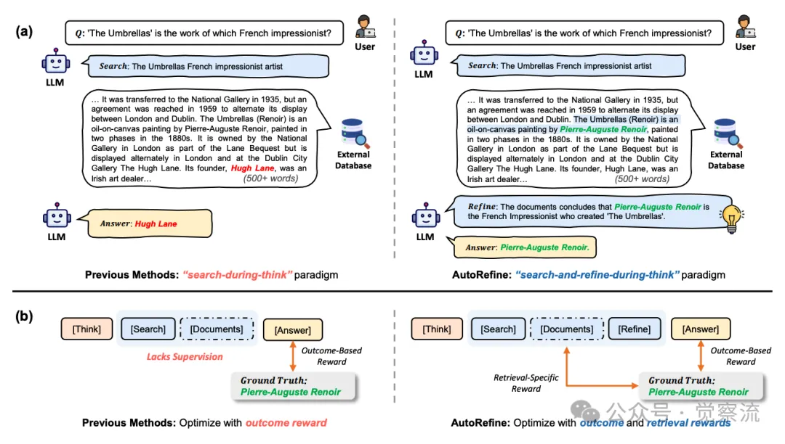
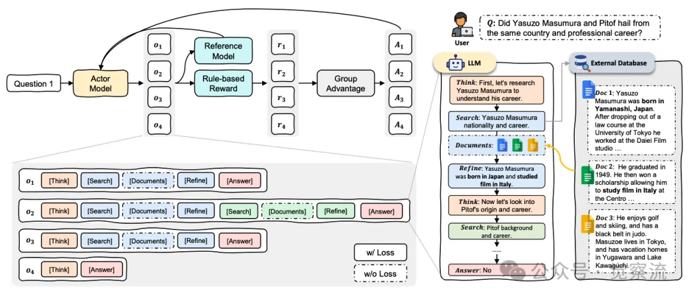
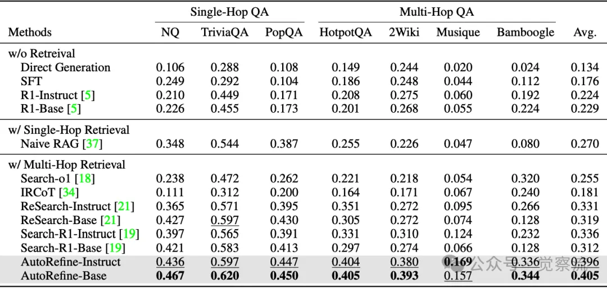

# 资源

- Search and Refine During Think: Autonomous Retrieval - Augmented Reasoning of LLM.
  - https://arxiv.org/pdf/2505.11277
- GitHub - syr - cn/AutoRefine. 
  - https://github.com/syr-cn/AutoRefine

# 原理

AutoRefine 的核心创新之处在于其独特的 “检索 - 提炼 - 思考” 范式。与传统的 “在思考中检索”（Search - During - Think）方法不同，AutoRefine 在连续的搜索调用之间加入了明确的知识提炼步骤。这一过程可以形象地理解为：当模型面对一个问题时，它不是简单地检索一次就立刻生成答案，而是先进行初步的检索，然后仔细阅读和提炼检索到的文档，筛选出真正有用的信息，再基于这些提炼后的关键信息进行进一步的思考和推理，必要时再次发起新的检索查询，直到获取足够的证据来支撑最终的答案生成。

这种范式的转变带来了巨大的优势。通过迭代地过滤、提炼和组织证据，模型能够逐步聚焦于与问题高度相关的核心内容，去除无关的噪声信息。这就如同在沙子中淘金，只有经过多次的筛选和提炼，才能最终得到纯度高的金子。在知识提炼步骤中，模型会对检索到的文档进行深加工，识别出其中的关键语句、重要概念和直接证据，并将这些信息进行整合和重组，使其更易于后续的推理和答案生成。这样一来，即使检索到的文档内容较为宽泛或包含大量无关信息，模型也能够从中挖掘出有价值的线索，从而提高答案的准确性和可靠性。

同时，AutoRefine 的奖励机制也是其取得成功的关键因素之一。它不仅考虑了最终答案的正确性（即结果奖励，Outcome - Based Reward），还特别引入了检索特定奖励（Retrieval - Specific Reward）。结果奖励通过计算模型生成的答案与真实答案之间的 F1 分数来衡量答案的准确性和完整性。而检索特定奖励则关注于模型在知识提炼过程中是否成功提取出了包含真实答案所有关键组成部分的信息。如果提炼出的内容涵盖了答案所需的核心要素，那么模型将获得较高的检索特定奖励。这种双重奖励机制如同给模型提供了两个方向的导航仪，一方面引导它朝着生成正确答案的方向前进，另一方面激励它在检索和提炼过程中尽可能地获取精准、全面的信息。通过联合优化这两个目标，模型能够在推理过程中更加关注细粒度知识的提取、组织和利用，从而实现更高效、更精准的检索增强型推理。

方法细节：轨迹生成、奖励建模与训练目标
轨迹生成与搜索提炼
在 AutoRefine 的框架下，任务形式化过程是这样的：给定一个包含问答对的数据集 D 以及一个外部搜索引擎 E，模型需要生成推理轨迹 o，该轨迹由多个中间推理步骤 τ 组成。每个中间推理步骤 τ 包括一个动作 st（如思考、搜索、文档检索、提炼或回答）以及与其相关联的内容 ct。模型通过不断地与搜索引擎 E 交互，执行思考、搜索、整合文档和提炼等操作，直到最终生成能够正确回答问题 q 的答案 oans。

比如，actor 模型 πθ 会生成包含多个内部推理周期的轨迹。每个周期都有序地执行以下操作：在 “思考” 步骤中，模型对当前已有的信息和下一步的行动进行整体规划，确定是否需要进一步检索以及检索的大致方向；接着在 “搜索” 步骤中，模型根据思考的结果向外部搜索引擎发出查询请求；搜索引擎返回相关文档后，模型进入 “文档整合” 步骤，将检索到的文档内容纳入当前的推理上下文中；随后在 “提炼” 步骤中，模型对文档内容进行深度加工，提取关键信息并去除无关内容；最后，当模型认为已经收集到足够的证据时，它将进入 “回答” 步骤，生成最终的答案。

整个轨迹生成过程是动态且自主的，模型根据问题的难度和复杂性决定内部推理周期的数量。例如，对于相对简单的问题，可能只需一个或两个推理周期即可得到答案；而对于复杂的多跳推理问题，则可能需要多个周期的迭代搜索和提炼。停止准则非常明确，当模型执行了 “回答” 动作时，生成过程终止，此时提取终端状态 τT 的内容 cT 作为最终答案 oans。

检索特定奖励的计算方法：

检索特定奖励（RRet）的计算方法如下：

1. 关键信息的定义：在知识提炼步骤中，模型会生成一段提炼后的内容，该内容包含了模型认为与问题相关的最关键信息。关键信息的定义基于问题的类型和需求，例如在回答人物关系问题时，关键信息可能包括人物名称、关系类型等；在回答历史事件问题时，关键信息可能包括事件时间、地点、主要人物和结果等。
2. 奖励值的计算：将所有知识提炼步骤的内容进行拼接，形成一个完整的提炼文本。然后，检查该文本是否包含真实答案的所有关键组成部分。如果提炼文本涵盖了答案所需的所有核心要素，则 RRet = 1；否则，RRet = 0。具体实现中，通过将提炼文本与真实答案进行文本匹配和语义分析来确定是否包含所有关键组成部分。例如，可以使用关键词匹配、语义相似度计算等方法来评估提炼文本与真实答案的相关性。
3. 优化过程：在训练过程中，模型会根据 RRet 的值来调整其提炼策略。如果 RRet 较高，说明模型的提炼步骤能够有效提取关键信息，模型会强化这一行为；反之，如果 RRet 较低，模型会尝试调整提炼方法，例如改变提炼的粒度、关注不同的内容类型等，以提高提炼质量。
奖励建模
结果奖励（RAns）的计算基于模型最终生成的答案与真实答案之间的对比。具体而言，将预测答案 oans 和真实答案 a 都视为单词集合，然后计算这两个集合之间的 F1 分数。F1 分数综合考虑了答案的精确匹配程度和召回情况，能够较为全面地反映答案的质量。例如，如果真实答案是 “牛顿是经典力学的奠基人”，而模型生成的答案是 “牛顿是经典力学的创始人”，那么通过计算两个答案的单词交集、并集等信息，可以得到一个介于 0 到 1 之间的 F1 分数，这个分数越高，说明答案越接近真实情况。

检索特定奖励（RRet）则侧重于评估知识提炼步骤的质量。它通过检查在 “提炼” 步骤中生成的内容是否包含真实答案的所有关键组成部分来确定奖励值。具体操作是将所有知识提炼步骤的内容进行拼接，如果拼接后的文本包含了构成真实答案的所有必要元素，那么 RRet 就为 1，否则为 0。这一奖励机制直接鼓励模型在提炼过程中尽可能完整且准确地提取出与答案直接相关的信息。

在训练过程中，这两种奖励相互配合，共同引导模型优化其行为。例如，当模型生成的答案正确时，它将获得较高的结果奖励；同时，如果在提炼过程中也成功提取了关键信息，那么它还能额外获得检索特定奖励。这种双重奖励机制使得模型在学习过程中不仅关注最终答案的质量，还注重检索和提炼过程的有效性，从而全面提升其检索增强型推理能力。

训练目标与算法
AutoRefine 采用组相对策略优化（GRPO，Group Relative Policy Optimization）算法来优化模型的策略。GRPO 算法的核心思想是通过采样一组轨迹，计算每个轨迹的优势估计，然后根据优势估计更新actor模型 πθ 的策略，以最大化策略的长期回报。

给定actor模型 πθ 和参考模型 πref，首先从模型中采样一组 G 个轨迹。然后，对于每个轨迹中的每个时间步 t，计算其优势估计 ˆAi,t，该优势估计反映了在该时间步采取特定行动相比于平均水平所能获得的额外回报。优势估计是通过将当前的奖励 ri,t 减去该组轨迹在该时间步的平均奖励，再进行归一化处理得到的。接着，利用这些优势估计来更新actor模型的策略，更新过程采用了裁剪（clip）操作，以确保策略的更新不会过于剧烈，从而保证训练过程的稳定性。

在损失计算过程中，为了防止检索到的文档对训练过程产生干扰，AutoRefine 特别设计了屏蔽机制。在计算损失时，将检索到的文档部分从输入中移除，使得模型的训练更加专注于其自身生成的内容和行动的优化，而不是简单地依赖于检索文档中的信息。这种屏蔽机制有助于提高模型的泛化能力和自主推理能力，使其在实际应用中能够更好地适应不同的检索环境和文档质量。

与其他方法对比：Why AutoRefine ？
与传统 RAG 方法对比
传统 RAG 方法严重依赖于监督微调（SFT）。虽然 SFT 能够在一定程度上优化模型的检索和生成能力，但其局限性非常明显。由于 SFT 主要基于训练数据进行优化，当模型面对非训练分布场景时，其泛化检索行为的能力极为有限。例如，在训练数据中，模型可能学会了针对特定类型问题的检索模式，但当遇到新的、未见过的问题类型时，它往往无法生成有效的检索查询，导致检索到的文档与问题的相关性较低，从而影响答案的质量。

此外，传统 RAG 方法在检索到文档后，直接利用这些文档生成答案，缺乏中间的知识提炼步骤。这就意味着，模型需要处理大量可能包含无关或噪声信息的文档内容，这不仅增加了模型的负担，还可能导致生成的答案偏离正确方向。相比之下，AutoRefine 的 “检索 - 提炼 - 思考” 范式通过引入知识提炼步骤，使模型能够对检索到的文档进行深度加工，提取关键信息并去除无关内容。这样，模型在生成答案时所依据的信息更加精准和精炼，从而提高了答案的准确性和可靠性。

以一个简单的例子来说，假设问题是 “列举牛顿的三大运动定律”。传统 RAG 方法可能检索到一篇包含牛顿生平、成果以及运动定律等内容的长篇文章，然后直接尝试从中生成答案。由1于文章内容较为宽泛，模型可能在生成答案时遗漏一些关键细节，或者受到无关内容的干扰而出现错误。而 AutoRefine 则会在检索到文档后，先进行提炼，提取出与运动定律直接相关的内容，如 “惯性定律、加速度定律和作用力与反作用力定律”，然后再基于这些提炼后的信息生成简洁准确的答案，从而避免了直接使用完整文档带来的问题。

基线方法的具体实现和优化过程：

在实验中，传统 RAG 方法的基线实现主要包括以下几个方面：

1. 训练数据的选择：基线方法使用与 AutoRefine 相同的训练数据集，包括 Natural Questions（NQ）和 HotpotQA 的训练集。这些数据集提供了丰富的问答对，用于训练模型的检索和生成能力。
2. 模型参数的调整：在 SFT 过程中，模型的学习率设置为 1e-5，训练批次大小为 32，训练步数为 10000 步。这些参数经过多次实验验证，能够在保证训练效率的同时，使模型达到较好的性能。
3. 检索引擎的配置：基线方法使用与 AutoRefine 相同的检索引擎 E5-base-v2，确保检索过程的一致性和公平性。每次查询返回的文档数量默认设置为 3，与 AutoRefine 的实验条件保持一致。
通过这些详细的实现和优化过程，传统 RAG 方法的基线性能得到了充分的发挥，从而为 AutoRefine 的性能提升提供了有力的对比基准。

与其他基于 RL 的检索增强推理方法对比
其他基于 RL 的检索增强推理方法通常只依赖于结果奖励，即仅根据最终答案的正确性来优化模型。然而，这种方法忽略了检索过程本身的质量评估和优化。由于缺乏对检索过程的直接指导，模型很难学会如何生成更相关、更有信息量的检索查询，从而限制了检索增强推理的整体性能提升。我想起另外一篇文章，点击扩展阅读👉《ReSearch 框架：让 AI 像人类一样边思考边搜索》。有兴趣的同学可以对比来看。

AutoRefine 则结合了检索特定奖励和结果奖励，通过定制化的检索特定奖励引导模型更有效地进行检索和信息提炼。在训练过程中，当模型在知识提炼步骤中成功提取出包含答案关键组成部分的信息时，它将获得检索特定奖励。这一奖励机制直接鼓励模型关注检索到的文档的质量和相关性，促使模型不断优化其检索策略，生成更精准的查询请求，从而提高检索到的文档与问题的匹配度。

在多跳推理场景中，AutoRefine 的优势尤为显著。多跳推理问题需要模型能够通过多次检索和推理，逐步收集分散在不同文档中的信息片段，并最终将这些片段整合成完整的答案。与其他方法相比，AutoRefine 的高质量搜索查询和有效的证据综合能力使其在这一类复杂问题上表现出色。例如，在回答 “谁是《战争与和平》作者的祖父？” 这样需要多跳推理的问题时，AutoRefine 首先会检索到《战争与和平》的作者是列夫·托尔斯泰，然后进一步检索列夫·托尔斯泰的祖父是谁，最终得出正确答案。而其他方法可能由于检索查询不够精准或无法有效提炼和整合多跳信息，导致无法准确回答此类问题。

为了更全面地展示 AutoRefine 的优势，对不同检索深度（k 值）下基线方法的性能变化进行了详细分析。实验结果表明，随着 k 值的增加，基线方法的性能在大多数数据集上呈现出先上升后趋于平稳的趋势。当 k = 3 时，性能提升最为显著，这表明在这一深度下，基线方法能够在信息丰富度和噪声之间取得较好的平衡。然而，与 AutoRefine 相比，基线方法在所有 k 值下的性能均低于 AutoRefine，这充分展示了 AutoRefine 在不同检索深度下的显著优势，尤其是在处理多跳推理问题时，其性能提升更为明显。

# 实验效果

# 参考

[1] AutoRefine：RL加持RAG，边想边搜并精炼，革新LLM推理（万字）, https://mp.weixin.qq.com/s/CqJsTmIggOaTXH8mRuzo_w