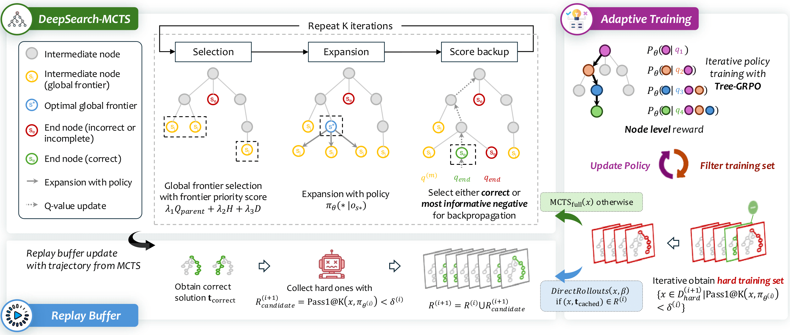

# 1. 资源

- Github (12)： https://github.com/smiles724/DeepSearch
- 论文：https://arxiv.org/pdf/2509.25454
  -  DEEPSEARCH: OVERCOME THE BOTTLENECK OF  REINFORCEMENT LEARNING WITH VERIFIABLE RE WARDS VIA MONTE CARLO TREE SEARCH

DeepSearch 的核心贡献在于，它不把树搜索仅仅看作是推理时（Inference-time）提升性能的技巧，而是将其作为训练时（Training-time） 进行系统性探索和精细化信用分配的核心机制。框架主要由三个创新部分组成：带熵引导的蒙特卡洛树搜索、自适应训练与回放缓存，以及基于树的训练目标 Tree-GRPO。

# 2. 原理

DeepSearch 是一种新颖的强化学习框架，它解决了蒙特卡洛树搜索 （MCTS） 中平衡探索广度和深度的基本挑战。通过引入带有自适应重放缓冲区的推出引导式探索机制，DeepSearch 在数学推理任务上实现了卓越的性能。

基于 VERL 提交 2bd291e5494db03ba358ef279a334c2f0829b979 构建

# 参考

[1] https://mp.weixin.qq.com/s/BumnOKx7B1wRTtSuN2Amag?scene=1&click_id=109