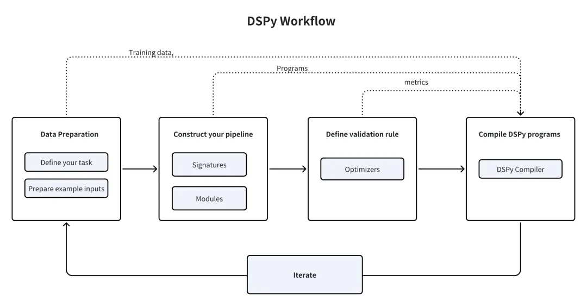

# 0. 资源

- DSPy GitHub仓库: https://github.com/stanfordnlp/dspy
- DSPy 文献: https://arxiv.org/pdf/2310.03714
- DSPy 文档: https://dspy-docs.vercel.app/docs/intro
- MilvusRM 指南: https://dspy-docs.vercel.app/docs/deep-dive/retrieval_models_clients/MilvusRM
- Milvus 文档: https://milvus.io/docs

# 1. 介绍

## 1.1 什么是 DSPy？

DSPy 是由斯坦福 NLP 组推出的一种程序化框架，旨在优化语言模型中的 Prompt 和权重，这在 LLM 跨多个 pipeline 阶段集成时尤其有用。它提供了各种可组合和声明式模块，以 Python 语法指导 LLM。

与依赖手动制作和调整提示的传统提示工程技术不同，DSPy 学习查询-答案示例，并模仿这一学习过程来生成为特定结果量身定做的优化提示。这种方法允许动态重组整个 pipeline，精确地针对任务的细微差别进行定制，从而免去了开发人员持续手动调整提示的麻烦。

## 1.2 关键概念和基本组件

DSPy 的自动化 Prompt 优化和模型微调部分由三个基本组件构成：签名（Signatures）、模块（Modules）和优化器（Optimizers，之前被称为 Teleprompters）。

## 1.3 签名（Signature）

签名是声明性的规范，定义了 DSPy 模块的输入/输出行为，用于告诉语言模型应执行哪些任务，而不是我们应如何设置 prompt 语言模型。

- 一个签名包括三个基本元素：
    - 语言模型旨在解决的子任务的简洁描述。
    - 我们提供给语言模型的一个或多个输入字段的描述（例如，输入问题）。
    - 我们期望从语言模型得到的一个或多个输出字段的描述（例如，问题的答案）。

以下是一些流行的 LLM 任务的签名示例：

- 问题回答："question -> answer"
- 情感分类："sentence -> sentiment"
- 检索增强型问题回答："context, question -> answer"
- 带推理的多项选择题回答："question, choices -> reasoning, selection"

- 这些签名指导 DSPy 高效地在各种模块中协调 LLM 操作，促进 LLM 流畅且精确地执行任务。

## 1.4 模块（Module）

DSPy 模块在 LLM pipeline 中抽象了传统的 prompting 技术。它们具有三个关键特性：

- 每个内置模块抽象出一个特定的 prompting 技术（如 Chain of Thoughts 或 ReAct）并处理 DSPy 签名。
- DSPy 模块具有可学习的参数，包括 prompt 组件和 LLM 权重，使它们能够处理输入并生成输出。
- DSPy 模块可以组合，从而创建更大、更复杂的模块。
- DSPy 提供七个内置模块以满足各种用途，包括 dspy.ReAct、dspy.ChainofThought、dspy.Predict、dspy.ProgramOfThought、dspy.ReAct、dspy.MultiChainComparison 和 dspy.Retrieve。

## 1.5 优化器（Optimizers）

DSPy 优化器（此前被称为 Teleprompters）是用来微调 DSPy 程序参数的算法，如 prompts 和 LLM 权重，以达到某些指标（如准确性）的最大值。一个典型的 DSPy 优化器需要三个输入：

您的 DSPy 程序：可以是单一模块（例如 dspy.Predict）或复杂的多模块程序。

- 您选择的指标：一个评估程序输出并为其打分的函数（分数越高表示结果越好）。
- 一组训练输入：通常只需要 5 到 10 个示例。
- 一旦您定义了训练数据、模块和指标，优化器将优化 LLM 权重、prompt 指令和少数示例演示，以提高程序效率。例如，BootstrapFewShot 优化器生成与指定度量一致的答案，而像 COT（Chain of Thought）这样的模块生成结构化推理以得出准确的答案。DSPy 记录这些成功的实例和理由作为处理未来测试查询的少数示例演示。

除了上述核心组件外，DSPy 还整合了数据、指标（metric）和断言（assertion）作为补充组件，丰富了其功能并改善了其适应能力。更多详细信息，请参阅 DSPy 文档。

# 2. DSPy 工作流程：构建高效的 LLM Pipeline

DSPy 在构建 LLM Pipeline 中扮演了什么样的角色？为了清晰起见，我们可以将整个过程分解为几个关键步骤。



- 首先，您必须定义您的任务并准备一些示例输入（通常不带标签，或者按需只带最终输出的标签）。
- 其次，通过选择内置模块来构建您的 pipeline，为每个模块分配一个签名（输入/输出规范），并无缝地将这些模块整合到您的 Python 代码中。
- 第三，定义您的 pipeline 的验证逻辑，包括使用哪些指标和示例输入来评估 prompt 的质量和最终结果。
- 第四，使用 DSPy 优化器编译您的代码，它会生成高质量的指令和自动化的 few-shot示例或更新的 LLM 权重。
- 最后，通过迭代过程优化您的数据集、程序或验证逻辑，以达到 pipeline 所需的性能水平。持续评估和改进，以满足不断变化的要求并优化结果。

# 3. DSPy vs. LlamaIndex/LangChain/AutoGPT

与 LangChain、LlamaIndex 和 AutoGPT 等许多其他流行的 AI 框架相比，DSPy 的方法具有显著的区别。下面是它们之间的差异和相似之处的详细比较：
- LangChain 是一个用于创建定制应用的工具包。它利用各种语言模型和实用程序包，允许开发者根据特定需求定制应用。
- LlamaIndex 是一个旨在简化各种私有数据源与语言模型集成的编排框架。它简化了数据处理和处理任务。
- AutoGPT 是一个由 GPT-4 和 GPT3.5 驱动的高级 AI Agent。它根据预定义的规则和目标进行决策和行动，强调自主性和决策能力。

DSPy 的独特功能：
- DSPy 能自动化生成并优化 prompt，增强了开发人员与语言模型的互动能力。
- 与专注于使用预定义模块进行高级应用开发的 LangChain 和 LlamaIndex 不同，DSPy 提供了强大的通用模块，能够在自定义 pipeline 中学习 prompt 或微调 LLM。DSPy 的优势在于其根据变化的数据、程序控制流调整或目标语言变化动态适应 prompt 和微调 LLMs 的能力。这种自动化的优化过程可以以最小的投入生成更高质量的输出，特别适用于开发者将他们的原型程序扩展为更复杂的生产用途的场景。
- DSPy 非常适合追求轻量、需要自动优化编程模型的用例，无需依赖 LangChain 和 LlamaIndex 提供的预定义 prompt 和集成。

# 4.  DSPy 与 Milvus 向量数据库的集成
## 4.1 安装
```bash
pip install dspy-ai[milvus]
```

## 4.2 加载数据集

本例中，我们使用 HotPotQA 数据集用于训练。该数据集中包含了复杂的问答对，我们可以通过 HotPotQA class 加载数据集。

```python
from dspy.datasets import HotPotQA

# Load the dataset.
dataset = HotPotQA(train_seed=1, train_size=20, eval_seed=2023, dev_size=50, test_size=0)

# Tell DSPy that the 'question' field is the input. Any other fields are labels and/or metadata.
trainset = [x.with_inputs('question') for x in dataset.train]
devset = [x.with_inputs('question') for x in dataset.dev]
```

## 4.3 将数据导入 Milvus 向量数据库

将上下文信息导入 Milvus Collection 中，以便后续进行向量检索。这个 Collection 应包含一个 embedding 字段和一个text 字段。我们使用 OpenAI 的 text-embedding-3-small 模型作为默认的查询 Embedding 模型。

```python
import requests
MILVUS_URI = "http://localhost:19530"
MILVUS_TOKEN = ""from pymilvus import MilvusClient, DataType, Collection
from dspy.retrieve.milvus_rm import openai_embedding_function

client = MilvusClient(
   uri=MILVUS_URI,
   token=MILVUS_TOKEN
)

if 'dspy_example' not in client.list_collections():
   client.create_collection(
      collection_name="dspy_example",
       overwrite= True,
       dimension=1536,
       primary_field_name="id",
       vector_field_name="embedding",
       id_type="int",
       metric_type="IP",
       max_length=65535,
       enable_dynamic=True
   )
text = requests.get('https://raw.githubusercontent.com/wxywb/dspy_dataset_sample/master/sample_data.txt').text

for idx, passage in enumerate(text.split('\n')):
   if len(passage) == 0:
       continue
   client.insert(collection_name="dspy_example", data = [{"id": idx , "embedding": openai_embedding_function(passage)[0], "text": passage}])
```

## 4.4 定义 MilvusRM

接着，需要定义 MilvusRM。

```python
from dspy.retrieve.milvus_rm import MilvusRM
import os
import dspy
os.environ["OPENAI_API_KEY"] = "<YOUR_OPENAI_API_KEY>"
retriever_model = MilvusRM(collection_name="dspy_example",uri=MILVUS_URI,token=MILVUS_TOKEN,  # ignore this if no token is required for Milvus connection
   embedding_function = openai_embedding_function
   )
turbo = dspy.OpenAI(model='gpt-3.5-turbo')
dspy.settings.configure(lm=turbo)
```

## 4.5 构建 Signature

现在我们已经加载了数据，让我们开始为 Pipeline 的子任务定义签名。原本，我们可以将签名简单定义为输入question和输出answer。但由于我们需要构建一个 RAG Pipeline，我们需要从 Milvus 检索上下文信息。因此，本例中，我们将签名定义为context, question --> answer。

```python
class GenerateAnswer(dspy.Signature):"""Answer questions with short factoid answers."""
   context = dspy.InputField(desc="may contain relevant facts")
   question = dspy.InputField()
   answer = dspy.OutputField(desc="often between 1 and 5 words")
```

我们简单描述了context和answer字段，以生成清晰的指南，帮助模型根据接收到的信息生成内容。

## 4.6 搭建 Pipeline

现在，让我们来定义 RAG Pipeline。

```python
class RAG(dspy.Module):
   def __init__(self, rm):
       super().__init__()
       self.retrieve = rm
       
# This signature indicates the task imposed on the COT module.
       self.generate_answer = dspy.ChainOfThought(GenerateAnswer)

   def forward(self, question):
       # Use milvus_rm to retrieve context for the question.
       context = self.retrieve(question).passages
       # COT module takes "context, query" and output "answer".
       prediction = self.generate_answer(context=context, question=question)
       return dspy.Prediction(context=[item.long_text for item in context], answer=prediction.answer)
```

## 4.7 运行 Pipeline 并获取结果

现在，我们已经成功搭建了 RAG Pipeline。让我们运行 Pipeline 并查看结果。

```python
rag = RAG(retriever_model)
print(rag("who write At My Window").answer)

# The result:# 'Townes Van Zandt'
```

评估数据集的量化结果。

```python
from dspy.evaluate.evaluate import Evaluate
from dspy.datasets import HotPotQA

evaluate_on_hotpotqa = Evaluate(devset=devset, num_threads=1, display_progress=False, display_table=5)

metric = dspy.evaluate.answer_exact_match
score = evaluate_on_hotpotqa(rag, metric=metric)
print('rag:', score)

# The result:# rag: 50.0
```

## 4.8 优化 Pipeline

在定义了这个程序之后，下一步是编译。这个过程会更新每个模块内的参数以提升性能。编译过程依赖于三个关键因素：

训练集：我们将利用训练数据集中的 20 个问答对示例来进行这次演示。

验证指标：我们将建立一个简单的 validate_context_and_answer 指标，用于验证预测答案的准确性，并确保检索到的上下文中包含所需答案。

特定优化器（Teleprompter）：DSPy 的编译器整合了多个 teleprompter，可有效优化程序。

```python
from dspy.teleprompt import BootstrapFewShot

# Validation logic: check that the predicted answer is correct.# Also check that the retrieved context does contain that answer.def validate_context_and_answer(example, pred, trace=None):
   answer_EM = dspy.evaluate.answer_exact_match(example, pred)
   answer_PM = dspy.evaluate.answer_passage_match(example, pred)
   return answer_EM and answer_PM

# Set up a basic teleprompter, which will compile our RAG program.
teleprompter = BootstrapFewShot(metric=validate_context_and_answer)

# Compile!
compiled_rag = teleprompter.compile(rag, trainset=trainset)

# Now compiled_rag is optimized and ready to answer your new question!
```

评估编译的 RAG 项目。

```python
score = evaluate_on_hotpotqa(compiled_rag, metric=metric)
print(score)
print('compile_rag:', score)

# The result:# compile_rag: 52.0
```

评估打分从 50.0 上升至52.0，体现了回答质量得到了提升。

# 5. 总结

DSPy 通过其可编程接口带来了语言模型交互的变革，这一接口使得模型 prompt 和权重实现了算法化和自动优化。使用 DSPy 搭建 RAG，开发人员能够轻松适应不同的语言模型或数据集，极大地减少了繁琐劳动和人工干预的必要。

此外，DSPy 集成了 Milvus 向量数据库，在其工作流中引入了 MilvusRM 检索模块。这样一来，开发者可以在 RAG 应用中将 prompt 优化和模型参数调整工作变得自动化，从而最终提高答案质量。如果您想了解更多信息，请查看 DSPy 文档中关于 MilvusRM 的详细指南！

# 参考

[1] Milvus 集成 DSPy：搭建高效 RAG Pipeline，https://mp.weixin.qq.com/s/Lk7ruNpKMrFOF0XUg-RGhQ