# 0. 资源

可以看看langchain出品的RAG系列，地址在：https://github.com/langchain-ai/rag-from-scratch

HyDE对应的文档和论文可以查看:
- https://github.com/langchain-ai/langchain/blob/master/cookbook/hypothetical_document_embeddings.ipynb
- 论文：https://arxiv.org/abs/2212.10496

路由优化：
- Logical and Semantic routing，基于逻辑规则和语义的路由分发：https://python.langchain.com/docs/use_cases/query_analysis/techniques/routing#routing-to-multiple-indexes
- 也可以基于语义来实现分发Semantic routing，https://python.langchain.com/docs/expression_language/cookbook/embedding_router

# 1. 简介

RAG优化是一个全面的过程，它包括数据预处理、优化检索、索引设计等多个方面。这些内容的整合，才能让RAG模型发挥出真正的潜力。

LangChain 团队最近的一场演讲，提供了一系列的优化方法，总共6个部分，主要受限于篇幅问题，今天先聊聊第一部分查询重写。

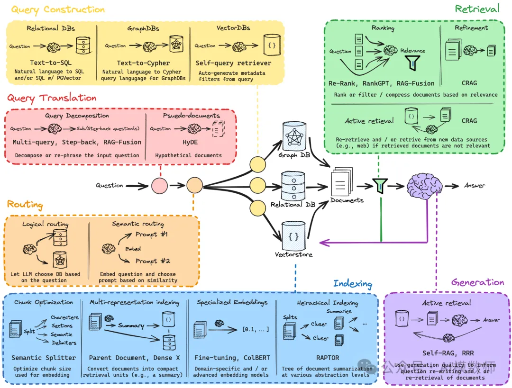

首先为什么需要查询重写？我觉得主要是两个方面，第一个是很多时候用户的提问是不可控的，如果问题比较模糊，就很容易得不到想要的答案。

第二个方面检索的内容，如果本身资料包含的内容表达也不是很清晰的，比如企业内部的培训文档。那也容易导致匹配失败，最终会让大模型生成的答案不清晰。

为了尽量缓解这些问题，RAG检索的第一步，就是需要对问题进行一定的处理。

LangChain团队给出了5种方法，Step Back、HyDE、多重查询、查询融合、查询分解。

# 2. 方法详解

## 2.1 多重查询

多重查询的概念比较容易理解，就是担心一个问题回答的不准确，使用大模型把一个问题变成一堆问题，再进行多次检索。

这种技术就是尝试从多个角度补充原来的问题，变成多个问题尽量全面的从向量数据库中查找结果。目标是细化查询，使其与主题更加相关，从而从数据库中检索更多相关的文档。

LangChain和LlamaIndex都提供了多重查询的方法，直接调用就可以。

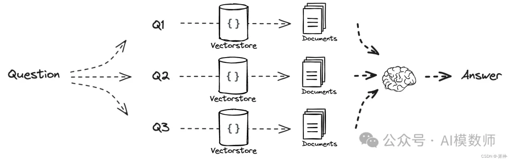

## 2.2 RAG融合（RAG-Fusion）

RAG融合跟刚才的多重查询类似，不过在多重查询的基础上，在从向量数据库查询到的结果后，把查询结果再进行一次评分，把出现最多的资料排在上面，优先发给大模型。

利用倒数排序融合（RRF）和自定义向量评分加权，生成全面准确的结果。

RAG-Fusion希望弥合用户明确提出的问题和他们（原本的意图）打算提出的问题之间的差距，更接近于发现通常仍然隐藏的知识。

## 2.3 查询分解

查询分解是通过将问题分解为子问题来改善问答效果的策略，分两条实现路径：

（1）序列求解，将上一个子问题的答案与当前问题一并扔给LLM生成答案，再把当前生成答案与下一个子问题一起给LLM生成答案，直到最后一个子问题生成最终答案；

（2）并行的独立回答问题，然后将多路答案合并为最终答案。

## 2.4 Step Back

翻译是退后一步？Step-back prompting（又是一篇来自谷歌的paper，正着玩、反着玩，不给别人留点活路~）。

把问题变得更抽象。为什么要让问题变得更抽象？抽象的目的不是为了让你更迷糊，而是对问题进行了总结，提供了更大范围的检索。

Step-Back Prompting（后退提示）是一种用于提高生成式模型回答质量的策略，尤其在面对复杂或多步骤问题时效果显著。与常规的生成流程不同，Step-Back Prompting 会在每一步生成后“后退”一步，对当前生成结果进行审查或调整，以确保最终输出的准确性和相关性。

论文：https://arxiv.org/abs/2310.06117

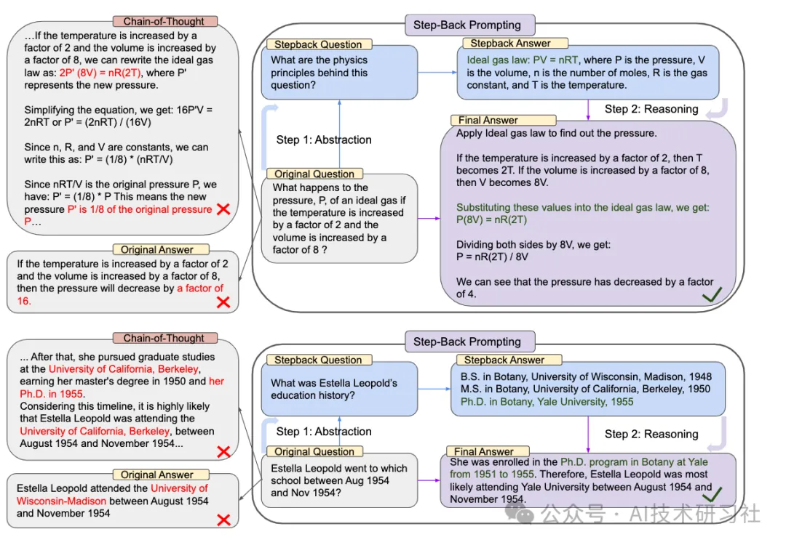

假设用户查询：“如何设计一个有效的电商直播营销策略？”

Initial Prompting（初步提示）

首先，生成初步回答，直接回答用户的问题。

初始Prompt：“请提供一个设计电商直播营销策略的详细步骤。”

初步生成的回答：

Step-Back Review（后退审查）

生成初步答案后，利用Step-Back Prompting 技术，进行反思或进一步审查。

后退Prompt：“请检查以上步骤是否完整，并说明是否有遗漏或可以优化的部分。”

审查后的反馈：“步骤总体上是完整的，但可以加强推广策略部分。例如，考虑使用个性化推送通知，提前告知粉丝直播的详细信息。此外，受众分析可以更深入，通过数据分析工具获取更精确的用户画像。”

Refine and Finalize（优化与定稿）

根据审查反馈，对原回答进行优化，确保内容更为全面和实用。

Step-Back Prompting 方法的优势
提高回答的完整性：通过后退审查，确保回答覆盖所有重要方面。

增强准确性：在生成后反思和调整，减少错误和遗漏。

提升内容深度：使回答更为详尽和有针对性，特别适合复杂或多步骤的任务。

Step-Back Prompting 是一种有效的提示策略，通过在生成过程中插入反思和调整步骤，可以显著提高回答的质量和实用性。它尤其适用于复杂查询和需要多步骤分析的场景，如策略设计、问题解决和详细指南的生成。

## 2.5 HyDE

HyDE（Hypothetical Document Embeddings），这个最难理解，翻译是假设的含义。

这是先用大模型对问题生成一个假设答案，这个技术是认为假设的答案和文档中检索的答案可能更接近。

HyDE方法适合原始问题一般都比较短的情况，而生成的假设文档可能会更好地与索引文档对齐。

HyDE（假设文档嵌入，Hypothetical Document Embedding）是一种方法，用于生成一个假设性的文档嵌入，这个嵌入基于用户查询所生成的假设回答。这个方法通过生成与用户查询相关的文本，再将其嵌入到向量空间中，以便更好地匹配查询和文档，从而提高检索的准确性。

论文：https://arxiv.org/pdf/2212.10496

项目：https://github.com/texttron/hyde

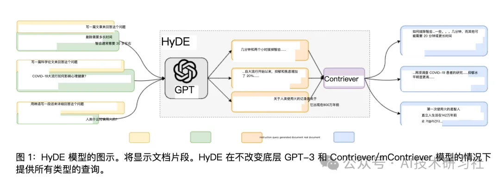

首先生成一个问题的答案对于给定一个query，将由InstructGPT生成一个能回答该query的假设文档，即a hypothetical document。

使用生成的答案进行检索：使用无监督的稠密检索模型（Contriever）把该文档表示为稠密向量。

最后基于最近邻从语料库中找到相似的文档，作为支撑信息然后进行问答。

假设我们有一个用户查询：“如何提高电商直播的观众参与度？” 我们可以利用HyDE方法进行以下步骤：

生成假设文档：使用大语言模型，如ChatGPT，生成一个与该查询相关的假设文档。

Prompt示例：“生成一个简短的文本，描述几种提高电商直播观众参与度的方法。”

模型生成的假设文档：“要提高电商直播的观众参与度，可以通过互动问答、限时优惠和实时抽奖等方式。互动问答可以让观众感觉到参与感，限时优惠则能激发他们的购买欲望，而实时抽奖可以增加直播的趣味性。”

嵌入假设文档：将生成的假设文档转化为嵌入向量，作为查询的表示。

与实际文档对比：使用HyDE生成的嵌入向量，与数据库中的文档嵌入向量进行对比和匹配，从而找到最相关的文档。

返回优化结果：根据匹配的结果，返回与用户查询最相关的文档，优化后的结果将更加符合用户的搜索意图。

下面是一个HyDE的代码实现：

```python
import pandas as pd
from tqdm import tqdm
import os
from gomate.modules.generator.llm import GLMChat
from gomate.modules.retrieval.dense_retriever import DenseRetriever, DenseRetrieverConfig
from gomate.modules.rewriter.base import BaseRewriter
from gomate.modules.rewriter.promptor import Promptor
from gomate.modules.document.common_parser import CommonParser

class HydeRewriter(BaseRewriter):

    def __init__(self, promptor, generator, retriever):
        self.promptor = promptor
        self.generator = generator
        self.retriever = retriever

    def prompt(self, query):
        return self.promptor.build_prompt(query)

    def rewrite(self, query):
        prompt = self.promptor.build_prompt(query)
        hypothesis_document, _ = self.generator.chat(prompt, llm_only=True)
        return hypothesis_document

    def retrieve(self, query, top_k=5):
        hypothesis_document = self.rewrite(query)
        hits = self.retriever.retrieve(hypothesis_document, top_k=top_k)
        return {'hypothesis_document': hypothesis_document, 'retrieve_result': hits}
```

使用HyDE的优势：

提高召回率：通过生成假设文档并嵌入向量空间，可以更有效地覆盖查询可能相关的文档，从而提高召回率。

增强匹配精度：HyDE利用生成的文本来精细化查询表达，能更准确地匹配数据库中的相关文档。

HyDE方法在与向量数据库结合时，能够显著提升搜索结果的质量，尤其是在处理模糊查询或多义查询时表现出色。

## 2.6 Routing路由优化策略

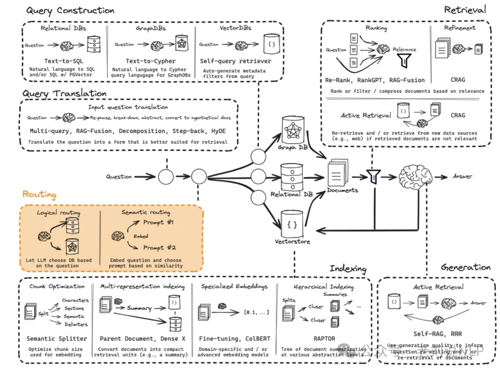

可用的方案包括，Logical and Semantic routing，基于逻辑规则和语义的路由分发：https://python.langchain.com/docs/use_cases/query_analysis/techniques/routing#routing-to-multiple-indexes


对应的具象化实现如下：

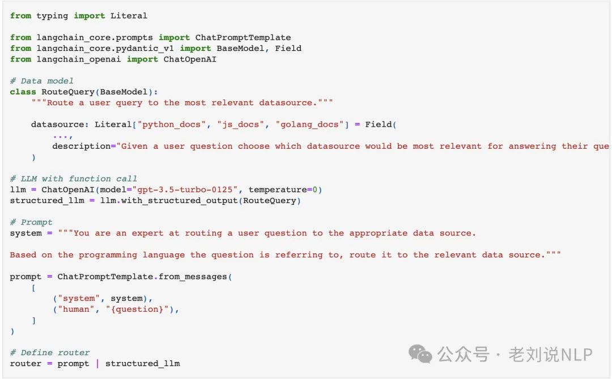

可以通过function call来实现：

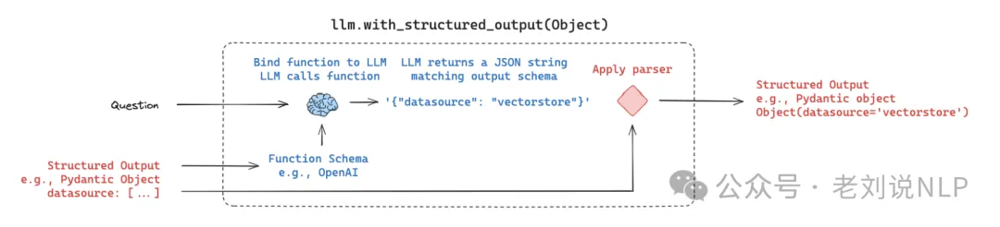

也可以基于语义来实现分发Semantic routing，https://python.langchain.com/docs/expression_language/cookbook/embedding_router

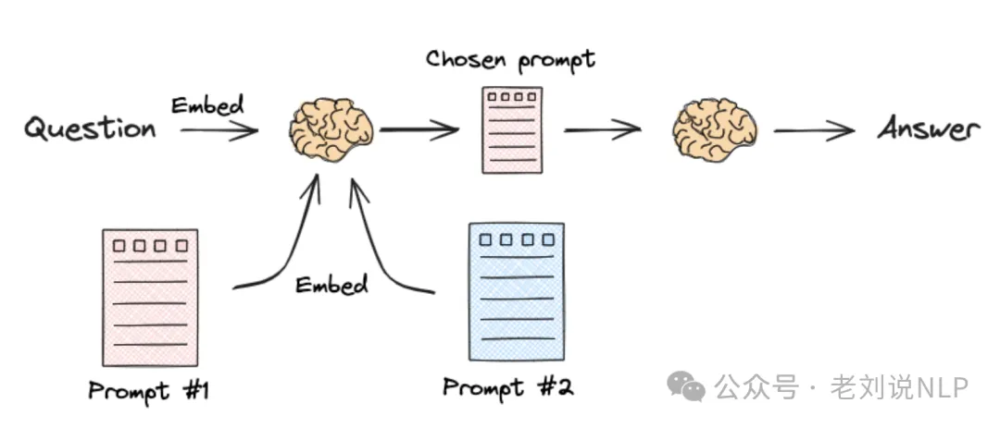


在实现上，可以为每个意图都设定一个prompt，然后进行判定，一个具象化的实现如下：

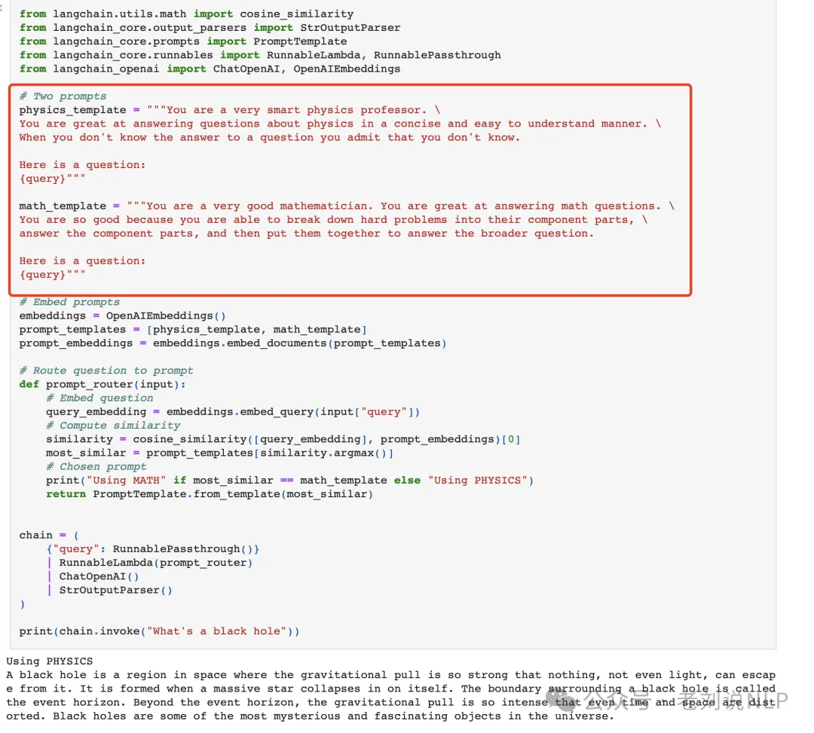

## 2.7 Query Construction问题构建优化策略

Query Construction，主要解决的问题是不同检索知识库，如mysql数据库、图数据库GraphDB、向量化数据库vectorDB的查询转换。使用LLM将自然语言转换为其中DSL是一种与给定数据库（SQL、Cypher等）交互所需的领域特定语言：https://blog.langchain.dev/query-construction/，https://blog.langchain.dev/enhancing-rag-based-applications-accuracy-by-constructing-and-leveraging-knowledge-graphs/

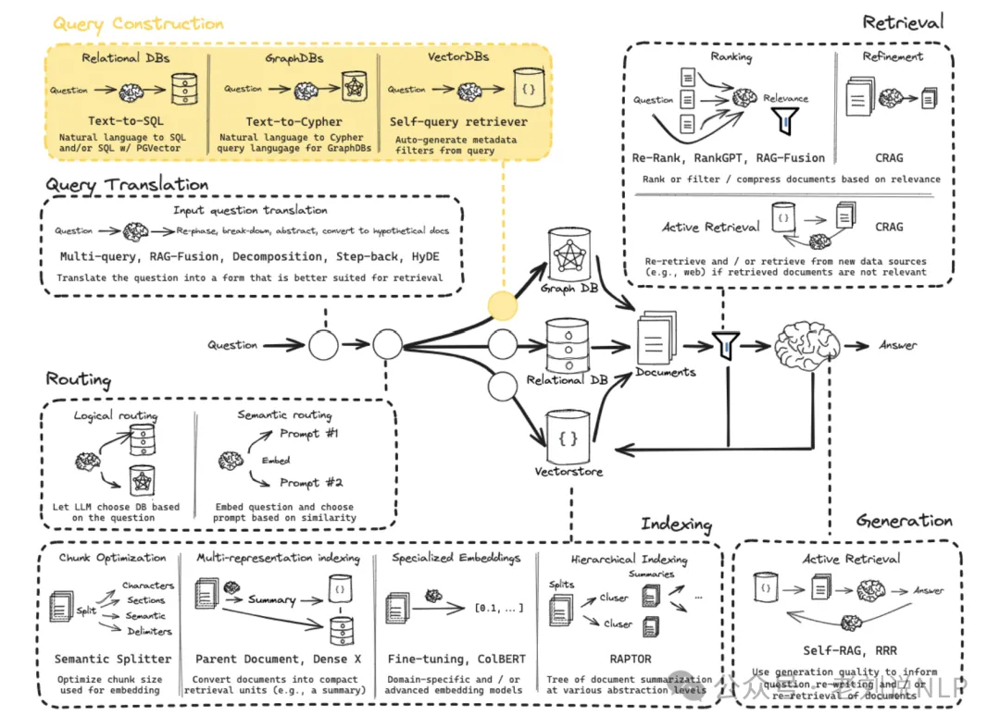

正在具体实现上，可以查看的方案，可以如下：

Query structuring for metadata filters，基于元数据过滤器的问题构建，例如，许多向量化存储都包含元数据字段，例如：

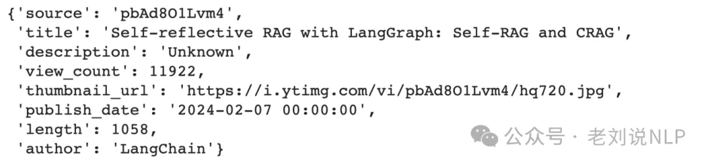

这样就可以根据元数据过滤特定的数据chunk：https://python.langchain.com/docs/use_cases/query_analysis/techniques/structuring

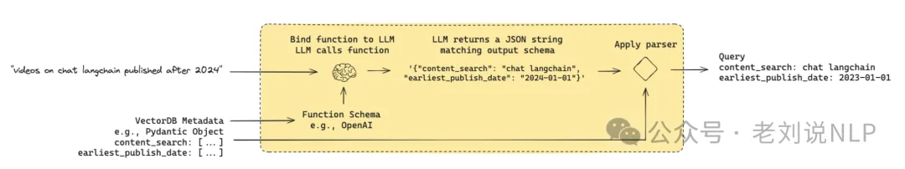

## 2.8  重写-检索-读取

Rewrite-Retrieve-Read（重写-检索-读取）是一种用于增强问答系统或搜索引擎的多阶段处理方法。该方法通过首先重写查询，再根据重写后的查询进行检索，最后对检索到的结果进行深入分析和呈现，从而提高搜索的精度和相关性。

论文：https://aclanthology.org/2023.emnlp-main.322.pdf

项目：https://github.com/xbmxb/RAG-query-rewriting

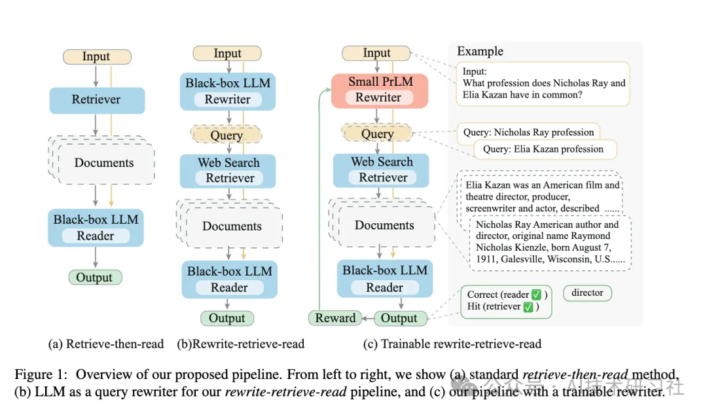

上图，从左到右，我们展示了（a）标准的retrieve-then-read方法，（b）LLM 作为我们的 rewrite-retrieve-read管道的查询重写器，以及（c）带有可训练重写器的管道。

假设用户查询：“如何提高电商直播的观看人数？”

Rewrite（重写查询）
首先，利用大语言模型对用户的查询进行重写，以便使查询更加清晰、简洁或更具可搜索性。

Prompt示例：“请将以下问题重写为更具针对性的问题：‘如何提高电商直播的观看人数？’”

模型生成的重写查询：“有哪些有效的策略可以增加电商直播的观众数量？”

通过这种重写，模型可能更好地理解用户的意图，从而提升检索的准确性。

Retrieve（检索相关内容）

使用重写后的查询在数据库或搜索引擎中进行检索，以找到与问题最相关的文档或信息。

这些文档都是根据重写后的查询精确匹配的内容。

Read（读取并分析结果）

对检索到的文档进行读取和分析，提取出最有价值的信息，以便生成最终的回答或呈现给用户的结果。

Rewrite-Retrieve-Read 方法的优势

提高查询准确性：通过重写步骤，能够优化原始查询，使其更易于理解和检索。

增强搜索相关性：检索过程基于重写后的更精准查询，提升了与用户意图匹配的相关性。

深度信息提取：通过阅读和分析步骤，系统可以提供更详细和有用的回答，而不是简单地返回检索结果。

Rewrite-Retrieve-Read 方法通过多阶段处理，使得搜索引擎和问答系统能够更加智能和灵活地应对复杂查询。这种方法在需要高精准度和深入理解的搜索场景中尤为有效，特别适用于电商、客户支持和知识管理等领域。

## 2.9 Query2Doc（查询2Doc）

Query2Doc（查询2Doc）是一种用于增强信息检索效果的技术方法，尤其适用于从大规模文档库中找到与用户查询最相关的文档。这个方法通过将用户的查询“扩展”成一个更详细的文档，从而提高检索系统对复杂查询的理解和处理能力。

论文：https://arxiv.org/abs/2303.07678

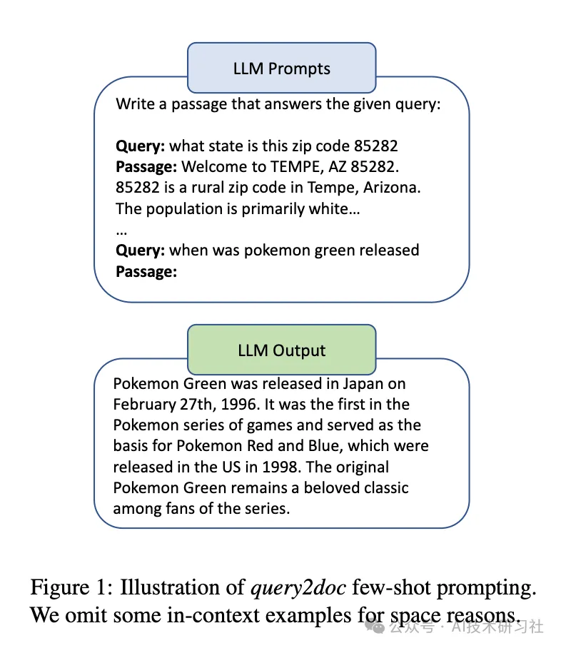

假设用户的查询是：“如何提高电商直播的转化率？”

Query Expansion（查询扩展）

首先，将用户的简短查询扩展为一个更详细的描述性文档，以包含更多潜在相关的关键词和概念。

原始查询：“如何提高电商直播的转化率？”

扩展后的文档（Query2Doc）：

Document Retrieval（文档检索）

利用扩展后的文档作为查询输入，系统将检索到一组更为相关的文档，这些文档包含用户问题的多方面信息。

检索步骤：将扩展后的Query2Doc输入到检索系统中，搜索与其最相关的文档，系统返回一系列包含详细信息和解决方案的文档。

Result Refinement（结果优化）

系统根据扩展查询找到的文档，可以进一步过滤或排序，确保返回的内容更加贴合用户原始需求。

优化后的结果：通过Query2Doc扩展，检索系统不仅返回直接与“转化率提升”相关的文档，还包含有关电商直播策略、用户互动方法、促销设计等方面的深入分析文章，帮助用户全面了解并实施有效的转化率提升措施。

Query2Doc 方法的优势

提高检索效果：通过将简单查询扩展为详细文档，系统能够识别并检索到更多相关信息，提升查询的召回率和精确度。

丰富内容语境：扩展查询有助于涵盖更多相关主题和关键词，增加找到有用信息的几率。

适用于复杂查询：尤其适用于那些需要综合多方面信息的复杂查询，帮助用户获取更全面的答案。

Query2Doc 是一种有效的查询扩展方法，通过将用户的简单查询转化为更具语境和内容丰富的“文档”，可以显著提升信息检索系统的效果。这种方法特别适用于需要从海量数据中筛选出与复杂问题相关的内容，从而帮助用户找到更有价值和深度的信息。


## 2.10 ITER-RETGEN（国际热核聚变实验堆 - 迭代生成器）

ITER-RETGEN（国际热核聚变实验堆 - 迭代生成器）是一种从研究项目的启发中借鉴的技术方法，应用于机器学习和自然语言处理领域。这个方法利用类似于聚变反应的“迭代生成”过程，通过不断生成、评估和优化，最终产生高质量的输出。该方法在复杂的生成任务中表现尤为出色，特别是在需要多次迭代以达到最优结果的情况下。

论文：https://arxiv.org/pdf/2305.15294

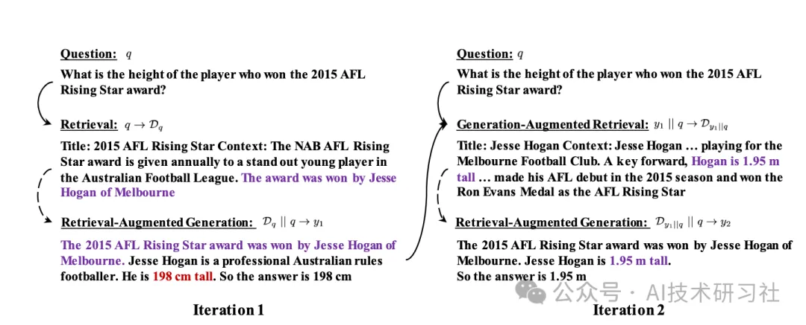

假设我们在进行一个复杂的内容生成任务，如生成一篇关于“未来能源解决方案”的详细报告。

Iterative Generation（迭代生成）

初始生成：首先，使用模型生成一个初步的草稿。这一草稿包含了基本的结构和主要观点，但可能在内容深度和准确性上还不够完善。

初始草稿：“未来的能源解决方案可能会包括可再生能源如太阳能、风能，以及正在研究的核聚变技术。这些技术有望在未来几十年内替代传统的化石燃料，成为主要的能源来源。”

Evaluation and Feedback（评估与反馈）

评估：对初步生成的草稿进行评估，找出不足之处。例如，草稿中的核聚变部分内容过于简略，没有提到当前研究的进展。

反馈：将这些不足之处反馈给生成模型，指导模型进行进一步的内容扩展和修正。

Regeneration（重新生成）

优化生成：基于反馈信息，模型重新生成内容，补充之前的不足。例如，加入关于国际热核聚变实验堆（ITER）的最新研究进展及其对未来能源的潜在影响。

优化后的草稿：“未来的能源解决方案将主要依赖于可再生能源如太阳能和风能的广泛应用。然而，核聚变技术也正在逐步进入实用化阶段，国际热核聚变实验堆（ITER）作为目前世界上最大规模的核聚变研究项目，正在探索如何通过聚变反应实现稳定的能源输出。ITER的成功将标志着人类能源发展史上的一次重大突破，有望彻底改变全球能源格局。”

Further Iterations（进一步迭代）

持续优化：这个过程可以进行多次迭代，每次生成新的版本并评估其质量，直到生成的内容达到预期的质量标准。

最终稿件：经过多次迭代，生成了一篇详细且准确的报告，涵盖了未来能源技术的各个方面，并特别强调了核聚变技术的重要性。

ITER-RETGEN 方法的优势

高质量输出：通过多次迭代和优化，最终生成的内容更为精确、全面。

动态调整：能够根据每次迭代的反馈实时调整和优化生成策略，确保输出结果逐步接近理想状态。

适用复杂任务：特别适用于那些需要深入分析、多角度探讨的复杂生成任务。

ITER-RETGEN 是一种基于迭代生成的技术方法，通过模拟核聚变反应的持续优化过程，帮助生成高质量、精细化的内容。这种方法特别适用于复杂生成任务，能够有效地在多次迭代中不断提高生成内容的质量，最终达到最优结果。

# 3. 总结

综合来看，问题重写的优化策略基本就是上下左右4个方向

- 把问题改写成多个
- 把问题总结
- 把问题分解
- 把问题通过大模型生成答案再检索

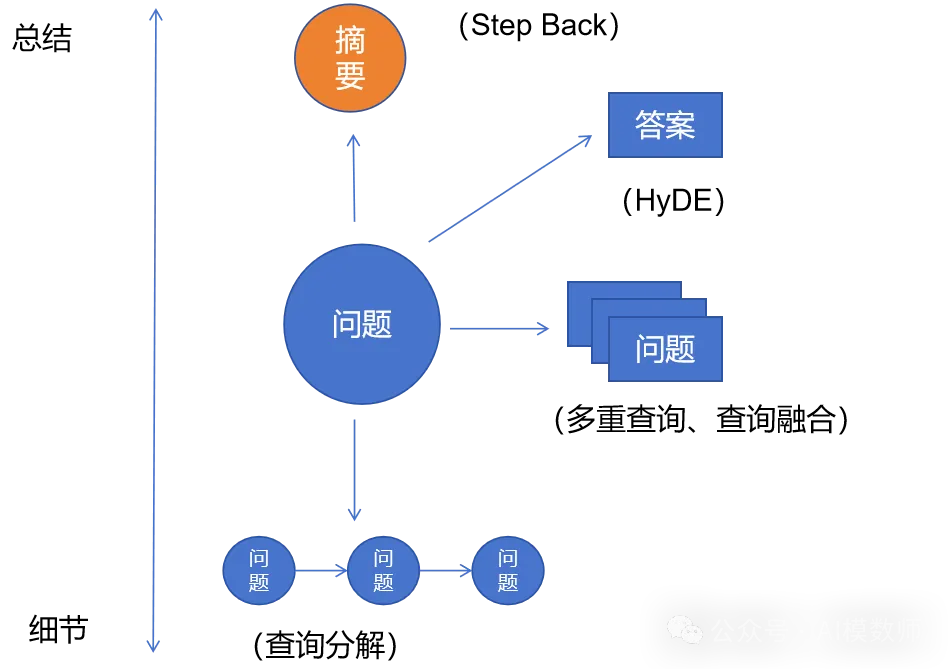

不过这5种优化方式只是提供了一种思路，在OpenAI发布的一个成功案例中，里面提到了HyDE的优化方法，但实际效果并不好，所以没有采用。

但多重查询和RAG融合这两种技术，让我感觉这可以扩展成一个大模型集群。

# 参考

[1] 【深入浅出RAG】RAG提问重写优化：如何提高问题的准确性，https://mp.weixin.qq.com/s/ZrH296u44CX_Xipr4q0jZA
[2] 一文详看Langchain框架中的RAG多阶段优化策略：从问题转换到查询路由再到生成优化, https://mp.weixin.qq.com/s/pK2BRLrWpEKKIPFhUtGvcg
[3] 提升RAG系统效果：揭秘Rewrite技术及其关键优化策略，提高召回率与精确度, https://mp.weixin.qq.com/s/1tF_ZsKEMze02bqn426UPg