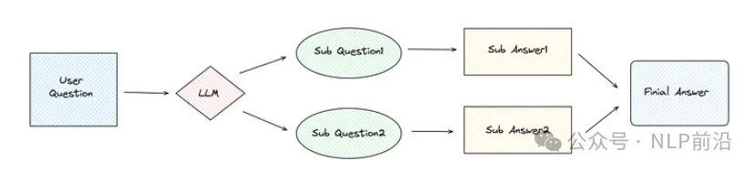
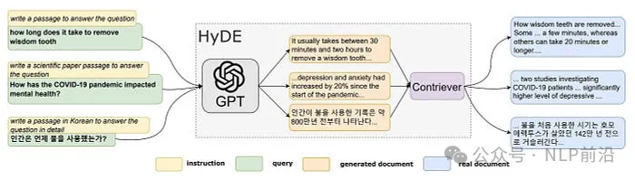
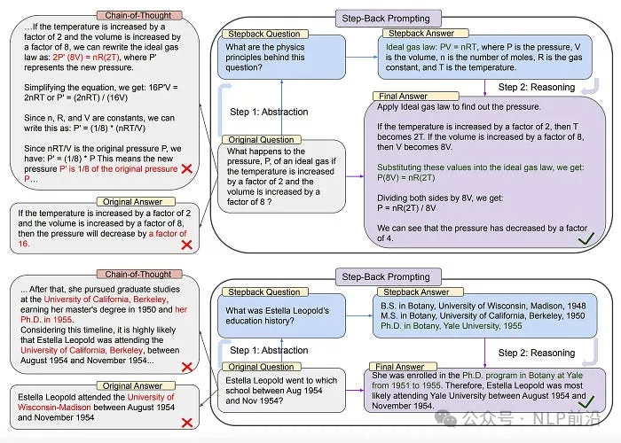

# 1. 资源

博客地址：https://generativeai.pub/advanced-rag-retrieval-strategy-query-rewriting-a1dd61815ff0

# 2. Sub-Question



流程：
- 子问题策略使用 LLM 根据用户查询生成多个子问题。
- 然后，每个子问题经过RAG过程以获得自己的答案（检索生成）。
- 最后，将所有子问题的答案进行合并，得到最终的答案。

```python
##  默认流程
from llama_index.core import VectorStoreIndex, SimpleDirectoryReader

question = "Harley Quinn和Thanos 是复仇者联盟中的正义人物吗？"
documents = SimpleDirectoryReader("./data").load_data()
node_parser = VectorStoreIndex.from_documents(documents)
query_engine = node_parser.as_query_engine()
response = query_engine.query(question)
print(f"base query result: {response}")

# Output
base query result: 不，Harley Quinn和Thano在《复仇者联盟》系列中并没有被描绘成正义的人物。


## Sub-Question
from llama_index.core.tools import QueryEngineTool, ToolMetadata
from llama_index.core.query_engine import SubQuestionQueryEngine

query_engine_tools = [
    QueryEngineTool(
        query_engine=query_engine,
        metadata=ToolMetadata(
            name="Avengers",
            description="漫威电影《复仇者联盟》",
        ),
    ),
]
query_engine = SubQuestionQueryEngine.from_defaults(
    query_engine_tools=query_engine_tools
)
response = query_engine.query(question)
print(f"sub question query result: {response}")

# Output
Generated 2 sub questions.
[Avengers] Q: Harley Quinn 在复仇者联盟电影中扮演什么角色？
[Avengers] Q: Thanos play 在复仇者联盟电影中扮演什么角色？
[Avengers] A: 在《复仇者联盟》电影的背景介绍中，并没有提到Harley Quinn。
[Avengers] A: Thanos是《复仇者联盟》电影中的主要反派。他是一位强大的军阀，试图按照自己的设想重塑宇宙。Thanos被描绘成一个强大而无情的敌人，对复仇者联盟和整个宇宙构成了重大威胁。
sub question query result: 复仇者联盟电影的背景中并未提及Harley Quinn。Thanos是复仇者联盟电影的主要反派，被描绘成一个强大而无情的敌人。
```

# 3. HyDE



原理：

HyDE（Hypothetical Document Embeddings）的本质是利用LLM生成假设文档。这些文档是根据 LLM 本身的知识生成的，可能包含错误或不准确之处。但是，它们与 RAG 知识库中的文档相关联。然后，利用这些假设文档来检索具有相似向量的真实文档，提高检索的准确性。

```python
from llama_index.core.indices.query.query_transform import HyDEQueryTransform

question = "Loki为了征服地球使用了什么神秘物品？"
hyde = HyDEQueryTransform(include_original=True)
query_bundle = hyde(question)
print(f"query_bundle embedding len: {len(query_bundle.embedding_strs)}")
for idx, embedding in enumerate(query_bundle.embedding_strs):
    print(f"embedding {idx}: {embedding[:100]}")

# Display result
query_bundle embedding len: 2
embedding 0: Loki 利用宇宙立方（又称宇宙魔方）试图征服地球。这个神秘的...
embedding 1: Loki 为了征服地球使用了什么神秘物品？

from llama_index.core.query_engine import TransformQueryEngine

hyde_query_engine = TransformQueryEngine(query_engine, hyde)
response = hyde_query_engine.query(question)
print(f"hyde query result: {response}")

# Display result
hyde query result: Loki 曾试图利用宇宙立方征服地球。这件强大的神器也被称为...
```

注：HyDE 生成的假设文档基于 LLM 的知识，可能包含错误或不准确之处。HyDE 可能会误导查询并引入偏差，因此在实际应用中使用时应谨慎。

# 4. Step-Back Prompting



步骤

Step-Back Prompting是一种引导LLM通过从用户查询中提取高级概念和基本原理，并用这些概念和原理来指导推理的方法。可以显着提高LLM遵循正确推理路径解决问题的能力。

以上图中的第一个问题为例，原来的问题是求给定温度和体积的压力。左边的答案中，无论是原来的答案还是思路链的答案，结果都是错误的。然而，通过后退提示，首先在原始问题的基础上生成更广泛的问题，例如寻求问题背后的底层物理公式。然后，从更广泛的问题中获得答案，最后将更广泛的问题的答案和原始问题一起提交给LLM，从而获得正确的答案。

```python
from llama_index.core import PromptTemplate
from openai import OpenAI

client = OpenAI()
examples = [
        {
            "input": "1968 年至 1974 年期间安娜·卡琳娜的配偶是谁？",
            "output": "安娜·卡琳娜的配偶是谁？",
        },
        {
            "input": "1954 年 8 月至 1954 年 11 月期间，埃斯特拉·利奥波德 (Estella Leopold) 就读于哪所学校？",
            "output": "埃斯特拉·利奥波德 (Estella Leopold) 的教育历史是怎样的？",
        },
    ]
    few_shot_examples = "\n\n".join(
        [f"human: {example['input']}\nAI: {example['output']}" for example in examples]
    )
    step_back_question_system_prompt = PromptTemplate(
        "你是世界知识方面的专家。"
"你的任务是退一步，将问题解释为更通用的退一步问题，"
"这更容易回答。以下是几个例子：\n"
        "{few_shot_examples}"
    )
    completion = client.chat.completions.create(
        model="gpt-3.5-turbo",
        temperature=0.1,
        messages=[
            {
                "role": "system",
                "content": step_back_question_system_prompt.format(
                    few_shot_examples=few_shot_examples
                ),
            },
            {"role": "user", "content": question},
        ],
    )
    step_back_question = completion.choices[0].message.content
    print(f"step_back_question: {step_back_question}")
    
retrievals = retriever.retrieve(question)
normal_context = "\n\n".join([f"{n.text}" for n in retrievals])
retrievals = retriever.retrieve(step_back_question)
step_back_context = "\n\n".join([f"{n.text}" for n in retrievals])


step_back_qa_prompt_template = PromptTemplate(
        "Context information is below.\n"
        "---------------------\n"
        "{normal_context}\n"
        "{step_back_context}\n"
        "---------------------\n"
        "Given the context information and not prior knowledge, "
        "answer the question: {question}\n"
    )

completion = client.chat.completions.create(
        model="gpt-3.5-turbo",
        temperature=0.1,
        messages=[
            {
                "role": "system",
                "content": "一定要回答问题，即使上下文没有帮助。",
            },
            {
                "role": "user",
                "content": step_back_qa_prompt_template.format(
                    normal_context=normal_context,
                    step_back_context=step_back_context,
                    question=question,
                ),
            },
        ],
    )
    step_back_result = completion.choices[0].message.content
    print(f"step_back_result: {step_back_result}")
    
question: 泰坦星上发生过一场大战吗？
base result: 不，泰坦星上没有发生过大规模战争。泰坦星上没有发生过任何重大冲突或战争。
====================================================================================================
step back question: 泰坦星上发生过什么重大事件吗？
step back result: 是的，在漫威电影宇宙中，泰坦星上发生过一场重大冲突。在《复仇者联盟：无限战争》中，泰坦星被描绘成灭霸被摧毁的家园，泰坦星上的战斗涉及一群英雄，包括钢铁侠（托尼·斯塔克）、蜘蛛侠（彼得·帕克）、奇异博士（史蒂芬·斯特兰奇）和银河护卫队，他们试图阻止灭霸实现他的目标。
```


# 参考

[1] RAG系统进阶：query rewrite高手必备的三大技巧，附代码实现，https://mp.weixin.qq.com/s/zD4rHt79CeRQgULUOfbBYg
