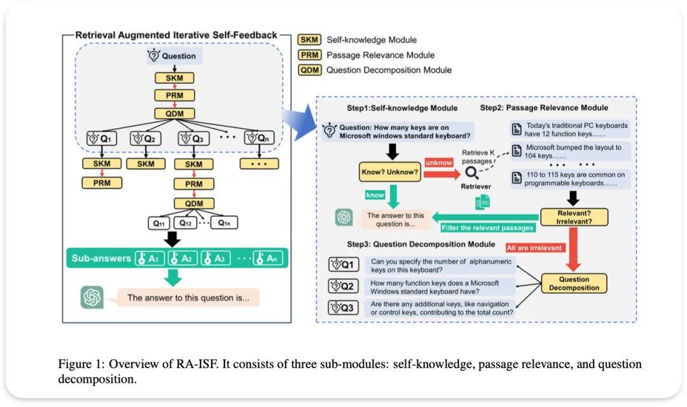

# RA-ISF

这个项目更具特色的是自适应检索,在6个RAG进阶优化方案,对应14篇论文案例解析也提过。涉及到的问题拆分是在原问题直接检索不到,颗粒度过粗的情况下, 将原问题拆分成细化的子问题Q1, Q2,Q3等再检索。

跟Shortwave不同在于, Shortwave一个是一上来就直接拆分问题本身,RA-ISF则是原问题实在检索不到再拆分问题

# 参考

[1] RAG进阶优化方向(2): 问题拆分, 检索线索和分步推理, https://mp.weixin.qq.com/s/RVFdiIPYchmO5GTQSbJWKQ