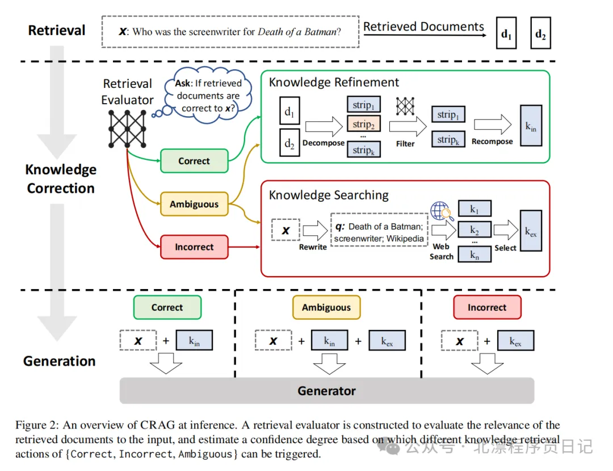
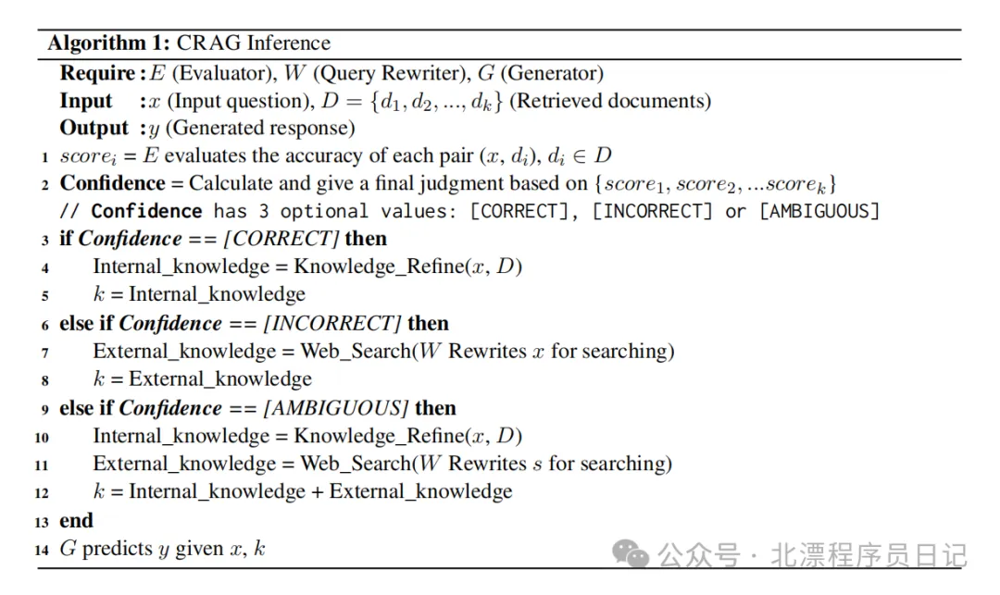
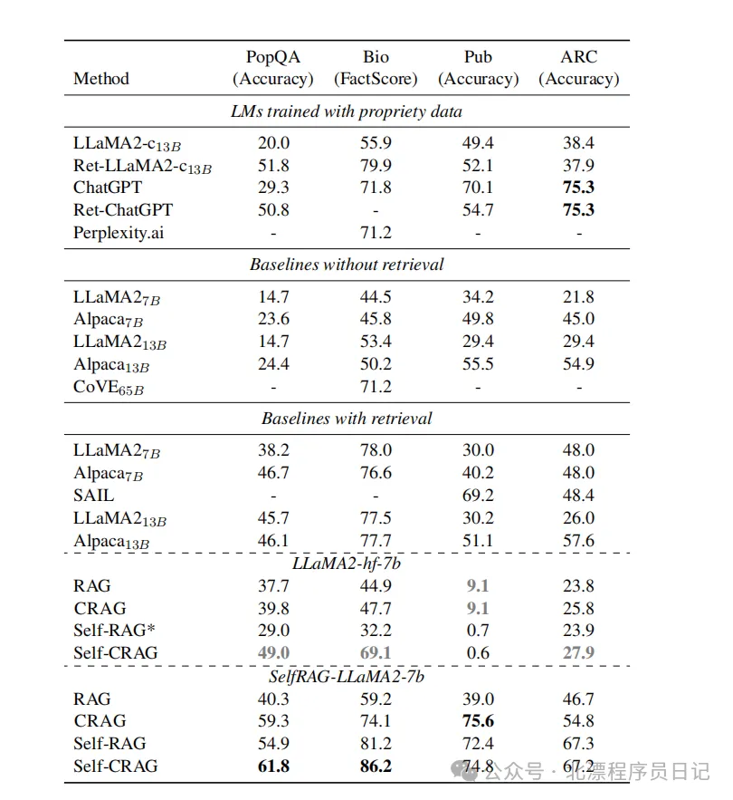

# 1. 资源

论文
- 论文地址：https://arxiv.org/pdf/2401.15884.pdf
- 论文标题：Corrective Retrieval Augmented Generation

Github (93 Stars): https://github.com/CraftJarvis/RAT.git

# 2. 问题

在用RAG的路子对大模型做一个增强问答的过程中，我们会遇到几个典型且棘手的问题，比如：

1. 检索到的文档不相关或者错误的信息。这些信息在很大程度上会导致模型的回答错误。

2. 检索的文档中会包含无用的信息。这些信息除了会增加参考信息上下文的长度外，还会一定程度上会让模型回复产生信息冗余。

RAG的问题，Prompt一般会有两种表示形式，一是完全按照参考信息作答，即便参考信息是错的，另一种是结合模型自身的知识+参考信息进行作答，这种方式其本质上也让LLM 对参考信息做了一遍过滤，但带来的负面效果就是给了LLM 自由发挥的空间，从而导致幻觉的控制能力更差。

# 3. 原理

论文中的实现过程如下：

- 对检索到的文档进行相关性的判断，论文这里使用T5-large 进行微调来进行实现。微调数据的生成采用标注对问题的召回候选进行标注（1是相关，-1是不相关）。笔者觉得这里还有两个候选方案：第一个方案：直接对问题和候选文档进行embedding，然后卡相似度阈值来进行快速的实现，第二个方案：lora-7B的模型，第二个方案理论上能实现更好的效果。

- 如果文档和问题是相关的，那么就对文档进行细粒度的知识拆解。拆解的流程为：对文档拆分成更小的语义单元（通常按几个句子来定义一个语义单元），然后对拆分后的语义单元用相关性判断器（就是流程一中微调的）进行判断，选Top-5, 并卡阈值进行筛选。笔者认为这里和之前的解决方案差别在于：之前是先chunk再召回，这里是先召回再chunk，并且对每一个chunk 的拆分粒度遵循语义单元的标准（即按照句子的拆分粒度）而不是直接卡一个chunk 的长度，这种方式理论上肯定要比之前的更优，拆分的效果要更好。

- 如果文档和问题不相关则直接进行丢弃，且会触发后续调用第三方通用检索接口的逻辑。另外还存在一个情况为：Ambiguous，对于这种情况，论文将拆分和调第三方搜索接口融合，以增强鲁棒性。笔者在论文中没找到与这条件相符合的数据参考，但笔者认为，可以完全抛弃模棱两可的情况，直接进行第三方检索，增加回复的准确度。

以下是三种情况的伪代码流转实现：

# 4. 结果

# 参考

[1] 纠正性检索增强生成（CRAG）：提升语言模型鲁棒性的新方法，https://mp.weixin.qq.com/s?__biz=MzIwMzEyMDY3OQ==&mid=2247483975&idx=1&sn=19de5097e9c12ba8ec6fc96d6708ec62&chksm=96d50b0fa1a28219a7a5e8bd7a588f99b26e2e45d5209f6e15b74bbdeabb36da1a054a59e49d&cur_album_id=3206823614842175490&scene=189#wechat_redirect