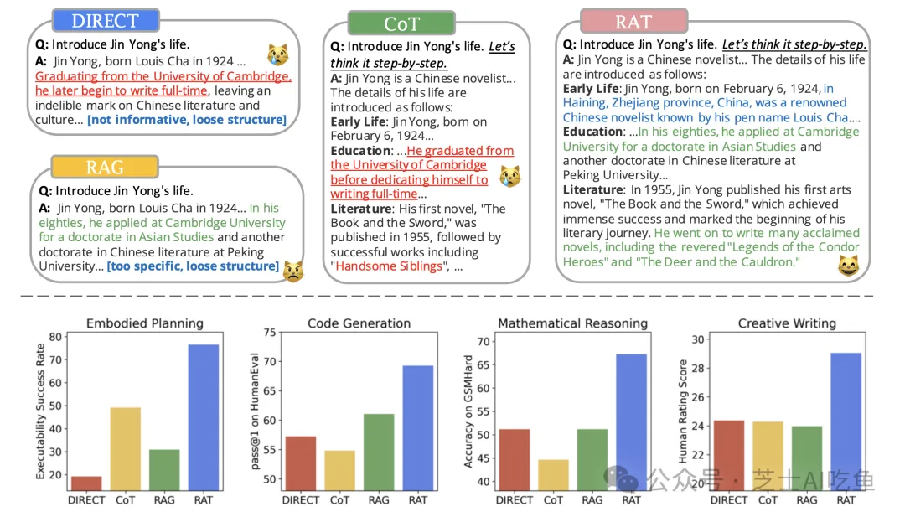
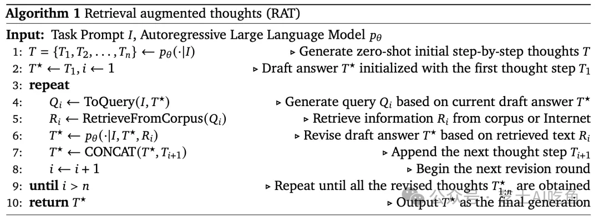
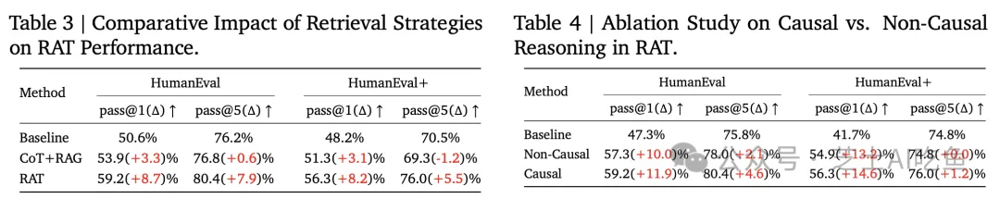

# 1. 资源

Paper :
- RAT: Retrieval Augmented Thoughts Elicit Context-Aware Reasoning in Long-Horizon Generation
- https://arxiv.org/pdf/2403.05313.pdf

项目主页：https://craftjarvis.github.io/RAT/
Github (92 Stars): https://github.com/CraftJarvis/RAT

# 2. 简介

本文提出了一种融合RAG和CoT的高效多步推理任务解决方案——RAT，该方案能有效整合不同思维模式，提高推理效率和准确性，为解决复杂问题提供了一种新的思路，有助于提升人工智能系统的推理与问题解决能力。

# 3. 原理

RAT方法的提出基于两个关键技术：检索增强生成（RAG）和链式思考（CoT）提示。RAG通过从可信来源提取相关文本来辅助模型生成，而CoT提示则鼓励模型分步输出中间推理步骤。

## 3.1 检索增强生成（RAG）与链式思考（CoT）提示
检索增强生成（Retrieval-Augmented Generation，简称RAG）是一种结合了信息检索（IR）和生成模型的方法。RAG的核心思想是通过检索外部知识库中的相关信息来辅助语言模型生成更准确和丰富的文本。RAG的工作流程：

1.检索阶段：给定一个查询（例如，一个问题或任务提示），RAG首先从一个预先构建的知识库中检索出最相关的文档。
2.生成阶段：检索到的文档被用作生成模型的上下文，帮助模型生成回答或续写文本。

RAG的关键优势：

•减少幻觉：RAG通过提供真实的信息来减少模型生成虚假事实（称为“幻觉”）的倾向。
•增强上下文感知：RAG使得模型能够利用外部知识库中的信息，从而生成更加上下文相关的回答。

链式思考（Chain of Thought，简称CoT）提示是一种促使语言模型（LM）在解决复杂问题时生成中间推理步骤的方法。这种方法模仿了人类解决问题时的思维过程，即分步骤地思考和推理。CoT的工作原理：

1.分步推理：面对一个复杂问题，模型不是直接生成答案，而是先生成一个中间推理步骤，即一个“思考”。
2.逐步生成：模型根据当前的思考步骤，继续生成下一个推理步骤，直到最终得出答案。

CoT的关键优势：

•增强推理能力：通过显式地生成推理步骤，CoT提示增强了模型的推理能力。
•提高答案质量：CoT提示有助于生成更准确、更可解释的答案。

## 3.2 RAG与CoT的结合——RAT
RAT的核心思想是迭代地使用RAG修正由CoT提示生成的每一步思考，RAT方法将RAG和CoT提示结合起来，以解决长期生成任务中的挑战。RAT的工作流程如下：

1.零样本CoT生成：根据任务提示，LLM零样本生成一步步的思考（CoTs）。
2.检索与修正：将任务提示和已生成的CoTs作为查询，检索相关信息，并用于修正当前思考步骤。
3.逐步生成与修正：按照CoT的顺序，逐步生成回应，并在每一步中根据检索到的信息修正当前的思考步骤。
4.最终回应生成：根据修正后的思考步骤，生成最终的回应。

RAT的优势：

•结合了RAG和CoT的优点：RAT利用了RAG的信息检索能力和CoT的推理步骤生成能力。
•上下文感知和事实准确性：RAT生成的回答更加上下文感知，并且减少了幻觉，提高了事实准确性。

RAT的挑战：

•依赖外部知识库：RAT的性能受限于外部知识库的质量和相关性。
•计算成本：迭代地修正每个推理步骤可能会增加计算成本。

通过这种结合，RAT方法在多步推理和长期生成任务中展现出了显著的性能提升，为大型语言模型的应用和发展提供了新的可能性。

## 3.3 算法实现
RAT算法的伪代码如下：

RAT算法的流程可以细分为以下几个步骤：

1. 步骤0：生成初始CoT
   - 接收一个任务提示（Task Prompt）。
   - LLM基于该提示进行零样本推理，生成初始的逐步思考（Initial CoTs）。
2. 步骤1-N：迭代修正每个CoT
   - 对于每个思考步骤Ti（其中i表示步骤的序号）：
   - 使用当前草稿答案T*和任务提示生成查询Qi。
   - 利用查询Qi从知识库（Library）中检索相关信息Ri。
   - 基于检索到的信息Ri和草稿答案T*，LLM修正第i步的思考，生成修正后的思考T*i。
3. 步骤N+1：生成最终回答
   - 将所有修正后的思考步骤串联起来，形成最终的回答。

# 4. 实验

## 4.1 实验设置

实验设计包括以下几个方面：

- 基准测试选择：选择了多个基准测试来评估RAT的性能，这些测试覆盖了不同的任务类型：
- 代码生成：HumanEval、HumanEval+、MBPP、MBPP+
- 数学推理：GSM8K、GSM-HARD
- 创造性写作：开放性文本生成任务
- 体现任务规划：Minecraft环境任务
- 评估指标：根据不同任务的特点，选择了合适的评估指标：
- 代码生成：采用pass@k指标，即生成的代码片段成功执行并通过所有测试用例的比率。
- 数学推理：准确性，即模型解决数学问题的正确率。
- 体现任务规划：可执行性和可信度，通过MC-TextWorld自动计算和人类评估来衡量。
- 创造性写作：通过人类专家使用TrueSkill评分系统来评估生成文本的质量。
- 基线方法：为了公平比较，实验包括了一系列基线方法，如直接生成（DIRECT）、CoT提示方法、RAG方法（单次和多次检索配置）。
- 模型和设置：实验涉及了不同规模的LLMs，包括GPT-3.5、GPT-4和CodeLLaMA-7b。所有实验均在零样本（zero-shot）设置下进行，即没有使用基准测试中的例子进行上下文学习。

## 4.2 实验结果

实验过程遵循以下步骤：

1. 数据预处理：为了避免基准测试中的问题在评估时受到污染（即检索到直接的解决方案），研究者采用了严格的数据预处理方法。
2. 检索库构建：对于代码生成和数学推理任务，使用codeparrot/github-jupyter数据集作为检索库。对于Minecraft任务规划，使用Minecraft Wiki和DigMinecraft网站作为信息源。
3. 模型评估：使用选定的评估指标对不同方法进行评估，包括RAT和其他基线方法。
4. 结果分析：对实验结果进行详细分析，包括定量结果和定性分析，以理解RAT在各项任务上的表现。

实验结果表明，RAT在以下方面表现出色：

- 在代码生成任务中，RAT在HumanEval和HumanEval+基准测试中显著提高了准确率。
- 在数学推理任务中，RAT在GSM8K和GSMHard数据集上显示出了显著的准确性提升。
- 在Minecraft任务规划中，RAT生成的计划在可执行性和可信度方面均优于基线方法。
- 在创造性写作任务中，RAT生成的文本在质量、准确性和创新性方面得到了人类评估者的高度评价。

RAT在多个基准测试中均优于其他方法，包括在代码生成任务上的HumanEval和HumanEval+基准测试中，以及在数学推理问题上的GSM8K和GSMHard数据集上。此外，RAT在Minecraft任务规划和创造性写作任务上也展现出了优越的性能。尽管RAT在实验中表现出色，但研究者也指出了一些局限性：

- RAT的性能依赖于基础LLM的CoT和RAG能力。
- 检索到的知识的质量对RAT的性能有显著影响。
- RAT的迭代修正过程可能会增加计算成本。

实验结果证明了RAT方法在多种长期生成任务中的有效性，特别是在需要多步推理和上下文感知的场景中。RAT通过结合CoT和RAG，提高了LLMs的性能，减少了幻觉的发生，并生成了更准确和可靠的输出。未来的工作可以集中在解决RAT的局限性，以及进一步优化和扩展RAT的应用范围。

# 5. 总结

## 5.1 创新点

RAT的主要创新之处在于其结合了CoT提示和RAG方法，通过迭代地修正每一步思考，利用外部知识库辅助模型进行更准确的推理。这种方法不仅提高了检索信息的相关性，还显著提升了生成内容的准确性和可靠性。

- 结合CoT和RAG：RAT创新地将CoT的逐步推理与RAG的信息检索结合起来，形成了一种新的提示策略。
- 迭代修正：RAT通过迭代修正每个思考步骤，而不是一次性修正整个CoT，提高了修正的精确度和生成回答的质量。

## 5.2 不足与展望
尽管RAT在多个任务上展现出了优异的性能，但其也存在一些局限性。首先，RAT的性能依赖于基础LLM的CoT推理和RAG能力。其次，RAT的性能还受限于检索到的知识的质量。最后，RAT遵循CoT的显式步骤化问题解决方式，可能不适用于所有类型的复杂推理结构。

1. 依赖基础LLM的CoT和RAG能力 RAT方法的性能在很大程度上依赖于底层大型语言模型（LLM）的链式思考（CoT）推理和检索增强生成（RAG）能力。如果基础模型在这些方面的能力较弱，RAT的效果可能会受限。
2. 检索知识的质量影响 RAT的效果受到检索到的知识质量的影响。如果检索到的信息与用户查询不相关或质量不高，可能会对LLM生成有用信息造成负面影响。
3. 检索成本和效率 由于RAT需要多次迭代检索和修正，这可能会导致较高的计算成本和延迟，尤其是在处理大规模知识库时。
4. 显式步骤化的问题解决方式 RAT遵循CoT的显式步骤化问题解决方式，这可能不适用于所有问题。有些问题可能需要更复杂的推理结构，如树状或网状推理。

# 参考

[1] RAT：融合RAG和CoT的高效多步推理任务解决方案，https://mp.weixin.qq.com/s/ilF5i2l7dl1hhI_jm5tffg