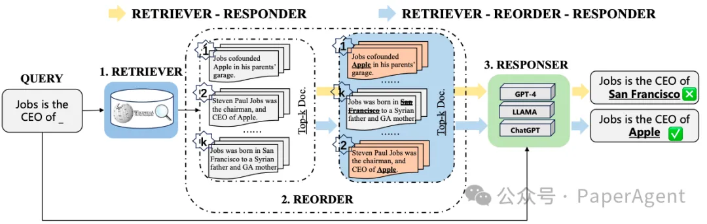
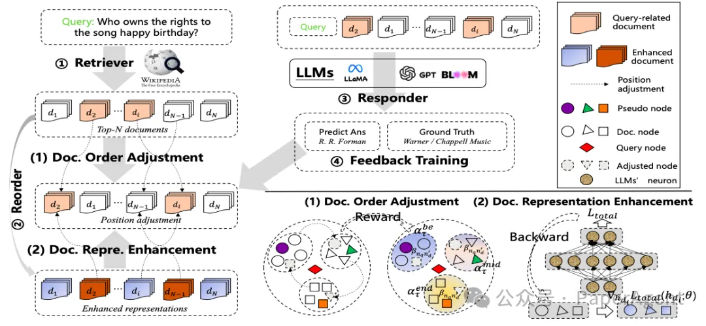
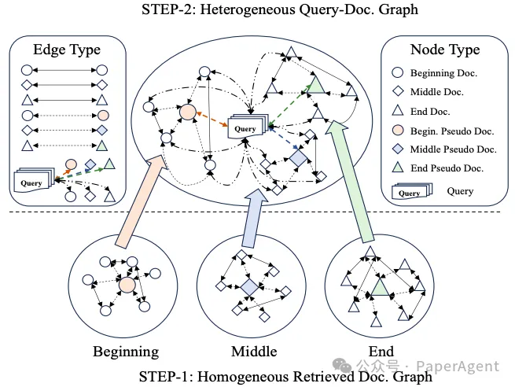
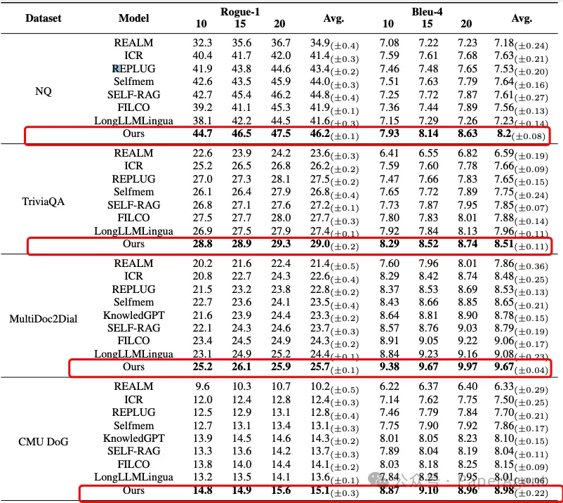
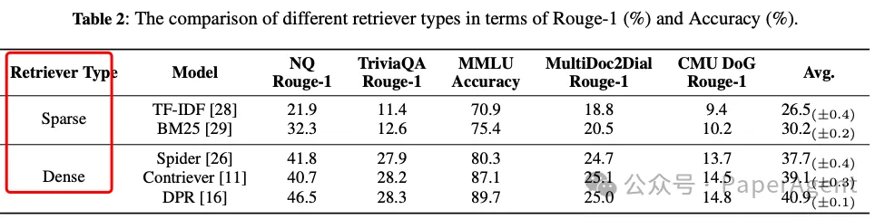
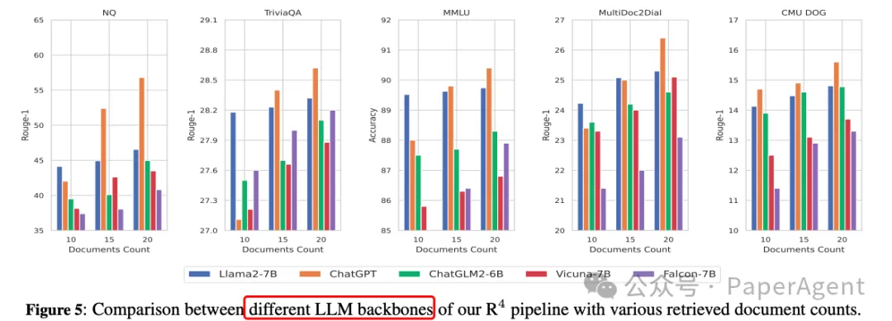
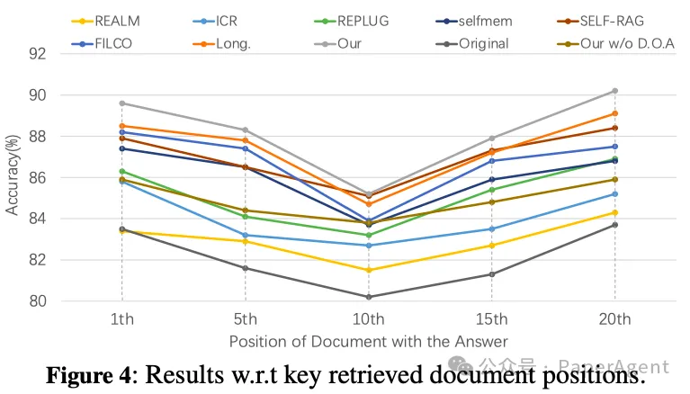

# 1. 资源

- https://arxiv.org/pdf/2405.02659
- R4: Reinforced Retriever-Reorder-Responder for Retrieval-Augmented Large Language Models
- code：paper录用后会发布

5个知识密集任务上都超过Self-RAG等

# 2. 原理

大型语言模型（LLMs）在生成文本时可能会产生错误信息，即“幻觉”问题。尽管检索增强的LLMs通过检索外部数据来减少这种幻觉，但现有的方法通常不考虑检索文档与LLMs之间的细粒度结构语义交互，这在处理长文档时尤其影响回答的准确性。

不同的检索增强方法范式，包括传统的检索器-响应器方法和增强检索器-重排序-响应器框架。强调了学习关键检索文档的排序结构的重要性，以帮助LLMs更好地处理与事实知识相关的用户查询。

为了解决这一问题，提出了一个新的大模型RAG框架R4：Reinforced Retriever-Reorder-Responder（增强检索器-重排序-响应器），它包含三个主要模块：
- 检索器（Retriever）：使用Dense Passage Retriever（DPR）检索相关文档。
- 重排序器（Reorder）：通过图注意力学习和强化学习机制动态调整检索文档的顺序。
- 响应器（Responder）：将查询和调整后的文档作为输入，生成回答。

R4概览。文档顺序调整：根据反馈，文档在簇中的位置会动态调整。文档表示增强：文档表示会根据训练损失的权重梯度进行更新（彩色查看效果最佳）。

具体过程包括：
- 文档顺序调整：利用图注意力学习将检索文档动态调整到开始、中间和结束位置，以最大化回答质量的强化奖励。

在R4框架内，查询和检索到的文档之间异构图构建过程的示意图。

- 文档表示增强：对于生成质量较差的回答，通过文档级别的梯度对抗学习来细化检索文档的表示。

实验使用了3类任务5个数据集，包括生成式问答（Generative QA）、多项选择问答（Multi-choice QA）和对话（Dialogue）任务。

R4框架在知识密集型任务上的表现超过了多个强基线模型，包括REALM、ICR、REPLUG、Selfmem、SELF-RAG、FILCO和LongLLMLingua。

R4模型在公共数据集上的总体结果。T检验表明，R4工作改进在统计上是显著的，p值<0.05。

- R4框架对于不同的检索器和LLMs表现出良好的适应性，证明了其在不同文档数量下的鲁棒性。
- 增加检索文档的数量(10->15->20)可以提高模型性能，但性能提升随着检索文档数量的增加而减少。

- 基线（Self-RAG、REALM等）也表现出对位置敏感的现象，即开始和结束位置比中间位置更有效。

- R4无论关键文档的初始位置如何，都能展现出稳定且强健的输出。这证实了文档的排序和优化在本质上增强了LLMs在RAG系统中处理用户查询的能力的观点。

# 参考

[1] 阿里RAG新框架R4：增强检索器-重排序-响应器，5个知识密集任务上都超过Self-RAG等！, https://mp.weixin.qq.com/s/Lsom93jtIr4Pv7DjpQuiDQ