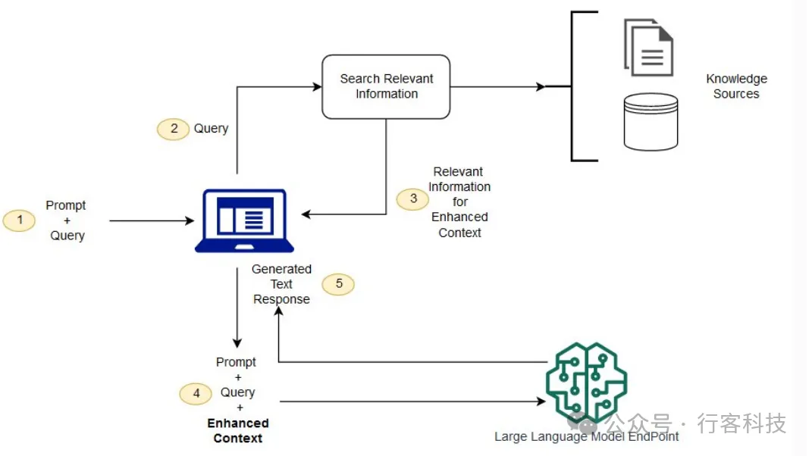
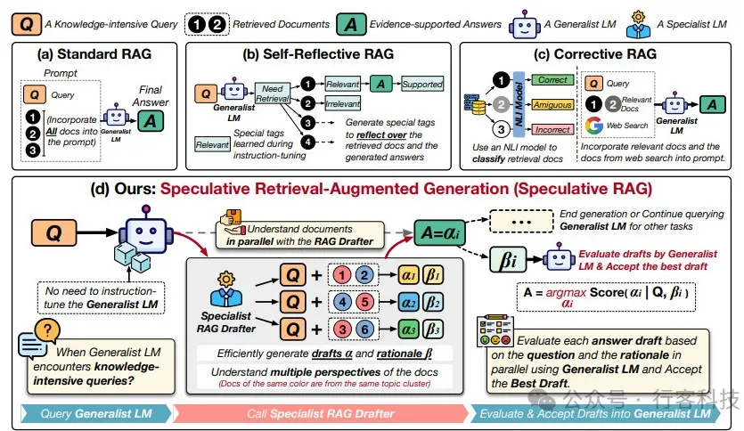
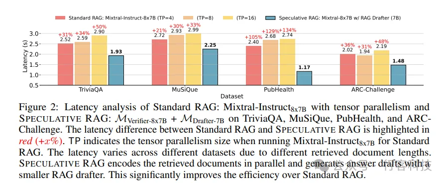
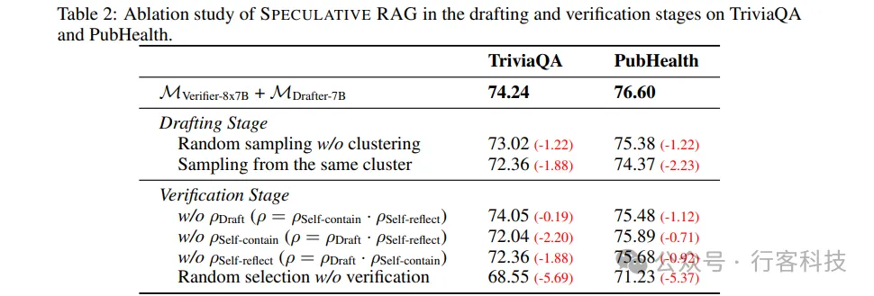
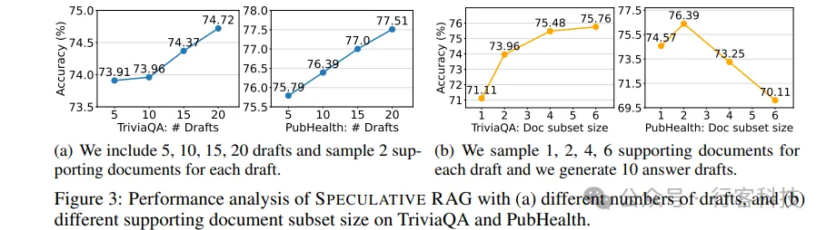
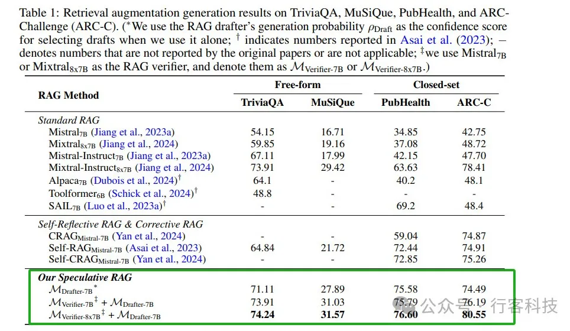

# 1. 简介

【行客按】近日谷歌与加利福尼亚大学圣迭戈分校合作，发布了一项名为Speculative RAG的新技术，旨在提升大型语言模型在知识密集型任务中的推理能力。传统的检索增强生成（RAG）方法通过从外部数据库检索相关文档，并将其纳入生成过程中，来提高生成答案的准确性。然而面对复杂问题时，现有RAG方法往往在效率和准确性之间难以取得平衡。

# 2. RAG背景

RAG（Retrieval Augmented Generation）是通过从外部数据库检索相关文档，并将其纳入生成过程中来增强大型语言模型（LLMs）的生成能力。RAG的基本流程如下：

检索阶段：从数据库中检索与输入问题相关的文档。

生成阶段：基于检索到的文档生成回答。

然而，传统RAG方法在生成答案时存在一定的效率和准确性问题，特别是在知识密集型任务中，容易产生事实错误。Speculative RAG通过引入草稿生成和验证机制，显著提升了RAG的性能。

（上图显示了将 RAG 与 LLM 配合使用的概念流程）

# 3. Speculative RAG

什么是Speculative RAG？

Speculative RAG是一种新的RAG框架，它通过分而治之的方法，将答案生成过程分为草稿生成和草稿验证两个阶段。具体来说，这一方法利用一个较小的专家模型（RAG Drafter）生成多个答案草稿，然后由一个较大的通用模型（RAG Verifier）对这些草稿进行验证，最终选择最优草稿作为答案。

Figure 1: 对不同 RAG 方法的示例
给定一个知识密集型查询 Q 和检索到的文档，（a）标准 RAG 将所有文档都纳入提示符中，这会增加输入长度并降低推理速度；（b）自我反射 RAG（Asai 等人，2023 年）需要对通用语言模型 (LM) 进行特殊的指令微调，以生成用于自我反射的特定标签；（c）纠正性 RAG（Yan 等人，2024 年）采用外部检索评估器来改进文档质量，仅关注上下文信息，而不增强推理能力；（d）相比之下SPECULATIVE RAG 利用更大的通用 LM 来高效验证由较小的专门 LM 并行生成的多个 RAG 草稿。每个草稿都由检索到的文档的不同子集生成，从而提供证据的不同视角，同时最大限度地减少每个草稿的输入标记数量。

技术原理解析

1. 草稿生成

    在草稿生成阶段，Speculative RAG通过以下步骤来确保生成草稿的多样性和准确性：
    
    文档聚类：将检索到的文档根据其与问题的相关性进行聚类，每个聚类代表一个视角。
    
    文档子集采样：从每个聚类中随机抽取一个文档，形成多个文档子集，确保多样性并减少冗余。
    
    生成草稿：利用RAG Drafter对每个文档子集生成答案草稿和对应的推理理由。

    

   Figure 2: 延迟分析
   
   该图分析了标准 RAG（Mixtral-Instruct8x7B，使用张量并行）和 SPECULATIVE RAG（MVerifier-8x7B + MDrafter-7B）在 TriviaQA、MuSiQue、PubHealth 和 ARC-Challenge 等数据集上的延迟表现。标准 RAG 和 SPECULATIVE RAG 之间的延迟差异用红色突出显示 (+x%)。TP 表示运行标准 RAG 的 Mixtral-Instruct8x7B 时使用的张量并行大小。由于检索到的文档长度不同，不同数据集的延迟也会有所差异。SPECULATIVE RAG 可以并行编码检索到的文档，并使用更小的 RAG 生成器生成答案草稿。这相比标准 RAG 显著提高了效率。

2. 草稿验证

   在草稿验证阶段，RAG Verifier对生成的草稿进行验证，具体包括以下步骤：
   
   生成概率计算：计算每个草稿的生成概率，初步评估草稿的可信度。
   
   自我反思评分：通过自我反思机制，对每个草稿进行自我评估，进一步提升验证准确性。
   
   草稿选择：结合生成概率和自我反思评分，选择最优草稿作为最终答案。

   

3. 数据生成与处理
   
   Speculative RAG在数据生成和处理上进行了优化，以提升效率和效果：

   文档检索：从数据库中检索与问题相关的文档，并根据内容相似度进行聚类，形成多个文档子集。
   
   数据多样性：通过多视角采样策略，确保生成草稿时的文档子集具有多样性和代表性，提升生成答案的全面性和准确性。

   

4. 模型架构和训练

   Speculative RAG的模型架构由两个主要部分组成：RAG Drafter和RAG Verifier。

   RAG Drafter：专门训练用于理解检索到的文档并生成答案草稿的小型模型。通过指令微调（Instruction Tuning）来适应特定任务。

   RAG Verifier：通用的大型模型，用于验证RAG Drafter生成的草稿，无需额外微调。

5. 实验与评估

   通过在四个公开数据集上的测试（TriviaQA、MuSiQue、PubHealth和ARC-Challenge），Speculative RAG展示了其在性能和效率上的显著提升。具体结果表明，Speculative RAG在所有测试中均优于传统RAG方法，并显著减少了处理延迟。在PubHealth数据集上，Speculative RAG将准确性提高了12.97%，同时将延迟减少了51%。
   
   

   业内专家对Speculative RAG表示高度赞赏，认为其不仅在技术上具有创新性，还为RAG研究注入了新的活力。Speculative RAG的成功实施表明，通过分而治之的方法，能够有效提升大型语言模型在复杂任务中的表现。

# 参考

[1] 谷歌推出Speculative RAG，推理准确性提升12.97%， https://mp.weixin.qq.com/s/8HZKIoapH4kwrXYDlxZnYA