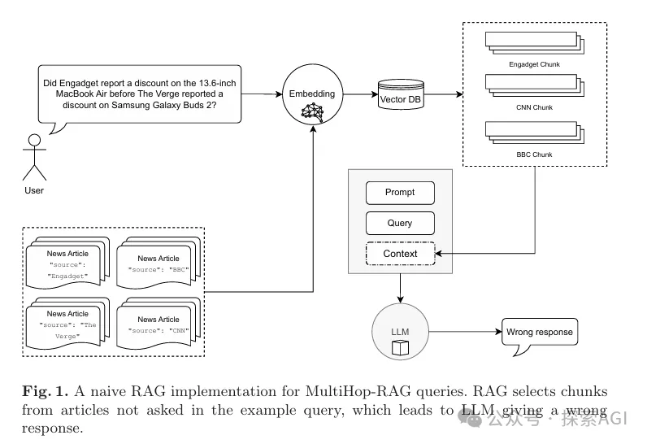
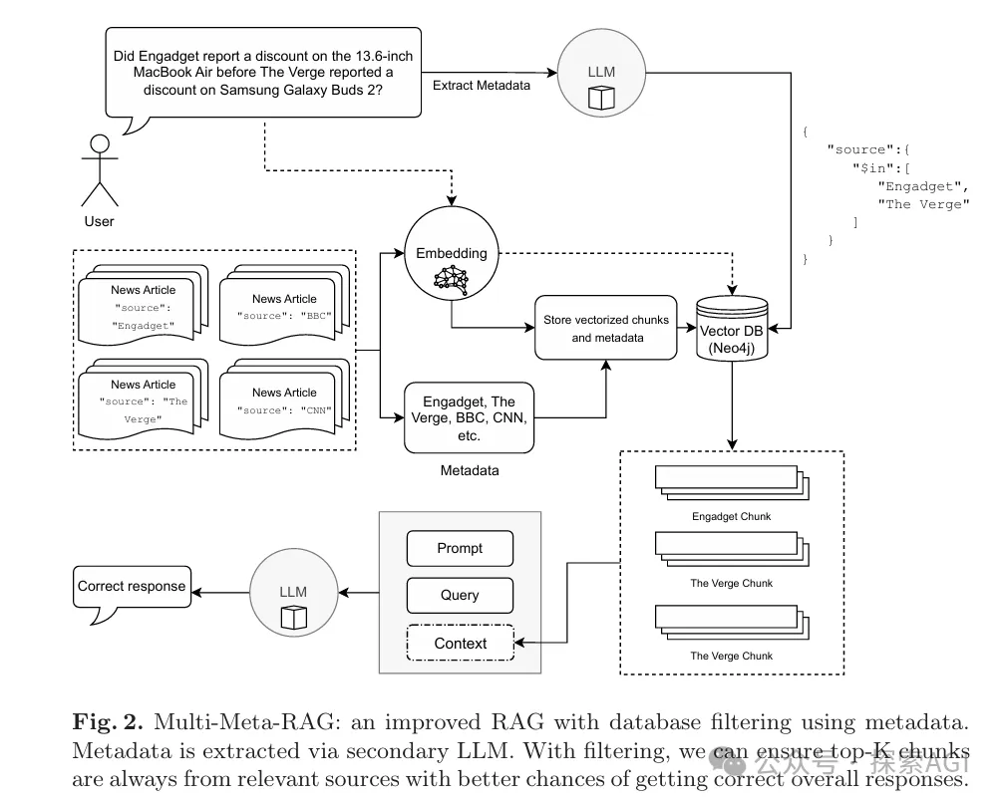
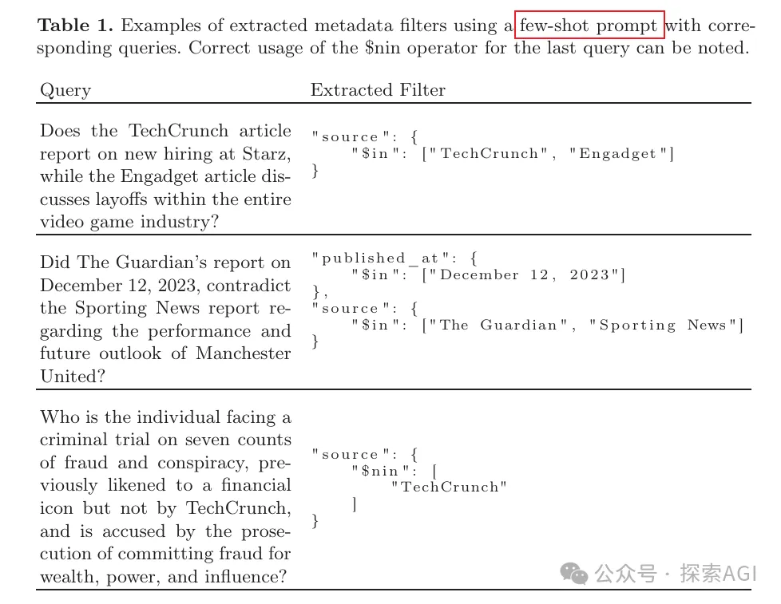
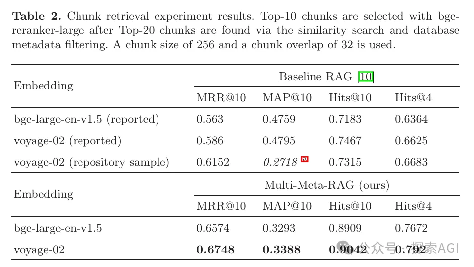
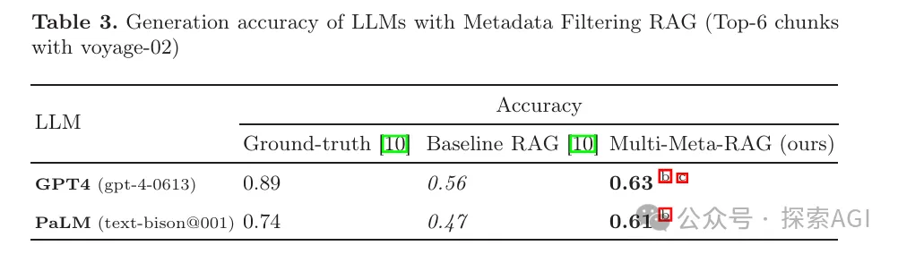

# 1. 资源

- https://github.com/mxpoliakov/Multi-Meta-RAG
- Multi-Meta-RAG: Improving RAG for Multi-Hop Queries using Database Filtering with LLM-Extracted Metadata

# 2. 方案

检索增强生成 （RAG） 支持从外部知识源检索相关信息，并允许大型语言模型 （LLM） 回答对以前看不见的文档集合的查询。然而，研究表明，传统的 RAG 应用程序在回答多跳问题方面表现不佳，这些问题需要检索和推理支持证据的多个元素。我们引入了一种称为 Multi-Meta-RAG 的新方法，该方法使用数据库过滤和 LLM 提取的元数据来改进 RAG 从各种来源中选择与问题相关的相关文档。虽然数据库过滤特定于来自特定领域和格式的一组问题，但我们发现 Multi-Meta-RAG 极大地改善了 MultiHop-RAG 基准测试的结果。

介绍内容之前，必须得先说下，啥是多跳问题呢？简单来说，就是那些需要从多个信息源中提取并推理出答案的问题。传统的RAG技术在这方面表现得不太好，因为它很难从多个文档中找到正确的信息片段，单一的向量很难召回出差异较大的信息源。

为了解决这个问题，两位研究者提出了Multi-MetaRAG方法。这个方法的核心是使用数据库过滤和LLM提取的元数据来提高文档选择的相关性。具体来说，就是先用一个辅助的LLM来分析问题，提取出问题中的关键信息，比如新闻来源或者发布日期，然后用这些信息作为过滤条件，去数据库里找到最相关的文档片段。

使用的few-shot prompt中的few-shot示例如下：

论文中使用了一个叫做MultiHop-RAG的基准测试数据集，这个数据集包含了很多多跳查询的例子。研究者们用这个数据集来测试他们的Multi-MetaRAG方法，结果发现，无论是在文档片段的检索上，还是在LLM生成答案的准确性上，都有了显著的提升。

举个例子，如果有人问：“Engadget在The Verge之前报道了13.6英寸MacBook Air的折扣吗？”传统的RAG可能会找错信息源，给出错误的答案。但Multi-MetaRAG通过过滤，确保了只从Engadget和The Verge这两个来源中检索信息，从而提高了回答的准确性。

最后，作者也指出了这个方法的一些局限性，比如它需要特定领域和格式的问题集，还需要额外的推理时间来提取元数据。不过，尽管有这些限制，Multi-MetaRAG还是一个简单易懂、效果显著的方法。

# 参考

[1] Multi-Meta-RAG：langchain点名，评论爆吹的新研究，https://mp.weixin.qq.com/s/Jf3qdFR-o_A4FXwmOOZ3pg