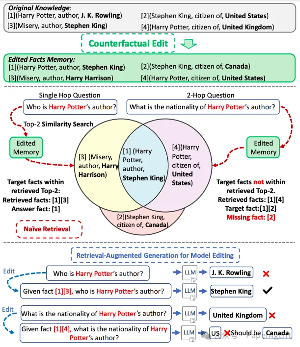
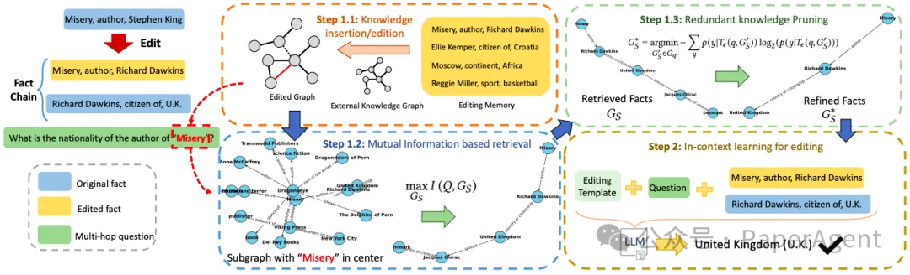
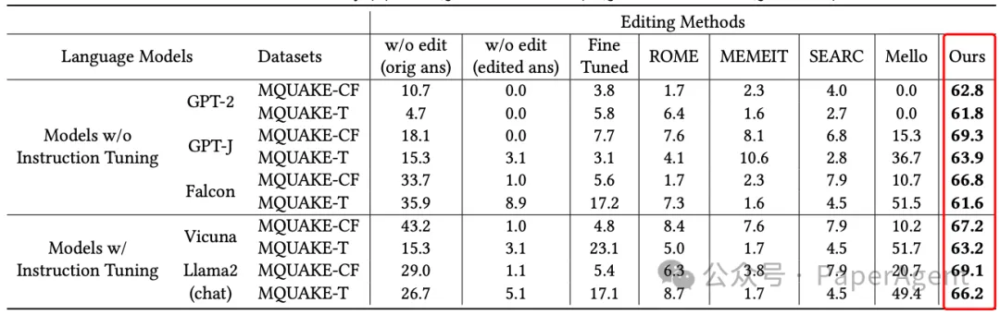
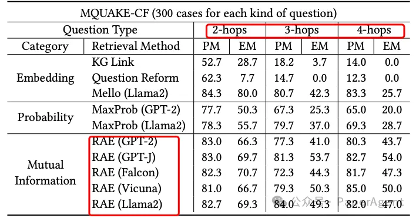
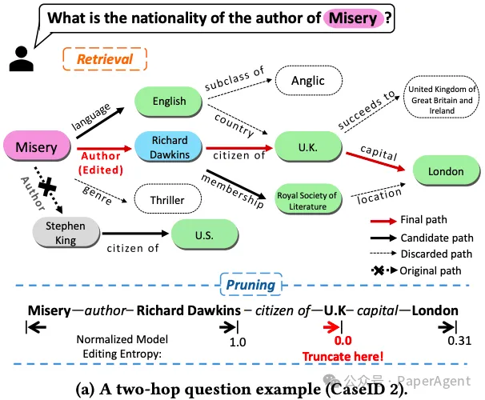
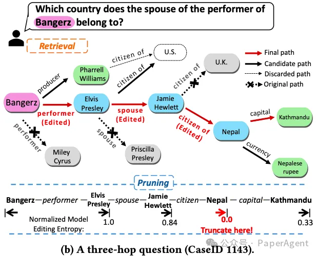

# 1. 资源

论文：
- Retrieval-Enhanced Knowledge Editing for Multi-Hop Question Answering in Language Models
- https://arxiv.org/pdf/2403.19631.pdf

# 2. 问题

随着大型语言模型（LLMs）在问答任务中表现出色，如何将实时知识更新整合到这些模型中成为一个挑战。尤其是处理多跳问题时，LLMs需要更新和整合与问题相关的多个知识点。现有的模型编辑方法在处理多跳问题时面临困难，因为它们往往无法有效地处理知识点之间的复杂联系，导致生成过时或不正确的回答。



图1：一个传统基于相似性搜索未能检索到LLM编辑正确事实的例子

# 3. 方案

为了解决这一问题，提出了一种名为检索增强型知识编辑（RAE）框架，专门用于多跳问答任务。RAE框架首先通过基于互信息最大化的检索方法检索编辑过的事实，然后通过上下文学习对语言模型进行细化。该框架的检索方法利用LLMs的推理能力，通过链式事实的识别来弥补基于简单相似性搜索可能遗漏的信息。此外，RAE框架还包含了一种剪枝策略，用于从检索到的事实中消除冗余信息，从而提高编辑准确性并减轻幻觉问题。



图2：检索增强型上下文模型编辑方法的整体框架

图 2 展示了检索增强型上下文模型编辑方法的整体框架。包括以下几个关键组成部分：

```text
1. 外部知识图谱：用于存储编辑过的事实和未编辑的事实，为检索过程提供丰富的知识基础。
2. 基于互信息的检索：通过最大化问题和检索到的子图之间的互信息，来识别与问题最相关的知识子图。
3. 冗余知识剪枝：使用编辑不确定性来评估检索到的事实集，并剪除那些可能导致模型输出不确定性增加的冗余或不相关事实。
4. 上下文学习编辑：将经过剪枝的、与问题最相关的事实集作为输入，结合编辑模板，通过LLMs的上下文学习能力来生成准确的答案。
5. 编辑模板：一种特定的提示结构，用于指导LLMs如何结合问题和事实来产生正确的输出。
```

通过在各种不同大小的语言模型上进行的全面评估，验证了RAE在提供准确答案和更新知识方面的能力。实验结果表明，RAE在处理多跳问题时，相比于现有的基线方法，能够显著提高编辑后的模型输出的准确性。

# 4. 性能



图3：在MQUAKE数据集（MQUAKE-CF和MQUAKE-T）上的编辑准确率（%）



图4：多跳事实检索准确率（%）比较

图5：编辑事实检索和剪枝的案例研究。检索过程涉及使用波束搜索，从查询实体开始，通过知识图谱进行导航，使用两个波束。在每个实体跳转中，两个主要候选边（波束）被加粗显示，其他的被丢弃并用虚线表示。用红色强调最终的波束搜索结果。





# 参考

[1] RAE：一个专为大模型多跳问答设计的检索增强型知识编辑框架，https://mp.weixin.qq.com/s/R0N8yexAlXetFyCS-W2dvg