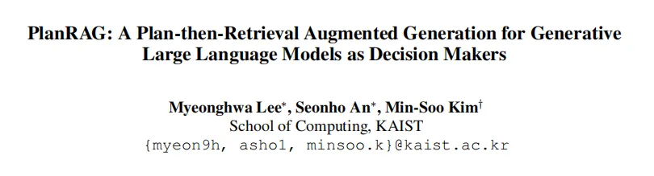
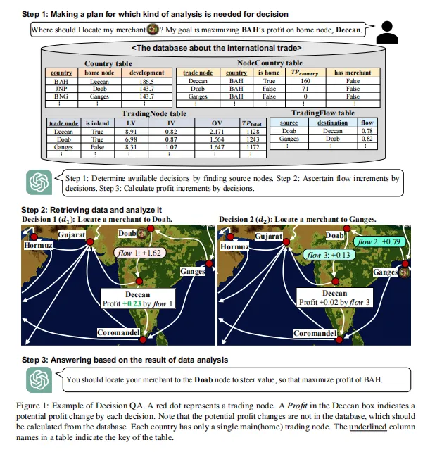
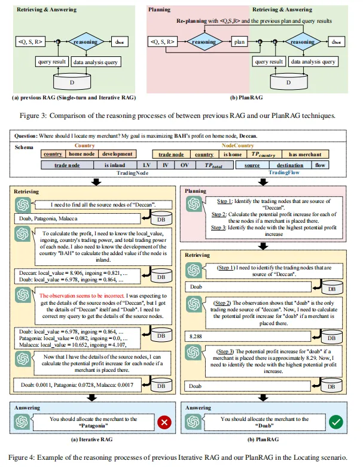
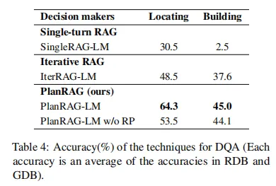
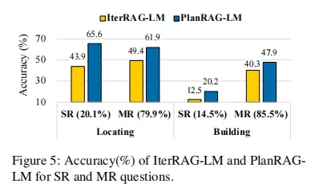
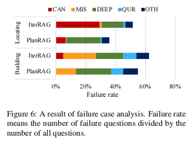
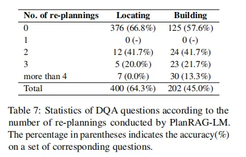

# 1. 资源



- 原文：PlanRAG: A Plan-then-Retrieval Augmented Generation for Generative Large Language Models as Decision Makers
- 地址：https://arxiv.org/abs/2406.12430
- 代码：https://github.com/myeon9h/PlanRAG
- 出版：ACL 24
- 机构: 韩国科学技术院

# 2. 问题

本文研究的核心问题是: 如何利用大型语言模型(LLMs)作为解决需要复杂数据分析的决策问题的方案。

假设一家制药公司需要决定哪个工厂应该继续运营或停止，以及每个工厂应该雇佣多少员工，以在保持按时交付的同时最小化生产成本。这需要分析大量数据并做出复杂的决策。本文研究如何让LLMs能够有效地处理这类决策问题。

本文研究问题的特点和现有方法面临的挑战主要体现在以下几个方面:

- 决策制定任务需要执行三个步骤:制定分析计划、检索必要数据、基于数据做出决策。现有方法主要关注后两个步骤，但对于制定分析计划这一关键步骤处理不足。
- 决策问题通常涉及大规模结构化数据库，而现有的检索增强生成(RAG)技术主要针对知识型问答任务，不适合处理复杂的决策问题。
- 决策过程可能需要多轮数据检索和分析，要求模型能够进行迭代推理和规划。

# 3. 方案介绍

lanRAG的核心思想是在检索和生成之前先进行规划。可以把它比作一个精明的管理顾问:首先制定分析计划，然后有条不紊地执行数据检索和分析，并在需要时调整计划。具体来说，PlanRAG首先生成一个初始分析计划，然后基于这个计划生成数据分析查询。执行查询后，它会评估是否需要重新规划或进行进一步检索。通过这种方式，PlanRAG能够更有效地处理复杂的决策问题，特别是在需要多轮数据分析的情况下。这种方法的独特之处在于它将规划、检索和生成紧密结合，使LLM能够更系统、更有针对性地进行决策分析。



## 3.1 概述



PlanRAG(Plan-then-Retrieval Augmented Generation)是一种新型的检索增强生成技术,旨在解决复杂的决策问题。传统的RAG(Retrieval Augmented Generation)技术在处理需要多步推理的复杂决策问题时往往力不从心。PlanRAG的核心思想是在检索和回答之前先进行规划,并在必要时进行重新规划,从而提高决策的准确性和效率。

举个例子,想象你是一家连锁药店的经理,需要决定在哪个城市开设新店以最大化利润。传统的RAG可能会直接检索各个城市的人口数据,然后基于这些数据做出决策。但是,PlanRAG会先制定一个全面的分析计划,考虑人口、竞争对手情况、潜在客户群等多个因素,然后有条不紊地执行这个计划。

PlanRAG的主要优势在于:

- 系统性:通过预先规划,确保考虑到决策所需的所有关键因素。
- 灵活性:能够根据新发现的信息动态调整计划。
- 效率:有计划的检索和分析可以减少不必要的数据查询,提高决策效率。

## 3.2 PlanRAG的核心步骤

PlanRAG包含三个核心步骤:规划(Planning)、检索与回答(Retrieving & Answering)以及重新规划(Re-planning)。让我们详细了解每个步骤。

### 3.2.1 规划(Planning)
在规划阶段,大语言模型(LLM)会根据给定的问题(Q)、数据库模式(S)和业务规则(R)制定初始分析计划。这个计划描述了为了做出决策需要执行的一系列数据分析步骤。

具体来说,LLM会生成一个类似以下格式的计划:

```text
Plan: [Step 1: requirement 1, Step 2: requirement 2, ..., Step N: requirement N]
```

举个例子,对于前面提到的药店选址问题,初始计划可能是:

```text
Plan: [
  Step 1: 获取所有可能城市的列表,
  Step 2: 分析每个城市的人口数据,
  Step 3: 调查每个城市现有的药店数量,
  Step 4: 评估每个城市的医疗保健需求,
  Step 5: 分析每个城市的经济状况
]
```

这个计划为后续的检索和分析提供了清晰的路线图。

### 3.2.2 检索与回答(Retrieving & Answering)

在这个阶段,LLM会根据制定的计划生成具体的数据分析查询,从数据库中检索信息,并基于检索结果进行推理。

具体来说,对于计划中的每一步,LLM会:

1. 生成相应的数据库查询
2. 执行查询并获取结果
3. 分析查询结果
4. 决定是否需要进行下一步或重新规划

以药店选址为例,对于计划中的第二步"分析每个城市的人口数据",LLM可能会生成如下SQL查询:

```sql
SELECT city_name, population, population_growth_rate 
FROM city_demographics 
WHERE country = 'USA'
```

然后,LLM会分析查询结果,可能得出类似"城市A和城市B的人口增长率最高,是潜在的好选择"这样的初步结论。

### 3.2.3 重新规划(Re-planning)
重新规划是PlanRAG的一个关键创新点。当LLM发现初始计划不足以解决决策问题时,它会重新制定计划。这可能发生在以下情况:

1. 发现了初始计划中未考虑的重要因素
2. 某些预期的数据不可用
3. 初步分析结果表明需要更深入的调查

继续我们的药店选址例子,假设在分析过程中,LLM发现城市的医疗政策对药店经营有重大影响,但初始计划中并未考虑这一点。这时,LLM可能会重新规划,添加一个新的步骤:

```text
Re-plan: Y
New Plan: [
  ... (原有步骤)
  Step 6: 研究每个候选城市的医疗政策
]
```

通过这种动态调整,PlanRAG能够不断优化决策过程,确保最终决策的全面性和准确性。

## 3.3 PlanRAG与现有RAG技术的对比
PlanRAG在多个方面超越了传统的RAG技术:

- 系统性思考: 传统RAG往往是被动地响应问题,而PlanRAG通过预先规划,能够更系统地思考问题。这就好比是有备而来和临场发挥的区别。
- 多步推理能力: PlanRAG特别适合需要多步推理的复杂决策问题。传统RAG可能在每一步都重新开始,而PlanRAG能够保持连贯的思路。
- 自我纠错机制: 通过重新规划机制,PlanRAG能够在决策过程中自我纠错和调整。这种灵活性是传统RAG所不具备的。
- 效率提升: 由于有明确的计划指导,PlanRAG能够更有针对性地检索和分析数据,减少不必要的查询,提高决策效率。
- 可解释性: PlanRAG的决策过程更加透明和可解释。通过查看其规划和重新规划的过程,我们可以更好地理解LLM是如何得出最终决策的。

具体来说,假设我们要为一家跨国公司选择新的总部位置。传统RAG可能会直接检索各个城市的经济数据,然后给出建议。而PlanRAG会先制定一个全面的分析计划,考虑经济、人才、政策、交通等多个因素。如果在分析过程中发现某个城市有特殊的税收优惠政策,PlanRAG还会重新规划,加入对税收政策的详细分析。这种方法更有可能找到真正最优的解决方案。

总的来说,PlanRAG通过引入规划和重新规划机制,显著提升了LLM在复杂决策问题上的表现。它不仅能够做出更好的决策,还能提供清晰的决策路径,这对于实际应用中的决策解释和审核都具有重要意义。

# 4. 实验

## 4.1 实验场景介绍
本论文提出了一个名为Decision QA的新任务，旨在测试语言模型在决策制定方面的能力。实验场景包括两个主要的决策场景：Locating和Building。Locating场景要求模型决定在哪个贸易节点放置商人以最大化利润，而Building场景则要求模型决定扩建哪个建筑以最大程度降低某种商品的价格。这些场景模拟了现实世界中的商业决策过程，需要模型理解复杂的业务规则并分析大量数据。

## 4.2 实验设置
- Datasets：DQA数据集，包含301对⟨Q, D⟩，其中200对用于Locating场景，101对用于Building场景。每个数据库都有RDB和GDB两个版本。
- Baseline：SingleRAG-LM（基于单次RAG）, IterRAG-LM（基于迭代RAG）
- Implementation details：
  - 所有决策模型都基于GPT-4实现，使用零温度设置
  - 使用LangChain库实现
  - 数据库使用MySQL（RDB）和Neo4j（GDB）
- Metric：准确率（正确决策的百分比）
- 环境：实验在配备8个Nvidia A100 (80GB) GPU的单台机器上进行

## 4.3 实验结果

实验1、主要性能对比实验



目的：评估提出的PlanRAG-LM与其他基线模型在DQA任务上的性能差异

涉及图表：表4

实验细节概述：比较SingleRAG-LM、IterRAG-LM、PlanRAG-LM和PlanRAG-LM w/o RP在Locating和Building两个场景下的准确率

结果：

- PlanRAG-LM在两个场景中都显著优于其他模型，Locating场景提升15.8%，Building场景提升7.4%
- 去除重新规划（RP）后，PlanRAG-LM的性能有所下降，说明重新规划过程对提高决策质量很重要

实验2、单次检索（SR）和多次检索（MR）问题分析



目的：探究PlanRAG-LM在不同复杂度问题上的表现

涉及图表：图5

实验细节概述：将DQA问题分为SR和MR两类，比较IterRAG-LM和PlanRAG-LM在这两类问题上的准确率

结果：

- PlanRAG-LM在SR问题上的提升更为显著，说明它能更好地处理被低估难度的问题
- 对于MR问题，PlanRAG-LM仍然优于IterRAG-LM，表明其更系统的检索方式更有效

实验3、关系型数据库（RDB）和图数据库（GDB）分析


目的：评估模型在不同类型数据库上的性能

涉及图表：表5

实验细节概述：比较各模型在RDB和GDB两种数据库类型上的准确率

结果：

- PlanRAG-LM在两种数据库类型上都表现最好
- 在Building场景中，PlanRAG-LM在GDB上的表现优于RDB，可能是因为GDB更适合处理复杂的多跳查询

实验4、数据分析遗漏率实验

目的：分析模型在关键数据分析上的完整性

涉及图表：表6

实验细节概述：测量IterRAG-LM和PlanRAG-LM在查询或计算关键值时的遗漏率

结果：

- PlanRAG-LM的遗漏率显著低于IterRAG-LM，表明其更能全面地进行必要的数据分析

实验5、失败案例分析



目的：深入了解模型失败的原因

涉及图表：图6

实验细节概述：将失败案例分类为五种错误类型，比较IterRAG-LM和PlanRAG-LM的失败模式

结果：

- PlanRAG-LM显著减少了候选选择错误（CAN）和数据分析遗漏（MIS）类型的错误
- PlanRAG-LM在深度理解（DEEP）错误上略有增加，这可能是减少其他类型错误的副作用

实验6、重新规划分析



目的：评估重新规划过程对PlanRAG-LM性能的影响

涉及图表：表7

实验细节概述：分析PlanRAG-LM进行重新规划的频率和对准确率的影响

结果：

- Building场景中重新规划更频繁，表明该场景更具挑战性
- 重新规划次数过多可能导致准确率下降，说明初始规划的质量很重要

# 5. 总结后记

本论文针对复杂业务决策问题,提出了一种名为PlanRAG的新型检索增强生成方法。该方法通过在检索前进行规划,并在必要时进行重新规划,显著提高了大语言模型在决策问题上的表现。作者构建了一个名为DQA的决策问答基准数据集,包含定位和建设两个场景。实验结果表明,PlanRAG在Locating场景中比现有最先进的迭代RAG方法提高了15.8%的准确率,在Building场景中提高了7.4%的准确率。

疑惑和想法：

- PlanRAG在更复杂的多步骤决策问题上的表现如何?是否可以扩展到更长期的战略规划任务?
- 如何将PlanRAG与其他增强LLM推理能力的方法(如思维链提示)结合,进一步提升决策质量?
- 在实际业务场景中,如何确保PlanRAG生成的决策是可解释和可追溯的?
- DQA基准是基于游戏数据构建的,它在多大程度上能反映真实世界的商业决策问题?
- 是否可以设计一种自适应的规划机制,根据问题的复杂度动态调整规划的粒度和频率?

可借鉴的方法点：

- 将规划步骤集成到RAG框架中的思路可以推广到其他需要多步推理的NLP任务,如多跳问答、复杂推理等。
- 构建模拟真实业务场景的基准数据集的方法值得借鉴,可以应用于其他难以获取真实数据的领域。
- 利用重新规划机制来处理复杂问题的思路可以扩展到其他AI系统,提高系统的鲁棒性和适应性。
- 将决策过程分解为规划、检索、回答等步骤的方法可以应用于构建更透明、可解释的AI决策系统。
- 利用LLM作为统一的规划者和执行者的设计可以简化多智能体系统的架构,提高系统的一致性和效率。

# 参考

[1] RAG | (ACL24规划-检索增强)PlanRAG：一种用于生成大型语言模型作为决策者的规划检索增强生成方法，https://mp.weixin.qq.com/s/CoOVI5RwXze6Hq1Ank4KjQ
