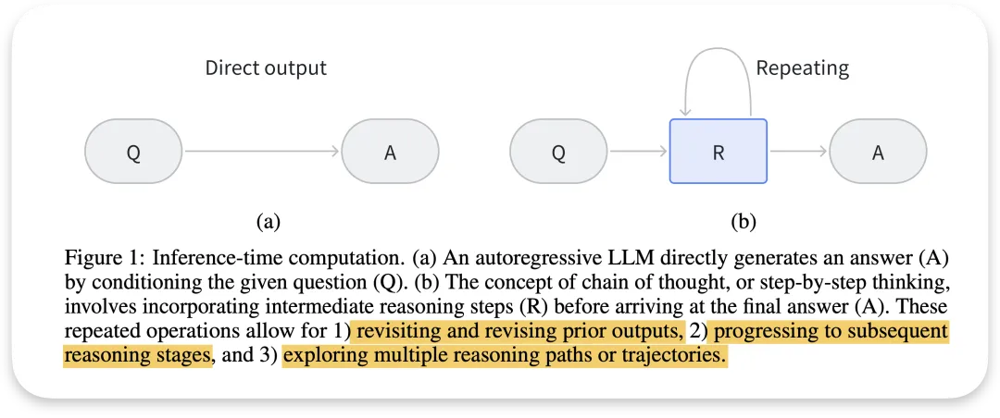
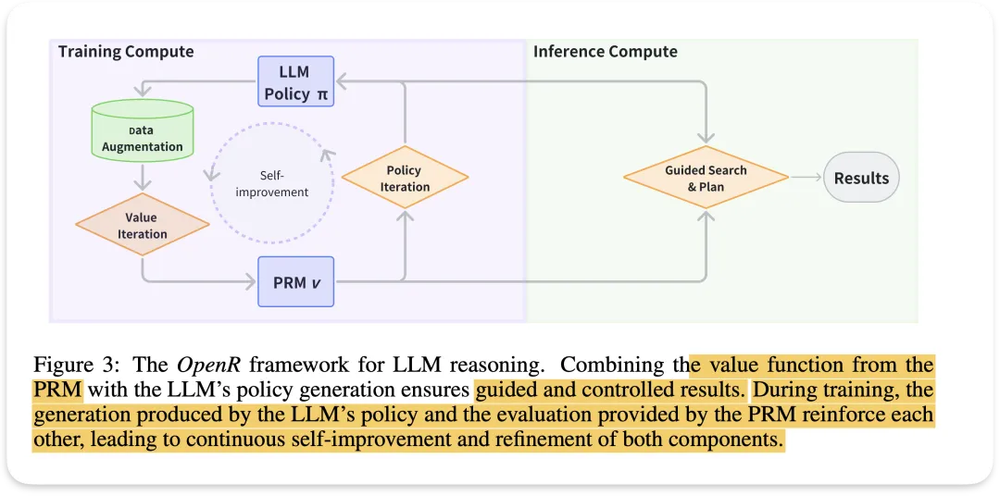

我看到的两个方式, 一个是通过PRM过程奖励模型和策略policy来训练LLM本身 ,让LLM自己具有像o1模型推理的能力。另一个是专门加一个负责拆分认为的planner机制, 训练这个planner, 这个在研究Agent时比较常见

而未来的方向更多是让大模型自身学会推理 , 通过对过程数据的学习来学会推理。这个过程数据就是我在某个人的采访中看过, 就是说这些过程相当于我们的草稿纸, 我们一般都不会保留草稿纸, 只呈现最终的过程, 因此这种过程数据相比结果更少。越专业的研究呈现的结果越直接简洁, 省略的过程也更多。

有一个openai人工整理的过程数据PRM800K, 也有的人使用OmegaPRM等自动化方法来合成数据节省人工标注的精力。

OpenR
大脑大概有两种认知, 一种是快速的立马的想法,比如简单地说到玫瑰就知道是什么, 一种是需要复杂推理,思考,做数学题。大模型能做到前者, o1的出现让后者也看到了希望。OpenR半个月才公布出来, 就是为了研究o1推理背后可能需要的机制。

如果LLM的理解能力是NativeCoT,而不是外部加机制引导, 则标志着大模型能力的进一步提升，OpenR通过以下3步尝试复现o1的推理能力,让模型不是直接输出内容, 而把重心放在输出之前的一步步思考上。一步步思考, 也提高了AI安全性会更强, 因为会更加按照human values ,policy等一步步思考去做, 也能提高对LLM的控制

1: 数据加持的过程监督process supervision

2: 对分步思考等策略规则进行RL强化学习,

3: 算力不仅分配在训练参数上, 也侧重在推理过程的算力消耗

像下图R中间过程不断重复, 除了不断检查是否符合各种要求, 也能增加回答内容的广度。

再详细说明这个OpenR用到的机制,架构流程

①训练计算阶段：

LLM Policy (π)：代表模型的策略生成器,生成分布推理

数据增强（Data Augmentation）：生成额外的标注数据，帮助LLM Policy学习每一个步骤,在出错时精细到每一个细化步骤, 而不是结果。

过程奖励模型（PRM ν）：在过程奖励模型 (PRM) 中，主要目的是判断解决方案的步骤是否在正确的轨道上。因此，PRM 会通过Value Iteration输出一个 0 到 1 之间的分数，作为当前解决过程的正确性指标。具体来说，给定一个问题及其解决步骤序列，PRM 会为每一步计算出一个分数，这可以视为一个二元分类任务：是否正确

“

ORM和PRM: DeepMind提出了在监督最终结果的同时，监督中间推理步骤的想法,关注模型在推理过程中每个步骤的正确性。

验证模型”（verifier models）和”多数投票”（majority voting）,验证模型会检查模型在推理过程中的每一步，确保每一步的合理性和准确性。多数投票机制通过汇总多个结果，确保模型给出的最终答案更准确另一方面

自我改进（Self-improvement）：通过策略迭代（Policy Iteration）和过程奖励模型的反馈，模型和策略不断优化，实现自我改进。

②推理计算阶段：隐式推理模型，通过加入“暂停标记”来鼓励生成过程中更加深思熟虑的推理

引导搜索和规划（Guided Search & Plan）：在推理时，模型会结合训练阶段学到的策略和奖励机制，通过引导的方式进行搜索和规划，从而选择最佳的解题路径。这部分是推理阶段最关键的部分，确保模型推理时能“步步为营”，最终得到更好的结果。

Pause Tokens：引入了“暂停标记”来鼓励模型在生成时停下来进行思考。这种机制能够让模型在生成过程中有更多时间去“思考”，从而提升推理质量。

③ 强化循环：过程奖励模型（PRM）和LLM策略生成（Policy π）是模型的核心，二者通过循环互相强化，推动模型的自我改进。

图中的循环箭头展示了模型如何通过强化学习的方式，不断循环反馈和改进。训练时，LLM 生成的策略会与过程奖励模型相互作用，生成的推理路径通过评估和反馈改进，逐步提升模型的推理能力。

# 参考

[1] RAG进阶优化方向(2): 问题拆分, 检索线索和分步推理, https://mp.weixin.qq.com/s/RVFdiIPYchmO5GTQSbJWKQ