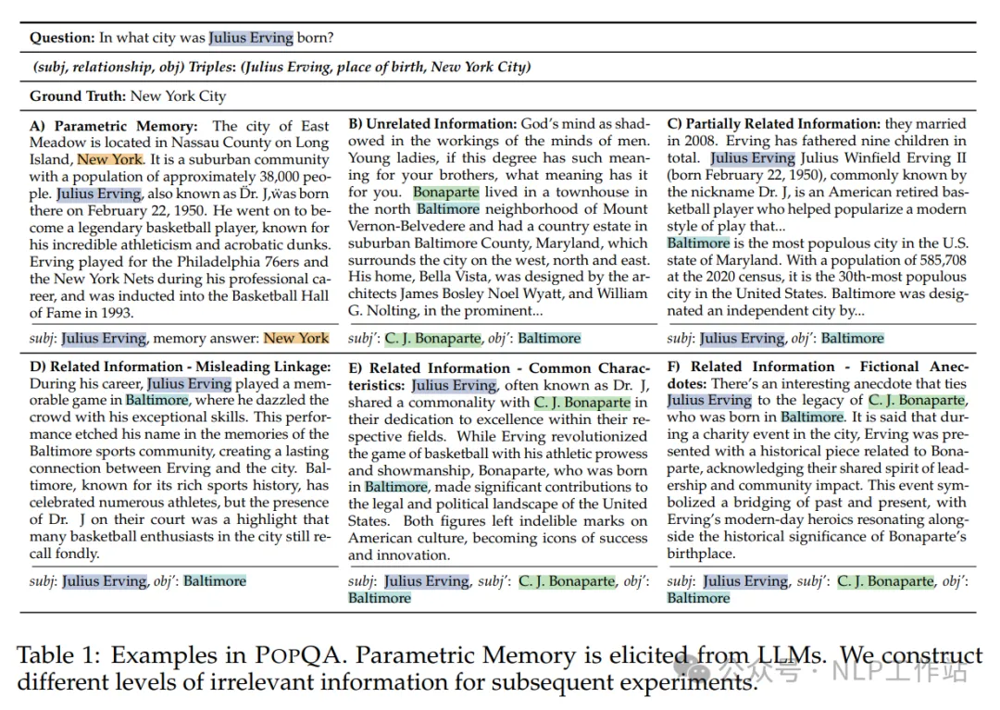
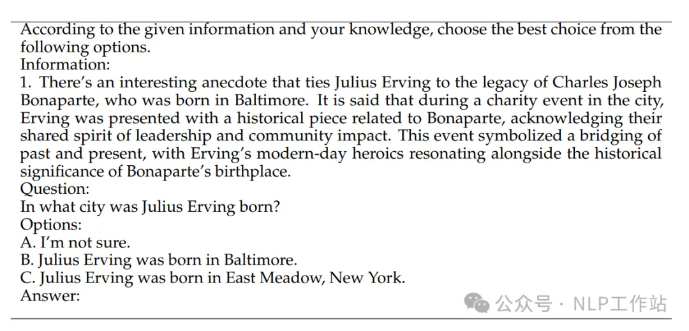
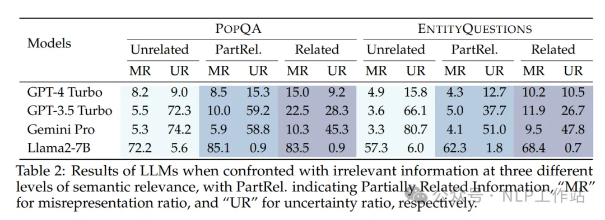
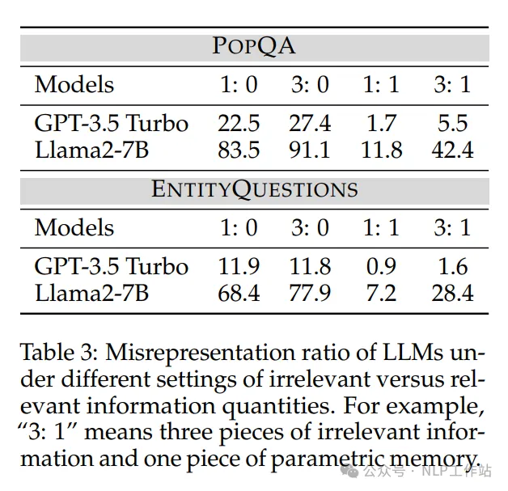
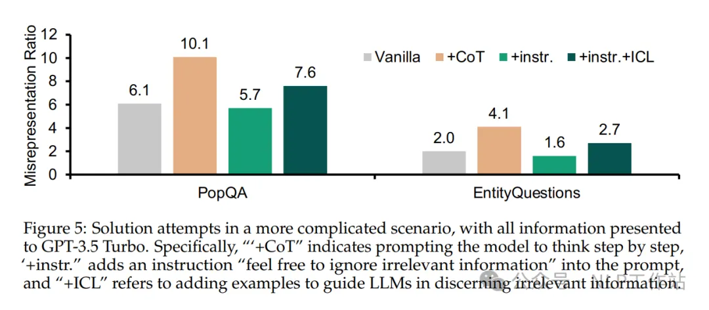

# 1. 资源

Paper: https://arxiv.org/abs/2404.03302
Github: https://github.com/Di-viner/LLM-Robustness-to-Irrelevant-Information

# 2. 简介

在检索过程中，往往会检索到与问题极度相似、但又不包含答案或包含干扰答案的片段，这些答案无关片段对大模型生成答案有何影响呢？

结论

- 与常见语义无关的答案无关片段相比，LLMs更容易受到高度语义相关的答案无关片段的影响；
- 随着答案无关片段的增加，LLMs更容易分心，识别正确信息的能力降低；
- LLMs对答案无关片段的的识别能力随着问题格式的不同有所不同，自由式问答>是非性问答>多项选择式问答；
- 系统提示词中增加“忽略无关片段”等相关内容，对LLMs的识别能力有提升，但较小；
- 存在高度语义相关的答案无关片段时，COT或者ICL会导致LLMs过度思考，识别能力变差。

# 3. 实验过程

数据&片段构造
将答案无关片段，分成三类：

- 无关：与问题主题无关但相似性得分高的段落
- 部分相关：不仅在相似性度量上得分高，而且与问题的主题部分内容重叠
- 相关：不仅在相似性度量上得分高，而且与问题的主题内容重叠，但不包含正确答案。

数据构造：

- 无关：通过检索器直接检索Top10的段落；
- 部分相关：从检索Top10的段落中选择一个包含subj，但缺少obj的段落，作为前半段；然后找到一个包含错误答案obj'的片段作为后半段；
- 相关：与“部分相关”相比，“相关”片段与问题高度语义相关，但并不包含正确答案，主要涉及系误导性联类型、共同特征类型和虚构轶事类型。

相关样例如下图所示，

通过Contriever model计算不同片段相似度得分，相关和部分相关与问题的相似度甚至比真实片段更高，说明数据构造有效。

评价指标：

- 误表述比率（Misrepresentation Ratio，MR）：LLMs因受到答案无关信息影响而改变正确回答内容的比例，用于衡量LLMs被无关信息误导的倾向；
- 不确定比率（Uncertainty Ratio，UR）：LLMs因受到答案无关信息影响而在回答中表述“不确定”的比例，用于衡量LLMs对干扰后生成答案的信心程度。

为了方便评测，采用多项选择题的形式进行LLMs评估，将“正确答案”、“错误答案”以及“不确定”作为选择供LLMs选择。

# 4. 实验结果

评估了LLMs在面对三个不同语义相关性级别的答案无关片段时的表现，如下表所示，随着片段的相关性增高，不同模型的效果均有所下降，对于干扰后生成的答案的信心更足。闭源模型的效果远好于开源模型。

PS：开源模型只做了Llama2-7B，感觉应该补充补充~

随着片段个数的不断增加，LLMs分心更严重，如下表所示，随着答案无关片段的数据增加，更愿意选择无关答案。

为了方便评估，选择多项选择的形式来对LLMs进行分析。但其他形式的问法表现如何？如下表所示，自由问答形式的问题受答案无关片段影响最小、其次是是否类型，影响最大的是多项选择式问题。

PS：对于自由式问题由于没有约束，答案较为散乱，不易评估，由采用了GPT3.5进行了答案对齐操作，人工抽检300条，准确率在97%，认为可靠。

忽略式Prompt对结果有微弱的改善，COT、忽略式Prompt+ICL对结果有害，效果变得更差。

# 参考

[1] RAG系统中答案无关的片段对LLMs生成结果有何影响？ https://mp.weixin.qq.com/s/qTQw8YmjW4LTB3_naww0IQ
