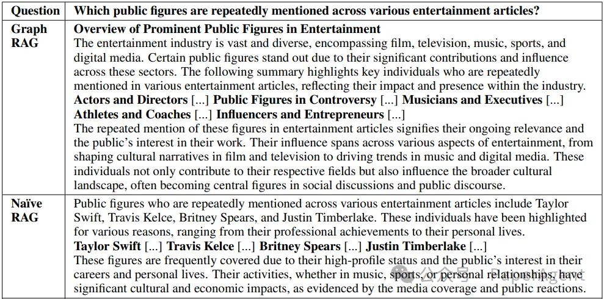

# 1. 资源

论文：
- From Local to Global: A Graph RAG Approach to Query-Focused Summarization
- https://arxiv.org/pdf/2404.16130

项目主页：https://aka.ms/graphrag
Github: 即将开源

# 2. 简介

传统的RAG方法适用于局部文本检索任务，但不适用于全局性的查询聚焦摘要任务，例如“数据集中的主要主题是什么？”这类问题。为了解决这一问题，提出了一种基于图的方法GraphRAG，利用大型语言模型（Large Language Models, LLMs）构建基于图的文本索引，以支持对整个文本语料库的全局性问题的回答。Graph Retrieval-Augmented Generation旨在改进针对私有或未见过的文档集合的查询聚焦摘要（Query-Focused Summarization, QFS）任务。
Graph RAG核心思想：通过两个阶段构建图索引，首先从源文档派生出实体知识图谱，然后为所有密切相关的实体组预生成社区摘要。

# 3. 方法

Graph RAG处理流程：

使用由大型语言模型（LLM）派生的源文档文本的图索引的Graph RAG流程。这个索引涵盖了节点（例如实体）、边（例如关系）以及协变量（例如声明），这些元素已经被为数据集领域定制的LLM提示检测、提取和总结。社区检测（例如Leiden算法）被用来将图索引划分为LLM可以在索引时间和查询时间并行总结的元素组（节点、边、协变量）。对于给定的查询，“全局答案”是通过在所有报告与该查询相关性的社区摘要上进行一轮查询聚焦的摘要来产生的。

- 源文档到文本块：决定输入文本的粒度，将其分割成文本块以供处理。
- 文本块到元素实例：使用LLM提示提取文本块中的实体和关系实例。
- 元素实例到元素摘要：进一步使用LLM将实例级摘要转换为图元素的描述性文本块。
- 元素摘要到图社区：使用社区检测算法将图索引分割成模块化社区。
- 图社区到社区摘要：为每个社区生成报告式摘要，这些摘要有助于理解数据集的全局结构和语义。
- 社区摘要到社区答案再到全局答案：使用社区摘要生成最终答案，通过一个多阶段过程，包括准备社区摘要、并行生成中间答案，并最终汇总成一个全局答案。

使用Leiden算法检测到的图社区，该算法应用于索引的MultiHop-RAG数据集。圆圈代表实体节点，其大小与它们的度数成比例。节点布局是通过OpenORD和Force Atlas 2完成的。节点颜色代表实体社区，显示在两个层次的层次聚类中：(a) 第0层，对应于具有最大模块化的层次划分；以及 (b) 第1层，它揭示了这些根级别社区内的内部结构。

# 4. 结果

Graph RAG效果评估：使用两个真实世界的数据集（播客文稿和新闻文章）来评估Graph RAG方法，并与naïve RAG和全局文本摘要方法进行比较。评估指标包括全面性、多样性和授权性（Empowerment）。Graph RAG在全面性和多样性方面显著优于naïve RAG基线，并且在较低的令牌成本下与源文本地全局摘要方法相比表现出有利的性能。

在两个数据集、四个指标和每次比较125个问题上的（行条件）相对于（列条件）的一对一胜率百分比（每个问题重复五次并计算平均值）。每个数据集和指标的总体胜出者以粗体显示。自我胜率没有计算，但作为参考显示为预期的50%。所有Graph RAG条件在全面性和多样性方面都优于朴素RAG。条件C1-C3在答案的全面性和多样性方面也比TS（没有图索引的全局文本摘要）略有提高。

新闻文章数据集的示例问题，以及由Graph RAG（C2级别）和朴素RAG生成的答案，还有由大型语言模型（LLM）生成的评估。Graph RAG答案更加丰富和多样。

# 参考

[1] 微软多部门联合推出GraphRAG项目：全面性和多样性方面显著优于原生大模型RAG，https://mp.weixin.qq.com/s/c--xUR7Q_O7yAMsaAJRiKQ