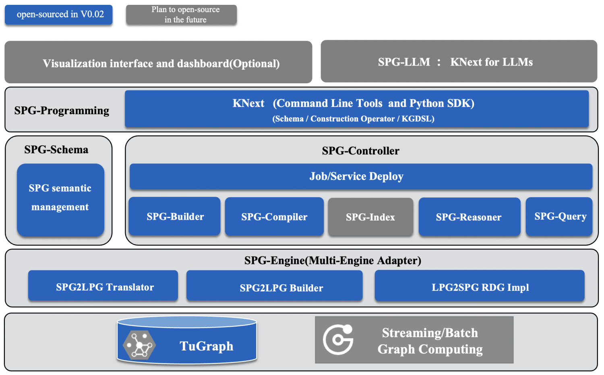

# 1. 资源

Github (413 Stars): https://github.com/OpenSPG/openspg

# 2. 介绍

蚂蚁开源 GraphRAG 结合开源图数据库 TuGraph可以支持企业级的知识管理，目前已经1.1K star，重点特征如下：

1. 支持实现可编程范式的知识引擎架构
2. 支持领域图谱高效构建、跨领域知识语义对齐
3. 多源融合、多图谱连接

# 参考

[1] GraphRAG， https://www.toutiao.com/w/1796323850853507/?app=news_article&timestamp=1714465944&use_new_style=1&wxshare_count=1&tt_from=weixin&utm_source=weixin&utm_medium=toutiao_android&utm_campaign=client_share&share_token=c63dbcad-47bc-4be9-a4b8-5b590a23d05f&source=m_redirect