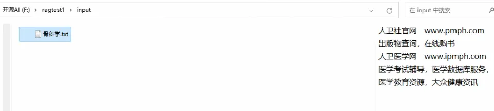
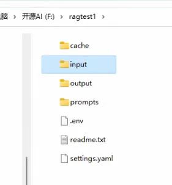
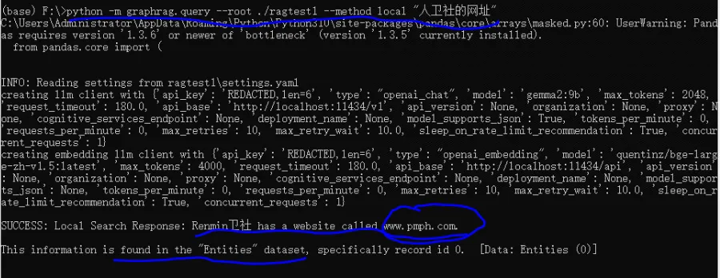
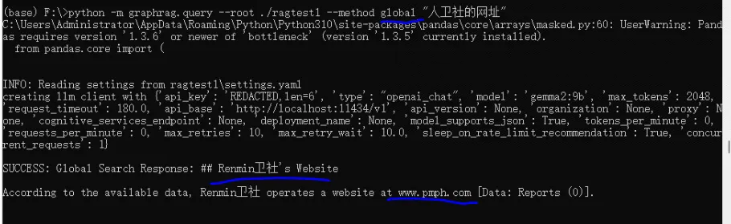

# 1. 资源

https://github.com/yuntianhe2014/Easy-RAG


# 2. 官方安装流程

graphRAG的安装还是很简单的，直接pip

```bash
pip install graphrag
```

但要注意，官方说了需要 python3.10-3.12

安装完成后，建立一个文件夹，存放你的知识数据，目前graphRAG仅支持txt和csv

```bash
mkdir -p ./ragtest/input
```

然后准备一份数据，放到 /ragtest/input 下，我找了一份中文数据，为了演示，截取了部分文本



要初始化您的工作区，让我们首先运行命令graphrag.index --init。由于我们在上一步中已经配置了一个名为 .ragtest1` 的目录，因此我们可以运行以下命令：

```bash
python -m graphrag.index --init --root ./ragtest1
```

执行完后，目录中结构如下



这将在目录中创建两个文件：.env和。settings.yaml./ragtest

.env包含运行 GraphRAG 管道所需的环境变量。如果检查文件，您将看到已定义的单个环境变量。 GRAPHRAG_API_KEY=<API_KEY>这是 OpenAI API 或 Azure OpenAI 端点的 API 密钥。您可以将其替换为您自己的 API 密钥。

settings.yaml包含管道的设置。您可以修改此文件以更改管道的设置。

我们需要修改 settings.yaml,你可以直接复制我的如下，切记你本机安装了Ollama并且安装了下边两个模型

```yaml
quentinz/bge-large-zh-v1.5:latest
gemma2:9b
```

那么你可以复制如下内容到  settings.yaml

```yaml
encoding_model: cl100k_base
skip_workflows: []
llm:
  api_key: ollama
  type: openai_chat # or azure_openai_chat
  model: gemma2:9b # 你ollama中的本地llm模型，可以换成其他的，只要你安装了就可以
  model_supports_json: true # recommended if this is available for your model.
  max_tokens: 2048
  # request_timeout: 180.0
  api_base: http://localhost:11434/v1 # 接口注意是v1
  # api_version: 2024-02-15-preview
  # organization: <organization_id>
  # deployment_name: <azure_model_deployment_name>
  # tokens_per_minute: 150_000 # set a leaky bucket throttle
  # requests_per_minute: 10_000 # set a leaky bucket throttle
  # max_retries: 10
  # max_retry_wait: 10.0
  # sleep_on_rate_limit_recommendation: true # whether to sleep when azure suggests wait-times
  concurrent_requests: 1 # the number of parallel inflight requests that may be made

parallelization:
  stagger: 0.3
  # num_threads: 50 # the number of threads to use for parallel processing

async_mode: threaded # or asyncio

embeddings:
  ## parallelization: override the global parallelization settings for embeddings
  async_mode: threaded # or asyncio
  llm:
    api_key: ollama
    type: openai_embedding # or azure_openai_embedding
    model: quentinz/bge-large-zh-v1.5:latest #你ollama中的本地embeding模型，可以换成其他的，只要你安装了就可以
    api_base: http://localhost:11434/api # 注意是 api
    # api_version: 2024-02-15-preview
    # organization: <organization_id>
    # deployment_name: <azure_model_deployment_name>
    # tokens_per_minute: 150_000 # set a leaky bucket throttle
    # requests_per_minute: 10_000 # set a leaky bucket throttle
    # max_retries: 10
    # max_retry_wait: 10.0
    # sleep_on_rate_limit_recommendation: true # whether to sleep when azure suggests wait-times
    concurrent_requests: 1 # the number of parallel inflight requests that may be made
    # batch_size: 16 # the number of documents to send in a single request
    # batch_max_tokens: 8191 # the maximum number of tokens to send in a single request
    # target: required # or optional
  


chunks:
  size: 300
  overlap: 100
  group_by_columns: [id] # by default, we don't allow chunks to cross documents
    
input:
  type: file # or blob
  file_type: text # or csv
  base_dir: "input"
  file_encoding: utf-8
  file_pattern: ".*\\.txt$"

cache:
  type: file # or blob
  base_dir: "cache"
  # connection_string: <azure_blob_storage_connection_string>
  # container_name: <azure_blob_storage_container_name>

storage:
  type: file # or blob
  base_dir: "output/${timestamp}/artifacts"
  # connection_string: <azure_blob_storage_connection_string>
  # container_name: <azure_blob_storage_container_name>

reporting:
  type: file # or console, blob
  base_dir: "output/${timestamp}/reports"
  # connection_string: <azure_blob_storage_connection_string>
  # container_name: <azure_blob_storage_container_name>

entity_extraction:
  ## llm: override the global llm settings for this task
  ## parallelization: override the global parallelization settings for this task
  ## async_mode: override the global async_mode settings for this task
  prompt: "prompts/entity_extraction.txt"
  entity_types: [organization,person,geo,event]
  max_gleanings: 0

summarize_descriptions:
  ## llm: override the global llm settings for this task
  ## parallelization: override the global parallelization settings for this task
  ## async_mode: override the global async_mode settings for this task
  prompt: "prompts/summarize_descriptions.txt"
  max_length: 500

claim_extraction:
  ## llm: override the global llm settings for this task
  ## parallelization: override the global parallelization settings for this task
  ## async_mode: override the global async_mode settings for this task
  # enabled: true
  prompt: "prompts/claim_extraction.txt"
  description: "Any claims or facts that could be relevant to information discovery."
  max_gleanings: 0

community_report:
  ## llm: override the global llm settings for this task
  ## parallelization: override the global parallelization settings for this task
  ## async_mode: override the global async_mode settings for this task
  prompt: "prompts/community_report.txt"
  max_length: 2000
  max_input_length: 8000

cluster_graph:
  max_cluster_size: 10

embed_graph:
  enabled: false # if true, will generate node2vec embeddings for nodes
  # num_walks: 10
  # walk_length: 40
  # window_size: 2
  # iterations: 3
  # random_seed: 597832

umap:
  enabled: false # if true, will generate UMAP embeddings for nodes

snapshots:
  graphml: false
  raw_entities: false
  top_level_nodes: false

local_search:
  # text_unit_prop: 0.5
  # community_prop: 0.1
  # conversation_history_max_turns: 5
  # top_k_mapped_entities: 10
  # top_k_relationships: 10
  max_tokens: 5000

global_search:
  max_tokens: 5000
  # data_max_tokens: 12000
  # map_max_tokens: 1000
  # reduce_max_tokens: 2000
  # concurrency: 32
```

最后我们将运行管道！

```bash
python -m graphrag.index --root ./ragtest1
```

此时开始构建 索引和知识图谱，需要一定的时间

源码修改：

接下来，你还需要修改 两处源码，保证 进行local和global查询时不报错

1、修改 

"C:\Users\Administrator\AppData\Roaming\Python\Python310\site-packages\graphrag\llm\openai\openai_embeddings_llm.py"

修改这个源码，需要你找到对应路径哈

```python

# Copyright (c) 2024 Microsoft Corporation.
# Licensed under the MIT License

"""The EmbeddingsLLM class."""

from typing_extensions import Unpack

from graphrag.llm.base import BaseLLM
from graphrag.llm.types import (
    EmbeddingInput,
    EmbeddingOutput,
    LLMInput,
)

from .openai_configuration import OpenAIConfiguration
from .types import OpenAIClientTypes
import ollama


class OpenAIEmbeddingsLLM(BaseLLM[EmbeddingInput, EmbeddingOutput]):
    """A text-embedding generator LLM."""

    _client: OpenAIClientTypes
    _configuration: OpenAIConfiguration

    def __init__(self, client: OpenAIClientTypes, configuration: OpenAIConfiguration):
        self.client = client
        self.configuration = configuration

    async def _execute_llm(
        self, input: EmbeddingInput, **kwargs: Unpack[LLMInput]
    ) -> EmbeddingOutput | None:
        args = {
            "model": self.configuration.model,
            **(kwargs.get("model_parameters") or {}),
        }
        embedding_list = []
        for inp in input:
            embedding = ollama.embeddings(model="quentinz/bge-large-zh-v1.5:latest",prompt=inp)
            embedding_list.append(embedding["embedding"])
        return embedding_list
        # embedding = await self.client.embeddings.create(
        #     input=input,
        #     **args,
        # )
        # return [d.embedding for d in embedding.data]
```

复制我的这个替换就可以，注意 里边的 

```python
embedding = ollama.embeddings(model="quentinz/bge-large-zh-v1.5:latest",prompt=inp)
```

这一句中的  model 要修改成和 你在settings中的embeding模型一致

2、修改

"C:\Users\Administrator\AppData\Roaming\Python\Python310\site-packages\graphrag\query\llm\oai\embedding.py"

修改这个源码，复制下边的直接替换这个文件

```python
# Copyright (c) 2024 Microsoft Corporation.
# Licensed under the MIT License

"""OpenAI Embedding model implementation."""

import asyncio
from collections.abc import Callable
from typing import Any

import numpy as np
import tiktoken
from tenacity import (
    AsyncRetrying,
    RetryError,
    Retrying,
    retry_if_exception_type,
    stop_after_attempt,
    wait_exponential_jitter,
)

from graphrag.query.llm.base import BaseTextEmbedding
from graphrag.query.llm.oai.base import OpenAILLMImpl
from graphrag.query.llm.oai.typing import (
    OPENAI_RETRY_ERROR_TYPES,
    OpenaiApiType,
)
from graphrag.query.llm.text_utils import chunk_text
from graphrag.query.progress import StatusReporter

from langchain_community.embeddings import OllamaEmbeddings


class OpenAIEmbedding(BaseTextEmbedding, OpenAILLMImpl):
    """Wrapper for OpenAI Embedding models."""

    def __init__(
        self,
        api_key: str | None = None,
        azure_ad_token_provider: Callable | None = None,
        model: str = "text-embedding-3-small",
        deployment_name: str | None = None,
        api_base: str | None = None,
        api_version: str | None = None,
        api_type: OpenaiApiType = OpenaiApiType.OpenAI,
        organization: str | None = None,
        encoding_name: str = "cl100k_base",
        max_tokens: int = 8191,
        max_retries: int = 10,
        request_timeout: float = 180.0,
        retry_error_types: tuple[type[BaseException]] = OPENAI_RETRY_ERROR_TYPES,  # type: ignore
        reporter: StatusReporter | None = None,
    ):
        OpenAILLMImpl.__init__(
            self=self,
            api_key=api_key,
            azure_ad_token_provider=azure_ad_token_provider,
            deployment_name=deployment_name,
            api_base=api_base,
            api_version=api_version,
            api_type=api_type,  # type: ignore
            organization=organization,
            max_retries=max_retries,
            request_timeout=request_timeout,
            reporter=reporter,
        )

        self.model = model
        self.encoding_name = encoding_name
        self.max_tokens = max_tokens
        self.token_encoder = tiktoken.get_encoding(self.encoding_name)
        self.retry_error_types = retry_error_types

    def embed(self, text: str, **kwargs: Any) -> list[float]:
        """
        Embed text using OpenAI Embedding's sync function.

        For text longer than max_tokens, chunk texts into max_tokens, embed each chunk, then combine using weighted average.
        Please refer to: https://github.com/openai/openai-cookbook/blob/main/examples/Embedding_long_inputs.ipynb
        """
        token_chunks = chunk_text(
            text=text, token_encoder=self.token_encoder, max_tokens=self.max_tokens
        )
        chunk_embeddings = []
        chunk_lens = []
        for chunk in token_chunks:
            try:
                embedding, chunk_len = self._embed_with_retry(chunk, **kwargs)
                chunk_embeddings.append(embedding)
                chunk_lens.append(chunk_len)
            # TODO: catch a more specific exception
            except Exception as e:  # noqa BLE001
                self._reporter.error(
                    message="Error embedding chunk",
                    details={self.__class__.__name__: str(e)},
                )

                continue
        chunk_embeddings = np.average(chunk_embeddings, axis=0, weights=chunk_lens)
        chunk_embeddings = chunk_embeddings / np.linalg.norm(chunk_embeddings)
        return chunk_embeddings.tolist()

    async def aembed(self, text: str, **kwargs: Any) -> list[float]:
        """
        Embed text using OpenAI Embedding's async function.

        For text longer than max_tokens, chunk texts into max_tokens, embed each chunk, then combine using weighted average.
        """
        token_chunks = chunk_text(
            text=text, token_encoder=self.token_encoder, max_tokens=self.max_tokens
        )
        chunk_embeddings = []
        chunk_lens = []
        embedding_results = await asyncio.gather(*[
            self._aembed_with_retry(chunk, **kwargs) for chunk in token_chunks
        ])
        embedding_results = [result for result in embedding_results if result[0]]
        chunk_embeddings = [result[0] for result in embedding_results]
        chunk_lens = [result[1] for result in embedding_results]
        chunk_embeddings = np.average(chunk_embeddings, axis=0, weights=chunk_lens)  # type: ignore
        chunk_embeddings = chunk_embeddings / np.linalg.norm(chunk_embeddings)
        return chunk_embeddings.tolist()

    def _embed_with_retry(
        self, text: str | tuple, **kwargs: Any
    ) -> tuple[list[float], int]:
        try:
            retryer = Retrying(
                stop=stop_after_attempt(self.max_retries),
                wait=wait_exponential_jitter(max=10),
                reraise=True,
                retry=retry_if_exception_type(self.retry_error_types),
            )
            for attempt in retryer:
                with attempt:
                    embedding = (
                        OllamaEmbeddings(
                            model=self.model,
                        ).embed_query(text)
                        or []
                    )
                    return (embedding, len(text))
        except RetryError as e:
            self._reporter.error(
                message="Error at embed_with_retry()",
                details={self.__class__.__name__: str(e)},
            )
            return ([], 0)
        else:
            # TODO: why not just throw in this case?
            return ([], 0)

    async def _aembed_with_retry(
        self, text: str | tuple, **kwargs: Any
    ) -> tuple[list[float], int]:
        try:
            retryer = AsyncRetrying(
                stop=stop_after_attempt(self.max_retries),
                wait=wait_exponential_jitter(max=10),
                reraise=True,
                retry=retry_if_exception_type(self.retry_error_types),
            )
            async for attempt in retryer:
                with attempt:
                    embedding = (
                        await OllamaEmbeddings(
                            model=self.model,
                        ).embed_query(text) or [] )
                    return (embedding, len(text))
        except RetryError as e:
            self._reporter.error(
                message="Error at embed_with_retry()",
                details={self.__class__.__name__: str(e)},
            )
            return ([], 0)
        else:
            # TODO: why not just throw in this case?
            return ([], 0)
```

好了，坑你算是跳过去了，哈哈

测试效果

1、local查询

```python
python -m graphrag.query --root ./ragtest1 --method local "人卫社的网址"
```

按这个格式执行，结果如下



这个也被解析到了知识图谱中了，还可以吧，我数据比较小，你们可以试试大一点的数据

2、global查询

```python
python -m graphrag.query --root ./ragtest1 --method global "人卫社的网址"
```




# 参考

[1] GraphRAG+Ollama 本地部署，保姆教程，踩坑无数，闭坑大法，https://mp.weixin.qq.com/s/npfqYbHjiAP4CFA5G5FBPA