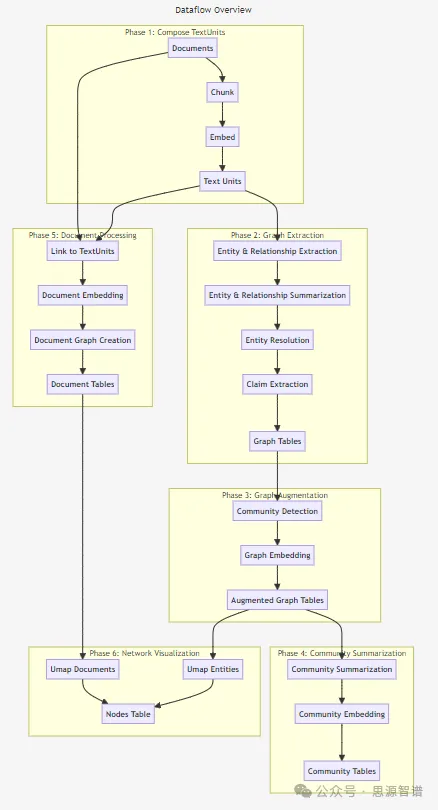
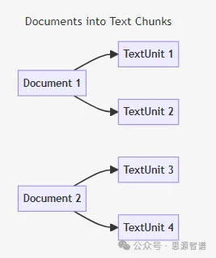
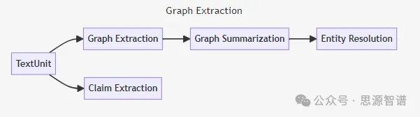
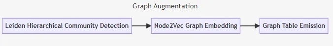
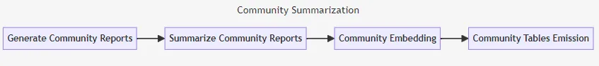
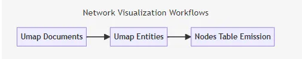

# 1. 面向实际场景的实现逻辑

GraphRAG不仅提供了一种强大的文本分析工具，而且通过其知识模型和工作流程的灵活性和可配置性，能够适应不同的应用场景和用户需求。GraphRAG知识模型和默认配置工作流程可以总结为以下几个核心逻辑步骤，以实现文本数据的高效处理和知识提取：

索引数据流

图形化知识模型（GraphRAG Knowledge Model）

定义: 符合数据模型定义的数据输出规范。

位置: 定义在GraphRAG仓库中的python/graphrag/graphrag/model文件夹。

实体类型:

文档: 系统输入文档，可以是CSV行或.txt文件。

文本单元: 用于分析的文本块，大小、重叠和数据边界可配置。

实体: 从文本单元中提取的实体，如人、地点、事件等。

关系: 两个实体间的关系，由协变量生成。

协变量: 提取的声明信息，可能与时间相关。

社区报告: 实体生成后，进行层次社区检测并生成报告。

节点: 包含实体和文档布局信息，用于渲染图形视图。

默认配置工作流程

将文本文档转换为图形化知识模型的过程。

包含六个阶段：网络可视化、文档处理、社区总结、图形增强、图形提取、文本单元组合。

# 2. 阶段详解

第1阶段：组合文本单元（Compose TextUnits）

- 目的：将输入文档分解为更易于处理的文本单元，用于图形提取。
- 方法：根据用户配置的token数量，将文档分割成不同大小的文本单元。文本单元大小可配置，默认300个token，可使用更大的文本单元加快处理速度。

第2阶段：图形提取（Graph Extraction）

- 目的：分析每个文本单元，提取实体、关系和声明。
- 方法：实体和关系通过entity_extract提取，声明通过claim_extract提取。合并子图形，同名同类型的实体和相同源目标的关系合并。

第3阶段：图形增强（Graph Augmentation）

- 目的：通过社区检测和图形嵌入，增强对实体间复杂关系的理解和表示。
- 方法：应用用层次Leiden算法进行社区检测，使用Node2Vec算法进行图形嵌入。

第4阶段：社区总结（Community Summarization）

- 目的：生成对不同层次社区的总结报告，提供对图形的高层次理解。
- 方法：使用大型语言模型（LLM）生成社区的概要和关键信息的描述。

第5阶段：文档处理（Document Processing）

- 目的：创建知识模型的文档表，将文档转换为知识模型中的结构化数据表。
- 方法：通过链接文本单元、生成文档嵌入，创建文档表。如果处理CSV数据，可配置添加额外字段。将文档链接到文本单元，生成文档嵌入。

第6阶段：网络可视化（Network Visualization）
- 目的：通过降维技术，将高维数据可视化，便于理解和分析。支持现有图形的高维向量空间的网络可视化。
- 方法：使用UMAP算法将实体-关系图和文档图降维到2D空间。

# 3. 总结

Graph RAG的知识模型和工作流程提供了一种系统化的方法来处理和分析文本数据，提取知识，并以图形化的方式展示数据关系，为文本密集型领域提供了一种强大的知识提取和分析工具。结构化解决方案流程简述如下：

文本分割: 接收原始文本数据，执行预处理和文本单元化。

知识提取: 通过LLM自动提取实体和关系,提取并评估文本中的声明，确保知识真实性。

图形增强: 应用社区检测和图形嵌入技术，增强对数据结构的理解。

社区分析: 生成社区报告，提供高层次的图形理解。

文档整合: 构建文档表，链接文本单元，整合文档信息。

网络可视化: 应用UMAP等降维技术，实现数据的二维图形展示。

# 参考

[1] 再揭秘Graph RAG-面向实际场景的实现逻辑，https://mp.weixin.qq.com/s/3dzbpHxHE1yH3BCYntzGHw
[2] https://arxiv.org/pdf/2404.16130
[3] https://microsoft.github.io/graphrag/posts/index/1-default_dataflow/