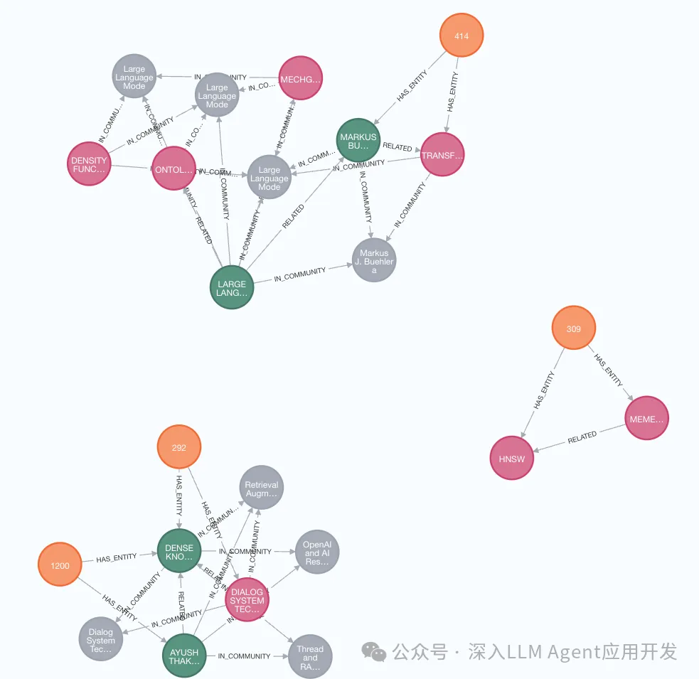
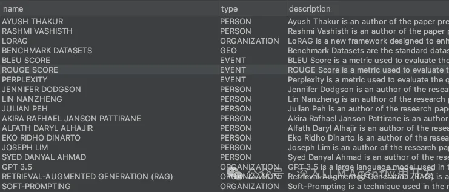
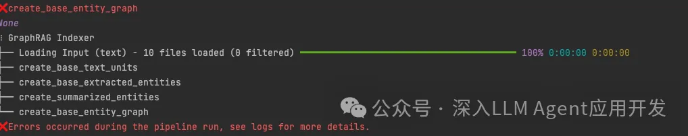
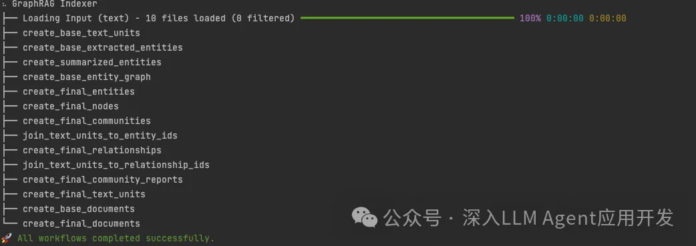
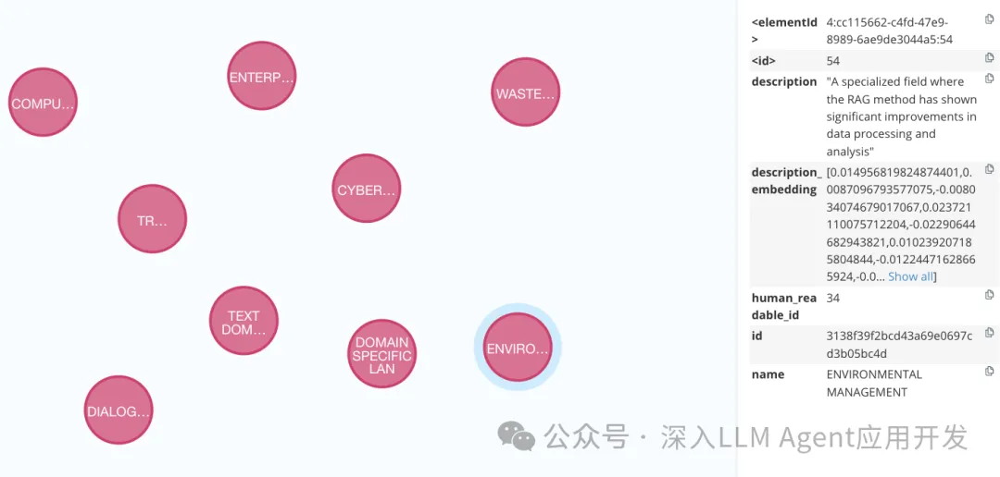

# 0. 简介

我最近在arXiv上下载RAG相关的论文，几百篇的论文，肉眼去一一观看实在是太难了。因此打算通过强大的GraphRAG索引这些文章的摘要，我希望GraphRAG能够根据实体提取和社群分区，能够告知我RAG的研究脉络和大概的研究领域。然而效果并不理想，提取出的实体和问答实在难以恭维，是GraphRAG失效了吗？今天让我们通过实验测试默认prompt索引与查询，并使用Prompt Tune对输入文档领域进行适配后的索引与查询，但是否会更好呢，让我们一探究竟。本文分为5小结，如何下载论文摘要、默认prompt索引查询与可视化，使用prompt tune进行领域适配索引查询和可视化，总结全文与不足。

# 1. 下载论文摘要

构建使用arXiv的高级检索，然后使用arXiv的pip包逐一获取摘要、作者、发表时间和下载链接等信息。

安装arXiv包

```bash
pip install arxiv
```

通过arxiv的高级检索链接，获取按照时间排序的该领域的论文网页。然后通过BeautifulSoap提取出论文id后，我们使用arxiv包分别去获取论文的具体信息并保存为txt。

```python
def fetch_and_save_paper_info(paper_ids, txtfile, save_dir='pdfs'):
    # Create directory if it doesn't exist
    if not os.path.exists(save_dir):
        os.makedirs(save_dir)

    for paper_id in paper_ids:
        # Fetch paper information using arxiv package
        paper = next(arxiv.Search(id_list=[paper_id]).results())
        title = paper.title.replace('/', '_')
        authors = ', '.join([author.name for author in paper.authors])
        abstract = paper.summary
        pdf_link = paper.pdf_url
        published = paper.published.date()

        # paper.download_pdf(save_dir, filename=f"[{published.strftime('%Y-%m')}]-{title}.pdf")
        # Write to TXT
        with open(f'abstracts/{title}.txt', 'w', encoding='utf-8') as txtfile:
            txtfile.write(f"Title: {title}\n")
            txtfile.write(f"Authors: {authors}\n")
            txtfile.write(f"Published: {published}\n")
            txtfile.write(f"Abstract: {abstract}\n")
            txtfile.write(f"PDF Link: {pdf_link}\n")
```

获取的文件大概如下所示，总共大约获取了261个论文。

```txt
Title: A Method for Parsing and Vectorization of Semi-structured Data used in Retrieval Augmented Generation
Authors: Hang Yang, Jing Guo, Jianchuan Qi, Jinliang Xie, Si Zhang, Siqi Yang, Nan Li, Ming Xu
Published: 2024-05-07
Abstract: This paper presents a novel method for parsing and vectorizing
semi-structured data to enhance the functionality of Retrieval-Augmented
...
is available at https://github.com/linancn/TianGong-AI-Unstructure.git.
PDF Link: http://arxiv.org/pdf/2405.03989v2
```

# 2. GraphRAG索引和检索
## 2.1 索引构建
将获取的论文摘要等信息文本放入输入文件夹input，使用默认的Prompt开始索引。

```bash
poetry run poe index --root .
```

经过漫长索引时间后，最终索引完成，由于每个文件都只有300多的Token导致实体提取时间变得异常的久，成本也成倍增加，我的DeepSeeker又被消耗了200万Token（😅）。

```bash
⠹ GraphRAG Indexer 
├── Loading Input (text) - 261 files loaded (0 filtered) ━━━━━━━━━━━━━━━━━━━━━━━━━━━━━━━━━━━━━━━━ 100% 0:00:00 0:00:00
├── create_base_text_units
├── create_base_extracted_entities
├── create_summarized_entities
├── create_base_entity_graph
├── create_final_entities
├── create_final_nodes
├── create_final_communities
├── join_text_units_to_entity_ids
├── create_final_relationships
├── join_text_units_to_relationship_ids
├── create_final_community_reports
├── create_final_text_units
├── create_base_documents
└── create_final_documents
🚀 All workflows completed successfully.
```

此外使用新的llama.cpp总是会因为任务堆积导致超时，在实体的embedding提取阶段失败。后来我发现我们可以将settings.yaml中的embedding的concurrency设置为1即可，毕竟本地的服务能力孱弱。

```yaml
embeddings:
  async_mode: threaded # or asyncio
  llm:
    api_key: ${GRAPHRAG_API_KEY}
    type: openai_embedding # or azure_openai_embedding
    model: text-embedding-ada-002
    api_base: http://localhost:8080
    batch_size: 1 # the number of documents to send in a single request
    concurrent_requests: 1 # the number of parallel inflight requests that may be made
```

## 2.2 实体可视化

启动neo4j实例，使用neo4j.py脚本，配置输入目录为索引output文件夹，执行该文件导入实体信息。

```python
GRAPHRAG_FOLDER = "../output/20240718-193845/artifacts"
```

```bash
{'_contains_updates': True, 'labels_added': 261, 'nodes_created': 261, 'properties_set': 522}
261 rows in 0.3114888668060303 s.
{'_contains_updates': True, 'labels_added': 261, 'relationships_created': 261, 'nodes_created': 261, 'properties_set': 783}
261 rows in 0.13231897354125977 s.
{'_contains_updates': True, 'labels_added': 851, 'relationships_created': 1300, 'nodes_created': 851, 'properties_set': 3851}
{'_contains_updates': True, 'labels_added': 911, 'relationships_created': 936, 'nodes_created': 911, 'properties_set': 3644}
1911 rows in 3.2000412940979004 s.
{'_contains_updates': True, 'relationships_created': 1000, 'properties_set': 6000}
{'_contains_updates': True, 'relationships_created': 928, 'properties_set': 5568}
1928 rows in 0.23821067810058594 s.
{'_contains_updates': True, 'labels_added': 156, 'relationships_created': 3062, 'nodes_created': 156, 'properties_set': 532}
188 rows in 0.21347689628601074 s.
{'_contains_updates': True, 'labels_added': 725, 'relationships_created': 725, 'nodes_created': 725, 'properties_set': 3571}
187 rows in 0.18852496147155762 s.
```

文档可视化，可以看到包含了大约262个文档，除了论文的261个，还有一个是之前索引的小说《仙逆》。


实体可视化。



neo4j这些显示不全的似乎也没法展开看那，还是看原始的create_final_entities.parquet文件。



默认提取的实体是PERSON、ORGANIZATION、GEO和EVENT这四个类型，这更像是一个针对什么人、什么组织、在哪里发生了什么的文体，更符合新闻或者小说之类的叙事体。可见默认的Prompt是不太适合学术论文领域的实体提取的。这也为接下来检索测试效果不太理想奠定了伏笔。其中，默认提取实体在settings.yaml中entity_extraction中指定。

```yaml
entity_extraction:
  prompt: "prompts/entity_extraction.txt"
  entity_types: [organization, person, geo, event]
  max_gleanings: 0
```

## 2.3 检索测试

问题1：这些论文中有哪些在尝试优化RAG性能，它们的手段是什么，优化了什么

```bash
poetry run poe query --method global "这些论文中有哪些在尝试优化RAG性能，它们的手段是什么，优化了什么" 
```

输出：

```bash
SUCCESS: Global Search Response: ### 优化RAG性能的研究概述
Retrieval-Augmented Generation (RAG) 是一种结合了检索和生成过程的先进技术，广泛应用于自然语言处理和信息检索领域。近年来，许多研究致力于优化RAG的性能，以提高其在各种应用中的效率和效果。以下是一些主要的研究方向和优化手段：
#### 1. 框架和模型的创新
- **LongRAG框架**：通过使用长上下文的大型语言模型（LLMs），在NQ和HotpotQA等数据集上展示了显著的改进[Data: Reports (158)]。
- **MedRAG工具包**：显著提高了GPT-3.5和Mixtral等模型的性能，使其达到GPT-4级别[Data: Reports (150)]。
- **X-RAG方法**：在标记级别上增强大型语言模型和RAG系统之间的协作生成[Data: Reports (170)]。
- **Mindful-RAG框架**：旨在提高大型语言模型在知识检索任务中响应的正确性和相关性[Data: Reports (110)]。
- **DPA-RAG框架**：通过整合多样化的知识偏好，增强了大型语言模型的能力[Data: Reports (186)]。
#### 2. 数据集和评估方法的改进
- **FeB4RAG数据集**：支持RAG框架内的联邦搜索，由Shuai Wang和Guido Zuccon等作者开发[Data: Reports (179)]。
- **CRUD-RAG基准**：用于评估RAG系统在各种应用场景中的性能，推动RAG技术的发展[Data: Reports (20)]。
- **DomainRAG基准**：专门用于评估特定领域的RAG模型，表明其在推进特定领域AI技术方面的重要性[Data: Reports (163)]。
#### 3. 算法和技术的创新
- **Unified Active Retrieval (UAR)**：通过解决主动检索方法中的挑战，提高了RAG的性能[Data: Reports (35)]。
- **Stochastic RAG**：通过预期效用最大化优化RAG模型，提高了性能和适用性[Data: Reports (142)]。
- **FILCO方法**：通过改进生成模型中的上下文质量，增强了模型性能并解决了安全漏洞[Data: Reports (148)]。
这些研究不仅展示了RAG技术的广泛应用潜力，还通过各种创新方法和技术，显著提升了RAG系统的性能和效率。这些进展对于推动自然语言处理和信息检索领域的进一步发展具有重要意义。
```

丢失RQ-RAG信息，看起来未能提取到相关实体导致被丢失。限于篇幅就不具体展开了，我还问了一些具体的问题，都不能很好地回答，很多信息被丢失了。

# 3. 使用GraphRAG的Prompt Tune

接下来我们尝试使用GraphRAG的Prompt-Tune进行自动适配领域。根据我的经验，在使用Prompt-Tune时，你使用的大模型必须是参数相对较大的，性能较好的那种，不然输出的Prompt质量可能较差，甚至是生成的Prompt都包含格式错误。我之前就用过gemma-9b进行Prompt-Tune来适配中文领域的网络小说，首先是Prompt提取实体的Example存在格式错误，然后输出的Prompt对于中文的领域内容理解也较差，所以如果你要使用Prompt-Tune对中文内容和领域进行适配的话，可以考虑使用对中文更加友好的大模型。

先看一下Prompt-Tune要如何使用：

```bash
python -m graphrag.prompt_tune --root . --domain "Chinese web novels" --language Chinese --chunk-size 300 --output prompt-paper
```

- root - 指定配置yaml位置和输入文件位置
- domain - 指定适配领域
- method - 指定如何选取文档作为适配参考，可选all, random和top
- limit - 在指定method为random或者top时，设置加载文件数量
- max-tokens - 设置生成prompt的最大tokens数量
- chunk-size - 设置chunk大小
- language - 设置适配的语言
- no-entity-type - 使用未分类实体提取，不太清楚有啥用
- output - 设置生成的prompt位置，不然会直接覆盖现有默认的prompt。

因此对于论文，由于都是英文，不需要调整语言，只调整领域。

```bash
python -m graphrag.prompt_tune --root . --domain "scholarly articles about retrieval augmented generation" --method random --limit 2 --chunk-size 500 --output prompt-paper
```

输出：

```bash
INFO: Reading settings from settings.yaml
Loading Input (text).....................................................................................................................
# 备注：检测语言，默认英文
INFO: Detecting language...
INFO: Detected language: The primary language of the provided texts is "English".
# 备注：生成Prompt-Tune系统角色，可以看到针对我们设定的关于RAG的学术文章。
INFO: Generating persona...
INFO: Generated persona: You are an expert in information science and network analysis. You are skilled at parsing and interpreting complex academic literature to map out the relationships and structures within a specific research domain. You are adept at helping people with identifying the key contributors, collaborations, and thematic clusters within scholarly articles about retrieval augmented generation.
# 备注：生成时社区报告Prompt
INFO: Generating community report ranking description...
INFO: Generated community report ranking description: A float score between 0-10 that represents the relevance of the text to retrieval-augmented generation, model configurations, performance metrics, and insights into model behaviors, with 1 being trivial or irrelevant and 10 being highly significant, impactful, and informative for the advancement of retrieval-augmented generation systems.
# 备注：生成实体 包含模型、技术、指标、架构和数据集
INFO: Generating entity types
INFO: Generated entity types: model, technique, metric, architecture, dataset
# 备注：生成实体的关系Example
INFO: Generating entity relationship examples...
INFO: Done generating entity relationship examples
# 备注：生成实体提取的Prompt
INFO: Generating entity extraction prompt...
Failed to get encoding for cl100k_base when getting num_tokens_from_string. Fall back to default encoding cl100k_base
Failed to get encoding for cl100k_base when getting num_tokens_from_string. Fall back to default encoding cl100k_base
Failed to get encoding for cl100k_base when getting num_tokens_from_string. Fall back to default encoding cl100k_base
Failed to get encoding for cl100k_base when getting num_tokens_from_string. Fall back to default encoding cl100k_base
# 备注：生成各种Prompt
INFO: Generated entity extraction prompt, stored in folder prompt-paper
INFO: Generating entity summarization prompt...
INFO: Generated entity summarization prompt, stored in folder prompt-paper
INFO: Generating community reporter role...
INFO: Generated community reporter role: A scholarly network analyst tasked with dissecting the domain of retrieval augmented generation (RAG) in scholarly articles, given a set of publications, authors, and their affiliations. The analyst will map out the key contributors, collaborations, and thematic clusters within the research community focused on RAG. This analysis will be instrumental in identifying trends, influential researchers, and potential areas for future research, thereby providing valuable insights to academic strategists and funding bodies.
INFO: Generating community summarization prompt...
INFO: Generated community summarization prompt, stored in folder prompt-paper
```

其中这个报错Failed to get encoding for cl100k_base when getting num_tokens_from_string. Fall back to default encoding cl100k_base不用担心，这是因为原本Prompt-Tune是不支持非Open AI模型导致的，已经被我修复了，也合并到main分支了，因此会打印这句回退到默认c100k_base的分词。

那么提取的这些实体类型model, technique, metric, architecture, dataset是否足够呢？可以小批量测试一下，以避免大量的Token消耗，我将论文数量缩减到10个，进行一些简单测试，以便能够更快地进行Prompt的Fine Tune。在进行小批量测试前，还有几点需要说明，Prompt-Tune生成的Prompt模板是没有claim_extraction.txt文件，可以从原prompt目录拷贝。简单起见，你将新生成的Prompt放到prompts目录，也可以考虑直接修改settings.yaml中各个地方配置这些prompts目录的配置项。

小批量索引测试一下。很遗憾，在构建基本实体的网络时候，报错EmptyNetworkError。



但如果你切换回默认的Prompt，又能Index成功，所以Prompt-Tune出的Prompt大概是有问题的。



我之前也曾尝试给设定中文语言和网络小说领域进行Prompt Tune，调试了一下午也没找到问题，这次依然报同样的错误。但这次我似乎发现问题了，我简单对比了一下，生成的3个文件：community_report.txt，entity_extraction.txt、summarize_descriptions.txt。其中总结描述地最简单，只是对角色设定加入了该领域的信息。翻译为中文：

```text
你是一位信息科学和网络分析专家。你擅长解析和解读复杂的学术文献，以绘制特定研究领域内的关系和结构图。你熟练于帮助人们识别关于检索增强生成（RAG）的学术文章中的关键贡献者、合作关系和主题集群。
利用你的专业知识，请生成一份对以下提供数据的综合摘要。
```

community_report也是对角色进行设定，Example基本上是没变化的，只是格式有点变了。最大的问题就出在entity_extraction.txt，我仔细对比了之后发现：

原文中output是这样：

```text
("entity"{tuple_delimiter}"Alex"{tuple_delimiter}"person"{tuple_delimiter}"Alex is a character who experiences frustration and is observant of the dynamics among other characters."){record_delimiter}
```

而Prompt-Tune出来的是:

```text
("entity"{tuple_delimiter}"RAGGED"{tuple_delimiter}"technique"{tuple_delimiter}"RAGGED is a framework designed to analyze and optimize Retrieval Augmented Generation (RAG) systems, particularly for document-based question answering tasks."){tuple_delimiter}
```

发现了不同了吗？结尾的换行符不同。这和它本身的Prompt设定也不同，本身Prompt设定要求在每个List结尾添加{record_delimiter}作为列表分割符。但个人觉得，这Prompt写的真不咋样，在设定中给出案例时候就该写上这个结尾，这第3条中就中间这一句要求加结尾，而且埋在前后要求翻译的话里。很容易被LLM忽略，放在这只能作为一种强调，大模型是否知道哪个list也未可知。

```text
3. Return output in English as a single list of all the entities and relationships identified in steps 1 and 2. Use **{record_delimiter}** as the list delimiter.
```

所以手动修改那些Example和Prompt说明，再次Index成功，我会尝试提PR去修复，敬请期待。

# 4. 测试

问题1：这些论文中有哪些优化RAG系统的方法

```bash
poetry run poe query --method global  "这些论文中有哪些优化RAG系统的方法"
```

```bash
SUCCESS: Global Search Response: Retrieval-Augmented Generation (RAG) 系统通过多种优化方法显著提升了大型语言模型（LLMs）的性能和效率。以下是一些关键的优化方法：

Sparse RAG: 这是一种新颖的方法，通过使用稀疏性来并行编码文档并选择性解码输出，从而降低计算成本并提高效率 [Data: Reports (5)].

FLARE: 作为RAG的一种特定方法，FLARE通过迭代使用即将到来的句子的预测来检索相关文档，增强了LLMs的上下文相关性和准确性 [Data: Reports (0)].

集成广告和代码生成: RAG通过集成广告来增强其功能，并优化了为特定领域语言（DSLs）生成代码的性能 [Data: Reports (1, 4, 5)].

这些优化方法不仅提高了RAG系统的性能，还扩展了其在不同领域的应用，如环境管理和特定语言模型的解释能力。
```

这次测试并没有索引所有文章摘要，还是那个10篇，是因为我觉得提取的实体并不完全是我想要的，但是答案已经好很多了。而且从可视化来看，确实也要好很多。比如Domain实体：它找出了环境，领域特定语言，机器翻译和计算广告等。



# 5. 总结
虽然我们通过Prompt-Tune借助LLM的能力自动微调Prompt以适配输入文件的领域，但我发现Prompt-Tune的给出实体列表就跟抽卡似的，同一个领域每次都不同。

- person, organization, technology, dataset, method
- model, person, publication, technology, optimization strategy
- model, technique, metric, architecture, dataset

但是这些实体类型是否是你想要的呢，是否足够匹配领域所需要的实体呢？就像论文，应该要包含关键字吧，要包含想要解决的问题吧，要包含解决方法吧？之后通过要解决的问题就能将所有的相关的论文link到一起。假设我想问RAG在查询这一阶段都有哪些优化？在合成阶段又有哪些优化手段？所以如何让他按照我所设的类型来提取呢？有没有可能给它提示，让它按照我的设想去生成呢？或者使用更好的模型，对该领域可能需要的实体给出范围呢？当然是可以的，下一篇如何手调Prompt以更好地适配你的领域。

# 参考

[1] GraphRAG失效？快用Prompt Tune适配文档的领域和语言，https://mp.weixin.qq.com/s/MdFY6ON-F8dzRhOk6bNokQ