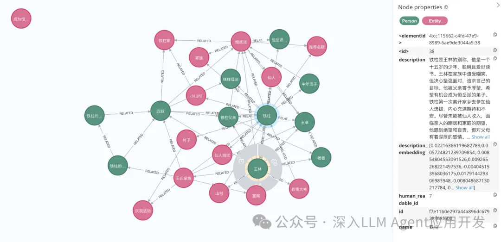
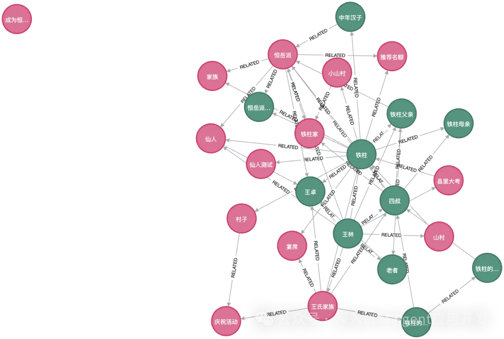
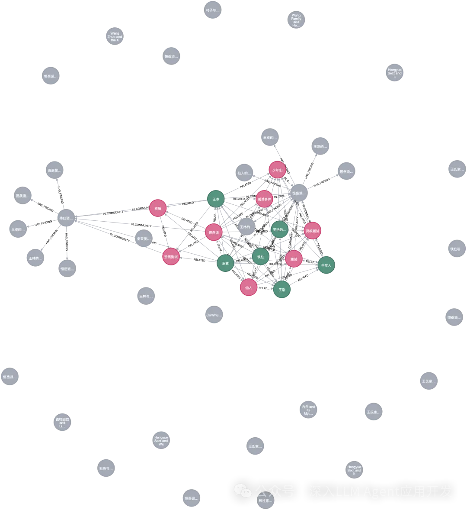
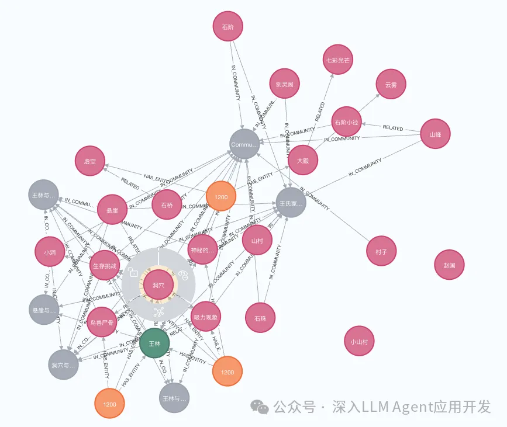

# 0. 简介

GraphRAG通过结合知识图谱，增加RAG的全局检索能力。今天我将讲解如何使用Neo4J可视化GraphRAG索引的结果，以便进一步的处理、分析。本篇仍然以小说《仙逆》提取的实体为例，一图胜千言。本文分为4小节，安装neo4j、导入GraphRAG索引文件、Neo4J可视化分析和总结，所有坑都已经帮你趟过啦，放心食用。



Neo4j[1]是由 Neo4j Inc. 开发的图数据库管理系统，是图数据库技术领域的领导者——强大的原生图存储、数据科学和分析，具备企业级的安全性。无约束地扩展您的事务和分析工作负载。已下载超过1.6亿次。Neo4j 存储的数据元素包括节点、连接它们的边以及节点和边的属性。

# 1. 安装Neo4j

Neo4j支持使用云端服务和本地社区开源版本，使用如下Docker命令启动Neo4J实例。

```bash
docker run \
    -p 7474:7474 -p 7687:7687 \
    --name neo4j-apoc \
    -e NEO4J_apoc_export_file_enabled=true \
    -e NEO4J_apoc_import_file_enabled=true \
    -e NEO4J_apoc_import_file_use__neo4j__config=true \
    -e NEO4J_PLUGINS=\[\"apoc\"\] \
    neo4j:5.21.2
```

浏览器打开http://localhost:7474/，然后输入默认用户名neo4j，默认密码neo4j即可登录，登录之后要求重设密码。

接下来，安装neo4j的依赖包

```bash
pip install --quiet pandas neo4j-rust-ext
```

# 2. 导入GraphRAG的索引结果

为了更好地支持中文提取，本次采用deepseeker[2]的deep-seek-chat模型（为啥不用qwen2？因为我的免费额度使用完了）。注册之后免费500万Token，索引一次通过，支持128K上下文，最大输出Tokens为4096。所以设置LLM的时候，务必把max_tokens设置为4096，未明确说明TPM和RPM，根据平台符合自动调整。

导入依赖库

```python
import pandas as pd
from neo4j import GraphDatabase
import time
```

联结本地Neo4j实例

```python
NEO4J_URI = "neo4j://localhost"  # or neo4j+s://xxxx.databases.neo4j.io
NEO4J_USERNAME = "neo4j"
NEO4J_PASSWORD = "password" #你自己的密码
NEO4J_DATABASE = "neo4j"

# Create a Neo4j driver
driver = GraphDatabase.driver(NEO4J_URI, auth=(NEO4J_USERNAME, NEO4J_PASSWORD))
```

配置本次索引目录

```python
GRAPHRAG_FOLDER = "./output/20240716-192226/artifacts"
```

创建Neo4j索引

在Neo4j中，索引仅用于查找图查询的起始点，例如快速查找两个节点以进行连接。约束用于避免重复，主要在实体类型的id上创建。我们使用带有两个下划线的类型作为标记，以区分它们与实际的实体类型。

```python
statements = """
create constraint chunk_id if not exists for (c:__Chunk__) require c.id is unique;
create constraint document_id if not exists for (d:__Document__) require d.id is unique;
create constraint entity_id if not exists for (c:__Community__) require c.community is unique;
create constraint entity_id if not exists for (e:__Entity__) require e.id is unique;
create constraint entity_title if not exists for (e:__Entity__) require e.name is unique;
create constraint entity_title if not exists for (e:__Covariate__) require e.title is unique;
create constraint related_id if not exists for ()-[rel:RELATED]->() require rel.id is unique;
""".split(";")

for statement in statements:
    if len((statement or "").strip()) > 0:
        print(statement)
        driver.execute_query(statement)
```

创建批量导入函数

```python
def batched_import(statement, df, batch_size=1000):
    """
    Import a dataframe into Neo4j using a batched approach.
    Parameters: statement is the Cypher query to execute, df is the dataframe to import, and batch_size is the number of rows to import in each batch.
    """
    total = len(df)
    start_s = time.time()
    for start in range(0,total, batch_size):
        batch = df.iloc[start: min(start+batch_size,total)]
        result = driver.execute_query("UNWIND $rows AS value " + statement, 
                                      rows=batch.to_dict('records'),
                                      database_=NEO4J_DATABASE)
        print(result.summary.counters)
    print(f'{total} rows in { time.time() - start_s} s.')    
    return total
```

导入文档

```python
doc_df = pd.read_parquet(f'{GRAPHRAG_FOLDER}/create_final_documents.parquet', columns=["id", "title"])
doc_df.head(2)

# import documents
statement = """
MERGE (d:__Document__ {id:value.id})
SET d += value {.title}
"""

batched_import(statement, doc_df)
```

导入text units

```python
text_df = pd.read_parquet(f'{GRAPHRAG_FOLDER}/create_final_text_units.parquet',
                          columns=["id","text","n_tokens","document_ids"])
text_df.head(2)

statement = """
MERGE (c:__Chunk__ {id:value.id})
SET c += value {.text, .n_tokens}
WITH c, value
UNWIND value.document_ids AS document
MATCH (d:__Document__ {id:document})
MERGE (c)-[:PART_OF]->(d)
"""

batched_import(statement, text_df)
```

加载实体

```python
entity_df = pd.read_parquet(f'{GRAPHRAG_FOLDER}/create_final_entities.parquet',
                            columns=["name", "type", "description", "human_readable_id", "id", "description_embedding",
                                     "text_unit_ids"])
entity_df.head(2)

entity_statement = """
MERGE (e:__Entity__ {id:value.id})
SET e += value {.human_readable_id, .description, name:replace(value.name,'"','')}
WITH e, value
CALL db.create.setNodeVectorProperty(e, "description_embedding", value.description_embedding)
CALL apoc.create.addLabels(e, case when coalesce(value.type,"") = "" then [] else [apoc.text.upperCamelCase(replace(value.type,'"',''))] end) yield node
UNWIND value.text_unit_ids AS text_unit
MATCH (c:__Chunk__ {id:text_unit})
MERGE (c)-[:HAS_ENTITY]->(e)
"""

batched_import(entity_statement, entity_df)
```

导入关系

```python
rel_df = pd.read_parquet(f'{GRAPHRAG_FOLDER}/create_final_relationships.parquet',
                         columns=["source", "target", "id", "rank", "weight", "human_readable_id", "description",
                                  "text_unit_ids"])
rel_df.head(2)

rel_statement = """
    MATCH (source:__Entity__ {name:replace(value.source,'"','')})
    MATCH (target:__Entity__ {name:replace(value.target,'"','')})
    // not necessary to merge on id as there is only one relationship per pair
    MERGE (source)-[rel:RELATED {id: value.id}]->(target)
    SET rel += value {.rank, .weight, .human_readable_id, .description, .text_unit_ids}
    RETURN count(*) as createdRels
"""

batched_import(rel_statement, rel_df)
```

导入社区

```python
community_df = pd.read_parquet(f'{GRAPHRAG_FOLDER}/create_final_communities.parquet',
                               columns=["id", "level", "title", "text_unit_ids", "relationship_ids"])

community_df.head(2)

statement = """
MERGE (c:__Community__ {community:value.id})
SET c += value {.level, .title}
/*
UNWIND value.text_unit_ids as text_unit_id
MATCH (t:__Chunk__ {id:text_unit_id})
MERGE (c)-[:HAS_CHUNK]->(t)
WITH distinct c, value
*/
WITH *
UNWIND value.relationship_ids as rel_id
MATCH (start:__Entity__)-[:RELATED {id:rel_id}]->(end:__Entity__)
MERGE (start)-[:IN_COMMUNITY]->(c)
MERGE (end)-[:IN_COMMUNITY]->(c)
RETURn count(distinct c) as createdCommunities
"""

batched_import(statement, community_df)
```

导入社区报告

```python
community_report_df = pd.read_parquet(f'{GRAPHRAG_FOLDER}/create_final_community_reports.parquet',
                                      columns=["id", "community", "level", "title", "summary", "findings", "rank",
                                               "rank_explanation", "full_content"])
community_report_df.head(2)
# import communities
community_statement = """MATCH (c:__Community__ {community: value.community})
SET c += value {.level, .title, .rank, .rank_explanation, .full_content, .summary}
WITH c, value
UNWIND range(0, size(value.findings)-1) AS finding_idx
WITH c, value, finding_idx, value.findings[finding_idx] as finding
MERGE (c)-[:HAS_FINDING]->(f:Finding {id: finding_idx})
SET f += finding"""
batched_import(community_statement, community_report_df)
```

以上我们导入了文档、TextUnits、实体、关系、社区和社区报告后，打开浏览器后就可可视化分析这些实体关系和社区之间的信息了。Here we go

# 3. 可视化分析

打开浏览器输入地址http://localhost:7474/browser/。

实体

每个实体可点开，查看进一步的关联关系，王林和铁柱的关系也是一目了然。



社区

社区有很多，基本上是对某一个特定事件进行整合，比如测试事件都关联了哪些人、哪些测试。



地点


点开洞穴可以进一步查看该洞穴关联的实体和人物、文本单元。




# 参考

[1] 喂饭教程！全网首发Neo4J可视化GraphRAG索引, https://mp.weixin.qq.com/s?__biz=MzI0OTAzNTEwMw==&mid=2247484265&idx=1&sn=660e17e8196d4eea4900db1636aa706f&chksm=e996e359dee16a4f899ab9738d4ff7df13cdb4cc2faa6586320e4155492de1f78744756de7a4&cur_album_id=3533964025434734594&scene=189#wechat_redirect