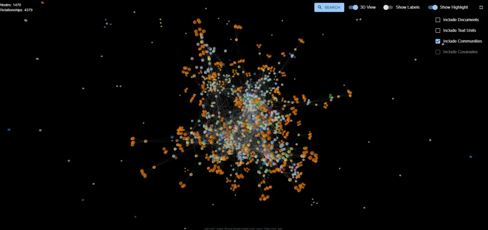

GraphRAG Visualizer：用于可视化和探索微软GraphRAG框架生成数据的Web工具，支持2D/3D图可视化、数据表格展示、搜索功能等。可以通过上传GraphRAG索引管道生成的parquet文件，实现在本地查看和分析数据，包括文档、文本单元、社区、协变量等节点及其关系。

[1] http://github.com/noworneverev/graphrag-visualizer
[2] https://noworneverev.github.io/graphrag-visualizer/#/upload

# 参考

[1] GraphRAG Visualizer：用于可视化和探索微软GraphRAG框架生成数据的Web工具，https://mp.weixin.qq.com/s/iOm0yFg7wy_aOLA2uVt7nQ