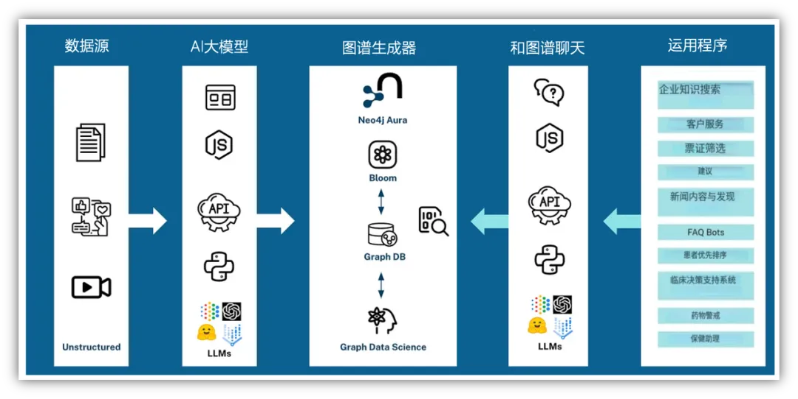
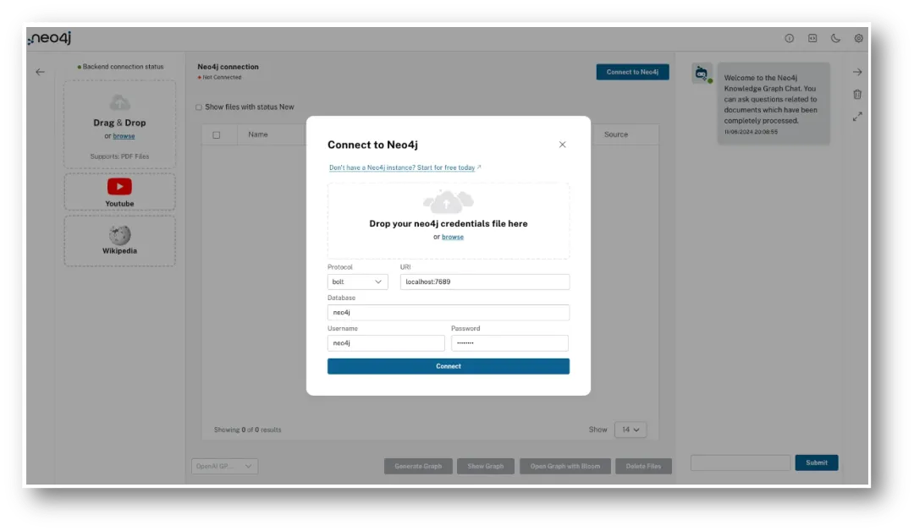
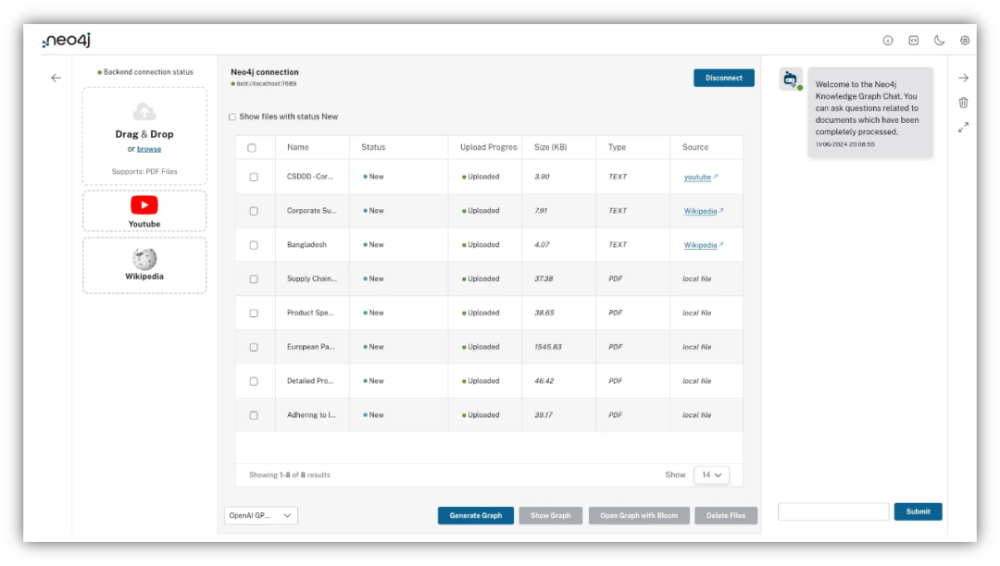
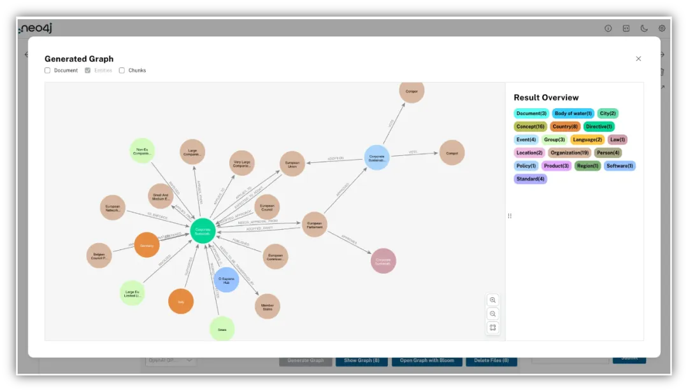
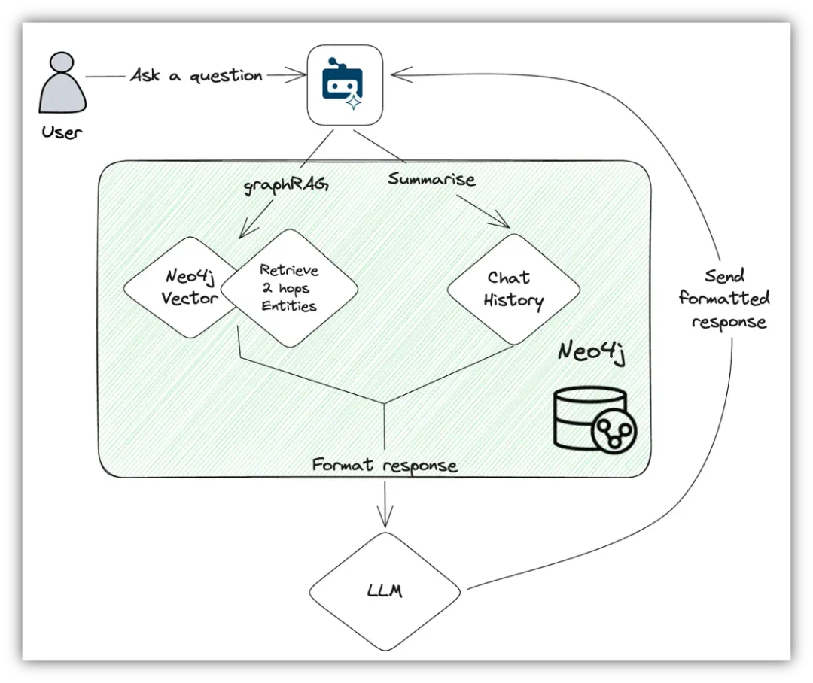
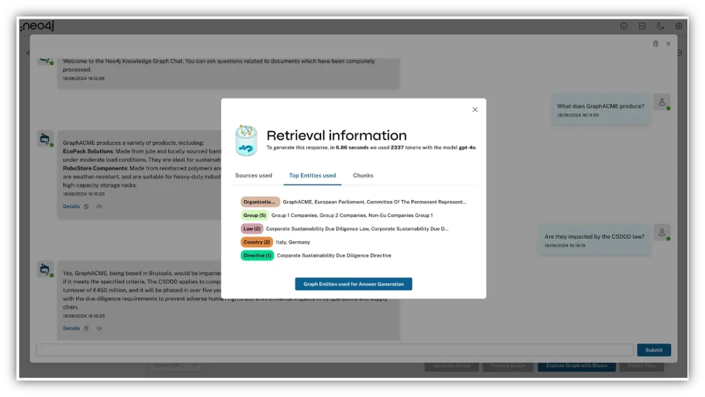
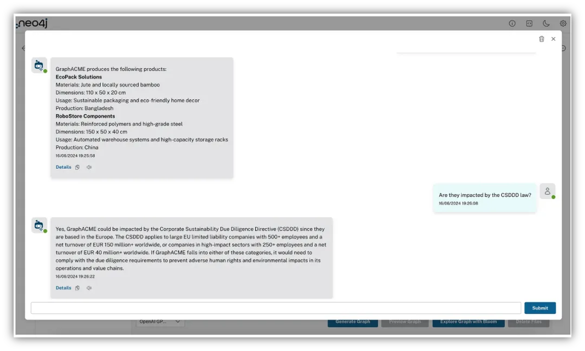

# 1. 简介

- GitHub仓库：https://github.com/neo4j-labs/llm-graph-builder

- 更详细的入门指南：https://neo4j.com/labs/genai-ecosystem/llm-graph-builder/

利用知识图谱从大量文档、视频中提取信息，建立实体之间的关系，有利于加速信息处理，提取文档中的数据，以及发现实体之间潜在关系和规律。

AI大模型的快速发展，大模型和知识图谱的结合，有了更多可能性。

本文我将演示下面我将演示如何在5分钟内上传数据源，构建一个动态知识图谱，可用于提取实体关系，并且与数据对话。

这里使用的工具是大模型知识图谱构建器（LLM Knowledge Graph Builder ）。

这个工具是Neo4j生态系统中常用的GraphRAG工具之一，能够将非结构化数据转化为动态知识图谱，还可以可以通过自然语言查询数据并获得解释性见解。

先简单介绍下什么是大模型知识图谱构建器，及其工作流程。

# 2. 工作流程

Neo4j 大模型知识图谱构建器是一款在线应用，无需编写代码和使用Cypher语言即可将非结构化文本转化为知识图谱，操作起来非常方便。

利用机器学习模型将PDF文件、网页和YouTube视频等转化为包含实体及其关系的知识图谱。

前端是基于我们Needle Starter Kit的React应用，后端是Python FastAPI应用。该应用使用了Neo4j为LangChain贡献的llm-graph-transformer模块。

该应用体验丝滑，分为以下四个简单步骤：

1. 导入数据：支持多种数据源，包括PDF文档、维基百科页面、YouTube视频等。

2. 识别实体：使用AI大模型识别并提取非结构化文本中的实体和关系。

3. 构建图谱：将识别出的实体和关系转换为图谱格式，利用Neo4j的图谱功能。

4. 使用图谱：提供直观的网页界面，用户可以方便地与应用互动，包括上传数据源、可视化生成的图谱以及与RAG代理交互。这一功能特别令人兴奋，因为它使用户能够直观地与数据互动，宛如与知识图谱对话，无需任何技术知识。

你可以在Neo4j官网使用应用程序，无需绑定支付信用卡和AI大模型密钥，使用过程无任何障碍。

如果你想在本地或自己的环境中运行该程序，可以访问GitHub仓库并按照我们将在本文中介绍的步骤进行操作。

现在我们开始。

# 3. 环境准备
在使用大模型知识图谱构建器之前，你需要创建一个新的Neo4j数据库。

你可以按照以下步骤使用免费的AuraDB数据库：

1、访问 https://console.neo4j.io 并登录或创建账户。

2、在Instances下创建一个新的AuraDB Free数据库。

3、下载凭证文件。

4、等待实例启动。

完成上述步骤后，Neo4j数据库已经启动，并且有了凭证。点击右上角的Connect to Neo4j，你打开大模型知识图谱构建器，

将之前下载的凭证文件拖到连接对话框中，所有信息会自动填充。你也可以手动输入所有信息。

# 4. 创建知识图谱
首先将非结构化数据导入，然后通过AI大模型识别关键实体及其关系。

你可以将PDF和其他文件拖到左侧的第一个输入区域。

第二个输入框允许你复制粘贴YouTube视频（暂不支持其他视频网站）链接。

第三个输入框则用于输入维基百科页面链接。

在这里，我将上传了：1）一家供应链公司内部的PDF文件，文档详细记录了他们的整个供应链策略和产品。2）福布斯的新闻文章；3）一个关于《企业可持续发展尽职调查指令》（CSDDD）的YouTube视频；4）以及维基百科上的两篇文章。

你可以选择只上传pdf文档，视频或者维基百科页面。

上传文件时，应用程序会使用LangChain文档加载器，以及YouTube解析器将上传的文件存储为图中的文档节点。

所有文件上传完毕后，你会看到类似如下的界面：

现在，我们只需要选择使用的模型，点击Generate Graph，系统将为你完成其余的工作！

如果你只想生成特定文件的图谱，可以先选择文件（在表格第一列的复选框中勾选），然后点击Generate Graph。

⚠️ 如果你想使用预定义的或自定义的图模式，可以点击右上角的设置图标，然后从下拉菜单中选择一个预定义模式。你也可以通过输入节点标签和关系来使用自定义模式，还可以从现有的Neo4j数据库中提取模式，或者粘贴文本，让AI大模型分析并提供建议的模式。

处理文件并创建知识图谱是如何进行的呢？我把工作原理总结如下：

1. 内容被分割成小块。

2. 小块存储在图中，并连接到文档节点和彼此，以实现高级RAG模式。

3. 高度相似的小块通过SIMILAR关系连接，形成K最近邻图。

4. 计算并存储小块的嵌入和向量索引。

5. 使用llm-graph-transformer或diffbot-graph-transformer，从文本中提取实体和关系。

6. 实体存储在图中，并连接到原始小块。

# 5. 探索知识图谱

从文档中提取的信息被结构化为图形格式，其中实体成为节点，关系则成为连接这些节点的边。

Neo4j的优势在于它能够高效地存储和查询这些复杂的数据网络，使生成的知识图谱能够立即用于各种应用。

在使用RAG代理提问之前，可以选中一个或多个文档，点击显示图谱（Show Graph）按钮。这将显示所选文档中的实体，你也可以在该视图中显示文档和块节点。

点击Open Graph with Bloom按钮将启动Neo4j Bloom，将可视化创建的知识图谱。点击删除文件（Delete files）将从图中删除选定的文档和块（如果在选项中选择，也会删除实体）。

# 6. 与你上传的数据对话

现在进入最后一个部分：使用右侧面板中的RAG代理（RAG agent）对话。

这部分是如何工作的呢？

下图展示了GraphRAG过程的简化视图。

当用户提出问题时，使用Neo4j向量索引和检索查询来找到与问题最相关的块及其连接的实体，深度最多可达两跳。

还可以总结聊天记录，并将其作为一个元素来丰富上下文。

各种输入的信息（问题、向量结果、聊天记录）都会被发送到选定的AI大模型中，通过一个自定义提示，向选定的AI大模型提供问题的各种输入和来源，并请求其根据这些元素和上下文提供并格式化问题的回答。当然，这个提示还包括其他方面，比如格式化要求引用来源，在不清楚答案时不进行推测等。

完整的提示和指令可以在QA_integration.py文件中找到，标记为FINAL_PROMPT。

文件地址：https://github.com/neo4j-labs/llm-graph-builder/blob/main/backend/src/QA_integration.py#L59

# 7. 当用户提出问题时，使用Neo4j向量索引和检索查询来找到与问题最相关的块及其连接的实体，深度最多可达两跳。

还可以总结聊天记录，并将其作为一个元素来丰富上下文。

各种输入的信息（问题、向量结果、聊天记录）都会被发送到选定的AI大模型中，通过一个自定义提示，向选定的AI大模型提供问题的各种输入和来源，并请求其根据这些元素和上下文提供并格式化问题的回答。当然，这个提示还包括其他方面，比如格式化要求引用来源，在不清楚答案时不进行推测等。

完整的提示和指令可以在QA_integration.py文件中找到，标记为FINAL_PROMPT。

文件地址：https://github.com/neo4j-labs/llm-graph-builder/blob/main/backend/src/QA_integration.py#L59

# 8. 与知识图谱对话
现在，我就可以询问上传文档的知识了（使用之前上传的数据），比如查询这家公司生产的产品列表，以及这些产品是否受到CSDDD法规的影响，如果受到影响，具体的影响是什么。

# 参考

[1] 超好用！五分钟内将文本转为图谱，可用于发现实体之间关系和规律，与文本对话，https://mp.weixin.qq.com/s/uzrXUYSwJrD6FiwjIz7R2A