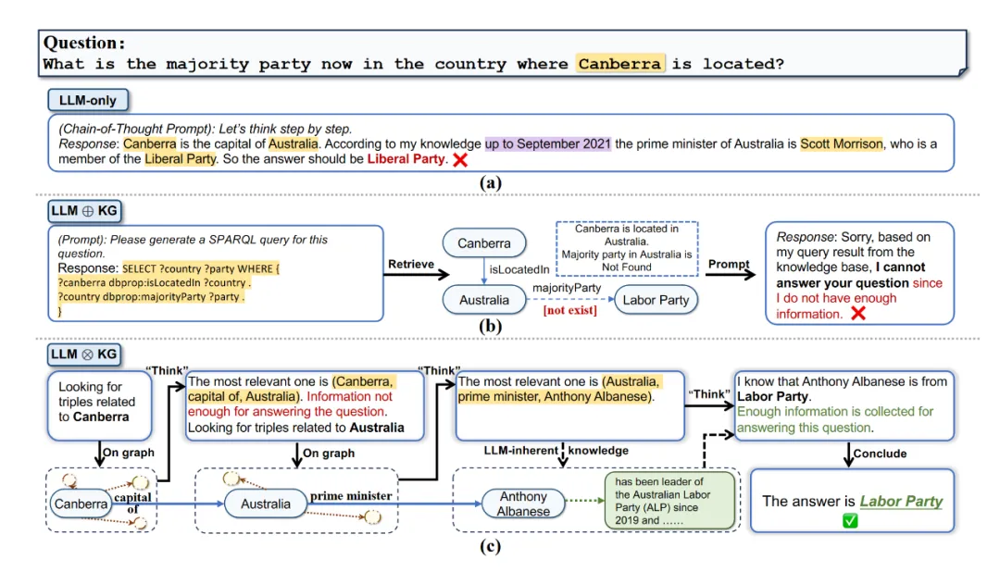
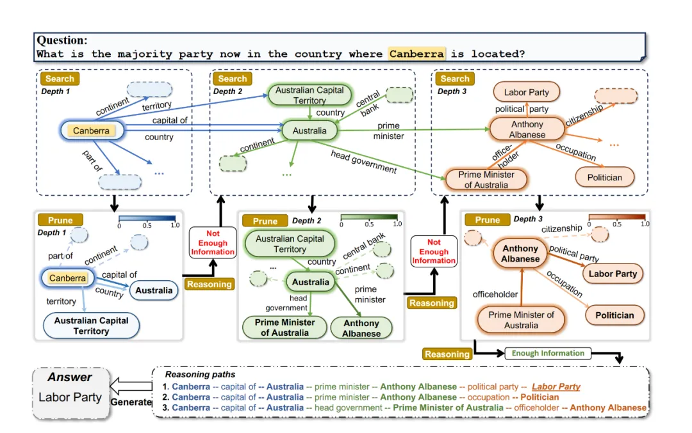
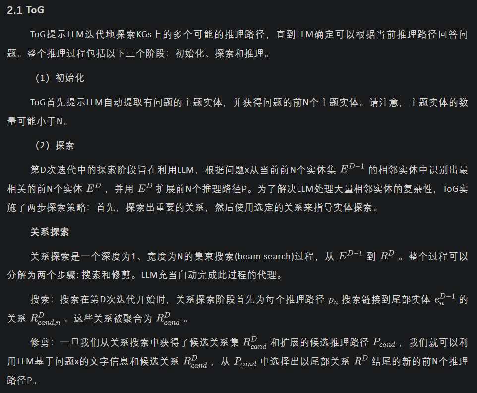
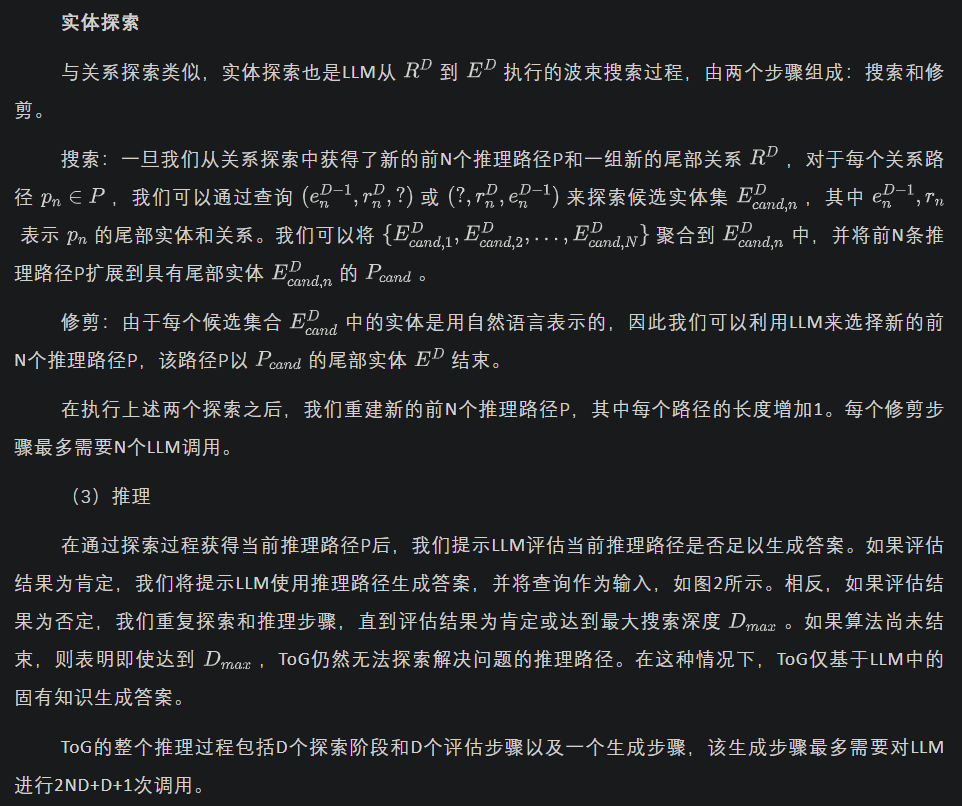
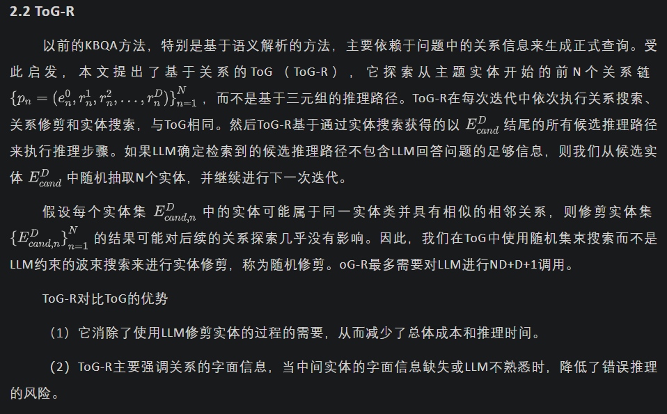
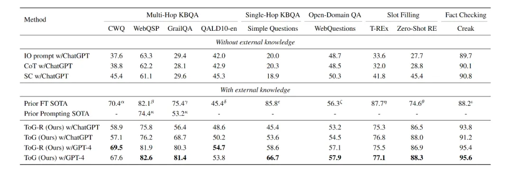

# 更新时间：2024-06-06

# 1. 资源

论文：
- [ICLR 2024] Think-on-Graph: Deep and Responsible Reasoning of Large Language Model on Knowledge Graph
- https://arxiv.org/pdf/2307.07697.pdf

代码：
- Github (112 stars): https://github.com/GasolSun36/ToG

OpenKG（中文开放知识图谱）旨在推动以中文为核心的知识图谱数据的开放、互联及众包，并促进知识图谱算法、工具及平台的开源开放。

# 2. 太长不看-简介

# 3. 研究动机

KGs存在局限性。

KGs提供结构化、明确和可编辑的知识表示，提供了一种互补的策略来减轻LLM的局限性。这些方法遵循一个范式：从KGs中检索信息，相应地增加提示，并将增加的提示输入LLM，这篇论文称为“LLM ⊕ KG”。

尽管LLM旨在整合LLM和KG的力量，但在这种范式中，LLM扮演着翻译器的角色，将输入问题转换为机器可理解的命令，用于KG的搜索和推理，但它并不直接参与图推理过程。不幸的是，这种低耦合度的范式有其自身的局限性，其成功在很大程度上取决于KG的完整性和高质量。

# 4. 方法

## 4.1 “LLM ⊗ KG”范式的提出

本文提出了一种新的高耦合“LLM ⊗ KG”范式，其中KG和LLM协同工作，在图推理的每一步中互补彼此的能力。这篇文章称为“Think-on-Graph”，ToG允许LLM动态探索KG中的许多推理路径，并相应地做出决策。其具有以下优点：

（1）深度推理

（2）可靠推理

（3）灵活高效

图1  针对问题“堪培拉所在的国家现在的多数党是什么？”，三种LLM推理范式的典型工作流程：（a） 仅LLM（例如思想链提示），由于知识库时间落后答案错误（b） LLM⊕KG（例如，通过LLM生成的SPARQL查询进行KBQA），图谱查询失败（c）LLM⊗KG（如，ToG）深度推理成功得到答案。

## 4.2 方法

图2 ToG的推理过程，包含多个关系探索、实体探索过程并且包含搜索和修剪过程，最终生成多个推理路径，从中得到答案

# 5. 实验

## 5.1 实验设计

数据集和评估采用最近常用的方法，如表1所示，共做了五个任务，包含九个数据集，使用了Freebase和Wikidata两个知识图谱用于推理。并且使用了多个大语言模型验证即插即用的便捷性，分别是ChatGPT, GPT4和Llama-2，其中。测试指标采用标准绝对匹配（exact match）准确率。因为基于特定数据集的大模型微调方法仅在特定相关领域有较好表现，所以不将微调方法的SOTA水平作为比较。

表1 ToG在不同数据集上的结果

## 5.2 实验结果

（1）与其他方法对比的结果：如表1所示，使用ToG方法所有的任务上效果都优于CoT方法的SOTA水平，甚至部分超过了微调方法。在大部分场景下，ToG方法优于ToG-R方法，因为ToG按照三元组推理的方法比ToG-R关系推理能够获得更多中间实体的信息。

（2）不同基座模型的表现 ：实验表明ToG的效果随着基座模型能力的提升而提升。并且即使使用最小的模型Llama-2（70B参数），ToG也优于GPT-4的CoT。小型LLM的ToG方案可能是替代昂贵大LLM的候选者，特别是在外部KG可以覆盖的垂直场景中。

（3）消融研究：针对搜索宽度和深度，实验表明宽度和深度设置为3是最合适的。针对知识图谱的选择，针对不同的任务越专业的知识图谱效果越好。针对提示的设计，使用ToG的三元组格式提示效果优于序列格式、句子格式以及ToG-R的格式。针对不同的修剪工具，直接让大模型做修剪效果最佳。

（4）知识的可追溯性和可纠正性：ToG的显式推理路径可以显示给用户，体现了知识的可追溯性。同时，根据ToG的提示，用户可以要求LLM更正KG出现的错误，并用正确的信息回答相同的问题。ToG不仅用KG增强LLM，而且用LLM提高KG的质量，称为知识灌输。

# 6. 总结

这篇文章介绍了LLM⊗KG范式，用于以紧密耦合的方式集成LLM和KG，并提出了图上思考（ToG）算法框架，该框架利用LLM作为参与KG推理的智能代理来实现更好的决策。实验结果表明，ToG在没有额外训练成本的情况下优于现有的部分基于微调的方法和基于提示的方法，并减轻了LLM的幻觉问题。

# 参考

[1] 论文浅尝 | THINK-ON-GRAPH：基于知识图谱的深层次且可靠的大语言模型推理方法，https://mp.weixin.qq.com/s/oU9hGinwIeLmQ21kWVwJzw