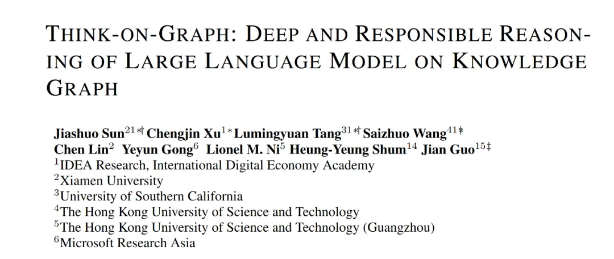

# 更新时间：2024-06-06

# 1. 资源

论文：
- https://arxiv.org/pdf/2307.07697.pdf

# 2. 太长不看-简介

# 3. 研究动机

# 参考

[1] 论文浅尝 | THINK-ON-GRAPH：基于知识图谱的深层次且可靠的大语言模型推理方法，https://mp.weixin.qq.com/s/oU9hGinwIeLmQ21kWVwJzw