# 1. 资源

我暂未跑通，报错。

Github (46 stars): https://github.com/a-s-g93/neo4j-runway

# 2. 简介

Neo4j Runway 是一个 Python 库，简化了将关系数据迁移到图数据库的过程。

它提供了与 OpenAI 交互的工具，用于数据发现和生成数据模型，还提供了生成代码和将数据加载到 Neo4j 实例中的工具。

换句话说，通过上传 CSV 文件，大模型将识别节点之间关系，并自动生成知识图谱。

目前，该库仅支持使用 OpenAI 的大模型解析 CSV，并提供以下功能：

- 提取数据：利用大模型从数据中提取有意义的见解。

- 图数据建模：使用 OpenAI 和 Instructor Python 库开发准确的图数据模型。

- 数据摄取：利用 Runway 内置的 PyIngest ，将数据加载到 Neo4j 中。

- 无需编写 Cypher 语句， 因为大模型会完成所有工作。

本文除了演示用大模型把CSV文件转为知识图谱外。我还使用了 Langchain 的 GraphCypherQAChain，用提示词生成 Cypher，无需编写一行 Cypher（用于查询 Neo4j 图数据库的 SQL 类语言）即可查询图谱。

该库给了一个金融行业的示例，本文我将测试在健康医疗场景中的效果。

从 Kaggle 上一个非常简单的数据集开始（疾病症状和患者档案数据集）。

该数据集只有 10 列（疾病、发烧、咳嗽、疲劳、呼吸困难、年龄、性别、血压、胆固醇水平和结果变量），我希望能够向大模型提供医疗报告，以获得诊断假设。

数据集：https://www.kaggle.com/datasets/uom190346a/disease-symptoms-and-patient-profile-dataset

# 3. 安装

```bash
sudo apt install python3-pydot graphviz
pip install neo4j-runway
```

# 4. 使用
## 4.1 数据加载整理

```python
import numpy as np
import pandas as pd
from neo4j_runway import Discovery, GraphDataModeler, IngestionGenerator, LLM, PyIngest
from IPython.display import display, Markdown, Image
```

加载环境变量：在 Neo4j Aura 中创建实例并进行身份验证。

```python

load_dotenv()
OPENAI_API_KEY = os.getenv('sk-openaiapikeyhere')
NEO4J_URL = os.getenv('neo4j+s://your.databases.neo4j.io')
NEO4J_PASSWORD = os.getenv('yourneo4jpassword')
```

加载医疗数据并整理格式

从 Kaggle 网站下载 CSV 文件，并将其加载到 Jupyter notebook 中。这个数据集非常简单，但对于测试概念非常有用。

```python
disease_df = pd.read_csv('/home/user/Disease_symptom.csv')
disease_df
```

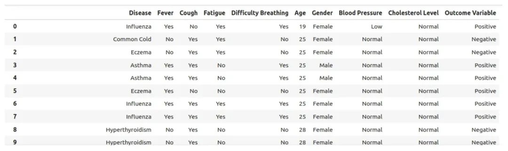

例如，我们可以创建一个列表，列出所有导致呼吸困难的疾病，这不仅对选择图中的节点很有趣，也有助于开发诊断假设：

```python
disease_df[disease_df['Difficulty Breathing']=='Yes']
```

所有变量必须是字符串（库是这样设计的），即使是整数。

然后，我们保存 CSV 文件：

```python
disease_df.columns = disease_df.columns.str.strip()
for i in disease_df.columns:
    disease_df[i] = disease_df[i].astype(str)
disease_df.to_csv('/home/user/disease_prepared.csv', index=False)
```

现在，我们将为大模型描述数据，包括每个字段的可能值：

```python
DATA_DESCRIPTION = {
'Disease': 'The name of the disease or medical condition.',
'Fever': 'Indicates whether the patient has a fever (Yes/No).',
'Cough': 'Indicates whether the patient has a cough (Yes/No).',
'Fatigue': 'Indicates whether the patient experiences fatigue (Yes/No).',
'Difficulty Breathing': 'Indicates whether the patient has difficulty breathing (Yes/No).',
'Age': 'The age of the patient in years.',
'Gender': 'The gender of the patient (Male/Female).',
'Blood Pressure': 'The blood pressure level of the patient (Normal/High).',
'Cholesterol Level': 'The cholesterol level of the patient (Normal/High).',
'Outcome Variable': 'The outcome variable indicating the result of the diagnosis or assessment for the specific disease (Positive/Negative).'
}
```

## 4.2 用大模型识别重要数据元素

下一步是让大模型分析表格数据，识别对生成图数据模型重要的数据元素。

```python
disc = Discovery(llm=llm, user_input=DATA_DESCRIPTION, data=disease_df)
disc.run()
```

这将生成数据分析的 Markdown 输出：

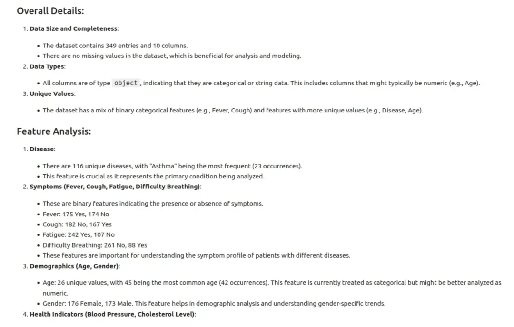

## 4.3 创建初始模型

现在，让我们创建初始模型：

```python
# instantiate graph data modeler 
gdm = GraphDataModeler(llm=llm, discovery=disc)

# generate model 
gdm.create_initial_model()

# visualize the data model
gdm.current_model.visualize()
```

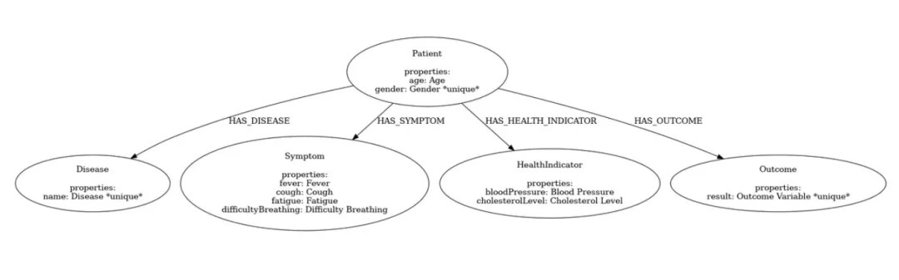

这里，我的重点是疾病，所以我们将重新排列一些关系。

```python
gdm.iterate_model(user_corrections='''
Let's think step by step. Please make the following updates to the data model:
1. Remove the relationships between Patient and Disease, between Patient and Symptom and between Patient and Outcome.
2. Change the Patient node into Demographics.
3. Create a relationship HAS_DEMOGRAPHICS from Disease to Demographics.
4. Create a relationship HAS_SYMPTOM from Disease to Symptom. If the Symptom value is No, remove this relationship.
5. Create a relationship HAS_LAB from Disease to HealthIndicator.
6. Create a relationship HAS_OUTCOME from Disease to Outcome.
''')

from IPython.display import Image, display
gdm.current_model.visualize().render('output', format='png')
# Load and display the image with a specific width
img = Image('output.png', width=1200)  # Adjust the width as needed
display(img
```

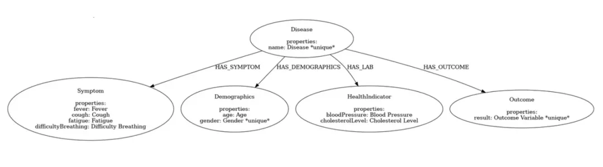

## 4.4 用Neo4j生成图谱

现在我们可以生成 Cypher 代码和 YAML 文件，将数据加载到 Neo4j 中。

如果你只是测试或第二次执行此操作，可能需要将实例重置为空白状态（清除所有内容）。

```python
# instantiate ingestion generator
gen = IngestionGenerator(data_model=gdm.current_model, 
                         username="neo4j", 
                         password='yourneo4jpasswordhere',
                         uri='neo4j+s://123654888.databases.neo4j.io',
                         database="neo4j", 
                         csv_dir="/home/user/", 
                         csv_name="disease_prepared.csv")

# create ingestion YAML 
pyingest_yaml = gen.generate_pyingest_yaml_string()

# save local copy of YAML
gen.generate_pyingest_yaml_file(file_name="disease_prepared")
```

一切准备就绪。让我们将数据加载到实例中：

```python
PyIngest(yaml_string=pyingest_yaml, dataframe=disease_df)
```

进入 Neo4j Aura 实例，打开，输入你的密码，并通过 Cypher 运行此查询：

```cypher

MATCH (n)
WHERE n:Demographics OR n:Disease OR n:Symptom OR n:Outcome OR n:HealthIndicator
OPTIONAL MATCH (n)-[r]->(m)
RETURN n, r, m
```

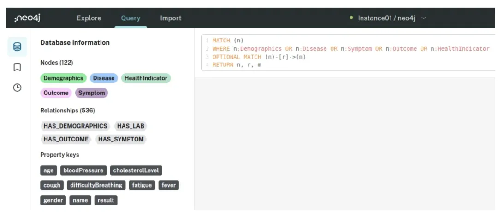

按下 CTRL + ENTER，你将看到以下结果：

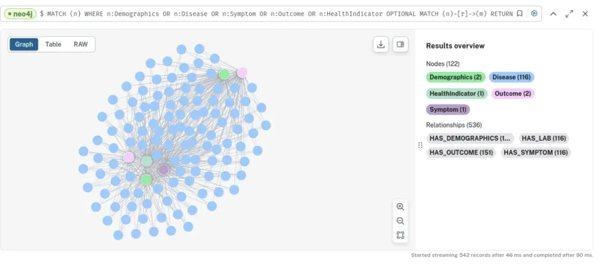

检查节点和关系后，我们发现症状、健康指标和人口统计数据之间有大量的相互连接：

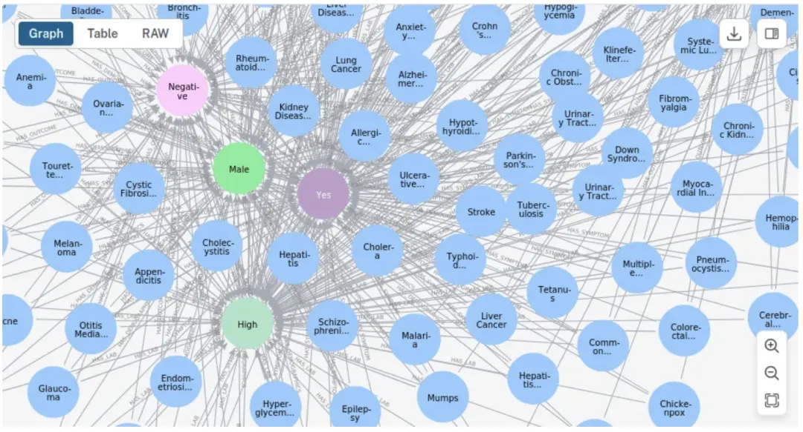

让我们看看糖尿病。由于没有应用过滤器，男性和女性都会出现，以及所有的实验室、人口统计和结果的可能性。

```cypher
MATCH (n:Disease {name: 'Diabetes'})
WHERE n:Demographics OR n:Disease OR n:Symptom OR n:Outcome OR n:HealthIndicator
OPTIONAL MATCH (n)-[r]->(m)
RETURN n, r, m
```

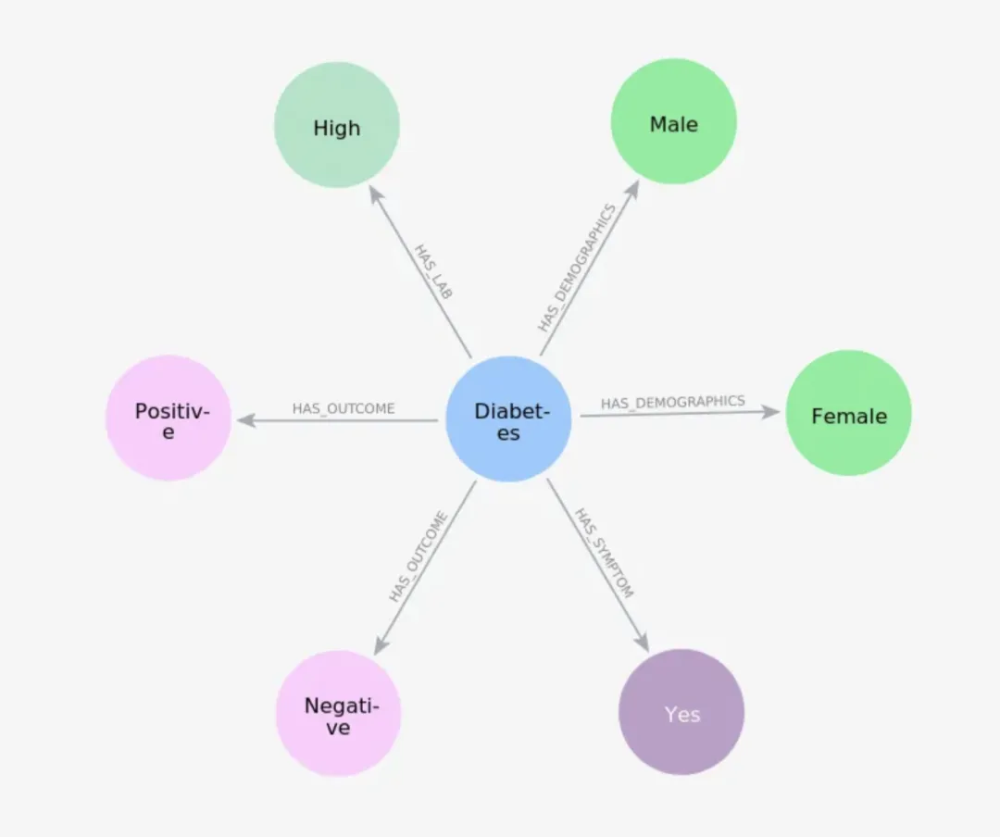

或者查看所有在临床检查中表现出高血压的疾病：

```cypher
// Match the Disease nodes
MATCH (d:Disease)
// Match HAS_LAB relationships from Disease nodes to Lab nodes
MATCH (d)-[r:HAS_LAB]->(l)
MATCH (d)-[r2:HAS_OUTCOME]->(o)
// Ensure the Lab nodes have the bloodPressure property set to 'High'
WHERE l.bloodPressure = 'High' AND o.result='Positive'
RETURN d, properties(d) AS disease_properties, r, properties(r) AS relationship_properties, l, properties(l) AS lab_properties
```

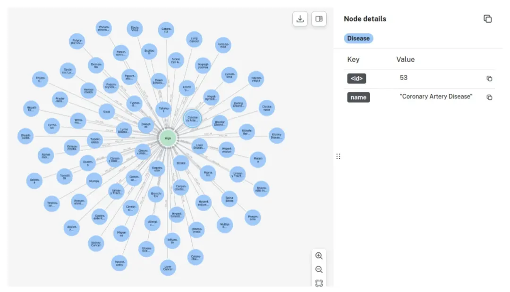

# 5. langchain使用

接下来我们向大模型（在本例中是 Google 的 Gemini-1.5-Flash）提交一份医疗报告，让它通过 Langchain（GraphCypherQAChain）自动生成 Cypher 查询，基于症状、健康指标等，返回患者可能患有的疾病。

让我们开始吧：

```python
import warnings
import json
from langchain_community.graphs import Neo4jGraph

with warnings.catch_warnings():
    warnings.simplefilter('ignore')

NEO4J_USERNAME = "neo4j"
NEO4J_DATABASE = 'neo4j'
NEO4J_URI = 'neo4j+s://1236547.databases.neo4j.io'
NEO4J_PASSWORD = 'yourneo4jdatabasepasswordhere'
```

从实例中获取知识图谱和模式：这里有节点属性和关系属性。

```python
kg = Neo4jGraph(
    url=NEO4J_URI, username=NEO4J_USERNAME, password=NEO4J_PASSWORD, database=NEO4J_DATABASE
)

kg.refresh_schema()
print(textwrap.fill(kg.schema, 60))
schema=kg.schema
```

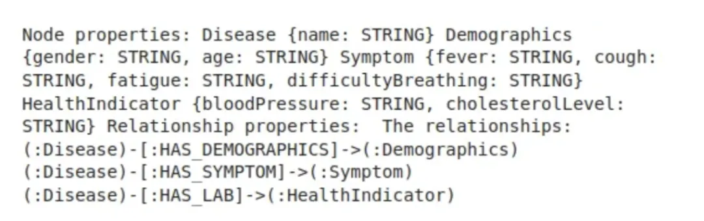

初始化 Vertex AI Gemini-1.5-Flash：

```python

from langchain.prompts.prompt import PromptTemplate
from langchain.chains import GraphCypherQAChain
from langchain.llms import VertexAI

# Initialize Vertex AI
vertexai.init(project="your-project", location="us-west4")

llm = VertexAI(model="gemini-1.5-flash")
```

现在是最难的部分。为 Gemini-1.5-Flash 创建详细的指令，让它自动生成 Cypher 查询图数据库并获取我们需要的结果。

我们需要一个主提示词！一步步思考+少样本提示。

```python
prompt_template = """
Let's think step by step:

Step1: Task:
Generate an effective and concise Cypher statement with less than 256 characteres to query a graph database
Do not comment the code.

Step 2: Get to know the database schema: {schema}

Step 3: Instructions:
- In the cypher query, ONLY USE the provided relationship types and properties that appear in the schema AND in the user question.
- In the cypher query, do not use any other relationship types or properties in the user's question that are not contained in the provided schema.
- Regarding Age, NEVER work with the age itself. For example: 24 years old, use interval: more than 20 years old.
- USE ONLY ONE statement for Age, always use 'greater than', never 'less than' or 'equal'.
- DO NOT USE property keys that are not in the database.

Step 4: Examples: 
Here are a few examples of generated Cypher statements for particular questions:

4.1 Which diseases present high blood pressure?
MATCH (d:Disease)
MATCH (d)-[r:HAS_LAB]->(l)
WHERE l.bloodPressure = 'High'
RETURN d.name

4.2 Which diseases present indicators as high blood pressure?
// Match the Disease nodes
MATCH (d:Disease)
// Match HAS_LAB relationships from Disease nodes to Lab nodes
MATCH (d)-[r:HAS_LAB]->(l)
MATCH (d)-[r2:HAS_OUTCOME]->(o)
// Ensure the Lab nodes have the bloodPressure property set to 'High'
WHERE l.bloodPressure = 'High' AND o.result='Positive'
RETURN d, properties(d) AS disease_properties, r, properties(r) AS relationship_properties, l, properties(l) AS lab_properties

4.3 What is the name of a disease of the elderly where the patient presents high blood pressure, high cholesterol, fever, fatigue
MATCH (d:Disease)
MATCH (d)-[r1:HAS_LAB]->(lab)
MATCH (d)-[r2:HAS_SYMPTOM]->(symptom)
MATCH (symptom)-[r3:HAS_DEMOGRAPHICS]->(demo)
WHERE lab.bloodPressure = 'High' AND lab.cholesterolLevel = 'High' AND symptom.fever = 'Yes' AND symptom.fatigue = 'Yes' AND TOINTEGER(demo.age) >40
RETURN d.name

4.4 What disease gives you fever, fatigue, no cough, no short breathe in people with high cholesterol?
MATCH (d:Disease)-[r:HAS_SYMPTOM]->(s:Symptom)
WHERE s.fever = 'Yes' AND s.fatigue = 'Yes' AND s.difficultyBreathing = 'No' AND s.cough = 'No'
MATCH (d:Disease)-[r1:HAS_LAB]->(lab:HealthIndicator)
MATCH (d)-[r2:HAS_OUTCOME]->(o:Outcome)
WHERE lab.cholesterolLevel='High' AND o.result='Positive'
RETURN d, properties(d) AS disease_properties, r, properties(r) AS relationship_properties


Step 5. These are the values allowed for each entity:
- Fever: Indicates whether the patient has a fever (Yes/No).
- Cough: Indicates whether the patient has a cough (Yes/No).
- Fatigue: Indicates whether the patient experiences fatigue (Yes/No).
- Difficulty Breathing': 'Indicates whether the patient has difficulty breathing (Yes/No).
- Age: The age of the patient in years.
- Gender: The gender of the patient (Male/Female).
- Blood Pressure: The blood pressure level of the patient (Normal/High).
- Cholesterol Level: The cholesterol level of the patient (Normal/High).
- Outcome Variable: The outcome variable indicating the result of the diagnosis or assessment for the specific disease (Positive/Negative).

Step 6. Answer the question {question}."""
```

编者注：上面的提示词中文版如下：
    
```python
prompt_template = """

让我们一步一步思考：


步骤1：任务：

生成一个有效且简洁的 Cypher 语句，字符数不超过 256 个，用于查询图数据库。

不要对代码进行注释。


步骤2：了解数据库模式：{schema}


步骤3：指令：

- 在 Cypher 查询中，仅使用模式和用户问题中提供的关系类型和属性。

- 在 Cypher 查询中，不要使用用户问题中未包含在提供的模式中的其他关系类型或属性。

- 关于年龄，绝不要直接使用具体年龄。例如：24 岁，使用区间：大于 20 岁。

- 对于年龄，只使用一个语句，总是使用“大于”，从不使用“小于”或“等于”。

- 不要使用数据库中不存在的属性键。


步骤4：示例：

以下是针对特定问题生成的 Cypher 语句示例：


4.1 哪些疾病表现出高血压？

MATCH (d:Disease)

MATCH (d)-[r:HAS_LAB]->(l)

WHERE l.bloodPressure = 'High'

RETURN d.name


4.2 哪些疾病表现出高血压等指标？

// 匹配疾病节点

MATCH (d:Disease)

// 匹配从疾病节点到实验室节点的 HAS_LAB 关系

MATCH (d)-[r:HAS_LAB]->(l)

MATCH (d)-[r2:HAS_OUTCOME]->(o)

// 确保实验室节点的 bloodPressure 属性设置为 'High'

WHERE l.bloodPressure = 'High' AND o.result='Positive'

RETURN d, properties(d) AS disease_properties, r, properties(r) AS relationship_properties, l, properties(l) AS lab_properties


4.3 老年人患有高血压、高胆固醇、发烧、疲劳的疾病名称是什么？

MATCH (d:Disease)

MATCH (d)-[r1:HAS_LAB]->(lab)

MATCH (d)-[r2:HAS_SYMPTOM]->(symptom)

MATCH (symptom)-[r3:HAS_DEMOGRAPHICS]->(demo)

WHERE lab.bloodPressure = 'High' AND lab.cholesterolLevel = 'High' AND symptom.fever = 'Yes' AND symptom.fatigue = 'Yes' AND TOINTEGER(demo.age) >40

RETURN d.name


4.4 哪种疾病在高胆固醇人群中表现为发烧、疲劳、无咳嗽、无呼吸困难？

MATCH (d:Disease)-[r:HAS_SYMPTOM]->(s:Symptom)

WHERE s.fever = 'Yes' AND s.fatigue = 'Yes' AND s.difficultyBreathing = 'No' AND s.cough = 'No'

MATCH (d:Disease)-[r1:HAS_LAB]->(lab:HealthIndicator)

MATCH (d)-[r2:HAS_OUTCOME]->(o:Outcome)

WHERE lab.cholesterolLevel='High' AND o.result='Positive'

RETURN d, properties(d) AS disease_properties, r, properties(r) AS relationship_properties


步骤5：每个实体允许的值如下：

- 发烧：表示患者是否发烧（是/否）。

- 咳嗽：表示患者是否咳嗽（是/否）。

- 疲劳：表示患者是否感到疲劳（是/否）。

- 呼吸困难：表示患者是否呼吸困难（是/否）。

- 年龄：患者的年龄（以年为单位）。

- 性别：患者的性别（男/女）。

- 血压：患者的血压水平（正常/高）。

- 胆固醇水平：患者的胆固醇水平（正常/高）。

- 结果变量：表示特定疾病诊断或评估结果的变量（阳性/阴性）。


步骤6：回答问题 {question}。

"""
```

我们设置 GraphCypherQAChain

```python
cypher_prompt = PromptTemplate(
    input_variables=["schema","question"], 
    template=prompt_template
)

cypherChain = GraphCypherQAChain.from_llm(
    VertexAI(temperature=0.1),
    graph=kg,
    verbose=True,
    cypher_prompt=cypher_prompt,
    top_k=10# this can be adjusted also
)
```

并提交医疗报告：

```python
cypherChain.run("""
Patient Information:
Jane Doe, a 58-year-old female, was admitted on June 15, 2024.

Chief Complaint and History of Present Illness:
Jane reported a high fever up to 104°F, body pain, and a rash, 
starting five days prior to admission.

Past Medical History:
Jane has no significant past medical history and no known allergies.

Physical Examination:
Jane's temperature was 102.8°F, heart rate 110 bpm, blood pressure 100/70 mmHg, and respiratory rate 20 breaths 
per minute. No petechiae or purpura were noted.

What disease may she have?""")
```

输出结果：这里 Gemini-1.5-Flash 生成 Cypher 查询图数据库，通过 JSON 返回结果给 LLM，LLM 解释并返回可读的响应：

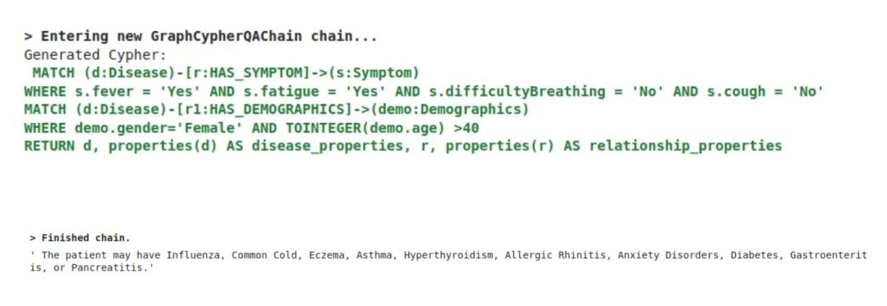

这个结果不考虑 Gemini-1.5-Flash 的知识库，只考虑它查询的知识图谱。想象一下，如果我们有一个包含 300 个特征的漂亮数据集！

注意，我们可以在 GraphCypherQAChain 中将 top\k 设置为 1 或其他值：

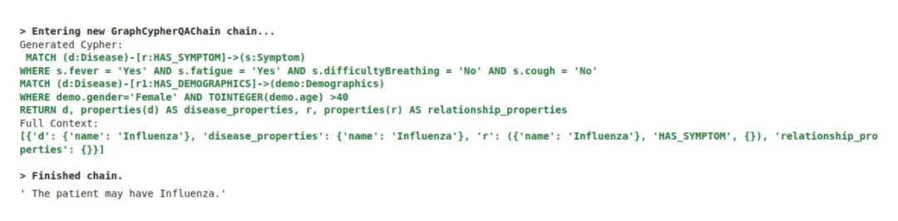

如果我们运行最后一个查询，我们将得到包含这些症状的 77 种疾病列表，但 top\k 设置为 1：

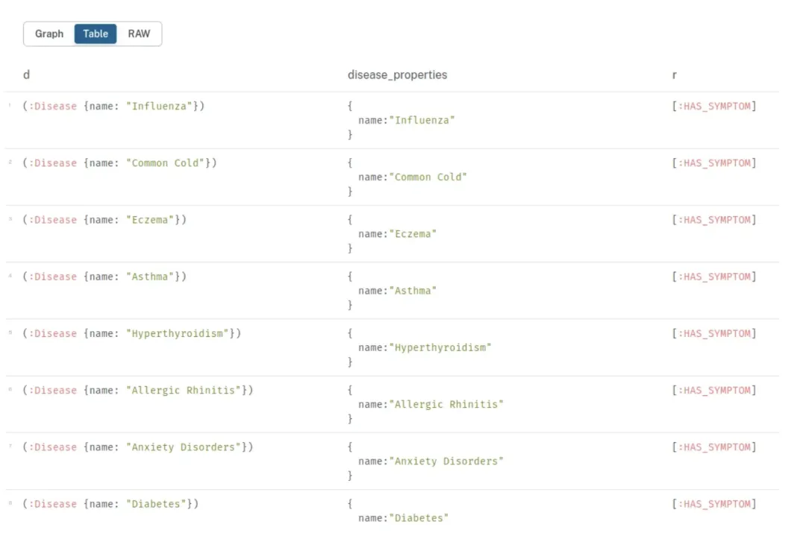

需要注意的是，当前 neo4j-runway 项目还不成熟，具有以下限制：

• 仅支持单个 CSV 输入用于数据模型生成

• 节点只能有一个标签

• 仅支持唯一性和节点/关系键约束

• 关系不能有唯一性约束

• CSV 列引用相同节点属性在模型生成中不受支持

• 目前仅支持 OpenAI 模型

• Runway 包含的修改版 PyIngest 函数仅支持加载本地 Pandas DataFrame 或 CSV。

# 参考

[1] 用AI大模型将CSV文件转为图谱，发现数据间关系，以健康医疗场景为例，https://mp.weixin.qq.com/s/rcq8q3NYT-PlTPTOkna65A?poc_token=HPA7jWajM_Bfbg7zpukmFmC9eg26xmq8bNySypwh