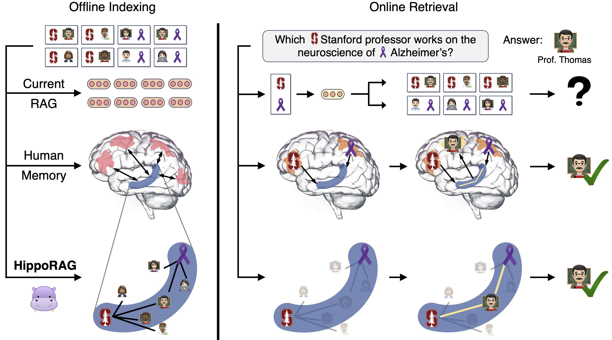

# 1. 资源

论文题目：HippoRAG: Neurobiologically Inspired Long-Term Memory for Large Language Models

论文链接：https://arxiv.org/pdf/2405.14831

# 2. 原理

在人工智能领域，特别是自然语言处理（NLP）中，大型语言模型（LLMs）的长期记忆能力一直是研究的热点和难点。人类大脑能够在不断变化的环境中存储和更新大量知识，而现有的LLMs在预训练后整合新经验时仍面临挑战。为了解决这一问题，本文介绍了HippoRAG，这是一种受人类长期记忆中的海马体索引理论启发的新颖检索框架，旨在实现更深层次、更高效的知识整合。

## 2.1 海马记忆索引理论
HippoRAG 的设计灵感来自海马记忆索引理论，该理论指出海马体在大脑中负责快速索引和存储新的经验和知识，而新皮层则负责长期存储和稳定化这些信息。该理论认为，人类的长期记忆由模式分离和模式完成两个过程协同工作：模式分离确保不同感知经验的表示是独特的，而模式完成则从部分刺激中检索完整的记忆。

HippoRAG 的核心创新基于海马体记忆索引理论，其具体方法和步骤如下：

- 使用 LLM 进行 OpenIE：从每个篇章中提取名词短语节点和关系边。
- 构建知识图谱（KG）：将提取的三元组整合成知识图谱，作为人工海马索引。
- 使用检索编码器：为 KG 中相似但不相同的名词短语添加额外的边，帮助下游模式完成。
- 查询命名实体提取：从查询中提取命名实体，并由检索编码器编码。
- PPR 算法：在 KG 上运行个性化 PageRank（PPR）算法，通过查询节点的分布概率，实现上下文相关的检索。

## 2.2 离线索引
HippoRAG的离线索引阶段类似于记忆编码过程，使用一个指令调整的大型语言模型（LLM）作为人工新皮层，通过开放信息提取（OpenIE）从检索语料库中的篇章中提取知识图谱（KG）三元组。这个过程提取出篇章中的显著信号作为离散名词短语，而不是密集的向量表示，从而实现更细粒度的模式分离。

## 2.3 在线检索
在线检索阶段，HippoRAG模仿人脑的记忆检索过程。LLM基于新皮层从查询中提取一组显著的命名实体，这些命名实体与KG中的节点基于检索编码器确定的相似性相连。选定的查询节点成为部分线索，HippoRAG的合成海马体执行模式完成，通过个性化PageRank（PPR）算法在KG上运行，使用查询概念作为种子，整合跨篇章的信息进行检索。

## 2.4 结语
HippoRAG作为一种新型的LLM长期记忆框架，通过模仿人类大脑的记忆机制，展示了在多跳问答任务中的潜力。

# 参考

[1] 大型语言模型的长期记忆能力--HippoRAG, https://blog.csdn.net/weixin_43145427/article/details/140112854