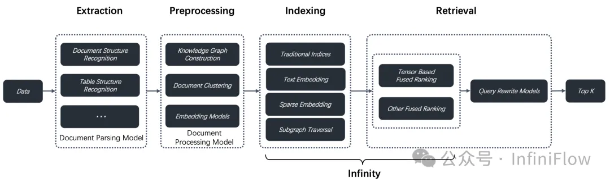
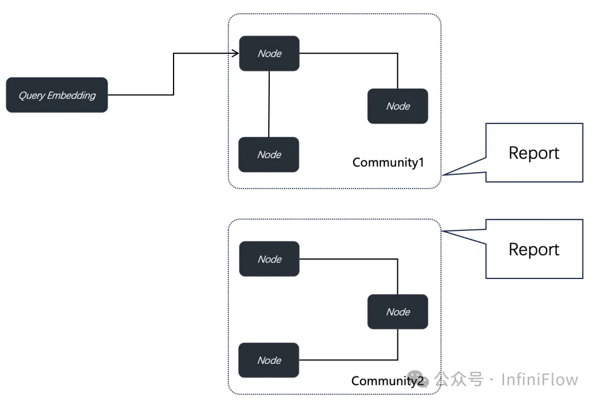
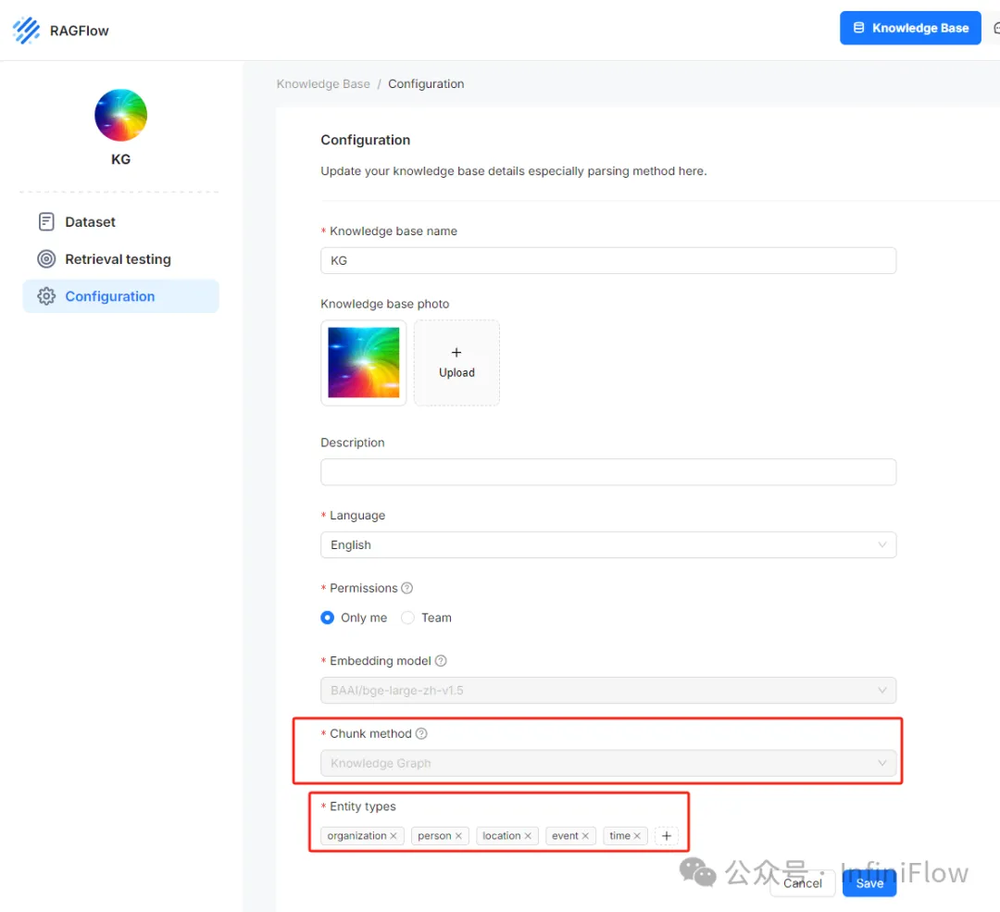
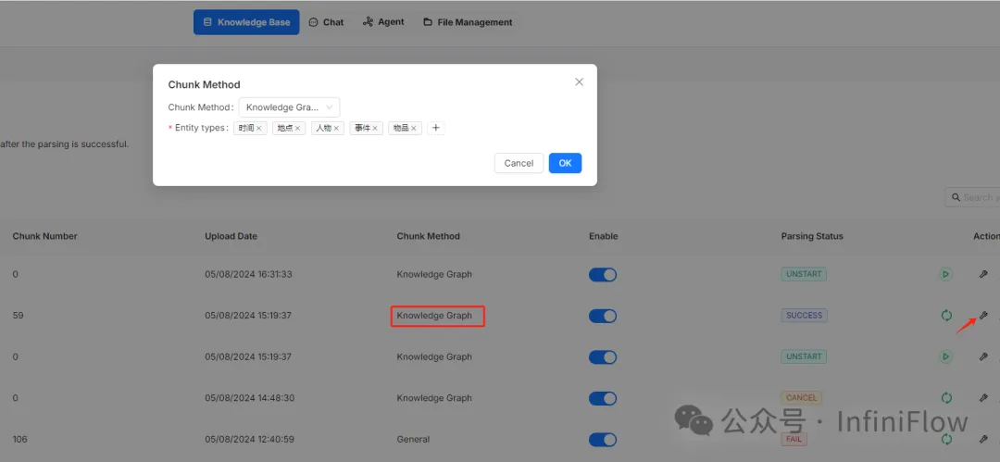
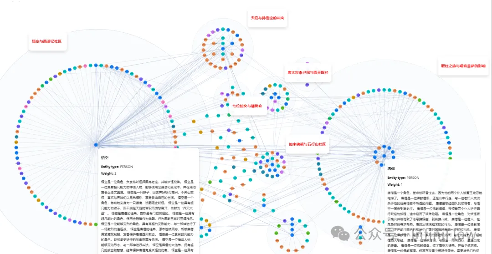
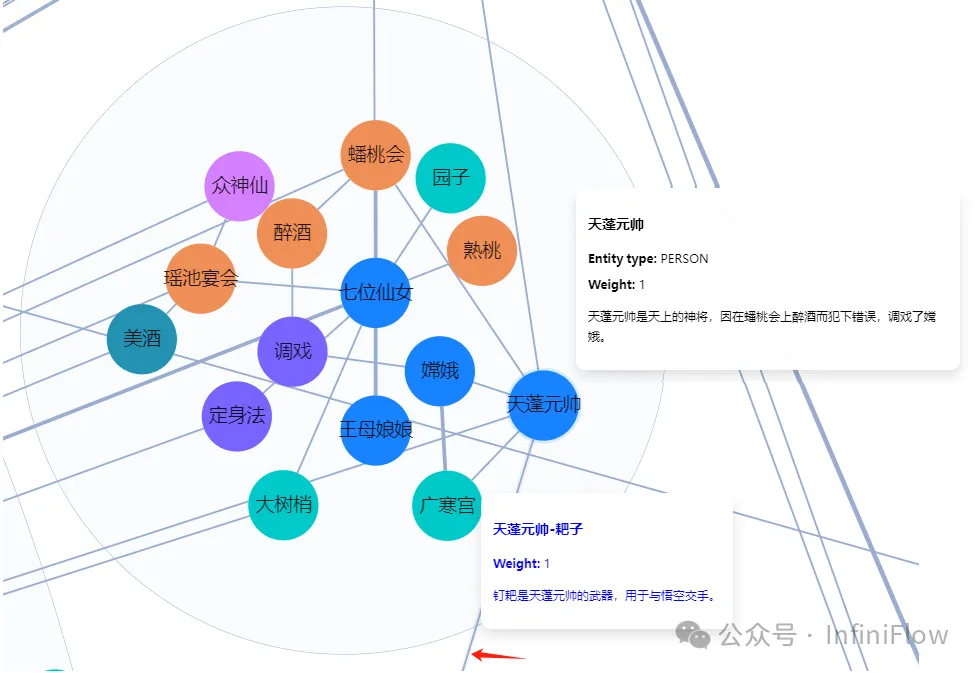
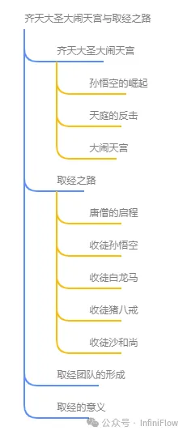
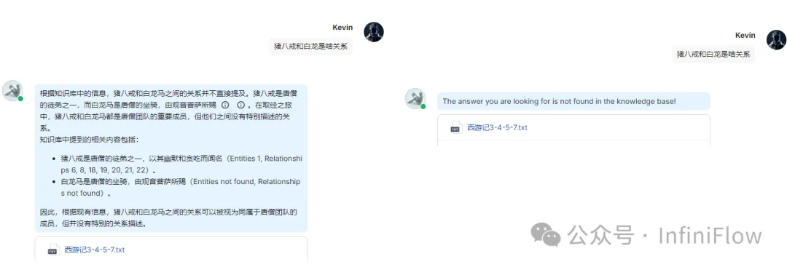

# 1. 简介

RAGFlow 0.9 版本发布，正式引入了对 GraphRAG 的支持。

- https://github.com/infiniflow/ragflow

# 2. 原理介绍

这是一个以搜索为中心的端到端的优化系统，分为 4 个阶段，除了后边 2 个阶段——索引与检索，这个大部分是需要一个专用数据库来提供服务，前边 2 个阶段的分工如下：

1. 数据抽取：利用各类文档（大）模型保证被索引数据的高质量输入，避免 Garbage In，Garbage Out。

2. 在抽取的数据被送到数据库之前，还可以选择性地加入一些预处理步骤，包括文档预聚类，知识图谱构建等，这些预处理，主要是解决针对多跳问答，跨文档提问等情况做出处理。因此，GraphRAG 确实是面向下一代 RAG 的方案，但站在 RAG 2.0 的角度，它则是整个 Pipeline 当中的一个单元。

知识图谱对于改进 RAG 的效果至关重要，因为简单的 RAG ，只能提供根据提问检索答案的功能，可是这只能找到跟提问相似的结果，而未必是答案。例如一些总结性的问题，这种场景本质上是一种聚焦于查询的总结 QFS（Query Focused Summarization），采用知识图谱可以很方便的解决这类问题，通过知识图谱按照文字相关性把内容聚合，在对话的时候按照这些聚合后的文字生成总结，就可以很好的回答问题。目前的很多专用 AI 搜索，就是这样工作的。RAGFlow 在过去的版本所提供的 RAPTOR，就是对文本做聚类，其实也是类似的原理，只不过相比 RAPTOR， 以知识图谱为中心的工作，可以形成以命名体实体节点为中心更有层次的结果，因此对于这种 QFS 查询，采用知识图谱的准确性和体系性更好。在其他一些场景中，采用知识图谱依然可以改善 RAG 的返回结果，因为它为返回结果添加了更多的知识图谱上下文，从而可以让 LLM 产生更有解释性的回答。采用知识图谱在 RAG 的有效性已经得到了很多研究工作的证实，因此从 GraphRAG 一推出，就迅速得到了社区的广泛关注。

在过去，采用知识图谱进行问答的工作有很多，在 RAG 出现之前的 KGQA 就已经存在很多年。这些工作最大的瓶颈之一，就是如何让知识图谱的构建自动化和标准化，这大大阻碍了基于知识图谱的工作在企业内大规模得到运用。随着 LLM 和 RAG 出现和广泛使用，用 LLM 来自动构建知识图谱成为一种可行的方案，GraphRAG 就是这些工作中最著名的一个。近期另一个这方面比较知名的工作是所谓模仿人类大脑海马体的 HippoRAG【参考文献3】，GraphRAG 和 HippoRAG 有一定的相似性：

在离线处理阶段，GraphRAG 和 HippoRAG 都将用户的文档首先送给 LLM 然后进行命名实体的自动抽取。但 GraphRAG 只抽取实体，而实体之间的关系并不做判断，仅仅用是否“相关”作为两者的联系；而 HippoRAG 则按照标准知识图谱的定义抽取整个三元组——就是说在一个图的定义中，实体 1 和实体 2 之间的关系是何种类型。在整个 GraphRAG 过程中，都没有利用到三元组的关系类型这个信息，这可能是因为 LLM 针对该关系的抽取无法做到非常准确导致的。在完成实体抽取后， GraphRAG 还用到了2个算法来补全这种关系：一个是社区检测算法，一个是 Graph Embedding。社区检测是存在已久的一类应用算法，本质上是聚类，它递归地利用图谱当中的节点命名体信息补全图的社区结构，从而为更多的节点之间建立是否“相关”的关系。在建立了社区结构之后，再利用 LLM 根据社区内的节点描述信息产生相应的摘要内容。Graph Embedding 在 GraphRAG 中是一个可选项，采用的是 Node2Vec，这也是存在已久的算法，它在现有的图上利用随机游走（就是类似 PageRank）结合节点命名体信息产生 Embedding ，因此这些 Embedding 可以看作是包含了经过了随机游走之后经过的子图节点所包含的语义信息。在查询时，可以利用这些 Graph Embedding  来返回更多的子图节点。

在线处理阶段，首先将用户的查询转成向量，然后找到知识图谱中最接近的节点，再根据该节点所在的社区，以及社区摘要信息，共同返回给 LLM ，从而让 LLM 来根据这些上下文做最后的答案生成，如下图所示。在实际查询中，除了查询这些知识图谱数据，还针对原文进行查询，然后两路结果归并后共同作为上下文返回给 LLM 。所有这些查询，跟传统上采用图数据库来代表知识图谱截然不同，这里几乎没有必须依赖图数据库的地方。

HippoRAG 的离线阶段，在利用 LLM 抽取知识图谱三元组信息之后，再利用现成的知识图谱如 OpenIE，来补全抽取的知识图谱。在查询阶段，要同样利用类似的随机游走算法（PageRank）在知识图谱上做子图遍历，从而根据返回的子图确定最终交给 LLM 的上下文。

可以看到， GraphRAG 和 HippoRAG ，都利用到了 PageRank 做子图遍历，只是前者放在离线阶段（尽管目前还没有实际使用这些结果），后者是在线查询阶段。至于为何采用 PageRank，是因为一些认知科学家发现了人类回忆过程和 PageRank 算法的输出之间有相关性。

因此， GraphRAG 实际上对于知识图谱的抽象和构建做了相当的简化：三元组不要了，图抽象表达也不要了，正是这些简化，使得工程上推出标准产品的可行性大为增加。所以 RAGFlow 也借鉴了 GraphRAG 的实现，在文档预处理阶段，引入知识图谱构建作为可选项，服务于一些高级问答场景。在 GraphRAG 的基础之上， RAGFlow 做了这些改进：

1. 引入了去重步骤，原版的 GraphRAG 抽取出的命名实体，直接用于构建知识图谱，对于一些同义词实体，例如 “2024”和“2024年”，“IT”和“信息科技”，如果不做去重，会影响知识图谱的结构。命名实体去重在学术上叫做 Entity Resolution，实际上是一类复杂的算法，并且很难做到通用化。RAGFlow 仍然是借鉴了 LLM 自身的能力来去重，因为从广义上来看，LLM 其实就是一个超级大的知识图谱。

2. 降低了 Token 消耗。GraphRAG 从它的工作原理上，就需要消耗大量的 Token，因为需要把用户自己上传的所有文档，都送到 LLM，甚至对于 GraphRAG 原版实现来说，这些文档被送了不止一次给 LLM ，对于使用一些 SaaS 服务的 RAG 系统来说，这里的 Token 消耗非常大。RAGFlow 主要通过一些流程上的优化，确保所有文档只会被提交给 LLM 一次，尽可能避免无效的 Token 消耗。当然，真正从根本上解决这个问题，可以利用一些较小的单独部署的模型来做知识图谱构建，例如一个成功的案例是 Triplex ，它是基于 Phi-3 做微调得到，参数量为 3B，相比采用 LLM 可以有数十倍的成本节约。在未来，RAGFlow 也会提供类似的解决方案，从而帮助降低 GraphRAG 的构建成本。

下边是 RAGFlow 中实现 GraphRAG 的产品效果展示：

在文档上传后的解析阶段，用户可以在知识库级的配置选择采用“Knowledge Graph”作为 Chunking 方案，并且用户需要自行定义需要 LLM 抽取的命名实体类型，如图中的 “organization”，“person”，“location” 等等：

针对知识库的特定文档，用户可以选择更改 Chunking 为其他方式，也可以更改该文档所要抽取的命名实体。如果一个知识库定义了采用 Knowledge Graph 作为 Chunking 方式，那么该知识库的所有文档，都会采用 GraphRAG 的方式召回：先召回知识图谱的实体和社区总结，再召回原文 —— 哪怕整个知识库大部分文档都采用的是其他 Chunking 方式。

在选择完 Chunking 后，LLM 就会自动抽取并构建知识图谱，这些知识图谱在 RAGFlow 中可以提供可视化展现，包括节点名称，节点描述，以及“社区”：

还可以以思维导图形式查看知识图谱：

知识图谱的可视化，对于用户调试对话有着重要意义。当前， RAGFlow 可以利用所有接入的 LLM 来生成知识图谱，然而这种较为复杂的信息抽取，在不同的 LLM 上能力表现差异较大，如果出现知识图谱抽取错误的情况，那么会导致最终对话结果的错误。在这种情况下，可以利用这些可视化工具查看图谱的结果分析对话生成。当前 RAGFlow 对知识图谱的生成，是文档级的，就是说目前没有针对整个知识库的所有文档统一构建知识图谱，因此目前的 GraphRAG 实现还无法对跨文档的知识图谱做关联。该特性需要更大的内存和计算资源，在未来 RAGFlow 会根据用户的使用反馈再决定是否添加这样的特性。

下图是一个以西游记第3-7回内容为基础的对话生成对比，左边是采用了 GraphRAG 的结果，可以看到在这些涉及到多跳或者嵌套逻辑的结果，GraphRAG 可以提供更加深入和全面的回答。

GraphRAG 是在 RAG 当中引入知识图谱自动构建的一个工程化有效实践，它的成功得益于去除了传统知识图谱中大量复杂的部分，然而，这并不代表知识图谱在 RAG 应用的终点。在实际的企业应用中，适合拿来做知识图谱构建的数据，只是一小部分，有大量的数据或者并不适合构建知识图谱，或者出于成本考虑，只在部分数据上构建知识图谱。因此，知识图谱的利用方式，还需要补充更多，例如如何利用知识图谱改写查询等，这些都会在未来的 RAGFlow 版本中逐步推出。

# 参考

[1] 在 RAGFlow 中实践 GraphRAG，https://mp.weixin.qq.com/s/5LdAF1I4WZehIpOyR1e85g
[2] GraphRAG, https://github.com/microsoft/graphrag
[3] From Local to Global: A Graph RAG Approach to Query-Focused Summarization, https://arxiv.org/abs/2404.16130
[4] HippoRAG: Neurobiologically Inspired Long-Term Memory for Large Language Models , https://arxiv.org/abs/2405.14831