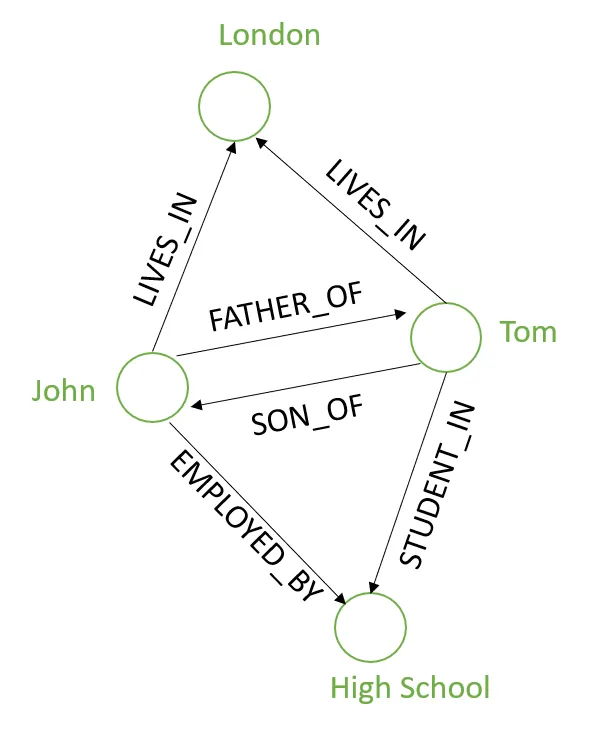
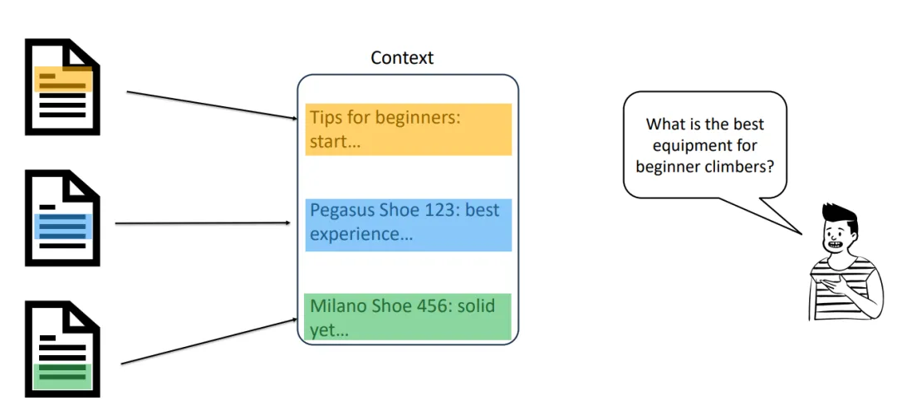
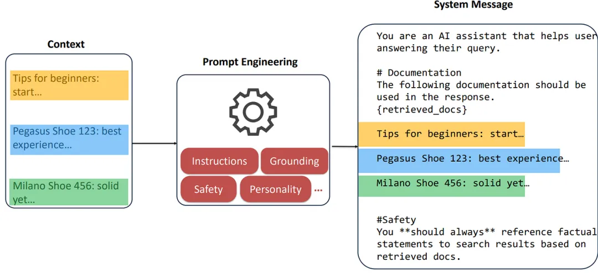
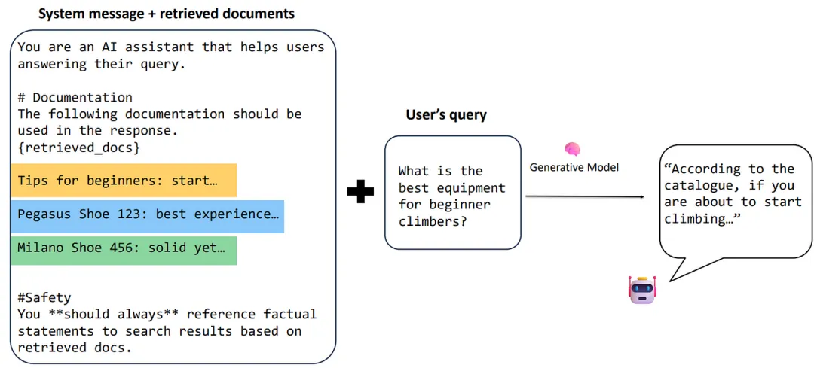
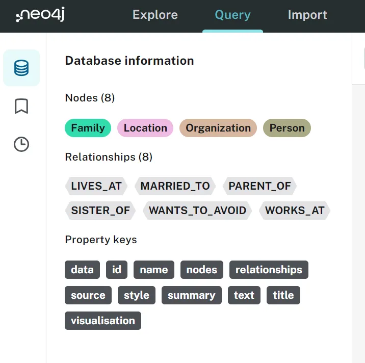

# 1. 简介

LangChain 开发了一个强大的库，名为LLMGraphTransformer，其目的是将非结构化文本数据转换为基于图形的表示形式。

# 2. 基础

## 2.1 图形和图形数据库

图是一种用于对对象之间的成对关系进行建模的数学结构。它由两个主要元素组成：节点和关系。

- 节点：节点可以看作是传统数据库中的记录。每个节点代表一个对象或实体，例如一个人或一个地方。节点按标签分类，这有助于根据其角色对其进行分类和查询，例如“客户”或“产品”。

- 关系：这些是节点之间的连接，定义不同实体之间的交互或关系。例如，一个人可以通过“EMPLOYED_BY”关系与公司建立联系；或者通过“LIVES_IN”关系与某个地方建立联系。



为了以类似的结构存储数据，2000 年代初引入了一个新的数据库系列：图形数据库。图形数据库是一种旨在将数据之间的关系视为与数据本身同等重要的数据库。它们经过优化，可以高效处理互连数据和复杂查询。

其中最著名和应用最广泛的是Neo4j，它采用灵活的图形结构，除了节点和关系之外，还包括属性、标签和路径特征来表示和存储数据。

- 属性：节点和关系都可以包含属性，即以键值对形式存储的属性。这些属性提供有关实体的特定详细信息，例如人的姓名或年龄，或关系的长度。

- 标签：标签是分配给节点的标记，用于将节点分为不同类型。单个节点可以有多个标签，有助于更动态、更灵活地查询图。

- 路径：路径描述节点序列和连接节点的关系。它们表示图中的路线，显示不同节点如何互连。路径在查询中很有用，可以揭示节点之间的关系，例如在社交网络中发现从一个人到另一个人的所有可能路线。

这使得 Neo4j 特别适合社交网络、推荐系统和欺诈检测等关系和动态查询至关重要的应用程序。

## 2.2 RAG 和 GraphRAG
检索增强生成 (RAG) 是 LLM 支持的应用场景中的一项强大技术，可解决以下问题：“如果我想向 LLM 询问一些不属于 LLM 训练集的问题，该怎么办？”。RAG 背后的想法是将 LLM 与我们想要浏览的知识库分离，该知识库被正确矢量化或嵌入并存储到 VectorDB 中。

RAG 由三个阶段组成：

- 检索→给定用户的查询及其对应的向量，检索最相似的文档（那些对应于更接近用户查询的向量的向量的文档）并将其用作 LLM 的基础上下文。

    

- 增强→通过附加说明、规则、安全护栏和类似的实践来丰富检索到的上下文，这些实践是提示工程技术的典型特征。
    
    

- 生成→基于增强上下文，LLM 生成对用户查询的响应。

  

如上所述，典型的 RAG 应用程序假设底层 VectorDB 存储了所有嵌入式知识库。然而，当涉及到 GraphRAG 时，这种方法略有不同。

事实上，GraphRAG 在“检索”阶段运行，利用图形结构的灵活性来存储知识库，目的是检索更多相关文档，然后将其作为上下文进行扩充（您可以在此处阅读有关 Microsoft 关于GraphRAG的第一次实验）。

有两种主要方法可以利用图形数据库来检索知识：

- 您可以完全依赖图形搜索（即关键字搜索）来检索相关文档，然后使用它们作为（增强）上下文，使用生成模型生成最终响应。

- 您可以将图形搜索与更高级的 LLM 相关搜索相结合，例如向量搜索（通过嵌入）。

注意：Neo4j 还支持向量搜索，这使其非常适合混合 GraphRAG 场景，我们将在下一节中看到。

无论您采用哪种方法，关键步骤都是将您的知识库组织到您的图表中。幸运的是，LangChain 引入了一个新库，它的目标正是：使将非结构化知识映射到您的图形数据库中变得更加容易，在本文中，我们将看到一种利用 Neo4j 的实现。

# 3. 使用

```python
#初始化 LLMTransformer 模型
llm_transformer = LLMGraphTransformer(llm=llm) 

#转换文档
from langchain_core.documents import Document 

text = """
住在女贞路 4 号的德思礼夫妇自豪地说
，他们非常正常，非常感谢。他们是最
不可能卷入任何奇怪或神秘事情的人，
因为他们根本不相信这种胡说八道。
德思礼先生是一家名为 Grunnings 的公司的主管，该公司生产
钻头。他身材魁梧，几乎没有脖子，但他确实
留着大胡子。德思礼太太身材瘦削，金发碧眼，
脖子几乎是普通人的两倍，这非常有用，因为她
花了很多时间伸长脖子越过花园篱笆，监视邻居
。德思礼一家有个小儿子叫达德利，在他们
看来，没有比他更好的男孩了。
德思礼一家拥有他们想要的一切，但他们也有一个秘密，
他们最害怕的就是有人会发现它。
如果有人发现了波特一家，他们觉得他们无法忍受。
波特夫人是德思礼夫人的妹妹，但她们已经好几年没见面了；
事实上，德思礼夫人假装她没有妹妹，因为她的
妹妹和她那一无是处的丈夫与德思礼的性格完全不符
。德思礼一家一想到
如果波特一家来到街上邻居们会说什么就不寒而栗。德思礼一家
也知道波特一家有个小儿子，但他们从未见过他。这个男孩
是让他们远离波特一家的另一个好理由；他们不想让
达德利和这样的孩子混在一起。
"""
文件 = [Document(page_content=text)] 
graph_documents = llm_transformer.convert_to_graph_documents(documents)
打印( f"节点：{graph_documents[ 0 ].nodes} " )
打印( f"关系：{graph_documents[ 0 ].relationships} " )
```

如您所见，我们的llm_transforme rwa 能够从数据中捕获相关实体和关系，而无需我们指定任何内容。现在我们需要将这些节点和关系存储在我们的 AuraDB 中。

```python
graph.add_graph_documents（
  graph_documents，
  baseEntityLabel = True，
  include_source = True
）
```
现在可以在我们的在线 AuraDB 实例中检查文档是否已正确上传：



我们还可以使用以下 Python 函数绘制数据库的图形表示：

```python
# 直接显示给定 Cypher 查询产生的图表
default_cypher = "MATCH (s)-[r:!MENTIONS]->(t) RETURN s,r,t LIMIT 50" 

def  showGraph ( cypher: str = default_cypher ): 
    # 创建一个 neo4j 会话来运行查询
    driver = GraphDatabase.driver( 
        uri = os.environ[ "NEO4J_URI" ], 
        auth = (os.environ[ "NEO4J_USERNAME" ], 
                os.environ[ "NEO4J_PASSWORD" ])) 
    session = driver.session() 
    widget = GraphWidget(graph = session.run(cypher).graph()) 
    widget.node_label_mapping = 'id' 
    #display(widget) 
    return widget 

showGraph()
```

现在我们有了 GraphDB，我们可以添加向量搜索功能来增强检索阶段。为此，我们需要一个嵌入模型，我将使用 Azure OpenAI text-embedding-ada-002，如下所示：

```python
从langchain_openai导入AzureOpenAIEmbeddings

嵌入 = AzureOpenAIEmbeddings（
    模型 = “text-embedding-ada-002”，
    api_key=api_key，
    azure_endpoint=azure_endpoint，
    openai_api_version=api_version，
）
```

```python
vector_index = Neo4jVector.from_existing_graph（
    嵌入，
    search_type = “混合”，
    node_label = “文档”，
    text_node_properties = [ “文本” ]，
    embedding_node_property = “嵌入”
）
```

已经可以使用向量相似度方法查询vector_index ：

```python
查询 = “杜德利是谁？”

结果 = vector_index.similarity_search(query, k= 1 )
打印(results[ 0 ].page_content)
```

```text
住在女贞路四号的德思礼夫妇自豪地说
，他们非常正常，非常感谢。他们是最
不可能卷入任何奇怪或神秘事件的人，
因为他们根本无法忍受这种胡说八道。
德思礼先生是一家名为格鲁宁斯的钻头制造公司的主管
。他身材魁梧，几乎没有脖子，尽管他留着
大胡子。德思礼太太身材瘦削，金发碧眼，
脖子几乎是普通人的两倍，这非常有用，因为她
花了很多时间在花园篱笆上探望邻居
。德思礼一家有个小儿子叫达德利，在他们
看来，没有比他更好的男孩了。
德思礼一家拥有他们想要的一切，但他们也有一个秘密，
他们最害怕的是有人会发现它。
如果有人发现了波特一家的事，他们觉得自己无法忍受。波特夫人
是德思礼夫人的妹妹，但她们已经好几年没见过面了；
事实上，德思礼夫人假装自己没有妹妹，因为她的
妹妹和她那一无是处的丈夫与德思礼家族格格不入。德思礼一家一想到如果波特一家来到街上，
邻居们会说什么，就不寒而栗。德思礼一家知道波特一家还有一个小儿子，但他们从未见过他。这个男孩是让他们远离波特一家的另一个好理由；他们不想让达德利和这样的孩子混在一起。
```

当然，由于我们没有将文本拆分成块，因此查询将返回整个文档。我们将在下一部分中看到这在处理较大的文档时如何变得相关。

最后一步是从我们的模型中获取实际生成的答案。为此，我们可以利用两种不同的方法：

利用预构建的组件CypherChain，它利用Neo4j 的 Cypher 查询语言与图形数据库进行交互。由于它与 Neo4j 原生集成，因此它与 AuraDB 图形功能进行交互，从而通过理解查询结果实现上下文感知响应。当精度、上下文感知和与 Neo4j 图形功能的直接交互至关重要时，建议使用它。

```python
从langchain.chains导入GraphCypherQAChain 

chain = GraphCypherQAChain.from_llm(graph=graph, llm=llm, verbose= True ) 
response = chain.invoke({ "query" : "Dursley 先生的工作是什么？" }) 
response
```

```python
> 输入新的 GraphCypherQAChain 链...
生成的密码：
MATCH (p:Person {id: "Mr. Dursley"})-[:WORKS_AT]->(o:Organization) RETURN o.id
完整上下文：
[{'o.id': 'Grunnings'}] 

> 完成链。
{'query': "Dursley 先生的工作是什么？", 
'result': 'Dursley 先生在 Grunnings 工作。'}
```

利用经典的 QA 链并使用可应用于 LangChain 中的数据存储（vectordb 和 graphdb）的方法vector_index.as_retriever() 。

```python
从langchain.chains导入RetrievalQA 

qa_chain = RetrievalQA.from_chain_type( 
    llm, retriever=vector_index.as_retriever() 
) 

result = qa_chain({ "query" : "Dursley 先生的工作是什么？" }) 
result[ "result" ]
```

```text
“德思礼先生是格鲁宁斯公司的董事，这家公司专门生产钻头。”
```

让我们暂时搁置响应的准确性——请记住，文档尚未分块，因此现在进行基准测试毫无意义。我们将在下一部分开始了解这些组件之间的差异以及它们如何带来出色的 RAG 性能。

# 4. 结论
在本系列的第 1 部分中，我们介绍了图形数据库的基础知识以及它们在基于 RAG 的应用程序环境中的重要性。在第 2 部分中，我们将看到基于图形的方法的实际实现，利用第一部分中介绍的所有组件。整个 GitHub 代码也将与第 2 部分一起提供。

# 参考

[1] 通过 LangChain 和 Neo4j 引入 GraphRAG，https://mp.weixin.qq.com/s/5NN8hnHL6Lqb85yYZP4ndw