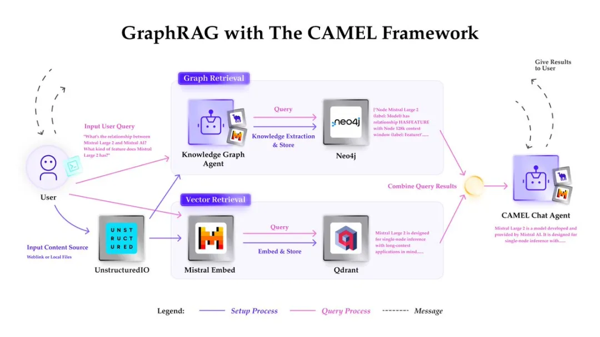

# 1. 资源

Twitter：

- https://x.com/CamelAIOrg

- https://x.com/MistralAI

GitHub：

- https://github.com/camel-ai/camel

- https://github.com/mistralai

Cookbook:

- https://tinyurl.com/dwye5b4d

# 2. 技术

技术栈细节

-CAMEL作为一个多智能体系统框架，提供了知识图谱代理和聊天代理等功能，简化了工作流程。

-MistralAI提供了Mistral Large 2大语言模型和Mistral Embed嵌入模型。

-Neo4j提供了知识图谱数据库。

-Qdrant提供了向量数据库，存储文本嵌入并支持快速向量检索。

-Unstructured.io则负责将非结构化数据转换为结构化格式，为RAG系统做好准备。

# 参考

[1] 新功能！CAMEL和Mistral合作推出GraphRAG检索技术！，https://mp.weixin.qq.com/s/DhnAd-k-CtdGFVrwGat90w