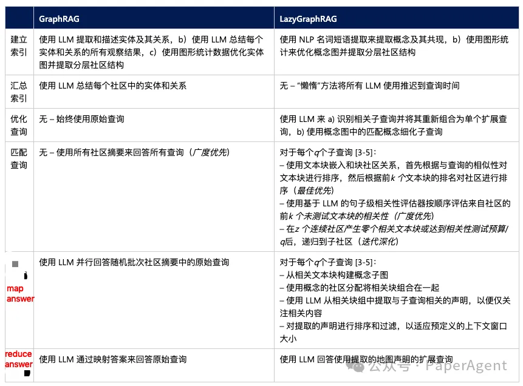
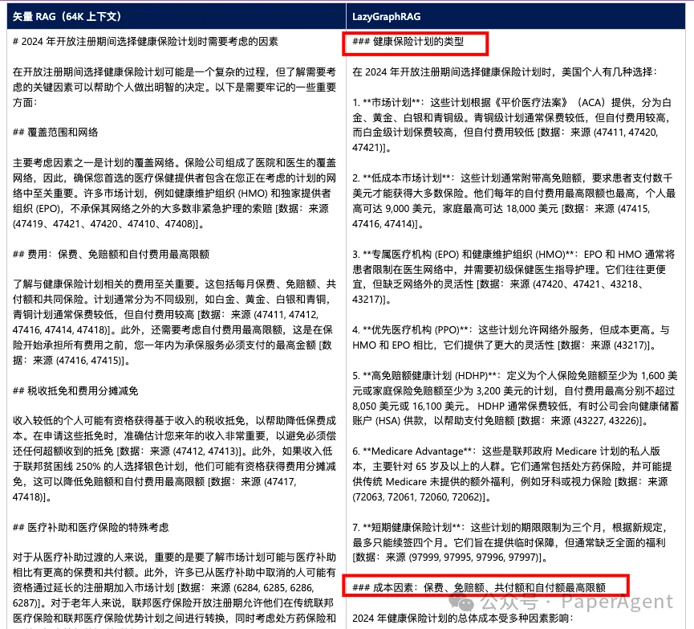
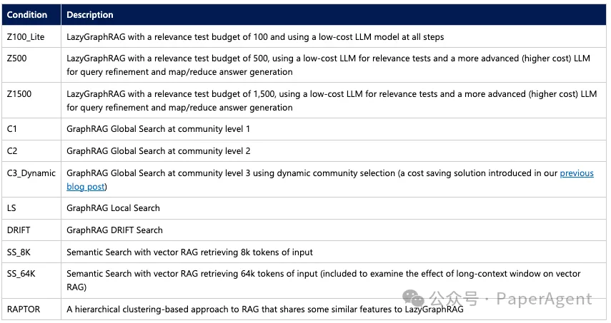
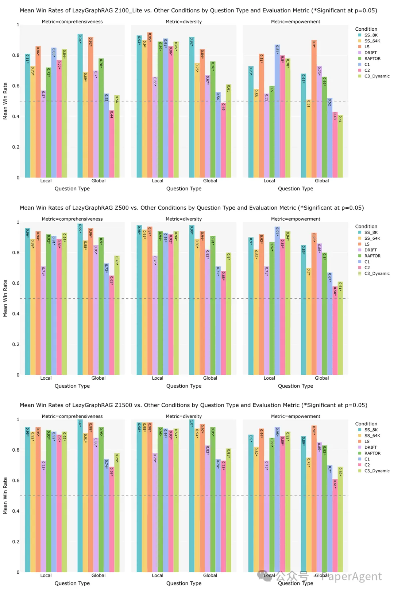

# 1. 简介

微软GraphRAG自发布以来，引起了很大关注（目前19.6k star），但是成本/慢一直被诟病，微软LazyGraphRAG应运而生，其只有完整GraphRAG成本的 0.1%。低成本的核心：
- 使用 NLP 名词短语提取来提取概念及其共现
- 使用图形统计来优化概念图并提取分层社区结构

示例对比，LazyGraphRAG论据更加详细，Query：描述 2024 年健康保险计划开放注册期间，美国个人在选择健康保险计划时应考虑哪些因素。

# 2. 评测

LazyGraphRAG效果评测

LazyGraphRAG的一个关键优势是其在成本和质量方面的固有可扩展性。在一系列竞争方法（标准向量RAG、RAPTOR、GraphRAG本地、GraphRAG全局和DRIFT搜索机制）中，LazyGraphRAG在成本-质量上显示出强大的性能，如下所示：

LazyGraphRAG数据索引成本与向量RAG相同，是完整GraphRAG成本的0.1%。

对于与向量RAG相当的查询成本，LazyGraphRAG在本地查询上超越了所有竞争方法，包括长上下文向量RAG和GraphRAG DRIFT搜索（我们最近引入的RAG方法，已被证明优于向量RAG）以及GraphRAG本地搜索。

相同的LazyGraphRAG配置还显示出与GraphRAG全局搜索相当的答题质量，但对于全局查询，查询成本降低了700多倍。

对于GraphRAG全局搜索查询成本的4%，LazyGraphRAG在本地和全局查询类型上显著超越了所有竞争方法，包括C2级别的GraphRAG全局搜索（社区层级中的第三层，推荐大多数应用使用）。

图1显示了LazyGraphRAG在与八个竞争条件的对比中的胜率。在最低预算水平，即使用低成本LLM模型进行100次相关性测试（与SS_8K成本相同）时，LazyGraphRAG在本地和全局查询上显著超越了所有条件，除了全局查询的GraphRAG全局搜索条件。在预算增加到500次相关性测试时，使用的是更先进的LLM模型（C2查询成本的4%），LazyGraphRAG在本地和全局查询上显著超越了所有条件。随着相关性测试预算增加到1,500，LazyGraphRAG的胜率持续上升，展示了其在成本与质量方面的可扩展性。

# 3. GraphRAG无价值了？

这是否意味着所有支持图形的 RAG 都应该采用LazyGraphRAG模式？微软认为答案是否定的，原因有三：
- GraphRAG 实体、关系和社区摘要的数据索引具有超越问答的使用价值（例如，阅读和分享为报告）。
- 实体、关系和社区摘要的 GraphRAG 数据索引与类似 LazyGraphRAG 的搜索机制相结合，可能会比单独使用 LazyGraphRAG 取得更好的效果。
- 一种旨在支持类似 LazyGraphRAG 的搜索机制（例如，通过预先声明和主题提取）的新型 GraphRAG 数据索引可能会实现最佳结果。

# 参考

[1] 微软LazyGraphRAG：新一代超低成本RAG, https://mp.weixin.qq.com/s/flKO2Xa7XQ0kd434UewGMg
[2] https://www.microsoft.com/en-us/research/blog/lazygraphrag-setting-a-new-standard-for-quality-and-cost/