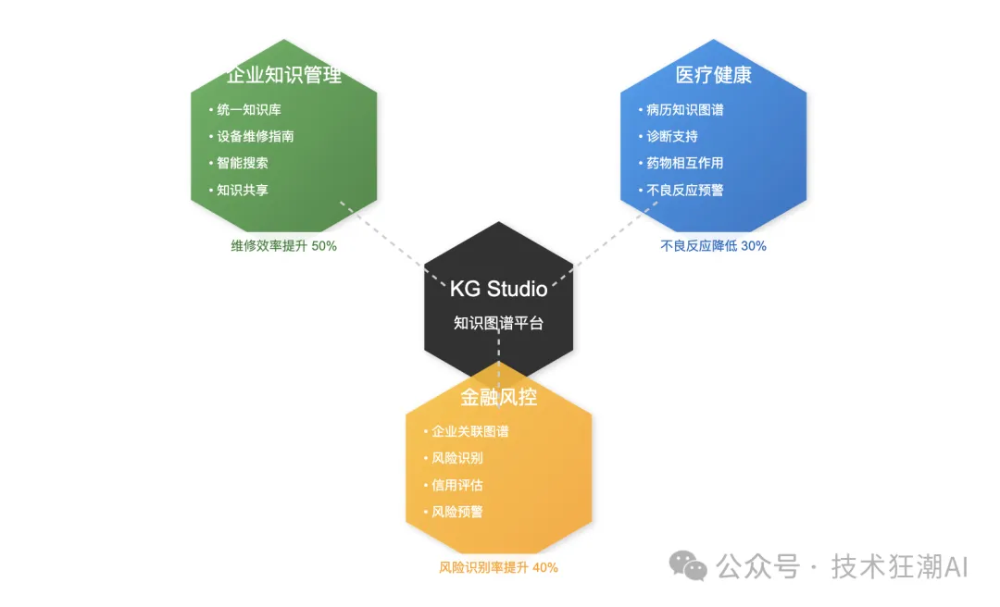

# 1. 资源

https://github.com/whyhow-ai/knowledge-table

https://github.com/whyhow-ai/knowledge-graph-studio

# 2. 简介

Knowledge Graph Studio 是 WhyHow.AI 团队最近开源的一款专注于知识图谱构建和管理的创新工具平台。


与传统的知识图谱工具相比，Knowledge Graph Studio 的与众不同之处在于它的"RAG原生"设计理念。它不仅支持传统的三元组存储和查询，还能够保持文本块、实体和关系之间的紧密关联，确保了知识溯源的完整性。这种设计对于需要严谨性和可解释性的领域应用来说，具有重要的现实意义。

## 2.1 技术架构特点

Knowledge Graph Studio 采用了一个创新的技术架构设计，它巧妙地将知识图谱、向量检索和 RAG 系统进行了有机整合。核心架构基于 NoSQL 数据库（如 MongoDB）构建，这种选择带来了显著优势：首先是模式灵活性，能够适应知识图谱动态演进的需求；其次是查询性能，支持大规模数据的高效检索；最后是可扩展性，便于横向扩展以应对数据量增长。

更值得关注的是，该平台实现了关系数据、向量存储和搜索功能的无缝集成。这意味着我们可以同时处理结构化的案件要素（如案件类型、时间地点、涉案人员等）和非结构化的案件材料，而不必在不同的系统之间来回切换。


这种架构设计带来了几个关键优势：

```text
统一的数据视图
打通了结构化和非结构化数据的边界
支持多粒度的知识表示和检索
保证了数据的一致性和完整性
高效的检索机制
创新性地将三元组进行向量化处理
支持语义相似性和精确匹配的混合检索
查询性能较传统图数据库提升显著
灵活的扩展能力
模块化设计便于功能扩展
支持自定义索引和检索策略
可根据需求选择性启用功能组件
完整的生态支持
提供标准的 RESTful API
支持 Python SDK 快速开发
配备直观的 Web 操作界面
```

这种架构设计不仅解决了传统知识图谱系统在处理非结构化数据时的局限性，还为构建智能化的知识应用提供了坚实的技术基础。特别是在处理大规模异构数据时，其灵活性和扩展性的优势更加明显。

通过这样的架构设计，Knowledge Graph Studio 能够同时满足知识建模的严谨性要求和实际应用中对灵活性的需求，为知识图谱的构建和应用提供了一个理想的技术平台。

## 2.2 核心功能亮点


实践数据表明，相比传统的 Text2Cypher 方案，我们的向量化检索准确率提升了 2 倍以上。这一突破性进展意味着执法人员可以用更自然的语言描述查询需求，系统能够准确理解并返回相关的知识内容，大大提升了实际应用效果。

在实体识别和关系抽取这个知识图谱建设的关键环节，我们没有一味追求全自动化，而是基于多年实践经验，构建了一套人机协作的实体解析体系。系统支持执法人员基于专业知识定制解析规则，这些规则可以被保存和复用，随着使用不断优化完善。

这种方式既保证了抽取结果的准确性，又能够通过规则的积累不断提升系统的智能化水平。特别是在处理新型犯罪或者复杂案情时，人机协作的方式能够快速适应新的知识需求，保持系统的与时俱进。

### 2.2.1 案件知识的结构化表示


传统的案件信息往往分散在大量的文书、笔录和资料中，这给快速获取和分析带来了巨大挑战。通过 Knowledge Graph Studio：

- 我们可以将非结构化的案件文书自动转化为规范的知识图谱结构
- 准确刻画人、物、地、案件、时间等要素之间的复杂关联
- 建立起案件信息的知识底座，为后续的智能分析和辅助办案提供坚实基础
- 支持灵活的知识模型定制，适应不同案件类型的特殊需求

### 2.2.2 证据链条的智能梳理 


在重大案件侦办过程中，证据关系错综复杂，常规方式难以厘清关键线索。Knowledge Graph Studio 提供：

- 基于图谱的证据链可视化展现，直观呈现证据之间的逻辑关联
- 智能识别证据链条中的关键节点和薄弱环节
- 辅助办案人员快速发现证据体系中的漏洞和不足
- 提供证据补强建议，有效提升案件质量
- 支持证据链路径的多维度分析和推演

### 2.2.3 跨案件的关联分析


串并案分析是提升破案效率的关键，但传统方法往往依赖人工经验。Knowledge Graph Studio 创新性地：

基于知识图谱的网络结构，自动发现案件间的潜在关联

提供多层次、多维度的关系路径搜索和推理能力

支持复杂条件下的案件特征匹配和相似性分析

实现对作案规律、团伙网络等高价值信息的智能挖掘

为串并案侦查和研判提供精准的数据支撑

通过这些功能的有机结合，Knowledge Graph Studio 不仅提升了办案效率，更为打造智能化办案新模式提供了有力支撑。在实践中，我们已经看到它在提升办案质量、加快办案进度等方面带来的显著成效。

## 2.3 与大模型的协同效应


虽然 Knowledge Graph Studio 目前还处于开源的初期阶段，但它的设计理念和技术路线与我们的需求高度契合。随着社区的参与和工具的不断完善，我相信它将成为推动公安执法领域智能化转型的重要支撑。

特别值得一提的是，该项目采用 MIT 许可证开源，这意味着我们可以基于自身需求进行定制化开发，这对于公安行业的特殊性要求来说尤为重要。

## 2.4 NOSQL架构

KG Studio 的技术架构是其核心竞争力之一。它基于 MongoDB 构建，同时支持关系数据、向量存储和灵活模式，旨在满足大语言模型（LLM）系统、多代理 RAG（Retrieval-Augmented Generation）工作流和结构化知识表示的需求。

MongoDB 作为基础架构的选择有几个关键优势：

- 文档模型灵活性：MongoDB 的文档模型允许存储复杂的嵌套数据结构，非常适合知识图谱中的多维数据表示
- Schema 灵活性：支持动态模式，可以根据需要调整数据结构，这对于不断演化的知识图谱至关重要


KG Studio 的存储层结合了以下技术：
- 图数据库：用于存储实体和关系，支持高效的图查询和推理。
- 向量数据库：支持语义相似性搜索，特别适合大语言模型生成的嵌入向量。
- 关系数据库：管理元数据和系统配置，提供可靠的数据一致性。
- 分布式缓存：提升查询性能，优化用户体验。

这种多模存储的设计，使得 KG Studio 能够同时处理结构化和非结构化数据，满足复杂知识图谱构建的需求。

## 2.5 数据接入与清洗

KG Studio 支持多种数据格式的接入，包括结构化数据（如数据库表）、半结构化数据（如 JSON）和非结构化数据（如文本和图片）。通过内置的智能数据清洗工具，用户可以快速完成数据去重、格式标准化和异常值处理，为后续的知识图谱构建打下坚实基础。




# 参考

[1] Knowledge Graph Studio：让知识图谱构建更简单、更智能，https://mp.weixin.qq.com/s/FfFB4EqCmvQeme2BlTPN6Q