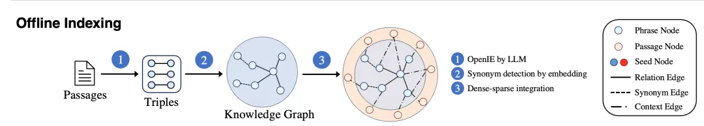
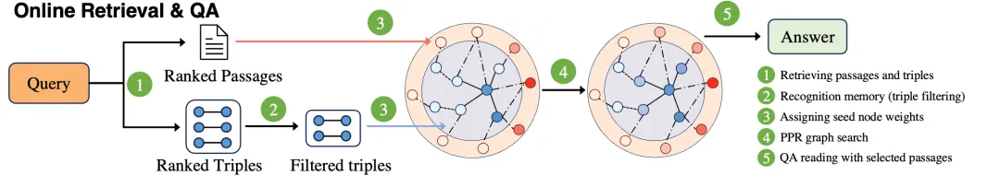
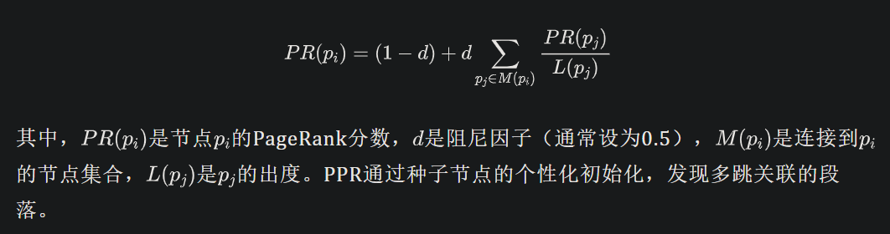
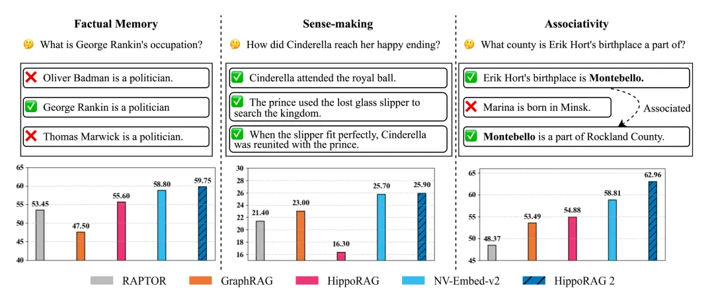
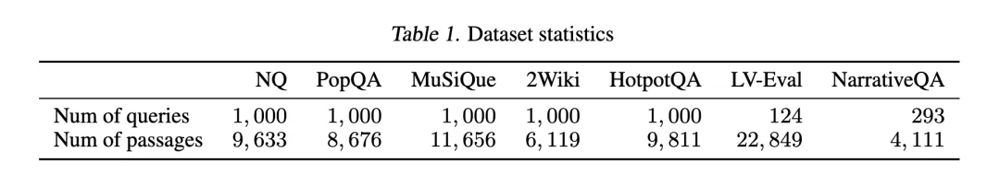
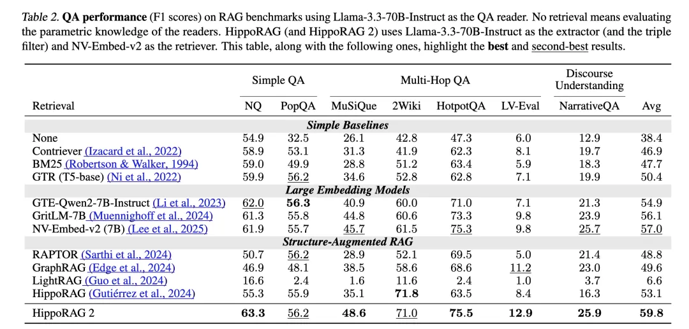
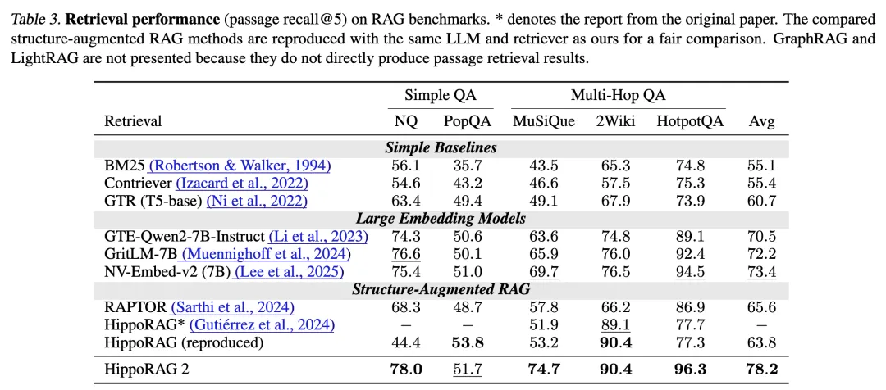

# HippoRAG 2：从RAG到记忆——大模型的非参数化持续学习
# 1. 资源

- Github (1.7k stars): https://github.com/OSU-NLP-Group/HippoRAG
- HippoRAG: Neurobiologically Inspired Long-Term Memory for Large Language Models
  - https://arxiv.org/abs/2405.14831
  - 2024年5月
- From RAG to Memory: Non-Parametric Continual Learning for Large Language Models
  - https://arxiv.org/abs/2502.14802
  - 2025年2月20日
  - 作者包括Bernal Jiménez Gutiérrez、Yiheng Shu、Weijian Qi、Sizhe Zhou和Yu Su，分别来自俄亥俄州立大学（The Ohio State University）和伊利诺伊大学厄巴纳-香槟分校（University of Illinois Urbana-Champaign）。

# 2. 简介

该研究针对大模型在吸收新知识和避免灾难性遗忘方面的挑战，提出了一种新的方法，模拟人类长期记忆的动态性和关联性。HippoRAG 2在事实记忆、语义理解和关联记忆任务上的表现好于标准检索增强生成（RAG）方法，为大模型的持续学习提供了新的可能性。

# 3. 背景

近年来，大模型在自然语言处理领域取得了显著进展，涵盖从对话生成到复杂推理的多种任务。但在持续学习方面，大模型仍面临较大挑战。

其他持续学习方法通常分为三类：持续微调、模型编辑和RAG。

- 持续微调（Continual fine-tuning）涉及定期用新数据对大型语言模型进行训练。可以通过像持续预训练、指令微调和对齐微调等方法实现。虽然整合了新的语言模式和推理技能，但持续微调受到灾难性遗忘的影响，即随着新数据的引入而丢失先前学到的知识。此外，其计算费用使得频繁更新对现实世界的应用来说也不具备可操作性。
- 模型编辑技术（Model editing）提供了一个更轻量级的替代方案，通过直接修改模型中的特定参数来更新其知识。然而，这些更新高度局部化，对与更新相关联的信息影响很小。
- 检索增强生成（Retrieval-Augmented Generation）作为连续学习的一个可扩展且实用的替代方案。与其修改大型语言模型（LLM）本身，不如在推理时检索相关的外部信息，允许实时适应新知识。

总的来说，传统方法如持续微调和模型编辑试图通过更新参数来融入新知识，但往往因灾难性遗忘和高计算成本而受限。例如，实验表明，持续微调可能导致模型遗忘早期训练数据中的知识，而模型编辑的更新效果通常局限于局部，难以全面关联相关信息。检索增强生成（RAG）因其非参数化特性成为解决这一问题的热门方案，通过在推理时检索外部信息，避免直接修改模型参数。但标准RAG依赖向量检索，难以捕捉人类长期记忆中的语义理解和关联性，特别是在处理多跳推理或长篇语篇时表现不足。

针对这些局限性，近年来的研究提出了多种结构增强的RAG方法。例如，RAPTOR通过生成摘要整合信息，GraphRAG则利用知识图谱（KG）增强检索过程。尽管这些方法在语义理解或关联性任务上有所改进，但实验表明，它们在基本事实记忆任务上的性能下降，未能实现全面的记忆能力。HippoRAG 2的研究动机源于此，旨在设计一种框架，既能保持事实记忆的准确性，又能提升语义理解和关联记忆的深度，从而更接近人类长期记忆的动态特性。

GraphRAG是一种利用知识图谱增强检索增强生成（RAG）的方法，旨在通过结构化数据提升大模型的全局理解和推理能力。该方法通过大模型从源文档中提取实体、关系和声明，构建一个实体知识图谱。这种图结构不仅捕捉了实体间的直接关系，还通过社区检测技术识别出实体群组，生成社区摘要以提供高层次的语义信息。在检索阶段，GraphRAG利用图的结构信息进行上下文感知的检索，能够处理需要跨整个数据集进行信息汇总的复杂查询。相较于传统的RAG方法，GraphRAG在处理全局性问题时表现出色，能够生成更连贯和全面的回答，特别适用于需要深入语义理解的场景。

LightRAG是一种将图结构融入文本索引和检索过程的RAG系统，旨在提升大模型在处理复杂查询时的效率和准确性。该方法采用双层检索框架，结合低级和高级知识发现，增强了信息检索的全面性。通过将图结构与向量表示相结合，LightRAG能够高效检索相关实体及其关系，显著提高响应速度，同时保持上下文的相关性。此外，LightRAG引入了增量更新算法，确保系统能够及时整合新数据，适应快速变化的数据环境。实验表明，LightRAG在多个领域的数据集上超越了传统RAG和GraphRAG，尤其在处理大规模语料库和复杂查询时表现出色，提供了更准确和多样化的回答。

# 4. 方法（重点内容）

HippoRAG 2的提出源于标准RAG和现有改进方法在模拟人类记忆方面的不足。标准RAG依赖向量检索，虽然简单高效，但无法处理复杂的上下文关联；而结构增强方法虽有所进步，但牺牲了事实记忆的性能。基于此，HippoRAG 2在前作HippoRAG的基础上，结合个性化PageRank（PPR）算法、深入的段落集成和有效的在线大模型使用，构建了一个更强大的非参数化持续学习框架。这一框架通过离线索引和在线检索两个阶段实现，其设计灵感来源于人类大脑的神经机制。

**离线索引**

在离线索引阶段，HippoRAG 2首先利用大模型从每个段落中提取开放三元组（如(subject, relation, object)），并将其整合到一个无模式的开放KG中。KG包含两类节点：

- 短语节点（phrase nodes），代表概念；
- 段落节点（passage nodes），保留上下文信息。

此外，通过编码器检测短语间的同义关系并添加同义边（synonym edges），实现跨段落的信息互联。段落节点通过"contains"边与从中提取的短语节点相连。这种设计借鉴了大脑的密集与稀疏编码理论，其中短语节点类似稀疏编码，提供简洁的概念表示，而段落节点类似密集编码，保留丰富的上下文细节。最终，KG整合了概念的原子性和上下文的全面性，为后续检索奠定了基础。

**在线检索**

在线检索是HippoRAG 2的核心，分为以下步骤：

1. 通过"Query to Triple"过程，编码器将查询与KG中的三元组匹配，识别潜在种子节点。与HippoRAG依赖NER（命名实体识别）不同，HippoRAG 2直接匹配整个查询，捕获更丰富的上下文。

2. 通过"Recognition Memory"机制，大模型过滤检索到的三元组，仅保留与查询高度相关的部分，模拟人类记忆中的识别过程，减少噪声干扰。

3. 利用个性化PageRank（PPR）算法在KG上进行上下文感知检索。PPR通过随机游走计算节点的重要性，公式如下：

   

4. 根据PageRank分数对段落排序，选出得分最高的段落用于下游任务。

**与现有方法的对比**

与标准RAG相比，HippoRAG 2通过KG和PPR实现了关联性推理，而非仅依赖向量相似性。与GraphRAG等方法不同，其KG直接辅助检索而非扩展语料库，避免了生成噪声的干扰。相较于HippoRAG，HippoRAG 2通过段落节点的整合和识别记忆机制，显著提升了上下文感知能力。

# 5. 实验与发现

HippoRAG 2的实验在多个基准数据集上进行，包括：

- 简单QA任务：NaturalQuestions、PopQA；
- 多跳QA任务：MuSiQue、2Wiki、HotpotQA、LV-Eval；
- 语篇理解任务：NarrativeQA。

这些数据集覆盖事实记忆、语义理解和关联记忆三个维度，样本数量从124到1000不等，语料库段落数在4111到22849之间（详见论文Table 1）。评估指标包括检索任务的Recall@5和QA任务的F1分数，实验使用Llama-3.3-70B-Instruct作为提取和过滤模型，NV-Embed-v2作为检索器，确保结果的可重复性。

实验表明，HippoRAG 2在所有基准上均好于基线方法。以下是部分关键数据（论文Table 2和Table 3）：

- 在简单QA任务中，HippoRAG 2在NaturalQuestions上的F1分数为63.3，PopQA为56.2，略高于NV-Embed-v2的61.9和55.7；
- 在多跳QA任务中，其在MuSiQue上的Recall@5为74.7（比NV-Embed-v2高5.0%），2Wiki为90.4（高13.9%），HotpotQA为96.3；
- 在语篇理解任务NarrativeQA上，F1分数达25.9，表现最好。

这些数据表明，HippoRAG 2在保持事实记忆能力的同时，显著提升了关联性和语义理解能力。

进一步分析显示，HippoRAG 2的优越性具有统计显著性。例如，在减少知识泄漏的挑战性数据集LV-Eval上，其F1分数为12.9，远高于NV-Embed-v2的7.8，凸显了其在复杂场景中的鲁棒性。对比HippoRAG，其改进版本在多跳任务上的提升尤为明显，验证了方法设计的有效性。

# 6. 结论与展望

HippoRAG 2通过整合个性化PageRank算法、段落节点和识别记忆机制，成功构建了一个接近人类长期记忆的RAG框架。其核心贡献在于实现了事实、语义和关联记忆的全面提升，为大模型的非参数化持续学习提供了新范式。实验表明，该框架在多种任务中表现出色，尤其在多跳推理和语篇理解方面具有显著优势

HippoRAG 2的研究方向值得进一步探索。例如，将episodic memory融入框架，可能实现对话中的动态记忆能力，推动大模型在长时交互中的应用。此外，结合领域自适应技术，HippoRAG 2有望在特定场景（如法律、医疗）中展现更大潜力，为AI的实用化迈出重要一步。

# 参考

[1] HippoRAG 2：从RAG到记忆——大模型的非参数化持续学习, https://mp.weixin.qq.com/s/VlAuKxU_Ec25Mf_iAsRQxg