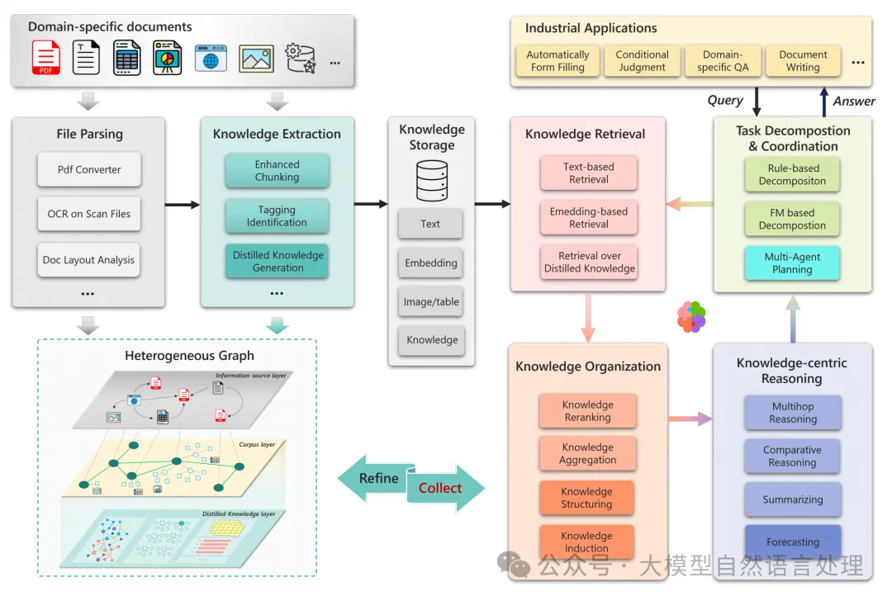

# 1. 资源

- PIKE-RAG: sPecIalized KnowledgE and Rationale Augmented Generation，https://arxiv.org/pdf/2501.11551
- 开源地址：https://github.com/microsoft/PIKE-RAG

# 2. 简介

PIKE-RAG框架的设计目标是提供一个灵活且可扩展的RAG系统，应对工业应用中复杂多样的任务需求。框架的核心是通过有效的知识提取、理解和组织，以及构建连贯的推理逻辑，解决了RAG系统在工业应用中的局限性。下面来看下微软开源的PIKE-RAG框架及其实现过程，供参考。

# 3. PIKE-RAG框架
PIKE-RAG框架主要由几个基本模块组成，包括文档解析、知识抽取、知识存储、知识检索、知识组织、以知识为中心的推理以及任务分解与协调。

从上图可以看到，相比传统的RAG框架，PIKE-RAG框架的核心是构建一个多层次的异质图作为知识库，涵盖信息资源层、语料库层和蒸馏知识层。每一层代表不同的信息抽象和粒度级别，支持在不同尺度上探索和检索相关知识。

# 4. 实现过程

## 4.1 Level-0: 知识库构建

**1. 文件解析**

文件解析模块负责处理各种类型的文件，这包括处理扫描文档、图像和复杂的表格等。为了保留多模态元素（如图表），框架采用布局分析技术，并使用视觉语言模型来描述图表内容，以确保信息的完整性。

关于PDF相关文档解析，笔者在前面系列中有许多详细的技术链路可以参考《文档智能记录链路合集》

**2. 知识组织**
知识库被构建为一个多层次的异质图，包括信息资源层、语料库层和蒸馏知识层。每个层次代表不同的信息粒度和抽象级别。

- 信息资源层：捕获多样化的信息源，建立跨源的引用关系。
- 语料库层：将解析的信息组织成段落和块，保留文档的原始层次结构，并集成多模态内容。
- 蒸馏知识层：将语料库进一步提炼为结构化的知识形式（如知识图、原子知识和表格知识），以支持高级推理。

## 4.2 Level-1: 事实性问题回答
可以在知识提取过程中使用上下文感知切分技术、自动术语标签对齐技术和多粒度知识提取方法来提高知识提取和检索的准确率，从而增强事实信息检索能力，如下面的流程所示：

增强的分块：分块是将大文本分割成小块的过程，以提高检索效率和准确性。PIKE-RAG采用一种文本分割算法，迭代地将文本分割成小块，同时保持上下文的连贯性。

自动标注：自动标注模块用于最小化源文档和查询之间的域差距。通过提取和映射领域特定的标签，提高检索的召回率和精确率。

多粒度检索：在多层次的异质图上进行多粒度检索，允许系统在不同层次上探索和检索相关信息。通过计算查询和图节点之间的相似性得分，并进行传播和聚合，优化检索过程。

## 4.3 Level-2: 可链接推理问题回答
基于上一层L1，增加一个任务分解与协调模块，将复杂任务拆分为更小、可管理的子任务

深绿色（■）表示知识提取模块中的原子知识生成，而深橙色（■）代表知识起源模块中的知识重排和聚合子模块。此外，浅蓝色（■）表示以知识为中心推理模块中的多跳推理、比较推理、总结子模块。

- 知识原子化：知识原子化是将文档中的知识分割成小的原子单元，以便更精细地检索和使用。通过生成相关的问题作为知识索引，增强知识与查询之间的匹配度。
- 知识感知的任务分解：任务分解模块将复杂任务分解为更小的子任务，以提高系统的处理效率。通过生成和评估原子问题提案，动态调整检索和推理过程。

  

- 知识感知任务分解器的训练：通过收集和训练数据，使任务分解器能够更好地理解和处理领域特定的知识。通过强化学习等方法，优化任务分解和结果寻找过程。

  

## 4.4 Level-3: 预测性问题回答
Level-3专注于处理预测性问题，强调基于知识的预测能力。

深红色（■）表示知识组织模块中的知识构建和知识归纳，而深蓝色（■）代表以知识为中心的推理模块中的预测子模块。

- 知识结构和归纳：在知识组织模块中，通过结构化和归纳知识，支持高级分析和预测任务。通过分类和时间序列分析，优化知识的使用。
- 预测子模块：在知识中心推理模块中，引入预测子模块，以支持基于知识的预测。通过历史数据和逻辑推理，生成未来的预测。

## 4.5 Level-4: 创造性问题回答
L4系统实现的特点是整合多智能体系统，支持多视角思考。通过并行处理和集成不同的推理路径，生成综合和连贯的解决方案。这种思维依赖于事实信息和对基本原理及规则的理解。

# 5. 实验

# 参考

[1] “RAG界的deepseek”开源-企业复杂私域知识理解与推理框架PIKE-RAG, https://mp.weixin.qq.com/s/z5KQQMyprxMiR1CX8xGzUw
