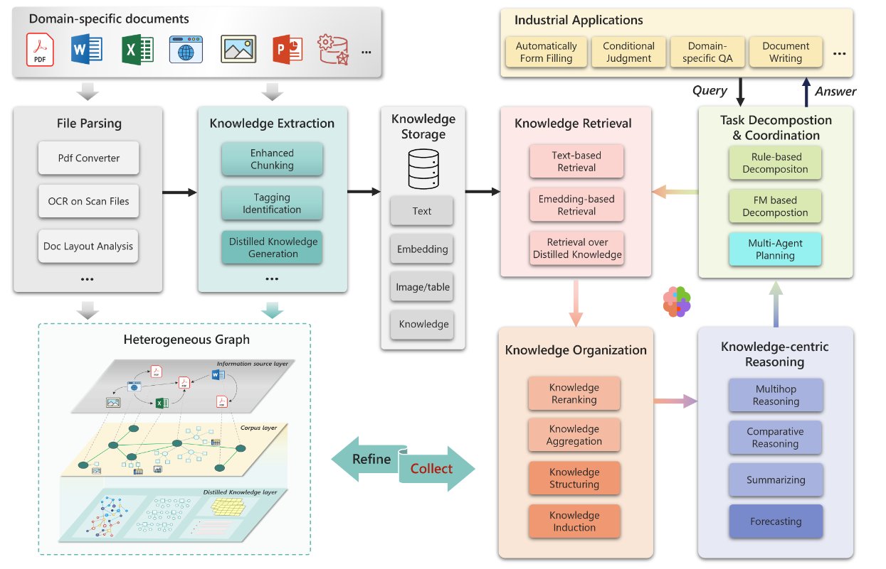
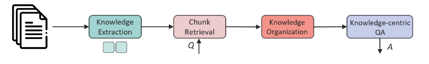
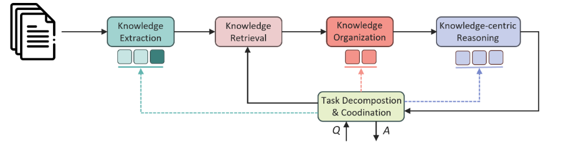
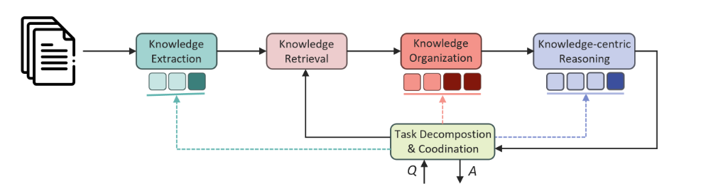
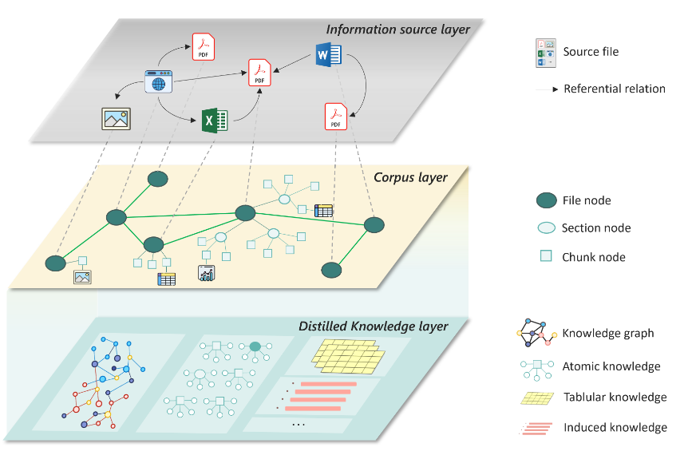
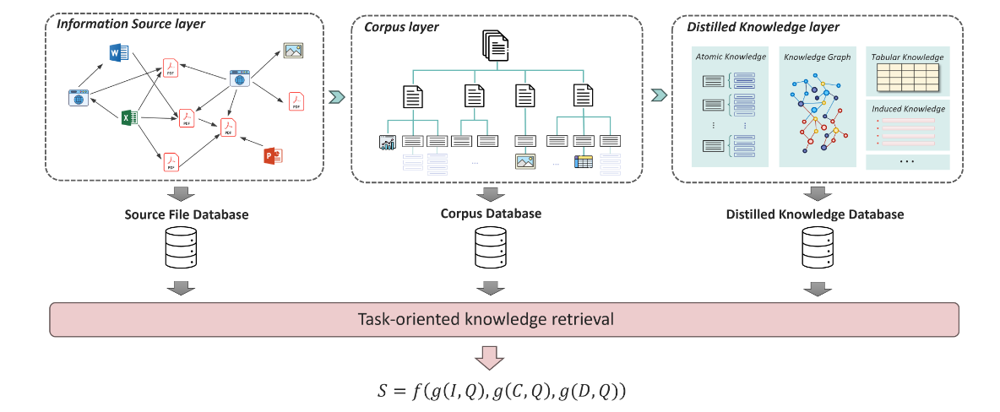
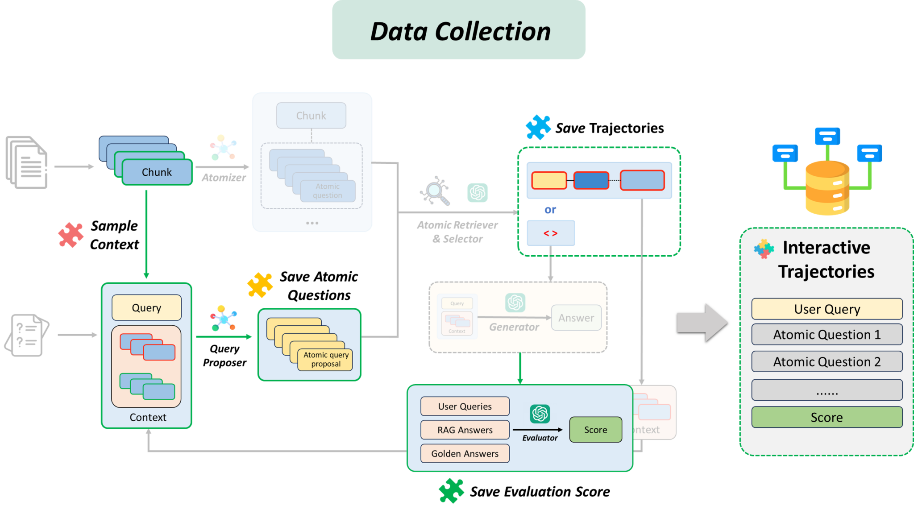
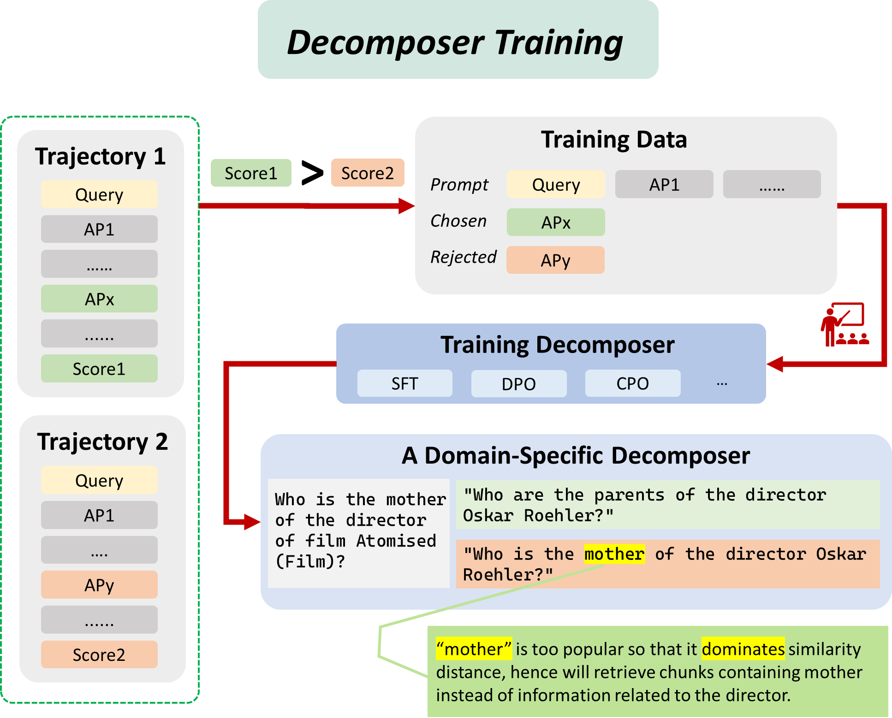

# 1. 资源

- PIKE-RAG: sPecIalized KnowledgE and Rationale Augmented Generationh
  - https://arxiv.org/pdf/2501.11551
  - 2025.01，Microsoft Research
- 开源地址：https://github.com/microsoft/PIKE-RAG

# 2. 特点

过多层次异构知识库构建、任务驱动的系统搭建策略以及自我进化的领域知识学习机制，显著提升了 LLMs 在复杂工业场景中的推理和应用能力。

具体来说，PIKE-RAG 旨在解决以下问题：

1. 知识来源的多样性：现有 RAG 方法在从多样化的数据源中高效提取私有知识和揭示潜在思考逻辑方面存在困难，尤其是在复杂的工业场景中。PIKE-RAG 通过构建多层异构图，能够表示不同层次的信息和知识，从而更好地解决这一问题。

2. 多样的能力与统一方法的矛盾：现有 RAG 方法未能充分考虑不同应用场景中的复杂性和特定需求。通过任务分类和系统能力分级，PIKE-RAG 提供了一种能力需求驱动的方案搭建策略，显著提高了系统在不同复杂性问题上的适应能力。

3. LLMs 的领域专业知识不足：在工业应用中，RAG 需要利用专业领域的私有知识和逻辑，但现有方法在应用于专业领域时表现不佳，尤其是在 LLMs 不擅长的领域。PIKE-RAG 通过知识原子化和任务动态分解，增强了对领域特定知识的提取和组织能力。此外，该系统能够自动从系统交互日志中提取领域知识，通过 LLMs 微调将学习到的知识固化下来，以更好地应用于未来的问答任务中。

# 3. 原理

## 3.1 **PIKE-RAG全景图：基于系统能力需求驱动的方案搭建**

如图1所示，研究员们提出了一个多功能且可扩展的 RAG 框架。在该框架中，通过调整主模块内的子模块，可以实现侧重不同能力的 RAG 系统。该框架主要由多个基本模块组成，包括文件解析、知识提取、知识存储、知识检索、知识组织、以知识为中心的推理，以及任务分解与协调。通过这种模块化的架构设计，PIKE-RAG 能够根据不同的系统能力需求，灵活搭建不同的 RAG 方法，从而应对实际场景中的复杂需求。

图1：PIKE-RAG 框架全景图
以下通过医药领域的四个案例，详细介绍 PIKE-RAG 系统在不同能力侧重下的应用与优化：

侧重事实信息检索能力的系统流程

任务示例：“查询某位病人在某日的就诊记录”

在此流程中需要重点关注的挑战是：知识的理解和提取常因不恰当的知识分块而受阻，导致语义连贯性被破坏，检索过程复杂且低效；常用的基于嵌入模型的知识检索会受到嵌入模型在对齐专业术语和别名方面的局限性影响，使得系统精准度降低。如图2所示，PIKE-RAG 在知识抽取过程中可以使用具备上下文感知能力的分片技术、自动的术语标签对齐技术以及多粒度的知识抽取方法等模块，提高知识抽取和检索的准确度，增强事实信息的检索能力。

图2：侧重事实信息检索能力的系统流程

侧重事实信息检索和链接能力的系统流程

任务示例：“查询并总结某位病人近五年的就诊情况”

相较于信息检索能力，信息的链接不仅需要有效的知识提取和利用，同时还需要系统具备较强的领域相关知识，能够准确理解任务并对其进行合理的分解。为了达到这一目标，PIKE-RAG 可以在上述流程中增加任务分解模块，分步骤地从知识库中提取相关的知识并进行链接，直至给出最终回答。

图3：侧重事实信息检索和链接能力的系统流程

侧重基于事实进行推理预测能力的系统流程

任务示例：“根据某位病人的病情描述，推测其最可能患的疾病”

基于事实进行推理预测的任务在考验系统组织、收集、检索信息能力的同时，还要求 LLMs 能够准确理解这些信息，并结合自身掌握的领域知识进行合理推理和预测。为此需要在知识组织阶段增加对结构化知识的提取和整理，例如从过往的非正式病情描述中提取专业的病症描述，并与确诊的疾病和治疗手段进行映射。实验发现，相较于原始的病情描述，结构化、标准化的病例能够显著提升 LLMs 的推断预测能力。

图4：侧重基于事实进行推理预测能力的系统流程

侧重基于事实进行创新生成能力的系统流程

任务示例：“根据某位病人的病情描述，建议合理的治疗方案和应对措施”

LLMs 在处理领域知识时，需要从复杂知识库中提取逻辑推理并关联多个因素，这对其理解力要求较高。创造性问题开放性强，评估答案质量困难。为了更准确地回答此类问题，我们引入了多智能体规划能力，通过不同角色模拟，从更多视角检索知识。例如，在医疗诊断中，不同科室的智能体医生可以提供更全面的治疗建议。

图5：侧重基于事实进行创新生成能力的系统流程

## 3.2 **如何支持多层次异构的知识库构建与检索？**

如图6所示，研究员们构建了包括信息资源层、语料库层和知识提炼层的异构图，以实现语义理解和基于推理的检索，从而支持多种下游任务。

信息资源层负责捕捉多样的信息来源，并将其视为源节点，通过边来表示节点之间的引用关系。这种结构有助于信息的交叉引用和知识的上下文化，为依赖多个来源的复杂推理任务奠定了基础。

语料库层会将解析的信息组织成文本块，同时保留文档的原始层级结构。对于多模态内容（如表格、图形等），通过 LLMs 进行提取和总结，并将其作为块节点整合到知识库中，可确保多模态知识能够被高效检索。此外，该层支持不同粒度的知识提取，允许在各种内容类型中进行准确的语义分块和检索。

在知识提炼层，语料库进一步被提炼为结构化的知识形式，例如知识图谱、原子知识和结构化的表格知识。通过在提炼层组织结构化知识，系统能够基于更深层的领域知识进行推理和综合，进而显著增强相关能力。

图6：包含三层信息的异构知识库示例

在检索阶段，研究员们会同时考虑三个层级的知识。除了常见的语义级别的关联外，信息资源层和知识提炼层的信息也会被用于评估检索知识的关联性。

图7：信息检索会同时考虑三层信息对于知识权重的影响

## 3.3 **支持自我进化的领域知识学习**

尽管目前利用现有的 LLMs 可以进行知识抽取、整理和检索，并完成任务分解、推理和预测。但在某些领域，如医疗健康等，存在大量有价值的私有数据和知识，让 LLMs 理解这些私有知识并更好地用于领域任务的分解、推理和预测是一个挑战。

为此，研究员们在 PIKE-RAG 中增加了支持系统自我进化和学习的模块。具体而言，PIKE-RAG 会定期分析系统运行日志，从中提取专家反馈并进一步微调 LLMs。为了应对专家反馈效率低和成本高的问题，研究员们还在系统中引入了数据自动收集模块。对于回答错误的问题，系统会利用进化算法自动尝试不同的知识抽取和检索策略，直到问题得到正确回答。进化出的好的策略会被保存用来微调 LLMs，使获取的知识得以固化并应用于未来的问答中。通过运行此过程，系统可以不断进化，持续获得与领域相关的知识与经验。图8和9展示了数据收集过程以及收集的数据如何被用以微调任务分解组件。

图8：一种自发无监督的数据收集机制

图9：如何从收集的数据中提取知识和推理逻辑并固化到模型中

# 4. 实验结果

在公开的基准测试中，PIKE-RAG 在多个多跳问答数据集（如 HotpotQA、2WikiMultiHopQA、MuSiQue）上展示了优异的性能。与现有的基准方法相比，PIKE-RAG 在准确性、F1 得分等指标上均表现出色。在 HotpotQA 数据集上，PIKE-RAG 的准确性达到了87.6%，在 2WikiMultiHopQA 上达到了82.0%，在更具挑战性的 MuSiQue 数据集上，准确性为59.6%。这些结果表明，PIKE-RAG 在处理复杂推理任务方面具有显著优势，特别是在需要整合多源信息和执行多步骤推理的场景中。

多层次的检索机制和任务分解策略使得 PIKE-RAG 能够有效地从私有知识库中提取相关信息，并在推理过程中逐步构建连贯的逻辑链。这种创新方法不仅在公开数据集（wikipedia）上展现出卓越的性能，也在法律领域的基准测试中（如 LawBench 和 Open Australian Legal QA）取得了显著成绩，进一步验证了其在专业领域应用中的潜力。

# 5. 解锁私有数据价值，拓展工业应用边界

随着 LLMs 能力的不断增强，其在工业场景中的应用潜力正逐渐释放。然而，基于安全和隐私等考量，许多特定领域的私有数据无法直接用于 LLMs 训练，这在一定程度上限制了 LLMs 在这些场景中的表现。PIKE-RAG 能够将这些私有数据转化为更有效的知识和逻辑，从而指导 LLMs 在特定领域做出更精准的决策。

PIKE-RAG 已经在工业制造、采矿、制药等多个领域进行了测试应用，并显著提升了问答系统的准确度。未来，研究员们将持续拓展其在更多领域的应用范围，同时也将继续探索其他形式的知识和逻辑，以及它们与特定场景的最佳适配。此外，研究员们也将研究和关注更高效的模型对齐与微调方法，以便能够用更少量的数据将特定的知识和逻辑有效整合到现有模型中。

# 参考

[1] PIKE-RAG：解锁领域私有数据价值，推动LLMs工业应用落地, https://www.microsoft.com/en-us/research/articles/pike-rag/