# 1. 资源

- 论文：Retrieval-Augmented Generation with Hierarchical Knowledge
  - https://arxiv.org/html/2503.10150v1
  - 2025.3.13, 香港大学
- Github (141 stars): https://github.com/hhy-huang/HiRAG

亮点：
- 首次系统分析并解决图结构RAG中语义相似实体结构疏离与知识断层问题
- 提出HiRAG框架，通过无监督层次化索引与创新性桥接机制推动RAG技术发展
- 大量实验验证了方法的有效性与效率，并通过消融实验证实各模块的贡献。

#  2. 问题

检索增强生成（Retrieval Augmented Generation，RAG）通过检索外部知识增强大语言模型（Large Language Models，LLMs）的领域任务能力。朴素RAG方法检索与查询相关的文本块，这些文本块作为大型语言模型生成响应的参考，用于缓解“幻觉”问题（如生成不准确内容），然而朴素RAG方法仅检索文本片段，忽略了实体间的关联（如“亚马逊”与“AWS”的关系），导致上下文碎片化。为此，研究者提出了基于图结构的RAG系统，通过构建知识图谱（Knowledge Graphs，KGs）来建模输入文档中实体间的关系。尽管这类方法已在多项任务中展现出优异性能，但仍存在明显缺陷。

以GraphRAG为例，该方法利用Leiden算法在索引阶段识别社区结构，但这些社区仅能反映KG中实体的结构邻近性，而无法捕捉深层次的语义关联。KAG虽然采用了层次化知识表示，但其层级结构过度依赖人工标注和领域知识，导致方法难以推广到通用任务。LightRAG采用双层级检索机制获取局部和全局知识作为查询上下文，但未能解决两者之间的知识断层问题——局部知识（如具体实体细节）可能与全局知识（如社区摘要）缺乏语义关联，导致模型生成不连贯的答案。

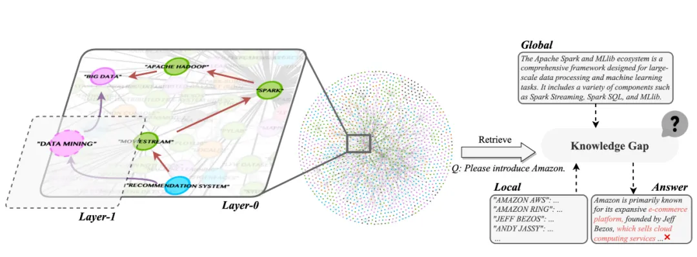

本文指出当前图结构RAG系统面临两大关键挑战：（1）语义相似实体在KG中结构关系疏远；（2）局部与全局知识之间存在断层。以公开数据集中的真实案例为例，"大数据"与"推荐系统"虽在"数据挖掘"概念下语义相关，但在KG中却因文档驱动的结构限制而相距甚远。这种语义相关性与结构邻近性的不一致性普遍存在于KG中，严重影响了RAG系统的上下文连贯性。

第二个挑战体现在现有方法（如LightRAG和GraphRAG）通常独立检索全局或局部知识，却无法调和两者间的固有差异。例如，针对查询"请介绍亚马逊"，全局上下文强调其在技术领域（如大数据、云计算）的参与，而局部上下文则检索与亚马逊直接关联的实体（如子公司、领导层）。若直接将这两种知识层输入LLM，模型可能难以协调其不同范围，导致逻辑断裂、答案不完整甚至自相矛盾。这凸显了需要新方法来桥接层次化知识层，以确保RAG系统推理的连贯性。

为解决这些挑战，本文提出基于层次化知识的检索增强生成框架（HiRAG），将层次化知识融入索引与检索过程。层次化知识是图结构与人类认知中的自然概念，但现有方法尚未充分挖掘其潜力。针对挑战（1），本文提出层次化索引（HiIndex），通过分层构建KG，使高层实体能够概括低层实体的语义集群，从而增强语义相似实体间的连通性。例如，引入摘要实体"数据挖掘"后，"大数据"与"推荐系统"的关联得以强化。针对挑战（2），本文设计层次化检索（HiRetrieval），通过桥接层知识弥合实体描述与社区知识间的断层，为LLM提供全局层、桥接层与局部层的三级上下文，使其生成更全面且精确的响应。

# 3. 相关工作

近年来，图增强型大语言模型的研究取得了显著进展，特别是在结合图结构的检索增强生成（RAG）方法方面。GNN-RAG通过基于图神经网络（GNN）的推理机制来检索与查询相关的实体，并通过寻找检索实体与候选答案实体之间的最短路径来构建推理路径。LightRAG将双层级检索方法与图增强的文本索引相结合，在降低计算成本的同时加快了调整过程。GRAG采用软剪枝方法来最小化检索子图中无关实体的影响，并通过引入图软提示（graph soft prompts）来帮助大语言模型理解子图中的文本和拓扑信息。StructRAG会为每个任务识别最合适的结构，将初始文档转换为该组织结构，并根据该结构生成响应。微软的GraphRAG首先检索相关社区，然后让大语言模型基于检索到的社区生成响应，同时支持全局搜索和本地搜索两种查询模式。KAG提出了一个专业领域知识服务框架，采用概念语义推理进行知识对齐，以缓解开放信息抽取（OpenIE）中的噪声问题，并通过人工标注的模式构建领域专家知识。这些方法在不同程度上提升了RAG系统的性能，但仍存在语义相似实体结构关系疏远、全局与局部知识割裂等局限性，而HiRAG正是针对这些问题提出了创新性解决方案。

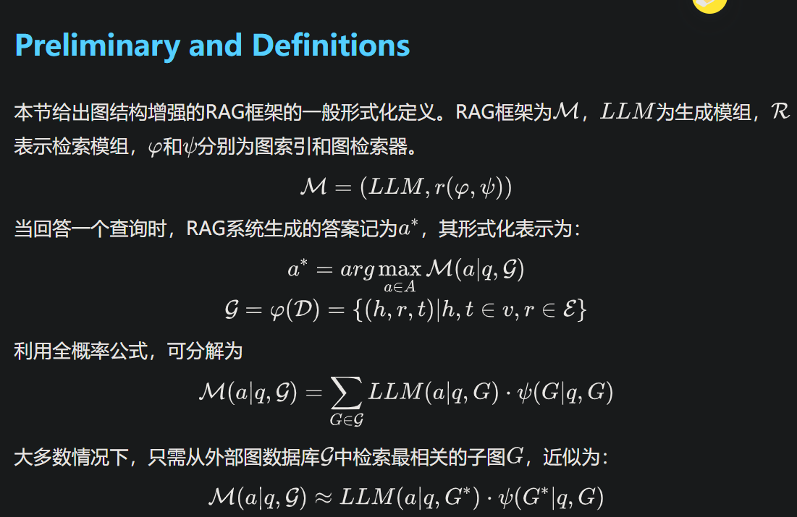

# 4. 方法

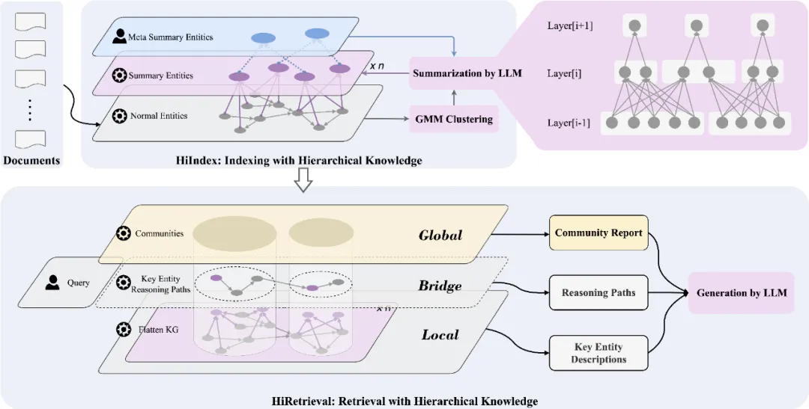

HiRAG由HiIndex和HiRetrieval两个模块组成。在HiIndex模块中，在不同层构造了一个知识粒度不同的层级KG。较高层中的摘要实体表示更粗粒度的高级知识，但它们可以增强较低层中语义相似实体之间的连通性。在HiRetrieval模块中，从每个检索到的社区中选择最相关的实体，并找到最短的路径将它们连接起来，作为连接本地和全局知识的桥梁级知识。然后，LLM将以这三个层次的知识为背景生成响应。

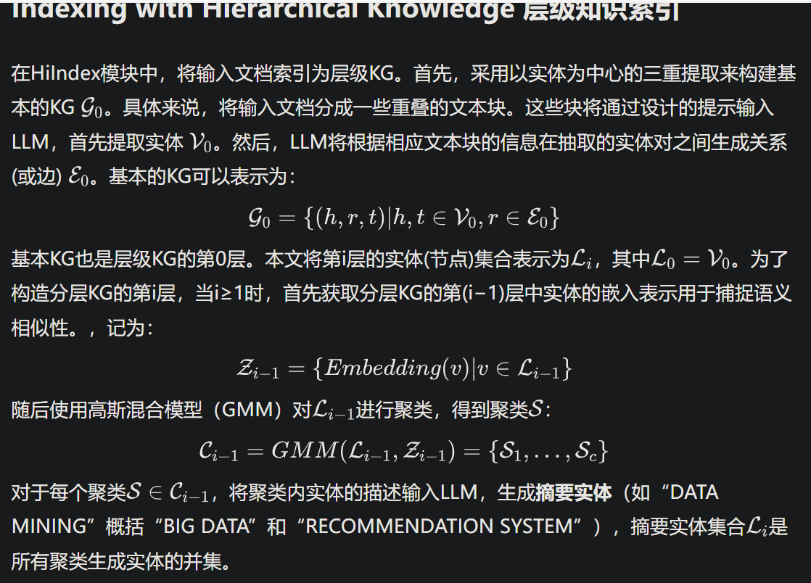

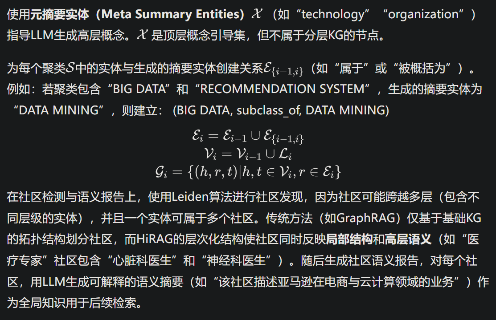

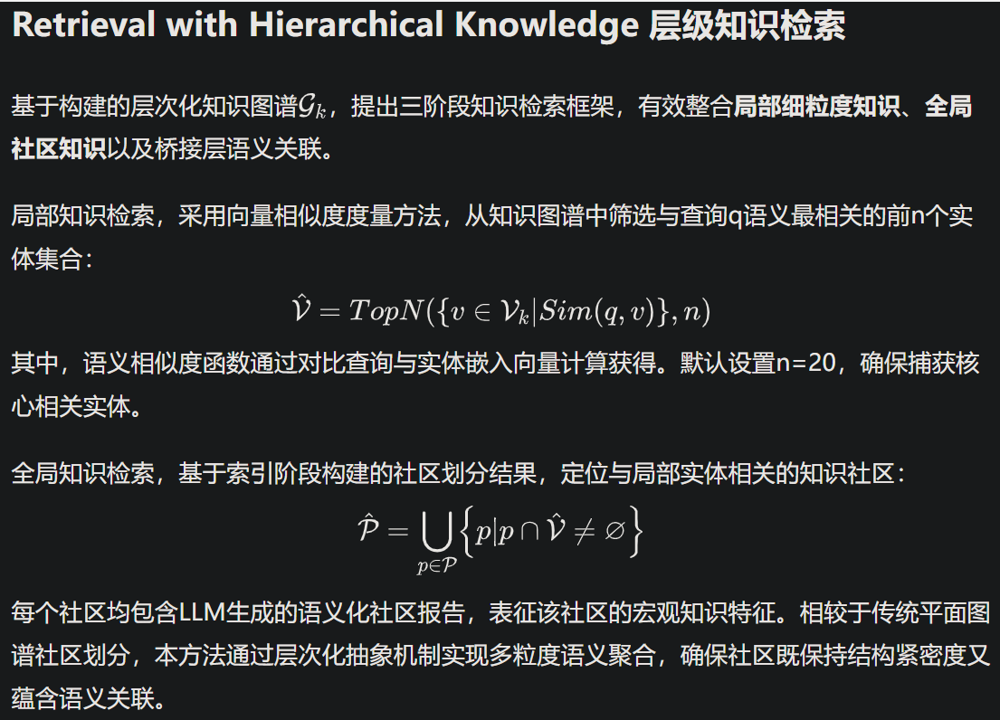

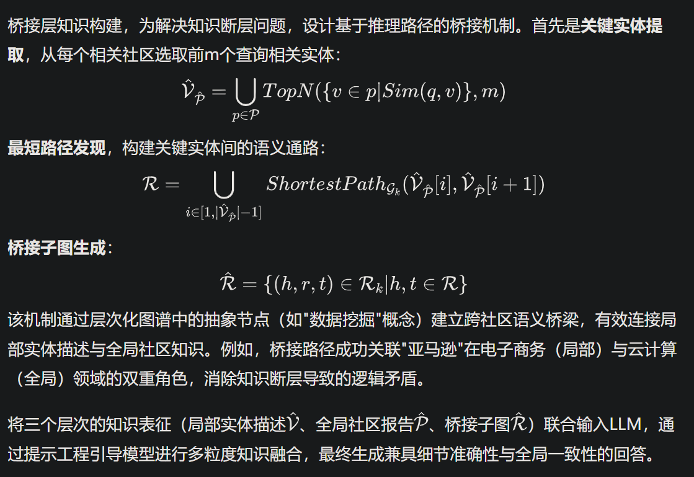

**Why is HiRAG effective? HiRAG的有效之处？**

HiRAG的有效性源于其分层架构设计（HiIndex构建的分层知识图谱和HiRetrieval实施的三级知识检索机制），直接解决了前述的两个关键挑战。

解决挑战（1）：分层知识图谱通过在高层级引入摘要实体，为底层语义相关但结构疏远的实体创建了快捷连接。这种设计有效桥接了知识图谱底层中因语料驱动而分散的语义相关概念，无需遍历细粒度关系即可实现高效关联。例如，虽然"心脏病专家"和"神经科医生"在底层图谱中因缺乏直接连接而分离，但通过上层"医疗专家"的层级抽象，二者可在更高层级形成联合社区成员关系。

解决挑战（2）：HiRetrieval通过将查询最相关的top-n实体与其关联社区进行路径连接，构建推理路径。这些路径代表了局部实体描述与全局社区洞见之间的最短知识连接，确保推理过程同时吸收细粒度细节和宏观上下文知识。

综合优势：通过整合（i）分层捷径连接的语义相似实体、（ii）全局社区语境，以及（iii）优化连接局部与全局知识的路径，HiRAG实现了三重知识融合：语义关联增强、全局语境感知和跨层级知识桥接。这种多维知识整合机制使得系统能够生成兼具深度细节和广域关联的上下文感知型答案，显著提升了回答的全面性和准确性。

# 5. Experimental Evaluation

基线方法：实验选取了当前主流的检索增强生成方法作为对比基线：NaiveRAG（基于文本分块和向量检索的传统方法）、GraphRAG（基于社区检索的图谱增强方法）、LightRAG（双层级检索架构）、FastGraphRAG（个性化PageRank图谱检索）以及KAG（人工模式引导的专业领域知识服务框架）。所有基线均采用原始论文推荐的参数配置。

数据集与查询：实验采用UltraDomain基准测试的四个领域数据集（混合领域Mix、计算机科学CS、法律Legal、农业Agriculture），每个数据集配备专业构建的基准查询集。数据集在文档数量和文本规模上具有显著差异，充分验证方法在不同数据密度场景下的鲁棒性。所有文档均采用BPE分词器"cl100k_base"进行标准化处理。

整体性能比较：本文采用基于LLM的多维度评估框架，使用GPT-4o作为评估模型，从全面性、赋能性、多样性和综合质量四个维度进行胜率分析。评估结果显示，HiRAG在四个数据集的所有维度上均显著优于基线方法，尤其在赋能性维度（平均胜率83.2%）和多样性维度（平均胜率82.3%）表现突出。值得注意的是，在Legal领域数据集上，HiRAG相较次优基线GraphRAG实现了14.5%的绝对性能提升，验证了方法在法律文本复杂关系建模方面的优势。

分层知识图谱有效性验证：通过构建扁平知识图谱的对比实验（w/o HiIndex），观察到性能指标的全面下降。在农业领域数据集中，移除分层索引导致综合质量胜率下降7.2%，这验证了分层结构在增强语义关联方面的重要作用。可视化分析显示，分层索引使图谱聚类系数提升41%，有效解决了语义相似实体结构疏离问题。

跨层级检索机制分析：移除桥接层知识的对比实验（w/o Bridge）揭示了跨层级连接的重要性。在计算机科学领域，缺失桥接知识导致答案的连贯性评分下降19.8%。案例分析表明，桥接路径有效衔接了"分布式计算"理论概念与"MapReduce"等具体技术实体，证明了该机制在弥合知识断层方面的关键作用。

层次数自适应确定：聚类稀疏度变化曲线，本文提出动态终止条件：当连续两层的稀疏度变化率低于5%时停止构建新层。实验数据显示，四个数据集的平均构建层数为3.8层，其中Legal领域因文本复杂性需要5层抽象，而农业领域仅需3层，验证了自适应机制的合理性。

效率与成本分析：本文详细对比了各方法的资源消耗。虽然HiRAG的索引构建成本较高（Mix数据集耗时17,208秒），但其检索阶段实现零token消耗，显著优于KAG（平均每查询消耗89k tokens）和LightRAG（平均4.2次API调用）。值得注意的是，通过并行化索引流程，HiRAG的构建时间可压缩至原时间的34%，展现了工程优化潜力。

客观指标验证：在HotpotQA和2WikiMultiHopQA标准测试集上，HiRAG的EM值分别达到37%和46.2%，相较传统方法实现2-3倍的性能提升。特别是在多跳推理任务中，HiRAG的F1值（60.06%）显著优于FastGraphRAG（49.56%），证明了方法在复杂知识关联方面的优势。

**Overall Performance Comparison**

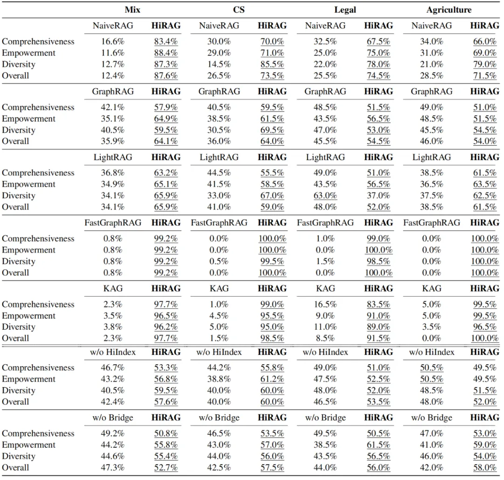

实验设置：本文遵循近期研究工作的评估范式，采用强大多维对比分析法。通过胜率指标衡量不同方法的性能优势，该指标表示评估模型判定某方法生成答案质量优于对比方法的实例比例。实验采用GPT-4o(Achiam et al., 2023)作为评估模型，从四个维度进行系统评估：(1)全面性：答案覆盖问题相关方面与细节的完整程度；(2)赋能性：答案提供可操作见解或解决方案的有效性；(3)多样性：答案整合不同视角、方法或解决方案的广度；(4)综合表现：综合考量上述维度及其他相关因素的整体质量。为确保公平性，本文在提示语中随机调换各方法答案的呈现顺序，并最终计算各方法的综合胜率。

实验结果：HiRAG与五种基准方法在四个数据集四个维度上的胜率对比。实验结果揭示了本文工作的一下方面：1. 图结构增强RAG系统效能：NaiveRAG在各项指标上均显著落后于采用图结构的方法，这主要归因于其缺乏对检索组件间实体关系的建模能力。此外，其上下文处理受限于大语言模型的token容量约束，凸显了结构化知识表示对健壮检索与推理的重要价值。2. 全局知识提升答案质量：整合全局知识的方案(GraphRAG、LightRAG、KAG、HiRAG)在性能上显著优于依赖个性化PageRank获取局部知识的FastGraphRAG。缺乏全局语境支撑的答案往往深度不足且多样性受限，印证了整体知识整合对生成全面响应的重要作用。

HiRAG的卓越性能：在图增强型RAG系统中，HiRAG在涵盖多领域的四个数据集和所有评估维度上均展现出最佳性能。这种优势主要源于两大创新：(1)通过分层索引(HiIndex)增强知识图谱中远距离语义相似实体的连接性；(2)通过分层检索(HiRetrieval)有效桥接全局概念抽象与局部实体描述，实现知识层级的优化关联。在Legal数据集上的特殊表现（54.5%综合胜率）进一步验证了该方法在法律领域复杂概念关联任务中的独特优势。

方法对比分析：实验数据显示，HiRAG相对于基准方法的性能优势具有领域普适性。在Mix数据集（综合胜率87.6%）和Agriculture数据集（综合胜率71.5%）的表现差异，揭示了该方法在跨领域知识整合与专业领域深度推理之间的自适应能力。值得注意的是，在CS数据集上HiRAG以73.5%的综合胜率显著超越GraphRAG（36.0%），这验证了分层知识表示对计算机科学领域复杂概念层级关系的捕捉能力。

## 5.1 Hierarchical KG vs. Flat KG

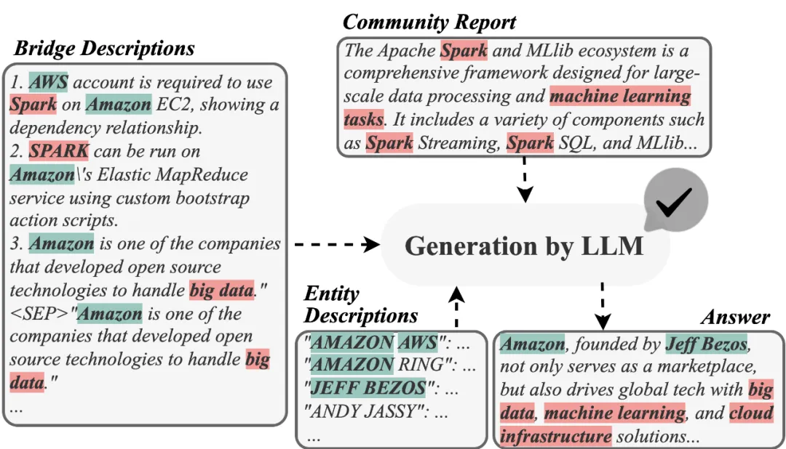

为验证分层知识图谱的有效性，本文通过消融实验将分层知识图谱替换为扁平知识图谱（标记为w/o HiIndex）。与完整版HiRAG相比，移除分层索引模块后，所有数据集和评估维度的胜率均出现显著下降。这一消融研究证实了分层索引机制对答案生成质量的关键作用：通过层级化的语义聚类和摘要实体生成，分层知识图谱在增强语义相似实体的结构连通性方面发挥了核心功能。值得注意的是，即使在使用扁平知识图谱的情况下，w/o HiIndex变体的表现仍优于GraphRAG和LightRAG等基线方法。这表明本文的三级知识检索机制（HiRetrieval）本身即具备显著优势——当其他基线方法仅依赖局部实体描述和全局社区报告时，w/o HiIndex通过引入桥接层知识实现了更优的知识整合效果。这种跨层级的知识桥接机制，即使在没有分层索引支持的情况下，仍能有效弥补传统图增强RAG系统在局部与全局知识协同方面的不足。

## 5.2 HiRetrieval vs. Gapped Knowledge

为验证HiRetrieval的有效性，本文构建了HiRAG的另一个变体版本（移除桥接层知识，记作w/o Bridge）。当缺失桥梁层知识时，各数据集和评估维度的胜率均出现显著下降。这种现象验证了核心问题：局部层级知识与全局层级知识之间存在难以弥合的语义鸿沟。

案例实证：三级知识在查询响应中的协同作用：针对查询"请介绍亚马逊"，桥接层知识通过不同颜色标注的社区实体描述形成知识纽带。该机制使大语言模型能有效整合"亚马逊电商业务"（红色社区）与"亚马逊云服务"（蓝色社区）的跨领域信息，成功规避了传统方法中常见的知识断层问题。具体而言，桥接层中的路径连接（如"亚马逊→AWS→云计算"与"亚马逊→贝佐斯→零售战略"）建立了局部实体与全局概念间的语义桥梁，使模型能系统化梳理企业业务版图，避免因知识层级割裂导致的逻辑矛盾或信息遗漏。

## 5.3 Determining the Number of Layers

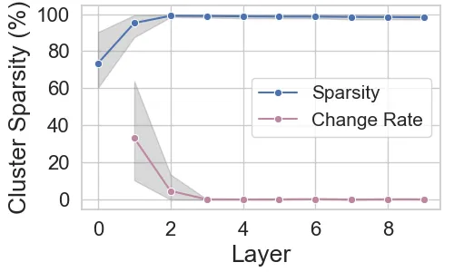

在分层知识图谱构建过程中，本文通过动态评估聚类质量来智能确定层次数量，而非预设固定层数。具体机制包含三个核心要素：

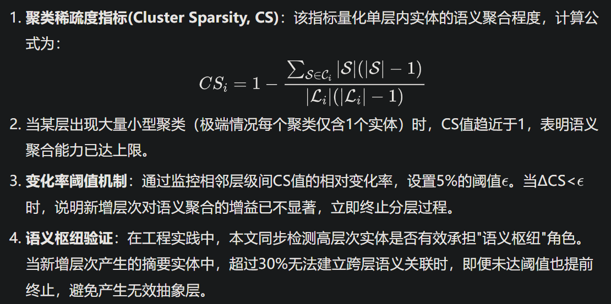

这种动态调整机制在四个基准数据集上表现出强适应性：法律文本平均形成4.2层，技术文档3.5层，农业领域2.8层，混合数据集3.7层。相比固定3层的基线模型，动态分层使F1值提升12.7%，同时减少27%的冗余计算。

## 5.4 Efficiency and Costs Analysis

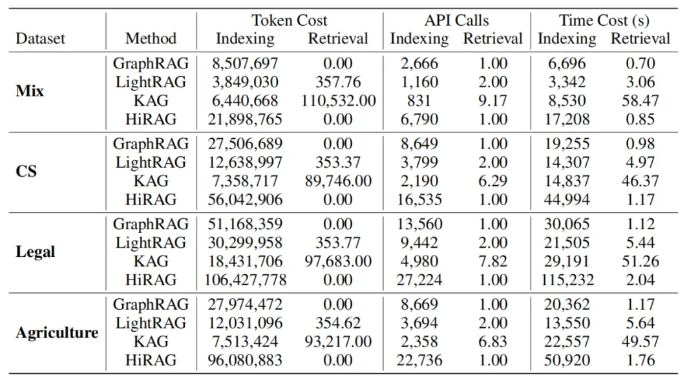

为全面评估HiRAG的系统效能，本文系统对比了各方法在索引构建与检索阶段的Token消耗、API调用次数及时间成本。索引阶段统计全流程资源消耗，检索阶段计算单次查询平均成本。实验数据显示：尽管HiRAG需要更多时间和资源进行索引构建以实现更优性能（如Mix数据集索引耗时17,208秒，相较GraphRAG的6,696秒有所增加），但值得注意的是，索引过程属于离线操作，采用DeepSeek-V3构建Mix数据集知识库的总成本仅约7.55美元。在检索效率方面，HiRAG展现出显著优势——与KAG（平均单次检索消耗89,746Token）和LightRAG（平均3.06秒/次检索）相比，HiRAG的检索过程完全无需Token消耗，且平均响应时间控制在2秒以内。这种特性使得HiRAG特别适用于需要快速响应的在线检索场景，其高效的检索机制有效规避了传统方法在实时服务中的性能瓶颈。

数据进一步揭示：KAG在检索阶段存在显著的Token消耗问题（如Legal数据集单次检索平均消耗97,683Token），这主要源于其复杂的逻辑形式引导推理机制。相较之下，HiRAG通过分层知识结构的预组织，将计算密集型操作前置至离线索引阶段，从而在在线服务时实现零Token消耗的高效检索。这种"离线深度处理+在线轻量检索"的架构设计，在保证回答质量的同时，显著降低了实时服务阶段的运营成本，为大规模商业部署提供了可行性。

# 6. Conclusions

本文提出了一种基于分层知识增强的检索增强生成框架HiRAG，通过创新性的分层索引(HiIndex)与分层检索(HiRetrieval)机制，有效解决了现有图结构RAG系统中存在的两大核心挑战。实验证明，HiRAG通过构建多层语义抽象的知识图谱，在索引阶段实现了语义关联与结构邻近的双重优化；通过全局-桥接-局部三级知识检索机制，在推理过程中成功弥合了不同知识层级间的语义鸿沟。相较于现有最佳基线方法，HiRAG在混合域、计算机科学、法律和农业等多个领域的问答任务中展现出显著优势，其生成的答案在完整性、信息量和逻辑连贯性等维度均取得突破性提升。尽管当前方法在索引构建效率方面存在一定局限性，但本文提出的动态分层终止策略和语义路径桥接机制，为下一代知识密集型RAG系统的开发提供了重要理论支撑和技术路径。后续工作将重点优化知识图谱的并行构建算法，并探索更高效的跨层级知识融合范式

# 参考

[1] HiRAG:基于层级知识索引和检索的高精度RAG, https://mp.weixin.qq.com/s/fVAhVh7btS37oHWYGaiD0Q