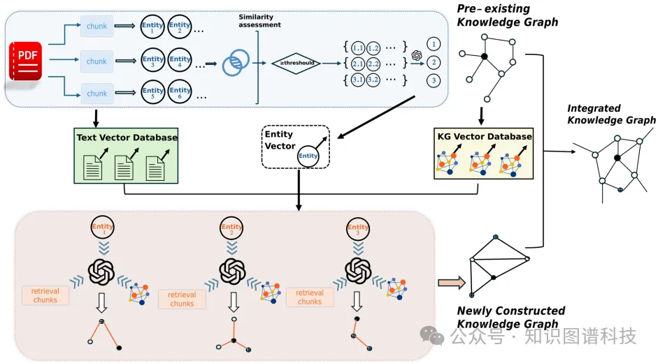

Github: https://github.com/LMMApplication/RAKG

随着基于知识图谱的检索增强生成（RAG）技术如GraphRAG和Pike-RAG的兴起，知识图谱在提升大型语言模型（LLMs）推理能力方面的作用日益凸显。然而，传统的知识图谱构建（KGC）方法面临复杂实体消歧、严格模式定义和跨文档知识整合不足等挑战。本文聚焦于自动文档级知识图谱构建任务。提出了一种文档级检索增强知识图谱构建（RAKG）框架。RAKG从文本块中提取预实体，并利用这些预实体作为RAG的查询，有效解决了LLMs中的长上下文遗忘问题，并降低了共指消解的复杂性。与传统的KGC方法相比，RAKG更有效地捕捉全局信息和不同节点间的相互联系，从而提升了模型的整体性能。此外，我们将RAG评估框架转移到KGC领域，对生成的知识图谱进行过滤和评估，从而避免了LLMs中因幻觉导致的错误生成实体和关系。我们通过为每篇文章构建标准的知识图谱，进一步开发了MINE数据集，并通过实验验证了RAKG的效能。结果显示，RAKG在MINE数据集上达到了95.91%的准确率，相较于当前最优基线GraphRAG（89.71%）提升了6.2个百分点。代码可在 https://github.com/LMMApplication/RAKG 获取。

研究方法
这篇论文提出了文档级别检索增强知识图谱构建（RAKG）框架，用于解决文档级别知识图谱构建的问题。具体来说，

知识图谱向量化
首先，将文档分块并向量化
预实体构建
对分块文本进行命名实体识别（NER），识别出初步实体并向量化，每个预实体被赋予类型和描述属性，并进行实体消歧，最终得到消歧后的实体集合。
关系网络构建
通过语料库回顾检索和图结构检索获取相关文本和关系网络，将检索到的文本和关系网络输入LLM生成关系网络。
知识图谱融合
合并新知识图谱中的实体和关系，确保与初始知识图谱的一致性。
实验设计

# 参考

[1] RAKG:文档级检索增强知识图谱构建 - 上海人工智能实验室等, https://mp.weixin.qq.com/s/z-NaHmiYUL818EyEr9AQ_w