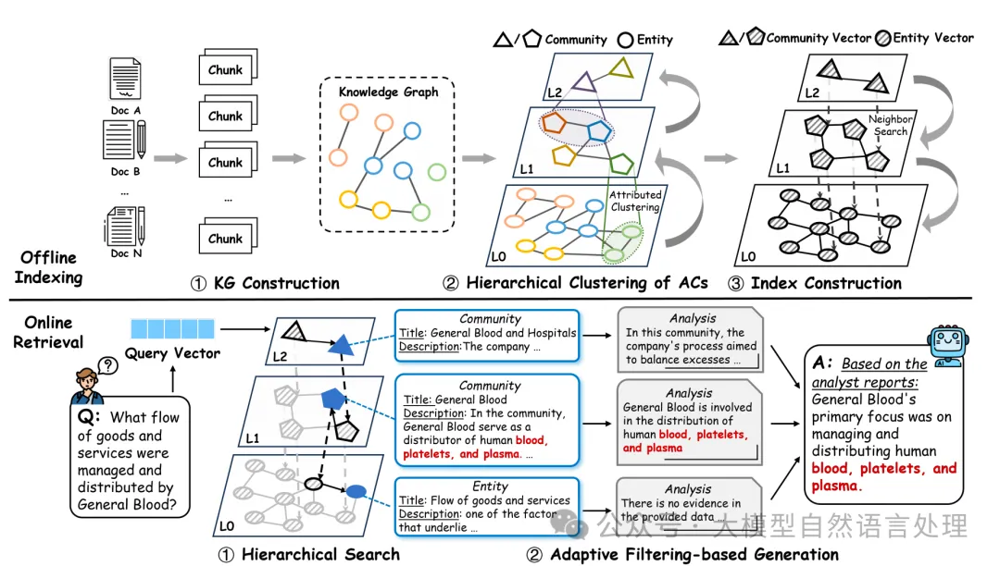

# 资源

参考文献：paper：ArchRAG: Attributed Community-based Hierarchical Retrieval-Augmented Generation [Technical Report]，https://arxiv.org/pdf/2502.09891v2

code：https://github.com/sam234990/ArchRAG

# 1. 问题

现有工作的工作流主要包括两个阶段：

(1) 离线索引：从给定语料库D构建知识图谱G(V,E)，其中每个顶点代表一个实体，每条边表示两个实体之间的关系，并基于知识图谱构建索引。

(2) 在线检索：使用索引从知识图谱中检索相关信息（例如节点、子图或文本信息），并将检索到的信息提供给大型语言模型以提高响应的准确性。

基于KG的RAG代表性的工作有GraphRAG等，如下表总结：

传统的GraphRAG影响性能的主要因素归结如下表：

| 问题             | 描述                                                                                                                                                                          |
|------------------|-------------------------------------------------------------------------------------------------------------------------------------------------------------------------------|
| 社区质量低       | 使用Leiden算法检测社区，仅依赖图结构，忽略节点和边的语义信息，导致社区包含不同主题，摘要质量差，影响性能。                                                                         |
| 兼容性有限       | 全局搜索和局部搜索策略仅在单一粒度上检索图元素，无法同时处理抽象和具体问题，限制现实世界场景适用性。                                                                             |
| 生成成本高       | 在抽象问题上表现良好，但分析大量社区耗时且资源密集。例如，在 Multihop-RAG 数据集检测到 2,984 个社区，回答 100 个问题需约 \$650 和 1.06 亿个 token。 |
| 实体识别不准确   | HippoRAG 等方法在实体识别方面存在问题，5.0% 的 HotpotQA 问题未能检测到实体，15.8% 的实体识别质量较低，导致不相关检索结果。                                                       |
| 检索过程不准确   | 基于图的 RAG 方法在搜索中常返回不相关内容，例如 GraphRAG 局部搜索时检索结果不准确，导致性能下降。                                                                               |

因此，ArchRAG改进的方向主要可以集中在通过改进社区检测和检索策略来解决这些问题。下面来看看，仅供参考。

# 2. 原理

ArchRAG分为两个阶段：离线索引（重点）和在线检索。如下图：
[09_langchain_neo4j.md](09_langchain_neo4j.md)

**离线索引阶段**

KG构建：与GraphRAG一样，使用LLM从文本语料库中提取实体和关系，形成子图并合并成一个完整的知识图谱（KG）。

层次化聚类：采用基于LLM的层次化聚类方法，检测出高质量的属性社区。这些社区不仅是节点密集连接的集合，还共享相似的语义主题。算法过程如下（重点看下该算法过程）：

C-HNSW索引构建：构建一个层次化的索引结构，用于高效检索不同层次的ACs和实体。

在线检索阶段

层次化搜索：在C-HNSW索引上进行高效的层次化搜索，检索出与查询相关的ACs和实体。

自适应过滤生成：利用LLM的内在推理能力来提取和分析相关信息，从检索到的信息中提取最相关的部分，生成最终的答案。

# 3. 实验

ArchRAG在特定QA任务上的表现优于现有的图基RAG方法，特别是在准确性方面提高了10%。

ArchRAG在令牌使用上比GraphRAG节省了高达250倍，显著提高了查询效率。

通过结合KNN或CODICIL与加权Leiden算法，提高了社区检测的质量。

回答示例：

# 参考

[1] 改进社区检测和检索策略大幅提升GraphRAG性能新框架-ArchRAG， https://mp.weixin.qq.com/s/zJEK3qhjzyqEnodGwXnu8Q 