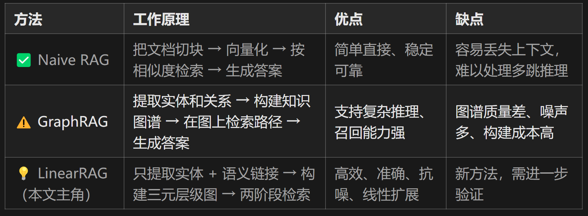
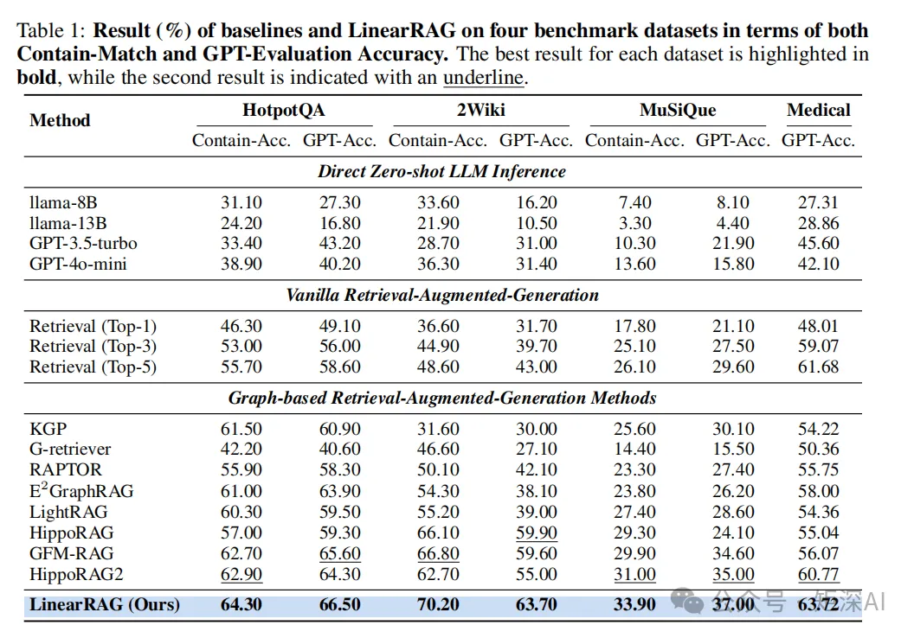
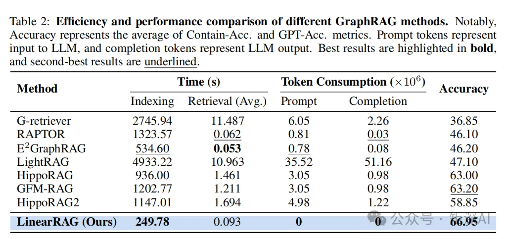
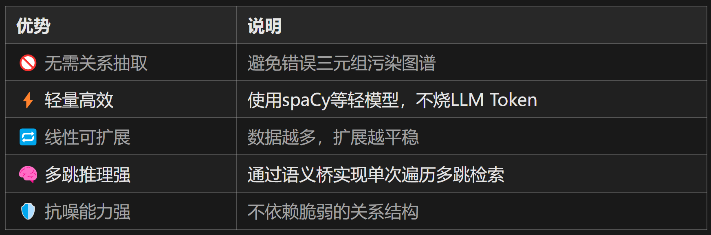

# 1. 资源

- GitHub：https://github.com/DEEP-PolyU/LinearRAG

# 2. 前语
最近在一直研究各种RAG技术用来工程化应用，但是尝试了耳熟能详的GraphRAG和LightRAG后，也发现了一些棘手的问题。

构建知识图谱 即 index 过程过于复杂，对于大文档来说非常耗时。
知识图谱的构建效果比较差，经常抽取出垃圾甚至错误的实体和三元组。
在错误的知识图谱引导下，其效果在感官上（直觉）甚至不如朴素的RAG。（在qwen3-embedding这种基于大语言模型的词嵌入模型加持下）
知识图谱的构建过程过于复杂，读代码也很头疼。（也可能作者能力有限）

直到我读到了一篇新论文 《LinearRAG: Linear Graph Retrieval-Augmented Generation on Large-scale Corpora》 ，或许这种RAG架构很接近我设想的方式。

接下来，让我们进入真正的主题：LinearRAG

传统RAG vs GraphRAG vs LinearRAG：谁更胜一筹？

📌 简单说：

Naive RAG 像是“关键词搜索”，快但浅。
GraphRAG 像是“构建思维导图后推理”，容易被噪声影响，负责、耗时。
LinearRAG 则另辟蹊径：不画抽取关系，只抓关键节点，靠“语义桥”连通信息孤岛。
GraphRAG 的“致命伤”：图谱越建越乱
你可能以为，有了知识图谱 = 万事大吉。但真相是：很多时候GraphRAG系统在真实场景下表现还不如最原始的RAG，其原因是，自动构建的知识图谱，往往充满错误。

研究发现，现有GraphRAG系统的性能下降，主要来自两个层面的问题：

局部不准（Local Inaccuracy）
比如这句话：

“爱因斯坦没有因为相对论获得诺贝尔奖。”

如果交给关系抽取模型处理，可能会被错误识别为：

(爱因斯坦, 获得诺贝尔奖, 相对论)
👉 直接把“否定”理解成“肯定”，事实完全颠倒！

这类错误在自然语言中极为常见，尤其是带有否定、条件、隐喻等表达时。

全局不一致（Global Inconsistency）
再看这个例子：

文档A说：“AI包括NLP和CV。”
文档B说：“AI包括无监督学习。”
文档C说：“无监督学习用于NLP。”

但如果每个句子独立抽关系，系统可能认为“NLP”、“CV”、“无监督学习”都是AI的并列子领域，忽略了‘无监督学习’其实是NLP中的技术方法。

结果就是：图谱结构混乱，推理路径出错。

🧠 打个比方：
这就像一群人各自画地图，没人沟通协调，最后拼起来的地图东一块西一块，根本没法导航。

破局之道：放弃关系抽取，拥抱“轻量级结构”
面对这些问题，港理工团队提出了一个大胆设想：

我们真的需要显式地抽取“主谓宾”三元组吗？

他们认为：不需要！

真正重要的是什么？
是那些跨文档对齐的实体（如“爱因斯坦”、“诺贝尔奖”、“相对论”），它们才是连接碎片化知识的“锚点”。

关系语义去哪了？
保留在原文段落里！大模型本身就能理解上下文中的复杂关系，何必强行拆成三元组引入噪音？

于是，提出了 LinearRAG ——一种无需关系抽取、高效可扩展的新一代检索增强框架。

PS：这个观点我非常认可，我一直都有这个想法， 抽取实体、关系三元组本身就会造成信息的丢失甚至信息的错误表达。而这个三元组本身就是从chunk中派生出来的。 现如今，embedding模型越来越强大，完全有可能通过语义相似度的方式去构建关系,而节点完全可以是chunk，这样既降低的构建知识图谱的复杂性，又保留了更多的语义信息。我认为LinearRAG甚至可以更进一步，抛弃sentence 节点来进行实现。（纯属个人观点）

核心创新：Tri-Graph + 两阶段检索
1. 构建 Tri-Graph：三层结构，轻盈又完整
LinearRAG 构建了一个名为 Tri-Graph（三图） 的层级图结构，包含三类节点：

🟦 实体节点（Entity）：如“爱因斯坦”、“AI”、“气候变化”
🟨 句子节点（Sentence）：原文中的每一句话
🟥 段落节点（Passage）：原始文本块
实体抽取方法：

不依赖大模型，直接使用spaCy（轻量级模型） 进行抽取。
边的连接规则很简单：

实体出现在某句子中 → 连接到该句子
实体出现在某段落中 → 连接到该段落
这样就形成了两个关系矩阵：

Mention Matrix：句子←→实体
Contain Matrix：段落←→实体
特点：
不依赖LLM做关系抽取，零Token消耗
使用轻量NER工具（spaCy），速度快、精度高
图谱更新只需局部重建，支持线性扩展
实验显示：相比传统GraphRAG，索引时间减少77%以上！

2. 两阶段检索：先激活实体，再召回段落
检索过程分为两个阶段，层层递进：

第一阶段：局部语义桥接（Local Semantic Bridging）
🎯 目标：找出与问题相关的“中间实体”，打通多跳路径。

举个例子：

问：“哪些技术推动了现代语音识别的发展？”

单纯匹配“语音识别”可能找不到提到“深度神经网络”的段落。但通过“语义桥”可以发现：

“语音识别” ↔ “端到端模型” ↔ “Transformer” ↔ “深度神经网络”
这些中间实体虽然没出现在问题中，但语义相近，能帮助打通信息链。

🔧 方法：

计算查询与初始实体的语义相似度
在句子层传播相似性，激活潜在相关实体
形成“激活实体集”
第二阶段：全局重要性聚合（Global Importance Aggregation）
🎯 目标：从全局视角评估哪些段落最重要。

🔧 方法：使用 个性化PageRank（Personalized PageRank）

将第一阶段激活的实体作为“种子”
在实体-段落子图上运行PR算法
得到每个段落的重要性得分
返回Top-K最相关段落
实验结果：全面超越SOTA！
直接贴上论文中的数据：

四个基准数据集上的结果， 包括包含匹配准确率和GPT评估准确率

ndex耗时-token消耗-准确度表

📈 关键结论：

它的构建速度更快、资源消耗更低，真正实现了“高性能 + 高效率 + 高可靠性”三位一体。

为什么 LinearRAG 是未来的方向？

# 参考

[1] 全新RAG框架 LinearRAG :无需关系抽取，高效又精准！超越GraphRAG和LightRAG! https://mp.weixin.qq.com/s/XP1vpEi1Dw-hhTH8HJ2fYA