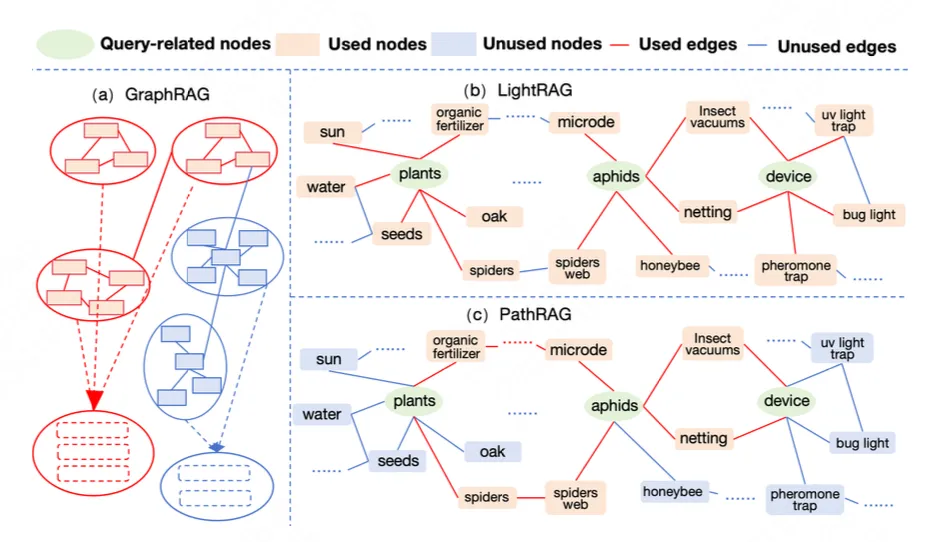
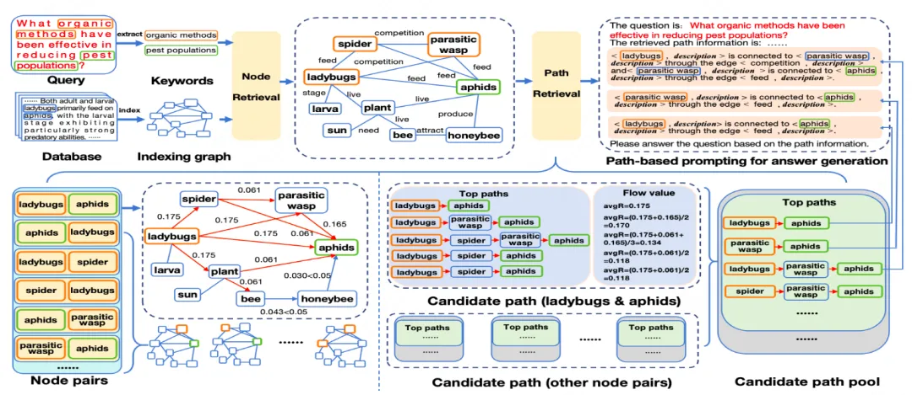
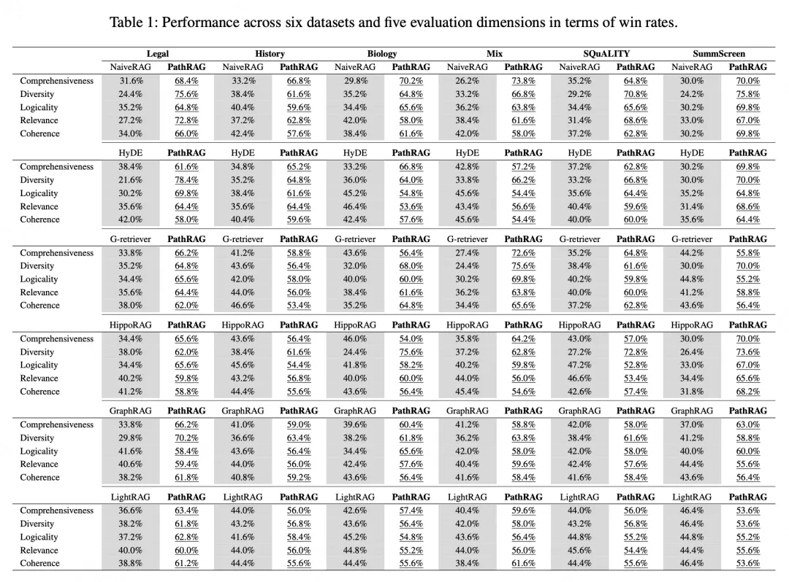
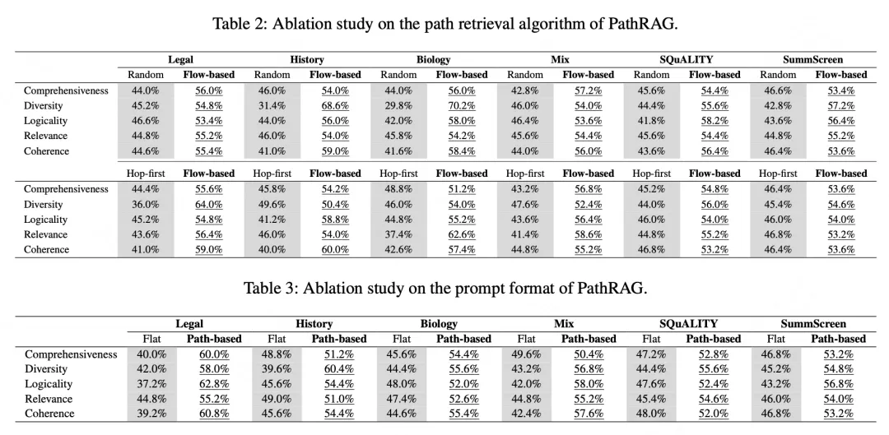
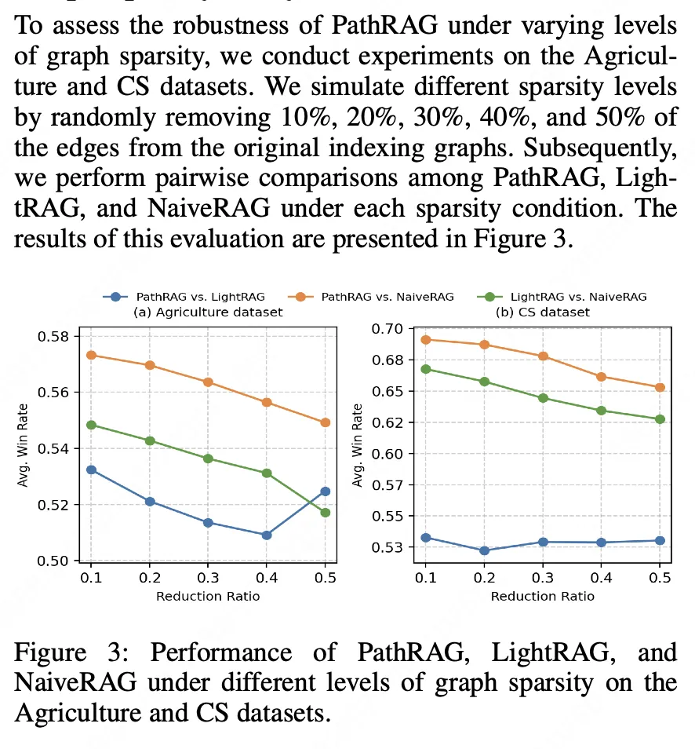
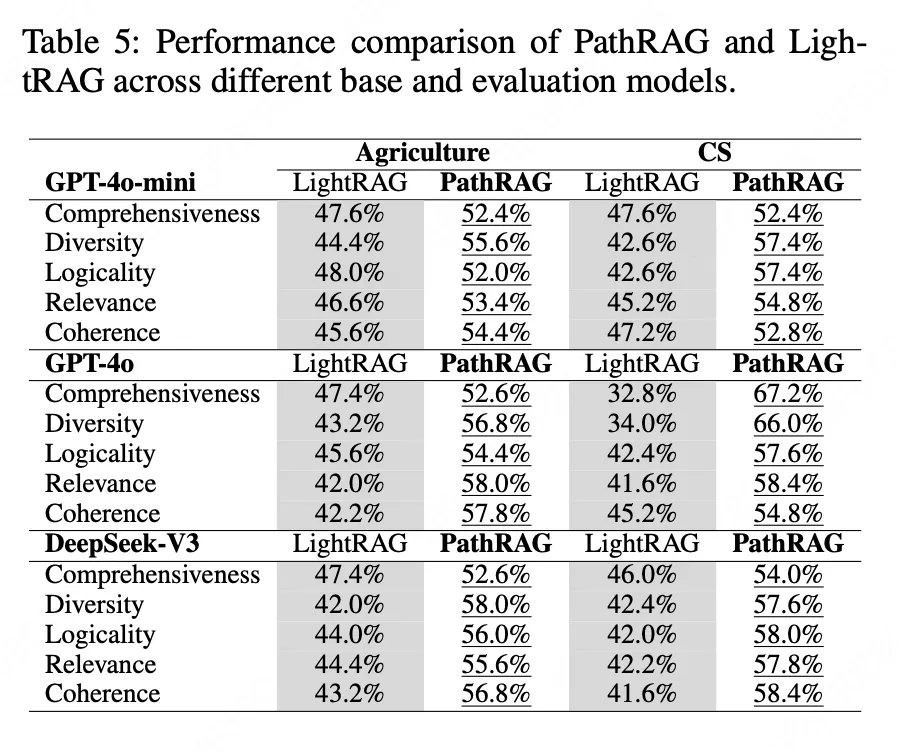

# 1. 资源

近日，CCF A类国际会议AAAI 2026放榜。北邮GAMMA LAB实验室的PathRAG工作被AAAI 2026录用，下面是论文详细介绍：
AAAI 2026|PathRAG: Pruning Graph-Based Retrieval Augmented Generation with Relational Paths
作者：Boyu Chen, Zirui Guo, Zidan Yang, Yuluo Chen, Junze Chen, Zhenghao Liu, Chuan Shi, Cheng Yang
链接：https://arxiv.org/abs/2502.14902

# 2. 原理

一、摘要
检索增强生成（RAG）通过从外部数据库检索知识，提高了大语言模型（LLM）的响应质量。典型的RAG方法将文本数据库切分为若干块，并以扁平结构组织，便于高效检索。为更好地捕捉文本数据库中的内在依赖和结构化关系，研究者提出将文本信息组织为索引图，并称为基于图的RAG。然而，我们认为，现有基于图的RAG方法的局限在于检索信息的冗余性，而非信息不足。此外，以往方法在提示词中仍以扁平结构组织检索到的信息，导致效果次优。为克服这些局限，我们提出了PathRAG，它从索引图中检索关键关系路径，并将这些路径转换为文本形式用于提示LLM。具体来说，PathRAG通过基于流的剪枝有效减少冗余信息，同时利用基于路径的提示引导LLM生成更具逻辑性和连贯性的回答。实验结果表明，PathRAG在六个数据集和五个评测维度上均优于当前最先进的基线方法。

二、核心技术
2.1 基于流量的路径剪枝算法
Graph-based RAG直接使⽤检索节点的⼀阶⼦图作为检索信息，该信息可能会存在噪⾳，且⼦图信息直接拼接后提供给⼤模型，导致潜在关联信息的缺失。针对这些问题，PathRAG提出了基于流量的路径剪枝算法。

核⼼点在于，针对任意两个基于query检索得到的检索节点，将其交替作为流量的起点与终点，进⾏初始流量的分发与最终流量的汇聚。在这个过程中，每个节点都将获取上游节点沿边传递⽽来的流量，也将继续向下游节点沿边进⾏流量的传递，边上也设置了磨损率来模拟信息的传递损失。之后，使⽤边上的均值流量对路径进⾏重要性排序，选取topk个路径提供给⼤模型进⾏问题的回答。

该⽅法不仅能有效减少“与检索节点相关⽽与问题回答⽆关”的噪⾳，还对检索信息进⾏了重要性排序，筛选出了更重要的信息帮助⼤模型进⾏回答，并额外获得了⼀阶⼦图外的节点、边信息，提⾼了模型的性能。

2.2 基于路径的prompt模板
考虑到直接拼接检索信息，会造成信息之间潜在关联的缺失，导致⼤模型⽆法很好地使⽤检索信息进⾏⾼质量的回答。PathRAG将检索信息以路径的形式显式地提供给⼤模型，指导其进⾏信息使⽤与问题回答。

同时考虑到⼤模型常⻅的“lost in the middle”现象，依照此前的重要性排序，将更为重要的信息放置于末尾能有效提⾼模型的性能。

三、实验
PathRAG沿⽤了GraphRAG与LightRAG的评估体系及数据集，并在更多的评估维度和数据集上相较基线有着更为出⾊的性能。

消融实验上也证明了基于流量的排序与基于路径的prompt模板的有效性。

通过对索引图进行随机的删除，可以观察到其在稀疏图上的可拓展性。

此外，通过更换不同的大模型基座，我们也验证了其广泛的适用性。

# 参考

[1] AAAI 2026 | PathRAG: 基于剪枝图的关系路径检索增强生成, https://mp.weixin.qq.com/s/RrohNC65RQxtUV1aQJH8xw