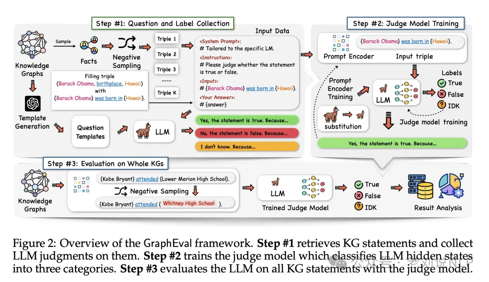

# 1. 资源

论文：
- Evaluating the Factuality of Large Language Models using Large-Scale Knowledge Graphs
- 地址：https://arxiv.org/pdf/2404.00942

代码：https://github.com/xz-liu/GraphEval

# 2. 原理

知识图谱用于大模型评估一个结合方向，《Evaluating the Factuality of Large Language Models using Large-Scale Knowledge Graphs》，这一工作提出GraphEval框架，用于测量语言模型与KG的关联性。

如图2所示，分为三步：

第一步：从KG和LLM中收集问题和标签。该模型从KG中采样三元组，并使用GPT-4创建的模板将每个三元组转换为陈述性语句。为了准备通用语句，采用负抽样，即故意生成错误的语句。之后，这些语句会被提出来收集由LLM回答的标签（即是、否和我不知道（IDK））。

第二步：评价模型训练。利用第一步收集到的三元组，训练一个评价模型，以避免生成冗长的文本并节省资源。

第三步：对整个大模型进行评估。与第一步类似从大模型中获取所有真/假语句。然后，将这些语句输入评价模型，以估计LLM的事实性。

# 参考

[1] 也看RAG优化策略之RQ-RAG及其与EventGround事件推理的结合：兼看值得一看的几个大模型综述, https://mp.weixin.qq.com/s/fKGi3rq3mqgMJrSvSO3OOA