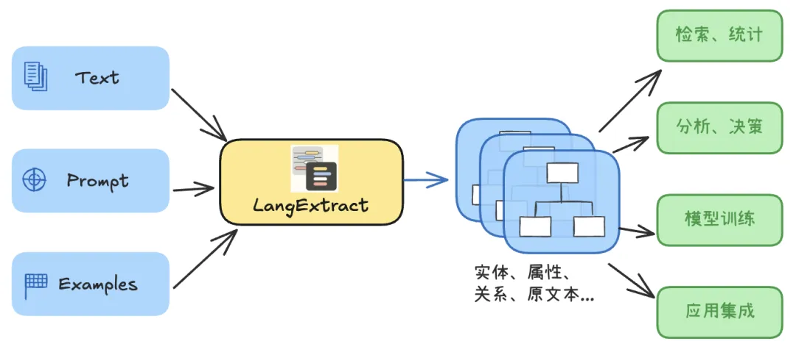
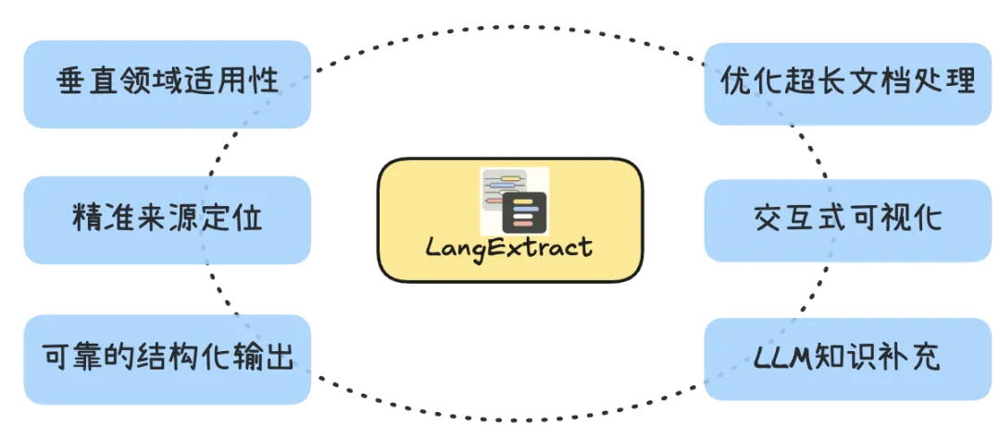
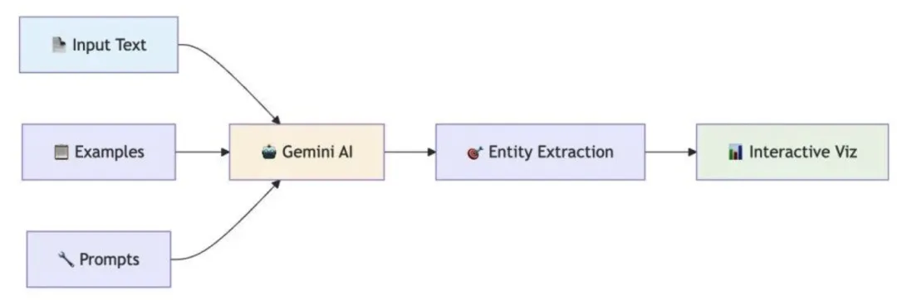
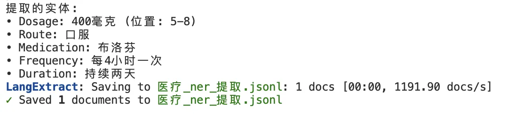
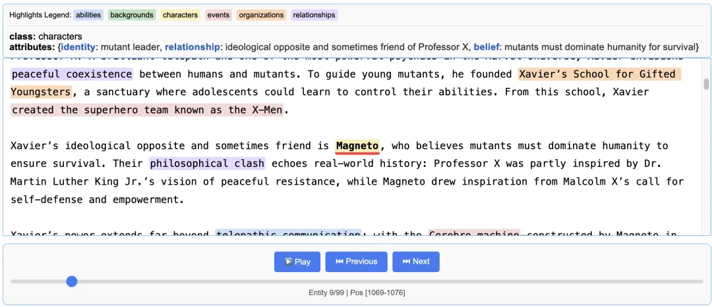
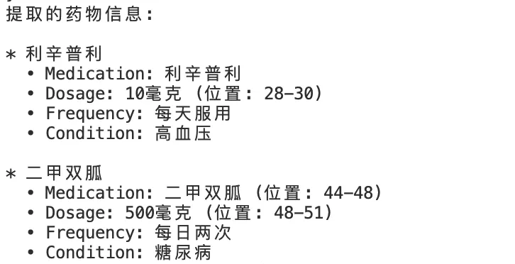
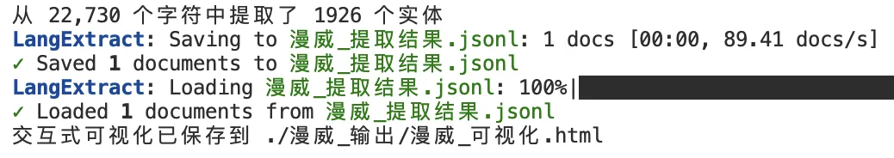
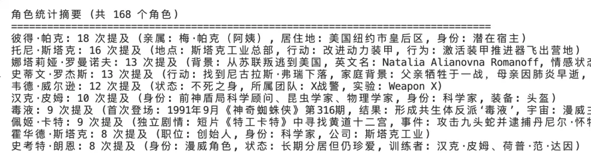
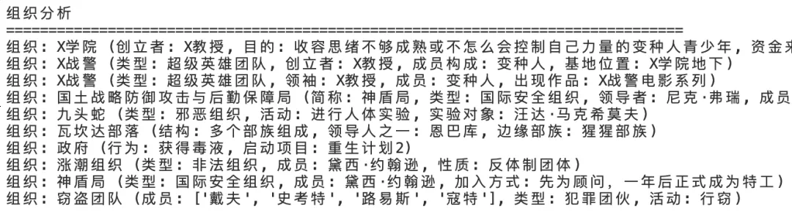
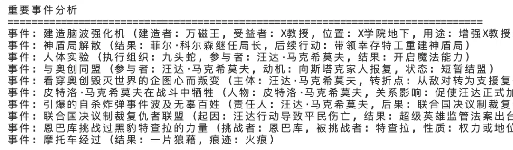

# 1. 资源

- Github (12.1k stars): https://github.com/google/langextract

# 2. 简介

在数据驱动的时代，大量有价值的信息隐藏在非结构化文本中—比如详尽的临床记录、冗长的法律文件、大量客户反馈与评价等。很多时候我们需要把其抽取成更结构化的内容。这是因为结构化信息：更易于被索引与查询、更适合统计分析与挖掘，也更易于被软件集成（RPA、API、工作流等）。

本篇为大家介绍LangExtract -- Google 新出品的一款开源Python 工具。它可以更完美的借助LLM，并根据用户指令，将海量非结构化文本转换为结构清晰、来源可追溯的结构化信息 。这也是近期看到最好的 “小而美” 工具之一：简洁、高效、有用。

# 3. 起源与动机

从低密度的自然语言文本中做结构化信息抽取一直是 AI 的难题。传统方法要么依赖繁琐的正则表达式，要么借助机器学习提取上下文特征，但很难应对语言多变、含义深刻的真实语料。 LLM给我们看到了解决问题的新方向，但是：

尽管当前的LLM已经具备了通识领域非常强大的自然语言理解能力，且具备结构化输出能力（大部分LLM）。但直接让 LLM “读文本吐结构” 仍然存在诸多痛点：

- 结果不稳定：同一段文本，用不同提示或在模型状态稍有变化时，输出的结果可能大相径庭 。
- 缺乏溯源：模型生成的字段难以定位到原文具体位置，审核和验证非常困难 。
- 长文本乏力：一旦文本过长（数万字乃至更多），模型容易“迷失”，简单截断又可能遗漏全局信息 。
- 跨领域适应难：不同领域（医疗、法律、金融、舆情等）的抽取需求各异，直接让模型覆盖所有领域往往力不从心，细调模型代价高昂。

LangExtract 正是为了解决上述这些问题而生 。它由 Google 开源，可以让开发者通过自然语言指令和少量示例数据来定义并完成抽取任务 。



相较于普通 LLM 的直接输出，LangExtract 在后台采取了一系列策略来强化结果的可靠性和可控性。开发者无需深厚的机器学习专业知识，只需用几行代码结合提示和示例，就能高效地将自由文本转换为结构化数据：它尝试把 LLM 抽取变成了一套可控、可追溯的过程。

# 4. 区别于直接LLM输出的特点

与让LLM直接尝试生成 JSON 等结构化结果相比，LangExtract 提供了一整套机制来保证抽取结果的准确、稳定和易用。其主要特点包括：



- 广泛的领域适用性：针对垂直领域，只需编写相应的提示和示例，无需对底层 LLM 进行微调，它就能理解并执行新的抽取任务 。从司法文书里的日期地点至医学报告的数据结构化，都可以通过更改 Prompt 和示例实现 。
- 精准的来源定位：每个抽取结果都能映射回原文中的精确位置。提取的数据带有字符偏移索引，方便人工审核和验证 。这一特性使得抽取过程透明可追溯。
- 可靠的结构化输出：开发者可以通过提示词描述所需的输出结构，并提供一组高质量的Few-Shot示例来定义 schema。LangExtract 会确保模型严格遵循预期的字段格式，即使面对复杂任务输出也稳定一致 。
- 优化的长文档处理：针对“海量文本、大海捞针”式的抽取难题，LangExtract 采用分区块+多线程并行+多轮抽取的策略 。即使百万级字符的长文档也能被有效“扫描”，不错过隐藏的关键信息。
- 交互式可视化：LangExtract 可以生成交互式的 HTML 报告，并使用颜色高亮标注每个提取实体在原文中的位置，且提供导航控件方便浏览大量注解 。对于需要人工复核或演示汇报的场景，方便了对结果的理解和质量评估。
- 善用 LLM 的通用知识：LangExtract 允许模型运用自身的通用知识来补充额外信息 。例如让模型基于其知识增加抽取的人物身份或时代背景等属性。在保证核心数据可追溯的前提下，适度发挥模型的知识推理能力，使结果更丰富。（当然，这部分推断内容的准确性取决于模型能力和提示的引导 ）

以上这些特性使得 LangExtract 将大模型从一个不可控的“黑盒”变成了开发者手中可定制、可追踪的工具。特别是对于追求严格数据质量和合规性的企业应用来说，这种严格的控制力正是我们非常需要的。

# 5. 实例演示：LangExtract抽取医学报告

LangExtract 的核心思想最早正是应用于医学信息抽取研究：例如从临床笔记中自动识别药物名称、剂量、频率、适应症状等用药信息，并构建信息间的关系 。

我们通过一个简单示例演示 LangExtract 在该领域的应用。在该示例中，LangExtract从杂乱的病人记录里提取出用药清单，包括药物名称、用法用量，以及不同药物之间的分组关系等，实现了对非结构化病历到结构化用药报告的自动化转换。

使用LangExtrace进行结构化信息抽取的基本步骤如下：



【基础抽取】

这里逐步完成一个基础示例：

定义抽取任务描述 (Prompt)：以自然语言撰写一段提示，清晰说明需要从文本中提取什么信息、遵循什么规则。

```python
import textwrap
import langextract as lx
from langextract.factory import ModelConfig

# 提取指令
prompt_description = textwrap.dedent("""\
提取药物信息，包括药物名称、剂量、给药途径、频率和持续时间，按照它们在文本中出现的顺序提取。
""")
```

提供高质量示例 (Few-shot Examples)：人工构造若干示例，展示给定一段文本时期望的提取结果。这些示例将作为模式指导，帮助模型明白如何输出。

```python
examples_ner = [
    lx.data.ExampleData(
        text="患者被给予250毫克静脉注射头孢唑啉，每日三次，持续一周。",
        extractions=[
            lx.data.Extraction(extraction_class="dosage", extraction_text="250毫克"),
            lx.data.Extraction(extraction_class="route", extraction_text="静脉注射"),
            lx.data.Extraction(extraction_class="medication", extraction_text="头孢唑啉"),
            lx.data.Extraction(extraction_class="frequency", extraction_text="每日三次"),
            lx.data.Extraction(extraction_class="duration", extraction_text="持续一周")
        ]
    )
]
```

执行抽取 (Extraction)：调用 LangExtract 的接口，将待处理的输入文本传入，并附上定义的提示描述和示例数据，以及指定所用的底层模型。LangExtract 会自动调用 LLM，对文本进行分析并提取所需信息，返回结构化的结果。

(这里使用了某API平台的OpenAI兼容接口，模型为qwen3-14b)

```python
input_text = "患者服用了400毫克口服布洛芬，每4小时一次，持续两天。"

#配置模型 - 明确指定OpenAI提供者
model_config = ModelConfig(
    model_id="qwen3-14b",  
    provider="OpenAILanguageModel",  # 明确指定使用OpenAI提供者
    provider_kwargs={
        "temperature": 0.1,
        "max_tokens": 2048,
        "base_url": "your-base-url",
        "api_key": "your-api-key"
    }
)

result_ner = lx.extract(
    text_or_documents=input_text,
    prompt_description=prompt_description,
    examples=examples_ner,
    config=model_config,  # 使用 ModelConfig
    fence_output=True,
    use_schema_constraints=False,
    debug=False
)
```

输出与可视化结果：你可以直接对解析结果进行输出，也可以将结果对象保存为 JSONL 文件，然后利用库提供的 visualize 方法生成交互式HTML文件。

```python
print("提取的实体:")
for entity in result_ner.extractions:
    position_info = ""
    if entity.char_interval:
        start, end = entity.char_interval.start_pos, entity.char_interval.end_pos
        position_info = f" (位置: {start}-{end})"
    print(f"• {entity.extraction_class.capitalize()}: {entity.extraction_text}{position_info}")

# 保存结果
lx.io.save_annotated_documents([result_ner], output_name="医疗_ner_提取.jsonl")
print("\n基础NER结果已保存到 医疗_ner_提取.jsonl")    

html_content_ner = lx.visualization.visualize("./test_output/医疗_ner_提取.jsonl")
with open("医疗_ner_可视化.html", "w", encoding='utf-8') as f:
    f.write(html_content_ner)
```

LangExtract的解析结果为Extraction类型的对象列表，它代表了抽取信息的完整结构。它是一个数据结果的容器，包含有如下信息：

核心层 - 定义"是什么"

extraction_class: 实体类型（如"medication", "person"等）

extraction_text: 提取的具体文本内容(如“布洛芬"）

定位层 - 记录"在哪里

char_interval: 字符级别的精确位置

token_interval: Token级别的位置（更适合NLP处理）

组织层 - 管理"如何组织"

extraction_index: 全局序号

group_index: 分组编号

alignment_status: 匹配质量状态

语义层 - 描述"更多信息"

description: 人类可读的描述

attributes: 结构化属性字典（关键特性！）

上面的简单例子中简单的打印了extraction_class与extraction_text信息：



此外，我们把结果可视化到了一个html文件。通过它你可以直观的查看提取的实体列表及其在原文本的位置（追溯）。

遗憾的是，目前LangExtraction版本的可视化(visualization）功能对中文支持不完善。如果是英文环境，利用输出的html文件，可看到类似如下的效果：



【关联抽取】

实际应用中，可能需要把多个相关的抽取结果关联在一起，比如在上例中，需要把一种药物的名称、用法、剂量等关联到一起。这有两种方法可以实现：

利用分组关联多个实体

这种方法给每一个抽取实体赋予一个”分组“属性，比如medication_group，这样，具有共同分组属性的实体就被自然的关联起来，而你只需要修改提示词和示例。

我们对上面的例子改造，引入更复杂的医学文本（input_text）：

“患者上个月被开了利辛普利和二甲双胍。他每天服用利辛普利10毫克治疗高血压，但经常漏服二甲双胍500毫克剂量，应该每日两次服用治疗糖尿病。”

现在修改prompt和examples：

```python
prompt_description_re = textwrap.dedent("""\
提取药物及其详细信息，使用属性将相关信息分组：
1. 按照实体在文本中出现的顺序提取
2. 每个实体必须具有 'medication_group' 属性，将其链接到相应的药物
3. 一个药物的所有详细信息应该共享相同的 medication_group 值
""")  

examples_re = [
    lx.data.ExampleData(
        text="患者服用阿司匹林100毫克每日一次用于心脏健康，以及辛伐他汀20毫克睡前服用。",
        extractions=[
            # 第一个药物组
            lx.data.Extraction(
                extraction_class="medication",
                extraction_text="阿司匹林",
                attributes={"medication_group": "阿司匹林"}
            ),
            lx.data.Extraction(
                extraction_class="dosage",
                extraction_text="100毫克",
                attributes={"medication_group": "阿司匹林"}
            ),
            lx.data.Extraction(
                extraction_class="frequency",
                extraction_text="每日一次",
                attributes={"medication_group": "阿司匹林"}
            ),
            lx.data.Extraction(
                extraction_class="condition",
                extraction_text="心脏健康",
                attributes={"medication_group": "阿司匹林"}
            ),

            # 第二个药物组【省略】
        ]
    )
]
```

这里通过medication_group把一个药物相关的多个抽取实体关联起来。现在，通过对抽取结果解析打印（代码略），可以轻松查看每种药物的关联性质：



以实体为中心的属性抽取

另外一种抽取方式是以药物作为中心的抽取实体，而其他相关的性质则作为药物实体的属性抽取。提示与示例如下：

```python
prompt_description_attr = textwrap.dedent("""\
提取药物信息，将每个药物作为主要实体，其相关的剂量、频率、途径、适应症等信息直接作为该药物的属性：
1. extraction_class 统一为 "medication"
2. extraction_text 为药物名称
3. 所有相关信息（剂量、频率、给药途径、适应症、持续时间等）放在 attributes 中
4. 按照药物在文本中出现的顺序提取
""")

examples_attr = [
    lx.data.ExampleData(
        text="患者服用阿司匹林100毫克每日一次用于心脏健康，以及辛伐他汀20毫克睡前服用。",
        extractions=[
            lx.data.Extraction(
                extraction_class="medication",
                extraction_text="阿司匹林",
                attributes={
                    "dosage": "100毫克",
                    "frequency": "每日一次", 
                    "condition": "心脏健康",
                    "route": "口服"  # 可以推断或明确提及
                }
            ),
```

在调用lx.extract进行抽取与结果解析后，你应该得到与上面方式基本一致的结果。

**实例演示：LangExtract超长文本抽取**

如果你针对超长文本进行传统的结构化信息提取（借助LLM），你可能会面临模型理解能力下降（详见大模型“大海捞针”测试结果）、性能低下、准确率不够等问题。

LangExtract针对长文本的解析与抽取做了更多独特的设计。

我们用一篇“漫威世界背景知识”的文本文件做测试，该文件共约23000个中文字符。文件中描述了大量漫威世界中的人物、关系、事件、组织等，很适合用来做复杂的结构化信息抽取与知识图谱的测试。

首先仍然是设定prompt并提供examples：

```python
prompt_description = textwrap.dedent("""\
从给定的漫威宇宙文本中提取角色、能力、关系、组织和事件。
为每个实体提供有意义的属性以增加上下文和深度。
重要提示：使用输入文本中的确切文字作为 extraction_text，不要意译。
按出现顺序提取实体，不要重叠文本片段。注意：在漫威宇宙中，角色通常有多个身份、绰号、能力和隶属组织。""")
example_data = [
    ExampleData(
        text="X教授是一位在漫威漫画中的出版物《X战警》中的虚构人物。X教授和至交好友万磁王不同，他一心想让变种人与人类能和平共处。",
        extractions=[
            Extraction(
                extraction_class="角色",
                extraction_text="X教授",
                attributes={"身份": "变种人领袖", "能力": "心灵感应", "组织": "X战警", "目标": "人类变种人和平共处"}
            ),
            Extraction(
                extraction_class="角色", 
                extraction_text="万磁王",
                attributes={"身份": "变种人", "关系": "X教授至交好友", "立场": "与X教授不同"}
            ),
            Extraction(
                extraction_class="组织",
                extraction_text="X战警", 
                attributes={"类型": "超级英雄团队", "领袖": "X教授", "成员": "变种人"}
            ),
            Extraction(
                extraction_class="关系",
                extraction_text="至交好友",
                attributes={"类型": "友谊", "人物1": "X教授", "人物2": "万磁王", "状态": "理念不同"}
            ),
        ]
    ),

    .....    
```

接下来从文件中读取内容进行解析，这里的解析参数有一些针对长文本的特殊设定：

```python
...从文件读取到marvel_text...

# 处理漫威宇宙文本
result = extract(
    text_or_documents=marvel_text,
    prompt_description=prompt_description,
    examples=example_data,
    config=model_config,
    extraction_passes=2,      # 多轮提取提高召回率
    max_workers=5,           # 并行处理加速
    max_char_buffer=1024,      # 较小的上下文窗口提高准确性
    fence_output=True,
    use_schema_constraints=False
)
```

这里省略后续的输出打印部分，直接看最后的解析结果，一共提取1926个实体：



打印出提取的前十名角色及属性：



前十名组织（这里看到一点瑕疵：X战警这个组织出现了两次）：



重要事件的前十名：



最后总结下LangExtract在超长文档解析上的一些设计策略：

多次提取：借助extraction_passes参数，可以执行独立的多次提取，以发现每次提取中出现的新的非重叠实体，从而减少遗漏。

智能分块：通过分块使用更小的上下文，提高单次推理的提取质量，减少上下文干扰；通过对文本分隔符等智能识别，确保上下文完整性和格式规范。

并行处理：为了提高大文档的处理性能，可以设置并行化处理（max_workers）参数，以减少总体延迟，同时也可以更好的配合分块处理。

# 总结与应用展望

 LangExtract 为从非结构化文本中获取洞察带来了新的体验和很多有效的改进——将 LLM 功能以一种更可控、可靠的方式应用于信息抽取，极大的解决了结果不可预期和不可溯源的问题，这对于企业场景中的应用具有重大的意义。

LangExtract可以在很多企业级场景中获得应用：

医疗与金融等专业报告结构化：正如前面的测试样例，用LangExtract提取临床文本报告中的药物名称、剂量、用法等，并自动建立药物与属性之间的关联关系，用于后续医学分析挖掘甚至诊断。同样，在金融领域，它也可以读取财报或研报，提炼出指标数据和关键信息，为风控和决策提供支持。类似地，工程日志、学术论文，舆情报告，只要是非结构化文本，均可考虑用 LangExtract 来将隐藏的信息转化为可用的数据资产。


客户评价与投诉分析：将凌乱的用户反馈整理归类，快速提炼出主要问题类型和用户情绪。企业能够一目了然地抓住共性诉求，加快响应。


软件 Bug 反馈整理：在技术支持和测试反馈场景下，LangExtract 可以自动抽取问题描述、错误信息、影响范围等字段，帮助开发团队快速定位和修复缺陷。


合同与法律文档要点提取：处理冗长的合同、协议或判决书，自动识别出其中的当事方名称、关键日期、金额、义务条款等信息节点，降低人工审核的负担 。这些结构化要点数据还可进一步用于合同管理系统或法律知识库。


会议纪要与邮件要点萃取：你可以用LangExtract 从会议纪要中自动抓取决策结论、行动项等内容，从长篇讨论中抽取出后续执行要点；从邮件中提取客户要求或技术支持摘要，帮助团队更高效地跟进工作。

LangExtract 已经发布在 PyPI 上，你可以轻松安装并集成到自己的应用中，快去试试吧！


# 参考

[1] 谷歌出品！详解“小而美” 的LangExtract：轻量却强大的结构化信息提取神器。https://mp.weixin.qq.com/s/m7SKA3dhCSCOpSXlTW9tOg?scene=1