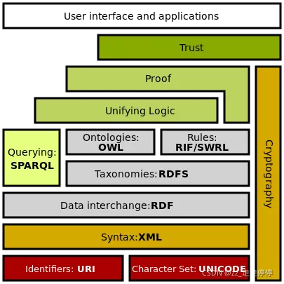
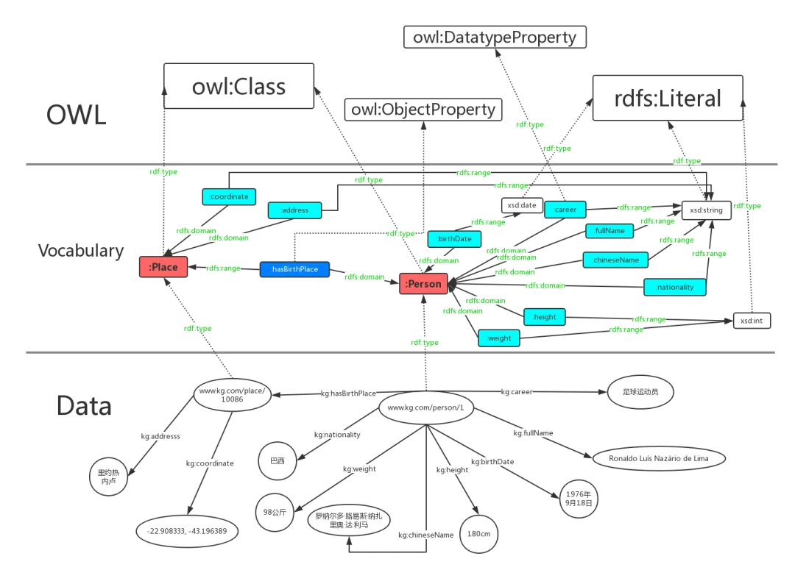
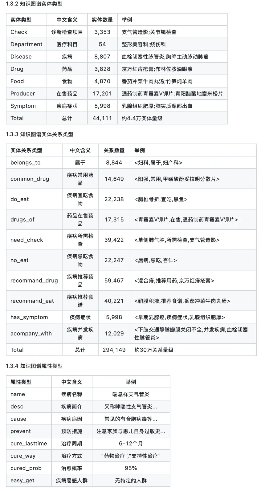
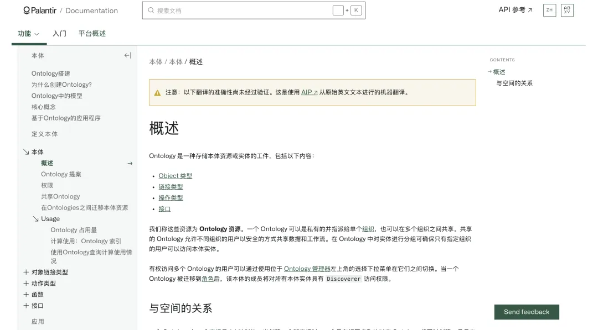

一、也谈palantir与本体的那些事儿

最近知识图谱圈比较热闹的事儿莫过于一窝蜂的去谈palantir了，这个其实很莫名其妙，对Palantir “本体” 的技术解读呈现出显著的玄学化倾向，因为回头头来，谈的还是7年前的事情，内容也没有发生变化，但是依旧在谈了，社区也在讨论，因此，回顾下，谈谈。

Palantir的“本体工程”（Ontology），强调其作为企业AI落地的关键，尤其是在数据整合和语义理解方面的作用，注意，这是数据整合，所以其做的是对数据治理的事情。

但是，一旦涉及到数据治理，那这个事情就变得很大，数据治理的口号喊了很多年了，但一直没做起来，因为很难做。企业的数据多且杂，结构化程度和标准化程度层次不齐，并且与业务深刻绑定，还涉及到各个板块之间的权限问题，其归结起来，就是数据语义层的问题。

所谓的数据语义层，就是根据特定业务，定义出一个标准的、全面的、没有歧义的数据模型，里面定义好了有哪些数据类型、哪些数据抽象类、哪些数据字段，哪些数据的约束条件等等，然后，基于这个标准化模型，可以把各个数据都往里塞，最终实现一个数据的语义网络。

所以，也正是这个需求，在2017年的时候，知识图谱就开始火热起来，其使命就是做数据的标准化和互联，而知识图谱又是由semantic-we b来的，是语义层的工作，也就是owl/rdf那套，也就是本体那一套。

在这个本体里，定义了一个领域的概念层次体系，具像化处理就是概念的层次类（thing-person-man/woman），然后分成了两层，一个是概念层，就是下面的owl层，里面有一些vocab，就是具像化的表述，如person, place。

也就是我们所讲的实体类型，例如有人物、机构、故障等实体类型，实体之下也有属性，比如人物有身高、出生地、故障有故障描述、故障发生时间等属性；实体之间也有关系，例如人物和人物之间的有夫妻、子女，故障和原因之间有导致关系等；实体的值也有约束信息，例如一个人的年纪不能超过200岁，出生日期不能是在2月31号。这个就是代码里的class，例如class Person():

然后，下面的data层，就是我们所说的实例层，也就是具体能够塞进去这个本体里面的数据。做编程的应该懂，这个其实就是从class，到了person1=Person()。

但知识图谱到了后面，其实这个ontology，其实变成了大家口中的schema，然后就有了一些知识图谱抽取的事情，例如在老刘2018年的开源项目：https://github.com/liuhuanyong/QASystemOnMedicalKG中提到的这个医疗知识图谱的schema：

从中针对医疗领域，定义了实体类型、关系类型以及实体的属性类型。然后，可以基于这个，将各个来源数据进行填充，如果是csv，那么直接走mapping，如果是mysql，也可以直接做转换，如果是非结构化，则直接通过信息抽取（基于schema的实体抽取、关系抽取和事件抽取，然后做实体合并，对齐）转成结构化，然后再做mapping，这也就是知识图谱的故事。

但是，问题来了，这个schema并不好定，定不出来，技术指望产品，产品指望运营，运营指望技术自动生成，死局。然后，即便这个schema定下来了，抽取也是个大问题，抽不准，也没用。

然而，还有一个更大的问题，就是这个schema来回变怎么办？这就是动态本体，这个其实是符合直觉的，因为定义本体其实是有时间局限性的，随着业务的扩大，业务人员对业务理解成都的加深，有新增的（要新加），有错误的（要删掉），有更改的（比如添加约束）。但是，为了支持这个变化，需要有几个代价。

一个是之前版本的数据是不是要刷一遍？刷的话，重构还是软链？之前定义好的schema语义存储是否不是要发生改变？版本如何控制？边界在哪儿？所以，你会发现，这个又变成了一个数据工程的问题，还需要考虑到冗余。

而走到这，也就是palantir为人所乐道的一个点，其动态本体也是国内企业所经常模仿的，谈的点。关于本体的，我不建议说看解读，因为本身其是有官网介绍的，https://www.palantir.com/docs/zh/foundry/ontologies/ontologies-overview

其本体的思路就是上面说的那些，搞了个语义层，并且是通过代码逻辑，类似抽象类的方式在做，可以看原文，拿准确结论。

然后呢，针对这个动态本体，国内的企业也做过很多，最简单粗暴的方式，其实就是把本体的label这些加入版本控制，或者同一个实体label变成多个label，通过扩展label的方式来保证过去版本数据不被冲刷（可以rollback）并并兼容新的义务需求。

所以说，palantir，其实做的就是数据语义的事情，其实就是数据库的事情，做的事就是怎么把数据治理好的事情，但是，必须要明白的是，Palantir的本体工程其实长期行业知识沉淀的工程，本体需要大量人工标注和领域专家参与，“动态语义网络” 的构建成本极高。

然而，而国内企业仍停留在工具化模块阶段，比较形象的比喻是，Palantir的本体实现了 “决策闭环”，而国内企业多聚焦于数据清洗和可视化。

数据洗不干净，就不要扯什么ontology让数据开口说话，也更不要扯什么指导agent决策，这是两码事，ontology是一套静态的规范，一个规范不具备决策能力，决策能力需要靠专家系统，规则执行引擎来支撑，一套标准跟决策智能完全是两个维度的事情【但是现在很多人在胡扯这个事情】。所以，palantir做的那些产品foundray，其实更多的是做的工程侧的事情，尤其是语义层工程侧的事情，把工具，业务逻辑执行等等，做了很复杂的精细化设计，所以才能把数据弄起来。

再延伸到chatbi，个人认为，两者之间是很类似的，数据库做不好，也白扯，表的规范，表字段的对齐等等，不是接一个bi-nl2sql就能搞定的，这是天方夜谭，归结起来，都是数据语义的事情。

最后总结下,ontology也好，schema也罢，本质上都是一种标准，一种数据规范，一种指导思想，更是一种理论，不要将理论搞成一个工具或者一个产品，甚至是一个系统【这都是玄学跟胡扯。】

palantir的本体，其实没必要太痴迷或者纠结，因为他是一套方法论，从方法论到落地，需要土壤跟时间，因为它需要对业务的熟悉，需要基础设施跟的上，需要对数据治理各个环节的细磨。

# 参考

[1] https://mp.weixin.qq.com/s/ycNr_LzfMU-Gr_5IcN36AA, 也谈palantir与ontology本体本质：兼看专利领域KG及文档OCR数据迭代合成思路