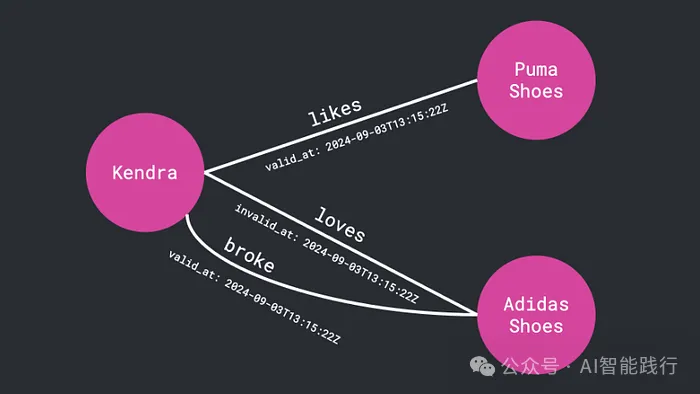

- Github (19.3k stars): https://github.com/getzep/graphiti

与常规的检索增强生成（Retrieval-Augmented Generation, RAG）框架相比，Graphiti 的独特之处在于，它并非一次性构建图谱后便不再更新，而是使其保持“存活”状态。当新信息（如用户聊天、数据库条目、外部更新等）输入时，图谱会自动更新。

如果 Kendra 明天转而喜欢耐克，Graphiti 会自动更新这一关系，同时仍然会记住她曾经喜欢阿迪达斯。这就像是带有时间线的记忆。

大多数 RAG 系统是静态的。它们批量处理数据、进行总结，然后将信息定格在某个时间点。这对于研究型机器人或 FAQ 助手来说尚可接受，但对于那些需要快速变化的应用场景——例如客户关系管理（CRM）、实时分析仪表盘，甚至是个人 AI 伴侣——这种静态模式则显得力不从心。

Graphiti 颠覆了这种模式。
它能提供：

• 新数据输入时的即时更新
• 双时态追踪（Bi-temporal tracking），即同时记录事件发生的时间和被记录的时间
• 混合检索（Hybrid retrieval），融合了语义搜索（semantic search，用于理解意义）、关键词搜索（keyword search，用于精确定位）和图遍历（graph traversal，用于探索关系）
简而言之，这意味着更快、更周全、更精确的响应——通常在不到一秒钟内完成。

# 参考

[1] Graphiti：快速将知识图谱塞进智能体,为更智能的 AI 代理构建实时知识图谱, https://mp.weixin.qq.com/s/Pq70JbFSUqswBZ1S4ZcECA