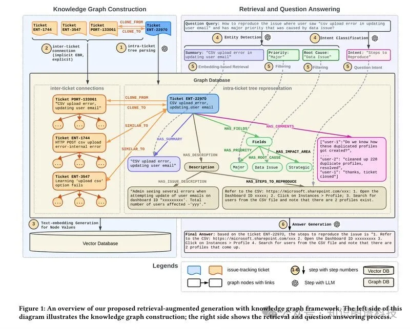
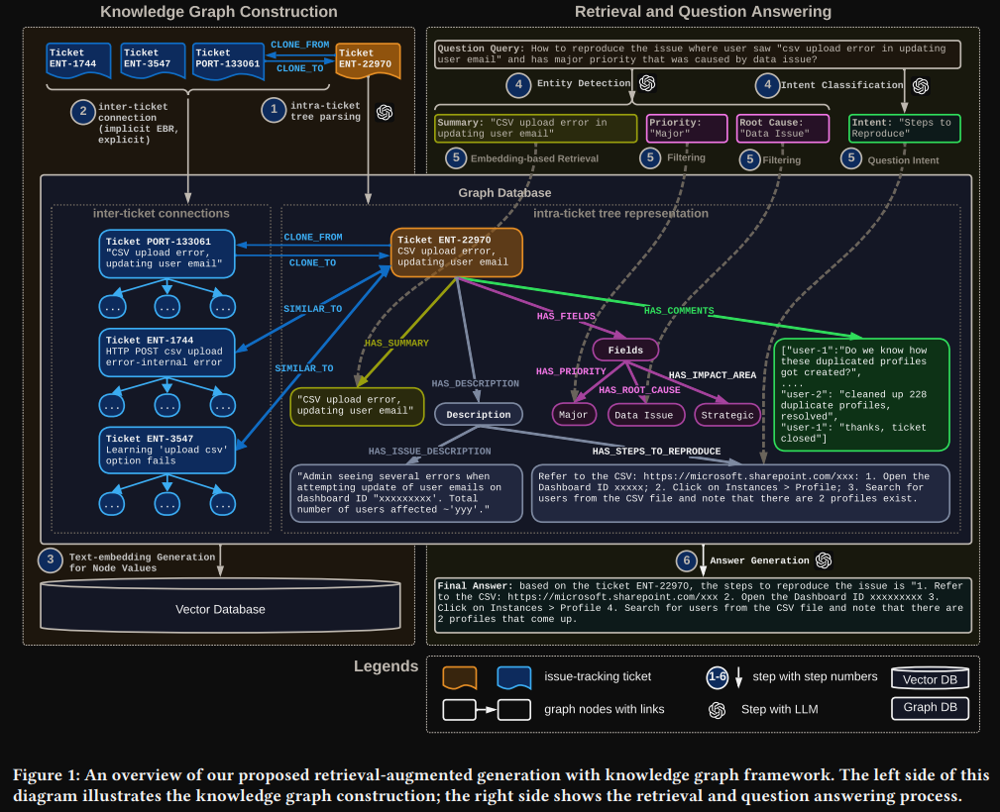
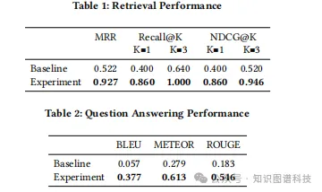

# 1. 资源

论文：
- Retrieval-Augmented Generation with Knowledge Graphs for Customer Service Question Answering
- https://arxiv.org/abs/2404.17723
- 时间：2024-4-26

# 2. 问题

在客户服务技术支持中，迅速准确地检索相关的过往问题对于高效解决客户咨询至关重要。传统的检索方法在大型语言模型（LLMs）中检索增强生成（RAG）将大量过往问题跟踪工单视为简单文本，忽略了关键的问题内部结构和问题之间的关系，这限制了性能。

1. 限制 1 -由于忽视结构而导致检索精度下降：

   问题跟踪文档，如 Jira，具有固有结构并具有相互关联，例如引用“问题A与问题B相关/复制/由问题B引起”。传统方法将文档压缩为文本块导致重要信息的丢失。我们的方法将问题工单解析为树状结构，并进一步连接单个问题工单以形成相互关联的图，保持实体之间的这种固有关系，从而实现高效的检索表现。

2. 限制 2 - 由于分段而导致答案质量降低：

   将复杂的问题工单分成固定长度的段以适应嵌入模型的上下文长度限制可能导致相关内容的分离，进而导致答案不完整。例如，在文本分割过程中，描述问题起始和解决方案结尾的问题工单可能会被分割，导致解决方案的关键部分被遗漏。我们基于图的解析方法通过保持工单部分的逻辑连贯性来克服这一限制，确保提供完整且高质量的响应。

# 3. 简介

我们引入了一种新颖的客户服务问答方法，将RAG与知识图谱（KG）相结合。我们的方法从历史问题构建知识图谱，用于检索，保留了问题内部结构和问题之间的关系。在问答阶段，我们的方法解析消费者的查询并从知识图中检索相关子图以生成答案。这种知识图谱的整合不仅通过保留客户服务结构信息提高了检索精度，还通过减轻文本分割的影响提高了回答质量。

在我们的基准数据集上进行的实证评估，利用了关键检索（MRR、Recall@K、NDCG@K）和文本生成（BLEU、ROUGE、METEOR）指标，显示我们的方法在MRR上的性能优于基准方法 77.6%，在BLEU上优于基准方法 0.32。我们的方法已在领英客服团队内部部署约六个月。



检索增强生成与知识图谱框架概述。该图的左侧展示了知识图谱构建过程；右侧展示了检索和问答过程。

# 4. 方法

该方法从历史问题（JIRA工单）构建知识图谱，用于检索，并根据知识图谱中的相关子图生成答案。JIRA系统已知具有内置的层次结构和固有结构，使其更适合（和方便）用于构建知识图谱。

## 4.1 知识图谱构建

1. 知识图谱构建：构造不同问题间以及单个问题内的关系图，如下图所示

   - First, during the KG construction phase, our
     system constructs a comprehensive knowledge graph from historical customer service issue tickets. It integrates a tree-structured
      representation of each issue and interlinks them based on relational
      context. It also generates embedding for each node to facilitate later
      semantic searching. 
   - Second, during the question-answering phase,
      our method parses consumer queries to identify named entities
      and intents. It then navigates within the KG to identify related
      sub-graphs for generating answers
   - 

2. 图谱构造方法
   - 类内关系：使用基于规则的方法（如关键词），不好使用规则的，使用LLM基于yaml模板生成
   - 类间关系：基于embedding相似度构建
   - 

## 4.2 问答流程

1. 问题处理
    - 判断意图
    - 抽取实体

2. 在图谱中利用embedding相似度搜索
   - first，rephrases the original user query 𝑞 to include the retrieved ticket ID; 
   - the modified query 𝑞′ is then translated into a graph database language, such as Cypher for Neo4j for question answering
   - ```text
     For instance, from the initial query 𝑞 ="how to reproduce the issue where user saw ’csv upload error in updating user email’ with
     major priority due to a data issue", the query is reformulated to
     "how to reproduce ’ENT-22970’ and thereafter transposed into the
     Cypher query MATCH (j:Ticket {ticket_ID: ’ENT-22970’})
     -[:HAS_DESCRIPTION]-> (description:Description)
     -[:HAS_STEPS_TO_REPRODUCE]-> (steps_to_reproduce:
     StepsToReproduce) RETURN steps_to_reproduce.value. 
     ``` 

# 5. 实验结果

这种方法在平均倒数排名（MRR）上比基准线高出了77.6％，在BLEU分数上为0.32。



实际应用效果：

将检索增强生成（RAG）与知识图（KG）相结合已经改善了检索和回答指标，以及整体服务效果。该方法已在领英客服团队内部部署，将每个问题的中位解决时间减少了 28.6%。 


# 参考

[1] Linkedin的GraphRAG客服问答系统实践，https://mp.weixin.qq.com/s/DLFL8Bi3SaB4lMB__tmxMQ