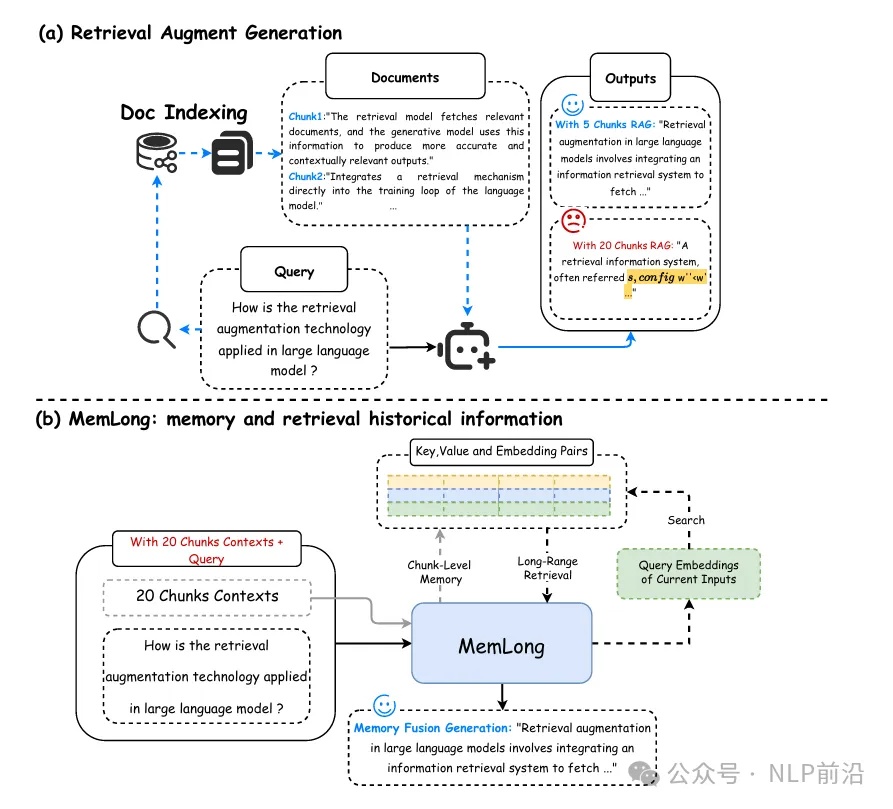
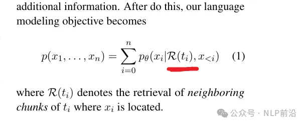
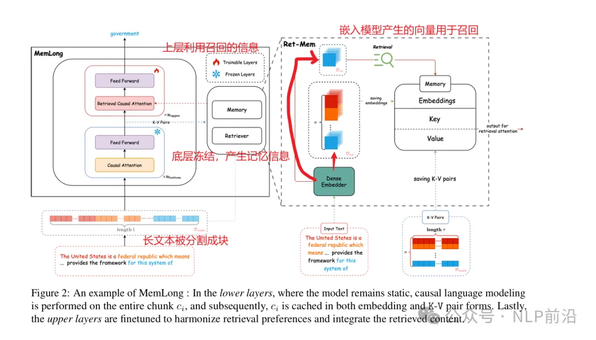
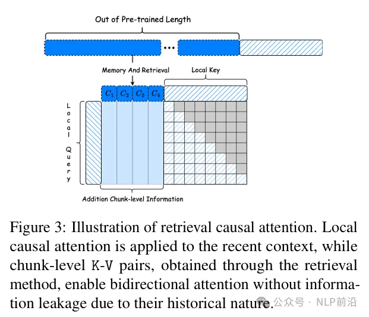
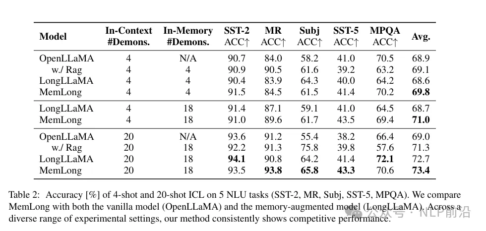

# 原理

论文笔记分享，标题MemLong: Memory-Augmented Retrieval for Long Text Modeling 代码开源：https://github.com/Bui1dMySea/MemLong

LLMs在处理长文本时，因为注意力机制二次时间和空间复杂度的问题，所以处理长文本时的内存消耗和计算成本有点恐怖。检索增强生成RAG自然就成了一个工业界成熟的解决方案，MemLong是一个新的解决方案，跟之前有些产品提到的RAG2.0有点类似（RAG 2.0有无数个版本~）。

整体上来看，他跟RAG的对比图如下，主要是通过存储过去的上下文和知识在一个记忆库中，利用这些存储的信息来检索（K-V and embedding pairs），来达到扩展了模型的上下文窗口的目的。

与标准语言建模目标相比，还会利用外部检索获取相关信息，并在模型的上层进行知识融合。

整体架构图如下

- 存储：文本 -> 块 -> 低层clm编码 -> 记忆存储
- 检索：给定一个新生成的文本块，检索与当前上下文最相关的过去信息

上层的注意力机制修改，将传统的多头注意力扩展到联合注意力机制，使每个token能够同时关注局部上下文和块级过去上下文

在多个长文本语言建模基准上进行了评估，显示出比其他最先进的LLMs更好的性能。它在单个GPU上能够将上下文长度从4k扩展到80k，大幅提高了模型在长文本任务中的性能。

# 参考

[1] 大模型RAG的下一形态，MAG，https://mp.weixin.qq.com/s/tLDSjRUdeafz0wc7xnUGvA