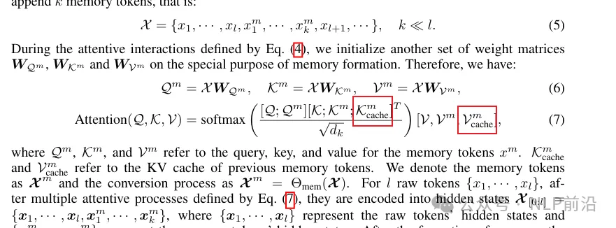

# 1. 简介

- https://github.com/qhjqhj00/MemoRAG
- https://arxiv.org/pdf/2409.05591
- MemoRAG: Moving Towards Next-Gen RAG Via Memory-Inspired Knowledge Discovery

开源了2个模型：

- https://huggingface.co/TommyChien/memorag-qwen2-7b-inst
- https://huggingface.co/TommyChien/memorag-mistral-7b-inst

MemoRAG是一个建立在高效、超长记忆模型之上的创新 RAG（Retrieval-Augmented Generation）框架，由智源研究院（北京人工智能研究院）与中国人民大学高瓴人工智能学院联合推出并开源。

MemoRAG与主要处理具有明确信息需求查询的标准 RAG 不同，MemoRAG利用其记忆模型实现对整个数据库的全局理解。通过从记忆中回忆与查询相关的线索，MemoRAG增强了证据检索，从而产生更准确、更丰富的上下文响应。

在处理需要对整个数据库进行高级理解的查询时，标准RAG与MemoRAG之间的比较，以《哈利·波特》书籍作为数据库。左侧图，由于输入查询的隐含性质，标准RAG难以准确定位所需的证据，导致答案不够准确。右侧图，MemoRAG构建了覆盖整个数据库的全局记忆。当提出查询时，MemoRAG 首先回忆相关线索，使有用的信息得以检索，从而得到一个精确且全面的答案。

特点：
- 全局记忆：在单个上下文中处理高达100万个token，为庞大的数据集提供全面的了解。 
- 可优化与灵活：轻松适应新任务，仅需几个小时的额外训练即可实现优化性能。 
- 上下文线索：从全局记忆中生成精确线索，将原始输入与答案连接起来，并从复杂数据中解锁隐藏的洞察。 
- 高效缓存：通过支持缓存分块、索引和编码，将上下文预填充速度提高多达30倍。 
- 上下文重用：一次性编码长上下文，并支持重复使用，提高需要重复数据访问的任务的效率。

# 2. 原理

记忆模型的主要目的是逐步将原始输入token压缩为明显更小的一组记忆token，同时保留基本的语义信息。想实现这个过程，作者使用一组记忆token插在模型的每一步的上下文窗口之后。看下图，先看x，每个窗口之后添加k个记忆token，算attention的时候，k,v会用到历史的cache 记忆token，q取当前窗口的token。

这种记忆模型仍然是通过预训练+sft训练完成，训练目标如下，给定最近的token和历史记忆，最大化下一个token的概率：

开源了2个模型：

- https://huggingface.co/TommyChien/memorag-qwen2-7b-inst
- https://huggingface.co/TommyChien/memorag-mistral-7b-inst

# 3. 实验结果

在三个基准上测试了MemoRAG，使用了三种不同的生成器（Llama3-8B-Instruct-8K、Phi-3-mini-128K、Mistral-7B-Instruct-v0.2-32K），得出以下结论： 

主要实验结果。每个版块中最好的结果以粗体显示。这些实验中使用的记忆模型是基于 Mistral-7B-Instruct-v0.2-32K 训练的，可在 HuggingFace 上获取。

- MemoRAG 在所有数据集上的表现都超过了所有基线模型，展示了其强大的领域泛化能力。 
- 直接将完整上下文输入到大型语言模型（LLMs）通常比其他 RAG 方法（BGE-M3、Stella-v5 和 HyDE）表现更好。这一发现揭示了标准 RAG 系统在处理长上下文和高级问题方面的困难。 
- 相比之下，MemoRAG 一贯超越了直接使用完整上下文的性能，展示了其有效弥合处理超长上下文和解决复杂任务之间差距的能力。
- MemoRAG 在三个领域内数据集上展示了卓越的性能，这表明其潜力可以通过更多样化的训练数据进一步增强。

可以直接用 HuggingFace 模型初始化。通过该MemoRAG.memorize()方法，记忆模型可以在较长的输入上下文中构建全局记忆。
- TommyChien/memorag-qwen2-7b-inst可以处理最多400K个token的上下文，
- TommyChien/memorag-mistral-7b-inst可以管理最多128K个token的上下文。
- 通过增加参数beacon_ratio，可以扩展模型处理更长上下文的能力。例如，TommyChien/memorag-qwen2-7b-inst可以处理最多一百万个token beacon_ratio=16。

# 参考

[1] 下一代RAG：MemoRAG，https://mp.weixin.qq.com/s/ZbkqzCgDEy5FiqS1pTn6lg
[2] 大模型RAG的风，从GraphRAG吹到了MemoryRAG, https://mp.weixin.qq.com/s/NEZUeaReTitXgaCSCDhd0Q