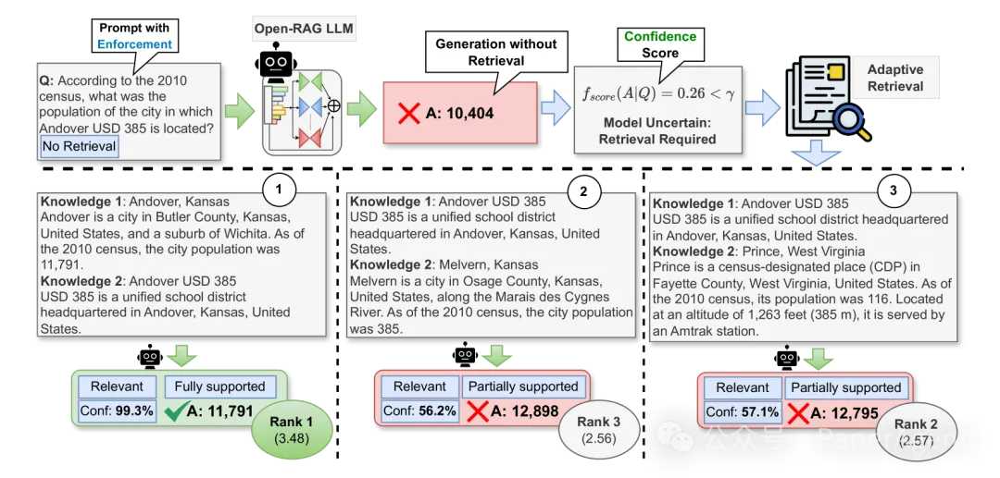
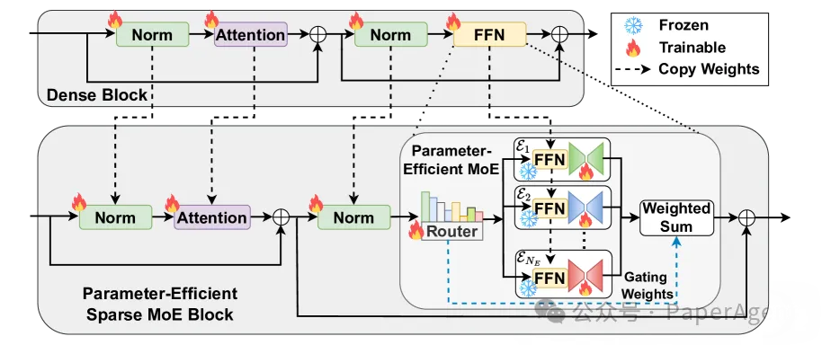
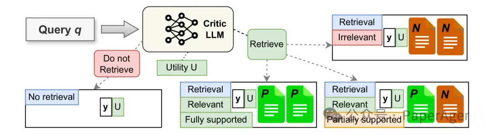
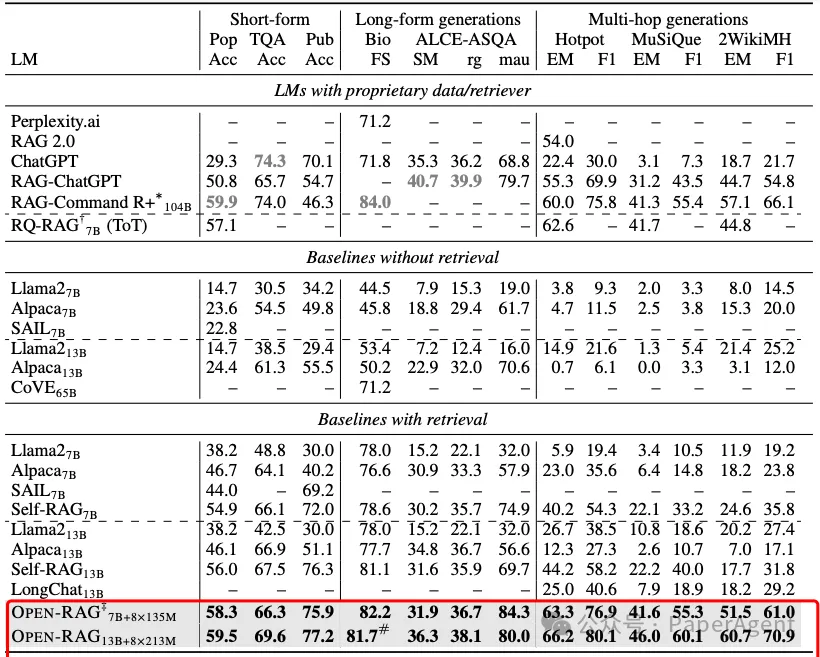
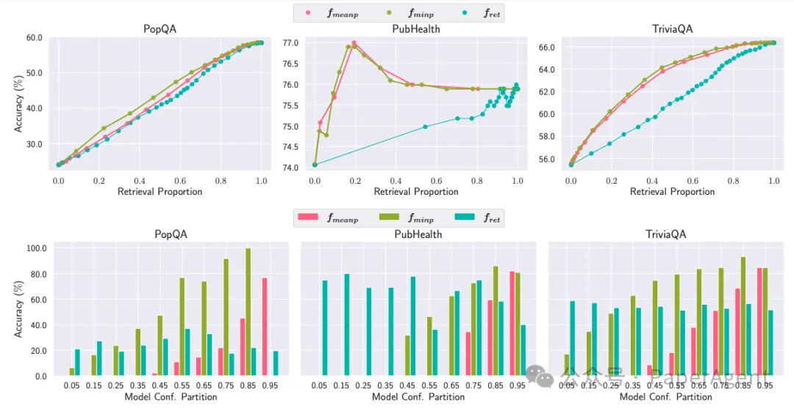
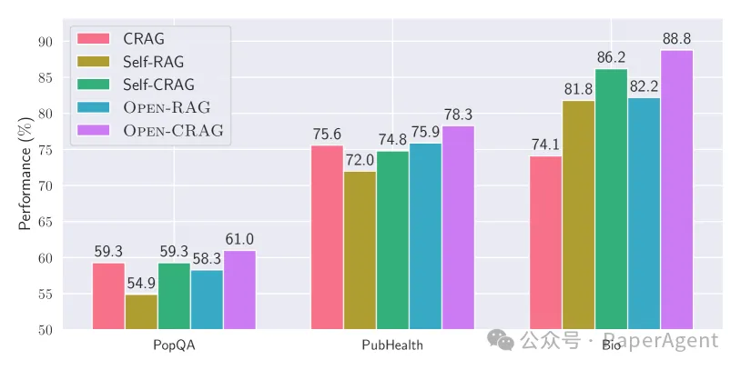
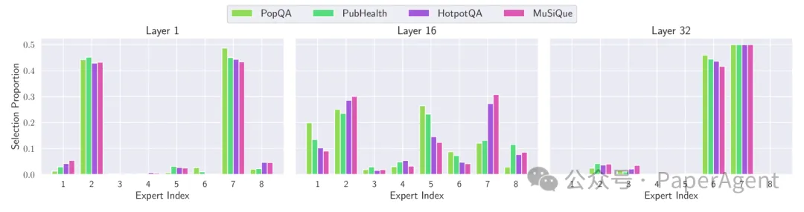

# 资源

https://openragmoe.github.io/

OPEN-RAG: Enhanced Retrieval-Augmented Reasoning with Open-Source Large Language Models

https://arxiv.org/pdf/2410.01782

# 原理

现有的RAG方法在使用开源LLMs处理复杂查询（如多跳检索任务）时，表现出有限的推理能力。

提出了一个名为OPEN-RAG的新框架，旨在提高开源LLMs在RAG中的推理能力。

OPEN-RAG中的推理流程。它学习生成检索/不检索标记，对比相关和不相关上下文，并将答案归类为部分支持、完全支持或不支持。然后在推理时，给定一个（多跳）用户查询，首先强制模型在输入条件为不检索的情况下生成答案，并根据模型的置信度动态决定是否需要检索。

OPEN-RAG将任意密集LLM转换为参数高效的稀疏专家混合（MoE）模型，能够处理包括单跳和多跳查询在内的复杂推理任务。

OPEN-RAG中的架构转换（从密集到PEFT MoE）。路由器R从头开始训练。FFN层保持冻结状态，并由基于并行适配器的专家E进行调整。其他层被复制。

OPEN-RAG通过独特的训练方法，使模型能够导航看似相关但具有误导性的挑战性干扰因素。

训练过程中，模型学习生成检索/不检索的反射标记，并评估检索内容的相关性、支持程度和实用性。

OPEN-RAG训练数据准备涉及从每个原始对（q, y）生成四种新的训练实例的变化，每种都使用真实情况/LLM评论家和检索到的段落，结合不同的反射标记。OPEN-RAG不仅使LLM能够反思生成质量，还能够对比干扰项。

OPEN-RAG推理流程
- 检索/不检索：模型学会生成检索/不检索的标记，以指示是否需要检索来回答查询。
- 相关性评估：对于检索到的内容，模型生成相关性标记，指示内容是否与查询相关。
- 生成答案：根据预测的相关性、支持度和效用标记，对所有可能的答案进行排序，生成最终答案。

在各种知识密集型的单跳/多跳短文/长文推理任务上，基于Llama2-7B的OPEN-RAG在事实准确性和推理能力方面显著优于现有的开源RAG模型，并且常常匹配或超越了最先进的专有LLMs及其RAG模型。

在多个任务中，OPEN-RAG基于Llama2-7B，超越了ChatGPT-RAG、Self-RAG、RAG 2.0和104B RAG-Command R+，树立了新的基准。

OPEN-RAG模型如何通过自适应检索方法在性能和速度之间取得平衡：
自适应检索策略有效：

信心评分：模型在推理时生成检索/不检索的反射标记，并计算输出序列在强制不检索设置下的信心分数。

阈值控制：通过调整阈值γ，可以控制检索的频率。如果模型信心分数低于阈值γ，则触发检索。

信心评分重要：fmeanp（几何平均概率）作为信心评分方法，相比于fminp（最小概率）和fret（外部模型预测的反射标记概率），在所有数据集上都显示出更稳健的性能。

性能与检索平衡：在某些任务中，过高的检索频率并不总是最佳选择；自适应检索可以在适当的时机使用检索，从而在各种检索频率下都取得较好的性能。

（上）不同自适应检索策略的性能对比检索。（下）性能与自适应检索得分对比。fret表示来自外部模型提炼/预测的反射标记的概率得分。

对比不同检索方法的鲁棒性

CRAG方法：CRAG（Corrective Retrieval Augmented Generation）是一种在检索质量较低时使用网络搜索来获取新检索的方法。通过将CRAG方法与OPEN-RAG结合，研究者评估了模型对检索质量的鲁棒性。

结果：OPEN-RAG在结合CRAG数据集时表现优于其他基线，显示出对高质量检索的潜在改进能力。

使用CRAG上下文的模型性能

路由分析

专家激活：通过分析不同任务中专家的激活情况，研究者发现某些专家在特定层次上更活跃，这表明专家能够根据任务的复杂性在不同层次上发挥作用。

单跳（PopQA、PubHealth）与多跳任务（HotpotQA、MuSiQue）的逐层专家激活情况。

OPEN-RAG限制：

OPEN-RAG的内存占用较高，因为它增加了总参数量（7.81B），与Llama2-7B系列基线（6.74B）相比有所增加。

尽管如此，OPEN-RAG在推理时只有7.01B的活跃参数，与性能相比，实际上降低了计算和内存成本。

# 参考

[1] OpenRAG：全面增强RAG推理，超越Self-RAG、RAG 2.0、Command R+， https://mp.weixin.qq.com/s/H0_THczQ3UWCkSnnk-vveQ