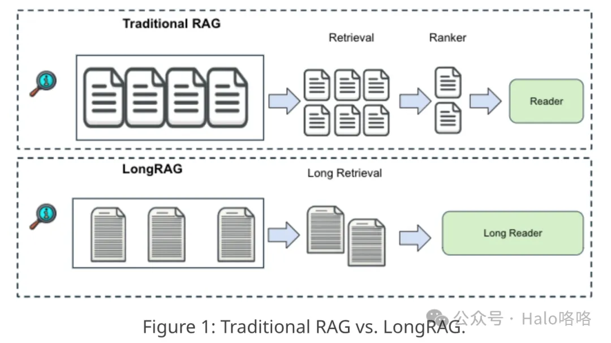
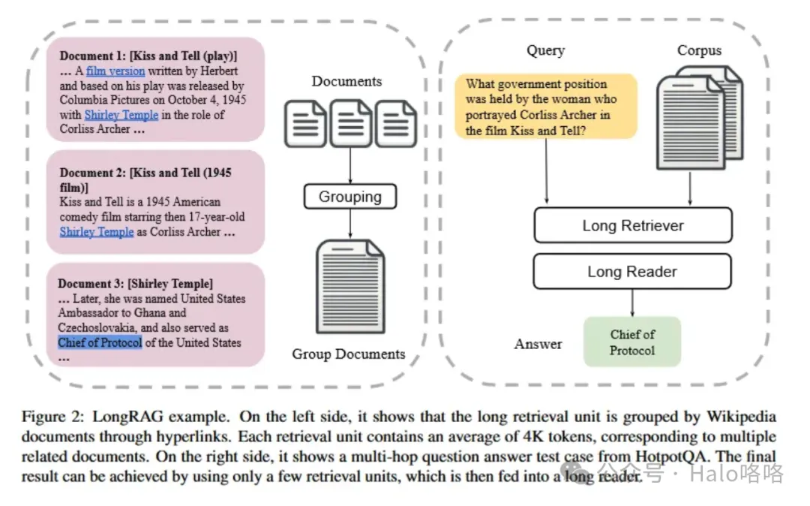
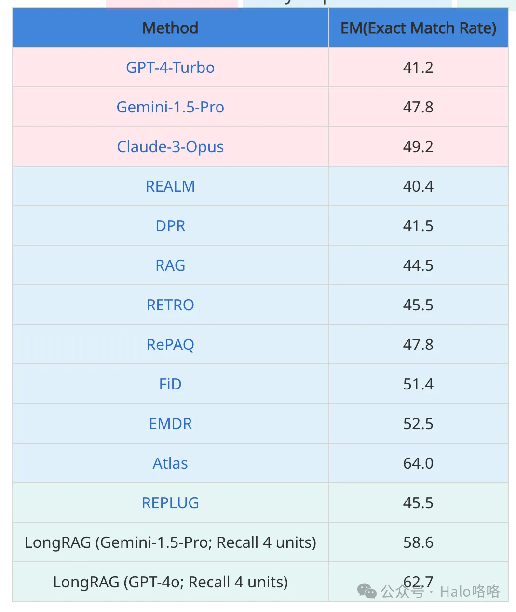
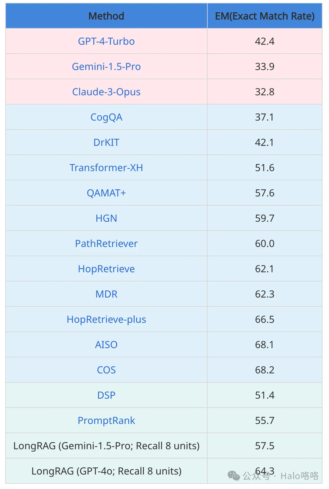

# 1. 资源

# 2. 简介

LongRAG旨在解决传统检索增强生成（RAG）系统的限制，这些系统通常使用较短的检索单元。在传统配置中，这些短单元导致检索器负担沉重，而阅读器的任务相对较轻，常常导致性能不佳。LongRAG提议使用长达4K个token的更长检索单元，减少所需的总单元数量，并显著减轻检索器的任务。这种方法显著提高了检索得分，与以前的方法相比，召回率大幅提高。此外，LongRAG利用长上下文大型语言模型进行零样本答案提取，实现了无需训练即可获得的竞争性结果，这为将RAG系统与长上下文大型语言模型的整合提供了一个有希望的发展方向。

# 3. 传统RAG的局限

传统检索增强生成（RAG）框架面临若干限制，LongRAG旨在有效解决这些问题：
1. 检索单元过短：传统RAG系统通常使用较短的检索单元，如100字的段落或片段，这可能导致上下文缺失和信息碎片化。这一限制常常使得系统无法处理需要更广泛理解或跨不同信息片段连接的复杂查询。
2. 高计算开销：由于检索单元较短，传统RAG框架需要管理和搜索一个显著更大的离散文本块集合，这可能在计算上非常昂贵且效率低下。
3. 语义不完整：传统RAG系统中检索单元的简短常常导致关键上下文信息的丢失，这可能妨碍模型生成连贯且上下文准确的响应。
4. 依赖大量训练：传统RAG框架通常严重依赖于使用特定数据集进行微调以实现最佳性能，这可能资源密集且限制了模型在不同领域的灵活性。
5. 检索器与阅读器间的平衡问题：在许多传统RAG设置中，存在一个平衡问题，即检索器承担着从大量语料库中找到相关信息的重任，而阅读器的任务相对较轻，仅处理检索到的片段。

通过解决这些限制，LongRAG显著提升了检索增强生成框架的性能和适用性，使它们在处理各种领域的复杂问答任务时更加有效。

# 4. LongRAG

LongRAG显著扩展了检索单元的规模，将每个单元的容量提升至高达4,000个token。这种扩展意味着可以在单一单元中检索到整篇文章或文本的大量段落。
- 检索单元数量减少：通过增加每个检索单元的规模，LongRAG大幅减少了需要处理和存储的单元总数。这种减少导致检索器需要处理的搜索空间更小，更易于管理。它简化了索引和搜索过程，提高了检索效率和速度。
- 信息密度提升：更大的检索单元能够捕捉到更全面和详细的信息，确保查询周围的上下文得到良好呈现。这种信息密度有助于系统理解和响应需要深入知识或跨不同信息片段连接的查询。
- 上下文理解增强：拥有更广泛的文本块，系统对内容的上下文把握更为精准，减少了遗漏对回答复杂问题至关重要的微妙细节或相关信息的可能性。这种理解在多跳问答等场景中尤其有益，其中答案依赖于从多个相互连接的信息片段中提取的洞察。
- 计算开销降低：尽管单个单元的规模更大，但由于系统总体上处理的单元数量减少，整体计算负载得到降低。在时间和资源限制显著的大型应用中，这种效率至关重要。
- 阅读器效果提升：阅读器组件从更大的单元中受益，因为它接收到的输入更为丰富和详细。这种丰富性使阅读器能够执行更精确和上下文意识更强的答案生成，充分利用长上下文大型语言模型（LLMs）的全面能力，有效解释和利用所提供的信息。

# 5. 性能表现

表格展现了HotpotQA开发集上的问答（QA）结果。结果与三组基线模型进行了比较：闭卷模式，此模式下直接向最前沿的大型语言模型（LLMs）提供16个上下文示例进行提示；全监督RAG，在此模式下，使用RAG框架，并对模型进行全监督训练，确保模型在训练数据上得到充分训练；以及无微调RAG，该模式下虽然采用RAG框架，但未对模型进行任何微调。

# 参考

[1] LongRAG：通过长上下文大型语言模型增强检索增强生成，https://mp.weixin.qq.com/s/Dkkr5G8l1rZmipJtYAu4hg