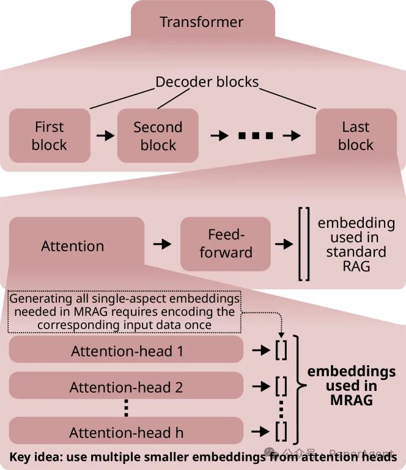
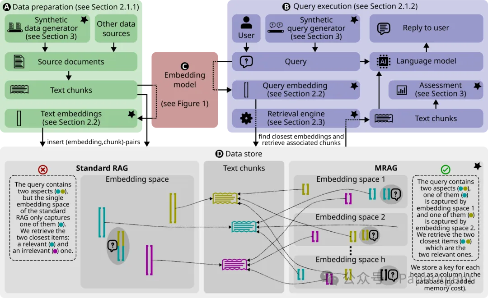
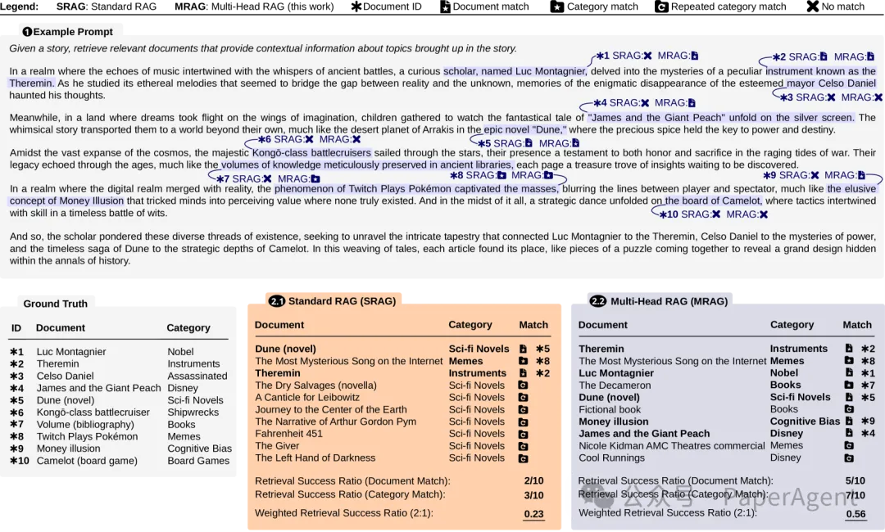
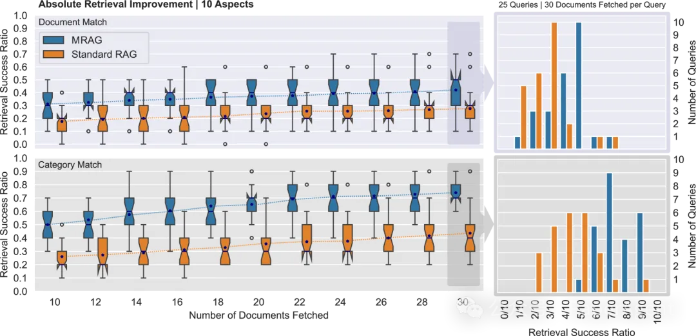
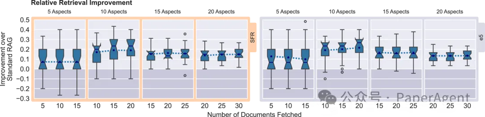
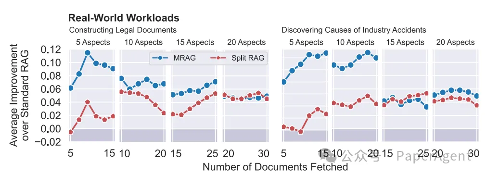
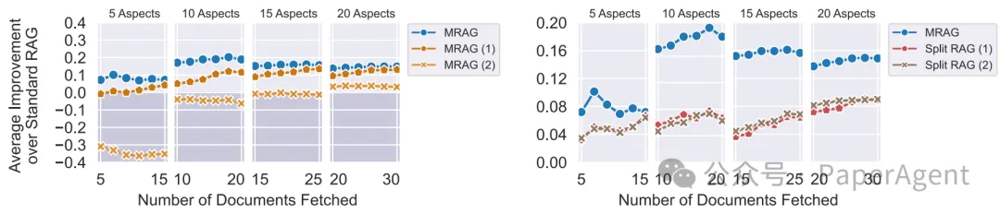

# 1. 资源

- https://arxiv.org/html/2406.05085v1
- https://github.com/spcl/MRAG
- Multi-Head RAG: Solving Multi-Aspect Problems with LLMs

# 2. 简介

现有的RAG方案没有专注于需要检索多个具有显著不同内容的文档的查询，这类查询经常出现，但挑战在于这些文档的嵌入可能在嵌入空间中距离很远，难以全部检索。

因此，提出一种多头检索增强生成方法（MRAG：Multi-Head RAG ），它的关键思想是利用Transformer解码器的多头注意力层的激活，而不仅仅是前馈层，来生成嵌入。不同的注意力头可以捕获数据的不同方面，因此使用这些激活产生的嵌入能更好地表示文档和查询的各个方面。

MRAG使用最后一个标记的每个注意力头的输出作为一组“单方面”嵌入。这些嵌入的完整集合形成了“多方面”嵌入。重要的是，这与仅使用最终解码器层输出的标准RAG相比，不需要额外的空间。

解码器架构的概述，以及标准RAG和多头RAG嵌入生成方式的比较。



MRAG（多头RAG）流程的概述，由两部分组成：数据准备A和查询执行B。嵌入模型C和数据存储D被这两部分使用。数据存储D包含指向反映三种不同方面（青色、品红色、黄色）的文本块的文本嵌入。带有星号标记的块是这项工作的新特点。



# 3. 方法

多头检索增强生成（Multi-Head RAG, MRAG）流程的概述：

```text
数据准备（Data Preparation）：在数据准备阶段，MRAG通过使用选定的基于解码器的嵌入模型（decoder-based embedding model）来创建文本块（text chunks）的多方面嵌入（multi-aspect embeddings）。这些嵌入随后与相应的文档或文本块一起存储在数据存储（data store）中。MRAG支持不同类型的数据嵌入，包括文档分块、整文档或其他类型的数据。

查询执行（Query Execution）：在查询执行阶段，首先使用选定的嵌入模型为输入查询生成多方面嵌入。然后，使用特殊的多方面检索策略在数据存储中找到最接近的多方面嵌入及其对应的文本块。最后，检索到的数据可以选用新的度量标准进行评估，以确定其与多方面需求的对应程度。

多方面嵌入的存储：与标准RAG不同，MRAG为每个多方面嵌入包含h个单方面嵌入，每个嵌入指向原始文本块。数据存储包含h个嵌入空间，每个空间捕获文本的不同方面。这使得MRAG能够在多个嵌入空间中比较查询和文本块，这些空间捕获数据的多个方面。

多方面检索策略：MRAG的检索策略包括三个步骤：在数据准备期间为所有h个嵌入空间分配重要性得分；在查询执行期间，MRAG首先为每个嵌入空间单独应用传统RAG检索，返回每个嵌入空间的c个最近文本块的列表；然后使用预计算的重要性得分通过投票策略从所有hc个块中选择整体前k个。

与数据存储的集成：MRAG可以与不同类型的数据存储和最近邻（Nearest Neighbor, NN）搜索方法无缝使用。它可以结合精确和近似的最近邻搜索来找到匹配的（嵌入，块）对。
```

用于评估不同RAG策略的示例查询。文本中要获取的文档，然后评估不同RAG策略在找到这些文档及其类别方面的成功率。标记了精确文档匹配、类别匹配、多次匹配类别的文档，以及没有匹配文档的文本段。最后，展示了每种策略的加权成功率，采用2:1的加权（优先考虑精确文章匹配）。



提供了评估方法和指标、合成数据集和现实世界用例来展示MRAG的有效性，显示出在相关性方面比标准RAG基线提高了高达20%。

MRAG（多头RAG）和标准RAG在25个查询中的检索成功率比较，每个查询包含10个不同的方面。上半部分展示了精确文档匹配，而下半部分展示了仅类别匹配（我们在第3节中解释了使用的度量标准）。为了展示25个查询中详细的分布情况，为一个特定样本呈现了直方图（每个查询获取的文档数量为30）。MRAG在精确文档匹配的检索成功率上一贯优于标准RAG（平均提高了超过10%）。在类别匹配上的检索性能提升更为显著（平均提高了超过25%的检索成功率）。



MRAG相对于标准RAG在不同数量方面和不同嵌入模型的查询中的相对检索改进10-20%（左侧为SFR，右侧为e5）。



在多方面数据集、法律数据集和事故数据集上的实验表明，MRAG在检索成功率上优于标准RAG和Split RAG。

在构建法律文件（左）和发现工业事故原因（右）这两个真实世界工作负载中，MRAG和Split RAG相对于标准RAG在检索成功率上的平均提升。



通过对不同解码器块的嵌入和不同投票策略的分析，证明了MRAG设计和选择的合理性。

对MRAG和Split RAG的不同投票策略的评估



# 参考

[1] MRAG：一种多头RAG，提升具有显著不同内容的多个文档复杂查询的检索准确性，https://mp.weixin.qq.com/s/TT1K9YIbpO4S9FR5FWAN9Q